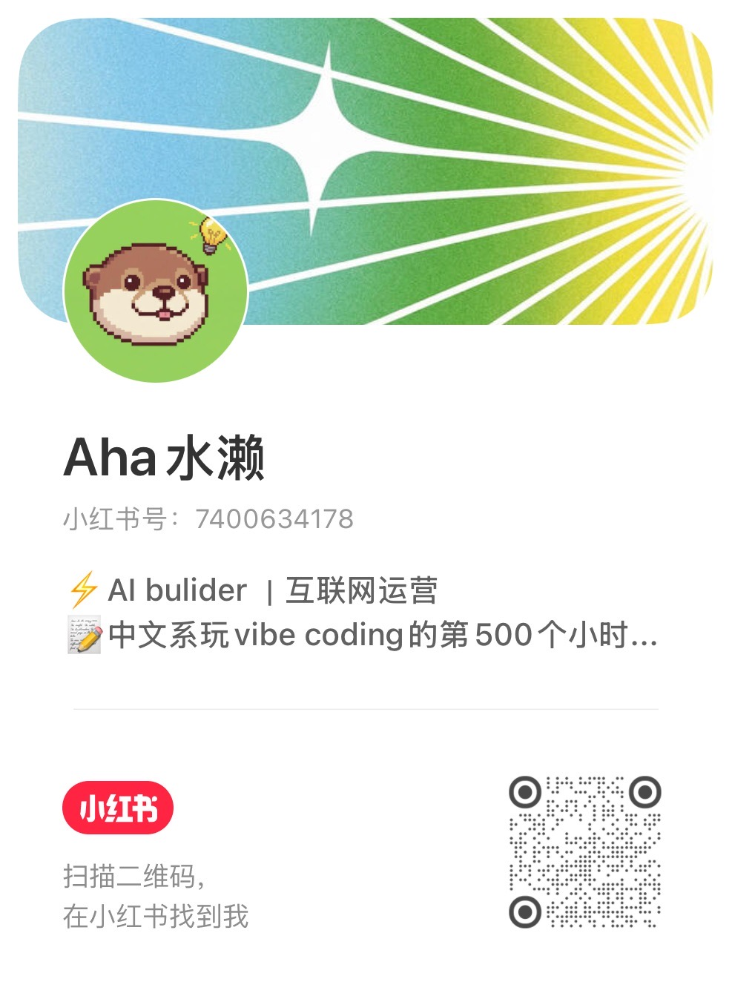

<div align="center">

# 博主蒸馏器

> "你研究了 10 个对标博主。你能说清楚任何一个的爆款打法吗？"

你翻了 50 条笔记，还是说不出 TA 为什么爆？<br>
你用 AI 写了模仿稿，出来的还是泛泛感觉——它根本不知道你想学谁。<br>
你换了个对标博主，一切又得从头研究？<br>
你自己也发了三十条笔记，但每次创作还是凭感觉从零开始？<br>

**把任何博主（包括你自己）的爆款打法，从真实笔记里蒸馏出来，装进你的 AI。**

输入博主账号，30 分钟后拿走 TA 的爆款打法——  
装进你的 AI，变成你永久的内容教练。

[](https://www.python.org/downloads/)
[](LICENSE)

[产出物](#产出物) · [分析模式](#分析模式) · [30 秒上手](#30-秒上手) · [API 配置](#api-配置tikhub) · [成本估算](#成本估算) · [进群交流](#进群交流) · [找到作者](#找到作者)

</div>

---

<details>
<summary><b>⚠️ 使用前请阅读：免责声明与数据处理说明</b>（点击展开）</summary>

本工具仅供**学习研究**使用。使用前请确认你已理解以下要点：

- **数据来源**：通过 [TikHub](https://tikhub.io) 的公开 REST API 获取平台公开数据（小红书 / 抖音），不模拟登录、不注入 Cookie、不破解加密接口。
- **适用范围**：仅建议用于研究**公开发布**的内容（公开账号、公开笔记/作品、公开评论）。请勿用于爬取私密内容、绕过平台风控、或任何违反小红书、抖音《用户协议》及相关法律法规的行为。
- **评论者隐私**：本工具会自动将评论者身份脱敏为"读者1 / 读者2 / 作者"，不保存评论者昵称、userId、头像、IP 属地。评论正文会保留用于内容研究。
- **商业使用**：如需商业用途，请自行确认小红书/抖音平台政策与 TikHub 服务条款是否允许。作者不对商业使用的合规性作任何背书。
- **风险承担**：使用本工具产生的一切后果（包括但不限于账号风险、数据准确性、第三方 API 费用）由使用者自行承担。

**合规使用边界**（参考《数据安全法》《个人信息保护法》《反不正当竞争法》）：

✅ 这些没问题：个人学习 / 需求分析 / 市场调研；仅爬取无需登录即可公开访问的内容；数据仅用于自己研究，不对外传播或变现。

❌ 这些有风险：贩卖或分发他人数据；爬取需要登录才能看到的内容；将大规模爬取的数据作为商业产品的核心数据来源。

详细条款见 [DISCLAIMER.md](./DISCLAIMER.md) · 安全策略见 [SECURITY.md](./SECURITY.md)

</details>

---

## 它做了什么

把「手工翻笔记 → 凭感觉总结」变成「一句话 → 自动蒸馏 → 拿结果」。

```
拆解/蒸馏博主 XX（最好附上链接🔗）
```

AI 自动完成全流程：

```
环境检查 → 端点自动探测 → 采集笔记 → 统计分析 → 认知层提取 → 蒸馏 → 出报告
```

你拿到的不是一堆原始数据，是两样东西（开启转写后三样）：

| 产出物 | 给谁 | 干什么 |
|--------|------|--------|
| **创作指南 Skill 文件夹** | 给你的 AI | 装进 AI 工具，用XX博主的认知、策略、内容风格帮你创作或做帐号诊断 |
| **HTML 蒸馏报告** | 给你看 | 浏览器打开，快速读完这个博主的人设、策略和爆款规律 |
| **口播逐字稿**（按需开启） | 给你的 AI | 把视频里说的话转成文字，补进分析数据，让 AI 读到博主真实的口播内容 |

---

## 产出物

### 创作指南 Skill（给 AI 用）

生成一个可安装的 Skill 文件夹。把它放到你的 AI 工具里：

```
.claude/skills/XX博主_创作指南.skill/
└── SKILL.md
```

安装后，在新对话里直接说：

```
用XX博主的风格，写一篇关于 AI 工具推荐的小红书笔记
```

AI 按照蒸馏出的公式、语气和结构来写——不是泛泛的"活泼风格"，是从真实笔记里提炼的具体规则。

**三层蒸馏结构：**

| 层级 | 回答什么 | 装进 Skill 的内容举例 |
|------|---------|----------------------|
| **认知层** | TA 怎么想？ | "TA 相信'反共识才有传播力'，80% 爆款都用了反常识观点开头" |
| **策略层** | TA 怎么运营？ | "每周三晚 8 点发，藏赞比 0.85 说明粉丝当教程收藏" |
| **内容层** | TA 怎么写？ | "35% 数字标题、25% 反问标题，开头永远是个人故事" |

8 大章节：使用说明 → 认知层 → 策略层 → 内容层 → 创作禁区 → 对比示例 → 选题灵感 → 局限性自检

### HTML 蒸馏报告（给你看）

单文件 HTML，浏览器打开即可阅读。

| # | 模块 | 内容 |
|---|------|------|
| 1 | 一眼看清 | 粉丝/获赞/爆款率/底层公式，一张卡片看完 |
| 2 | 人设拆解 | TA 是谁、代表什么、粉丝为什么追 TA |
| 3 | 认知层 | 核心信念 × 观点张力 × 价值立场 |
| 4 | 策略层 | 系列规划 × 蹭热点方式 × 运营节奏 |
| 5 | TOP10 爆款 | 逐条拆解：为什么爆？能学什么？ |
| 6 | 内容公式 | 11 种标题公式 × 开头模板 × CTA 策略 |
| 7 | 选题灵感 | TOP15 选题方向，按难度 × 潜力排序 |
| 8 | 数据面板 | 均赞/均藏/藏赞比/视频 vs 图文/发布频率 |
| 9 | 发展趋势 | 早期 vs 近期变化，转型路径（附置信度标注）|
| 10 | 核心结论 | 三句话总结 + 行动建议 |

### 口播逐字稿（按需开启）

蒸馏完成后说「提取口播」，Whisper 自动将视频音频转成文字：

- 文件保存为 `{博主名}-口播逐字稿.md`，可直接交给 AI 用于深度分析
- 默认 Base 档，准确率约 70%；可在 Skill 中升级模型，每升一档转写时间翻一倍
- 仅支持 10 分钟以内的视频，超长自动跳过

---

## 分析模式

| 模式 | 你想做什么 | 产出物 |
|------|-----------|--------|
| **A — 拆解对标博主** | 学习 TA 的打法 | HTML 报告 + `{博主名}_创作指南.skill/` |
| **B — 蒸馏自己的账号** | 打造属于自己的创作工作流 | HTML 报告 + `{用户名}_创作基因.skill/` |

笔记数量三档可选：30 条（快速）/ 50 条（推荐）/ 80 条（深度）

---

## 拓展玩法

首次蒸馏完成后，说出触发词即可解锁两个进阶分析——无需重新采集，基于已有数据直接运行：

| 玩法 | 触发词 | 平台 | 说明 |
|------|--------|------|------|
| 🎨 封面视觉风格分析 | 「分析封面」 | 双平台 | 8 维度视觉拆解：封面风格类型 / 构图 / 标题钩子 / 文字设计 / 人物出镜 / 装饰元素 / 信息密度 / 视觉一致性，输出封面公式 + 内容匹配度评估 + 3 条针对性建议（零额外 API 调用） |
| 📈 关键词趋势洞察 | 「关键词趋势」 | 双平台 | 分析博主核心关键词的热度趋势与受众画像，挖掘内容方向机会 |

---

## 30 秒上手

```bash
git clone https://github.com/otter1101/blogger-distiller.git
cd blogger-distiller
python install.py
```

在你的 AI 编程助手里说：

```
拆解小红书/抖音博主 XX
```

系统会问你选模式（A 或 B）、平台（小红书 / 抖音）和笔记数量，之后全自动。

### Skill 安装方式（进阶）

**方式 1：让 AI 帮你安装（推荐）**

打开你的 AI Agent（本地 / 云端都可以），说：

```
请帮我下载 https://github.com/otter1101/blogger-distiller 的 skills，并告诉我该怎么使用
```

AI 会自动完成下载和配置。

**方式 2：手动安装**

下载 Skills 的压缩包，解压到对应文件夹，然后按提示完成安装即可。

---

## API 配置（TikHub）

本工具通过 [TikHub](https://tikhub.io) 的 REST API 获取小红书 / 抖音数据。**全程走外部 API 调用，不模拟浏览器登录、不注入 Cookie，你的账号零封号风险。** 这是目前成本最低、端点覆盖最全的第三方 API 方案。作者与 TikHub 无利益关系，不从中盈利，只是在提供一种可用的解决方案。

你需要自行注册 TikHub 账号、充值并开通 API 权限：

### 第 1 步：注册

访问 [https://user.tikhub.io](https://user.tikhub.io) 注册并完成邮箱验证。

### 第 2 步：充值

登录后在 **控制台 → 充值/套餐** 页面充值。推荐按量付费（Pay-as-you-go），按实际调用次数扣费。

### 第 3 步：开通权限

在 **控制台 → API 权限** 中，**一键勾选全部小红书（xiaohongshu）及抖音（douyin）相关端点**即可。系统启动时会自动探测哪些端点可用，不需要你手动挑选。端点开得越全，自动容错能力越强。

### 第 4 步：生成 API Token

在 **控制台 → API Token** 页面生成一个 Token key，然后将其发给你的agent即可！

ps：若agent无法解析API密钥，可尝试3种解决方法：

1.重试/检查网络问题

2.换密钥，不用重复充值

3.换一个agent，claudcode/codex/workbuddy/openclaw/hermes都能用

<details>
<summary>可选：自定义 RPS 加速</summary>

TikHub 不同套餐有不同的 RPS（每秒请求数）上限。默认使用 RPS=10。如果你的套餐 RPS 更高，可以手动加速：

```bash
export TIKHUB_RPS=20    # 间隔减半，速度翻倍
```

</details>

---

## 成本估算

每次蒸馏一个博主的大致费用（基于 TikHub 按量计费）：

| 笔记数量 | 预估费用 |
|----------|---------|
| **30 条**（快速） | ¥1 ～ 3 |
| **50 条**（推荐） | ¥2 ～ 5 |
| **80 条**（深度） | ¥4 ～ 8 |

> 实际费用取决于评论量、端点可用性和重试次数。以上基于真实使用统计，请以 [TikHub 官网定价](https://tikhub.io/pricing) 为准。系统已内置多项节省策略（启动探测避免请求打到无效端点、会话内死链缓存、默认跳过搜索补充等），尽量减少无效 API 调用。

---

## 架构设计

**「脚本保下限，AI 冲上限」**

| 角色 | 占比 | 负责什么 |
|------|------|---------|
| **脚本** | 30% | 采集数据、算统计、识别标题模式、提取 CTA、计算藏赞比 |
| **AI** | 70% | 提炼信念、发现认知张力、写人设拆解、做因果分析、给个性化建议 |

**核心特性：**

- **零配置** — 自动下载依赖、启动服务，开箱即用
- **端点自动探测** — 启动时自动检测所有 API 端点的可用性并动态排序，自适应+调整
- **多端点 Fallback** — 4 组端点池（web_v2 / app / web_v3 / app_v2）自动降级，挂一个还有三个
- **跨领域通用** — 不预设内容类型，基于笔记实际内容动态聚类，适用任何赛道
- **断点恢复** — 每 10 条自动存盘，断网/中断不丢数据

---

## 项目结构

```
blogger-distiller/
├── SKILL.md                       # Skill 定义（AI 编程助手读这个）
├── run.py                         # 一键运行入口
├── install.py                     # 自动安装脚本
├── scripts/
│   ├── crawl_blogger.py           # Phase 1: 采集入口路由（自动分发至各平台）
│   ├── crawl_xhs.py               # Phase 1-XHS: 小红书数据采集
│   ├── crawl_douyin.py            # Phase 1-DY:  抖音数据采集
│   ├── crawl_common.py            # 采集层共享工具（目录/JSON/进度/限速）
│   ├── analyze.py                 # Phase 2: 数据分析（聚类+标签+TOP10+认知层）
│   ├── deep_analyze.py            # Phase 3: 数据底稿 + AI 蒸馏任务生成
│   ├── verify.py                  # Phase 4: 数据校验（双平台）
│   └── utils/
│       ├── tikhub_client.py       # TikHub API 客户端（多平台路由+限速+降级）
│       ├── endpoint_router.py     # 端点池路由 + 自动降级引擎
│       ├── xhs_endpoints.json     # 小红书端点池（4组×7类 = 28 个端点）
│       ├── douyin_endpoints.json  # 抖音端点池（10个功能池 = 19 条链路）
│       ├── adapters.py            # 响应数据归一化适配器（XHS + 抖音）
│       ├── cover_analyzer.py      # 封面视觉风格分析（拓展玩法：卡片A）
│       ├── index_client.py        # 关键词趋势洞察（拓展玩法：卡片B，双平台）
│       ├── common.py              # 平台注册表 + 共用工具函数
│       ├── privacy.py             # 数据脱敏（双平台）
│       ├── first_run.py           # 首次运行合规确认
│       ├── quality.py             # 数据质量检查工具
│       └── transcript.py          # 口播提取（Whisper 集成，小红书+抖音）
```

---

## 版本历程

| 版本 | 里程碑 |
|------|--------|
| v0.1–v1.0 | SKILL 设计 → 全 Phase 脚本 → 通用化重构 → 全自动环境准备 → 输入端稳定化（扫码登录版，已废弃） |
| v1.7 | 认知层提取（观点句 / 思维模式 / 价值词） |
| v1.8 | 产出物改版（HTML 报告 + Skill 文件夹） |
| v1.9 | 全流程切换新范式 + 采集 Bug 修复 |
| **v2.0** | **API + 合规改造发版** |
| **v2.2** | **多平台扩展**：新增抖音全链路采集（22 条端点）、双平台分析引擎、封面视觉分析（卡片A）、关键词趋势洞察（卡片B）、原子卡片拓展玩法 |
| **v2.3** | **口播提取**：集成 Whisper 模型，小红书、抖音视频可一键转写逐字稿（Base 档 ~70% 准确率 / 多档可选）；10 分钟以内视频自动转写，超长跳过；逐字稿导出为 MD |

---

## License & 免责

本项目基于 [MIT License](./LICENSE) 开源。

本工具仅供**学习研究**使用。完整条款请阅读：

- [DISCLAIMER.md](./DISCLAIMER.md) — 免责声明与使用边界
- [SECURITY.md](./SECURITY.md) — 数据安全与隐私处理


如果觉得本工具有用，辛苦在右上角点个 ⭐ Star 呀！

---

## 进群交流

<div align="center">

</div>

vx:catsanddogs666（白天回复不及时）

---

## 找到作者

<div align="center">
&nbsp;&nbsp;&nbsp;&nbsp;
</div>


