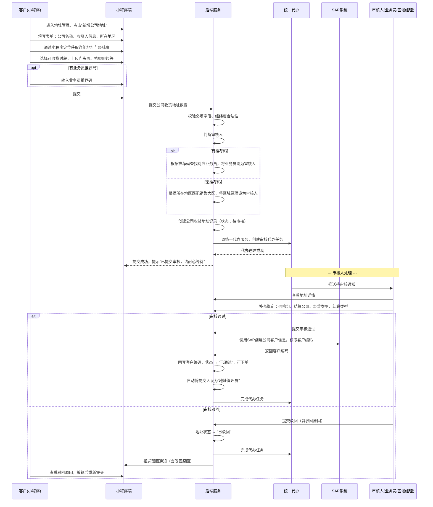
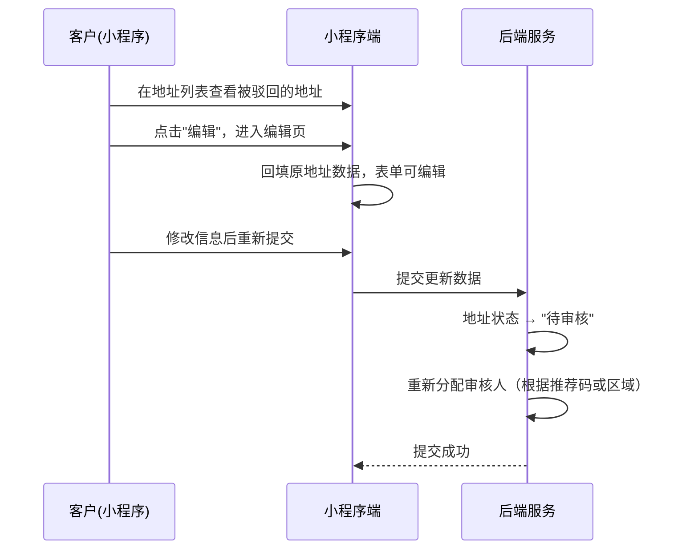
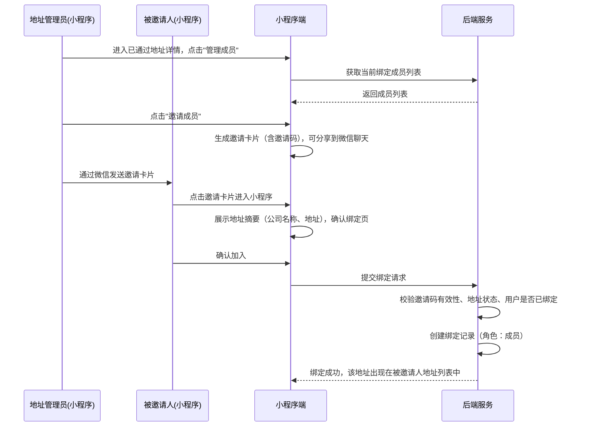
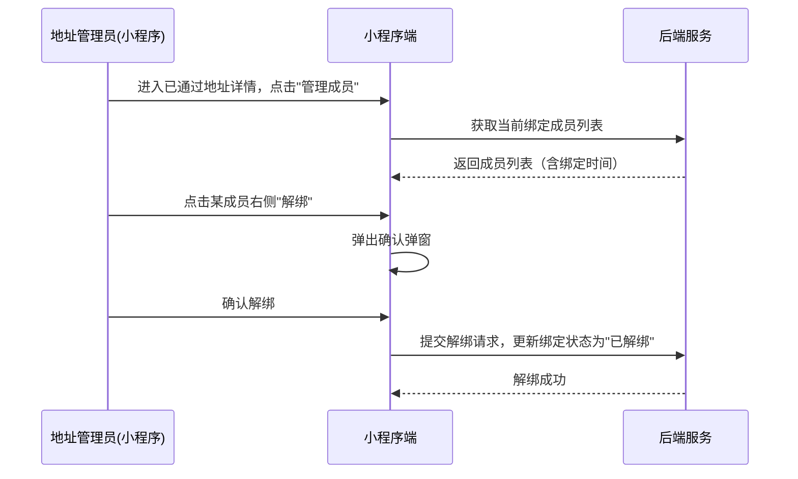
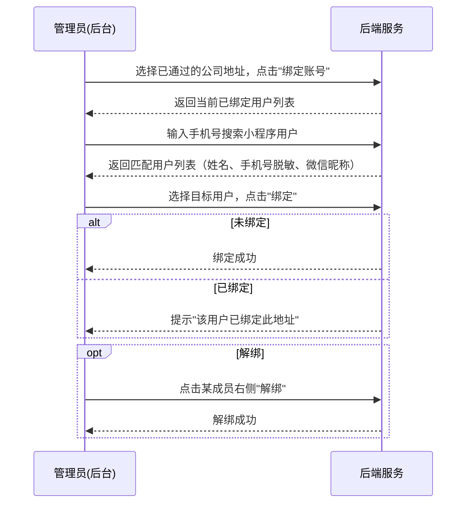
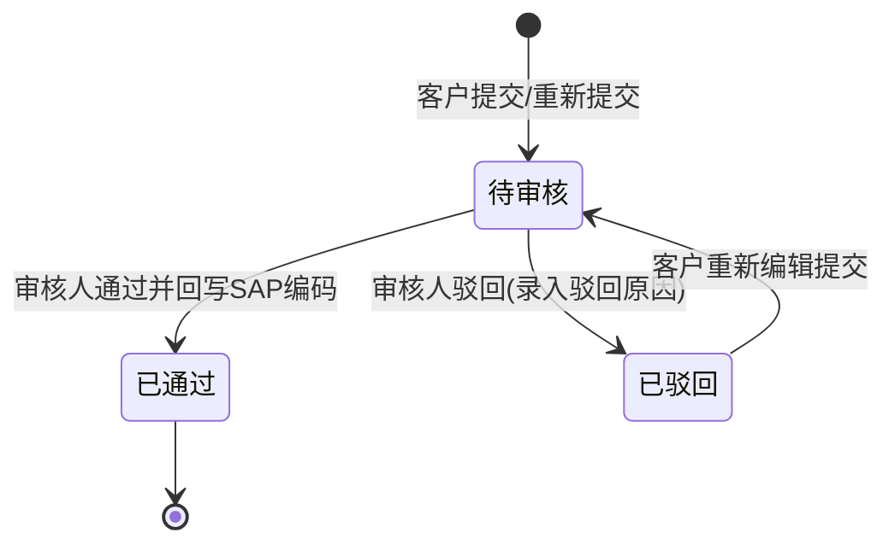

# 客户资料管理（公司档案）模块 SPEC

> **归属中心**：02-客户中心
> **子模块**：客户资料管理（公司）档案
> **版本**：v2.1
> **更新日期**：2026-07-02
>
> - **小程序端**：面向 B 端客户，以"公司收货地址"视角呈现，核心是地址创建、成员绑定与下单应用。
> - **后台端/审核端**：面向销售与管理员，以"客户资料/公司档案"视角管理。
> 两端共用同一套底层数据与状态机。

------

## 1. 背景与目标 (Background & Objectives)

**背景**：B端客户在小程序完成注册登录后，需要维护公司收货地址用于下单。地址需经过审核方可生效——审核由对应销售大区的运营经理或业务员负责，审核通过后绑定价格组、结算公司、经营类型等业务属性。

**目标**：为客户提供公司收货地址的创建、列表查看、驳回后编辑能力；同一公司下多个小程序用户可绑定同一个已通过收货地址，支持不同员工各自下单时共用；为业务员/区域经理提供地址审核能力；为后台管理员提供全量地址管理能力。打通"客户提交 → 审核分配 → 审核确认 → 多用户绑定 → 可下单"的完整链路。

------

## 2. 角色与使用场景 (Roles & Scenarios)

| 角色 | 说明 |
| --- | --- |
| 小程序客户（B端） | 已登录客户，创建和管理自己的公司收货地址 |
| 业务员 | 通过推荐码绑定客户的销售责任人，审核名下客户提交的地址 |
| 区域运营经理 | 管理某个销售大区，审核区内无推荐码的客户提交的地址 |
| 后台管理员 | 在 PC 后台管理所有公司收货地址数据 |

**使用场景**：

- 作为客户，我在小程序端新增公司收货地址，填写公司信息、收货人信息、上传资质照片后提交，等待审核通过后用于下单。
- 作为客户，我查看已提交的地址列表，对被驳回的地址进行修改后重新提交。
- 作为客户，我（地址首个提交人，即"地址管理员"）可将已通过的地址绑定给公司内其他小程序用户，让他们也能用这个地址下单；也可以解绑成员。
- 作为客户，我可以通过地址管理员分享的邀请卡/二维码加入绑定，共享该地址用于下单。
- 作为业务员，我收到待审核通知，查看客户提交的公司地址详情，补充绑定价格组、结算公司、经营类型后审批通过或驳回。
- 作为区域运营经理，我审核辖区内无推荐码客户提交的地址，并绑定相关业务属性，并且可把客户指定给其他业务员。
- 作为后台管理员，我在 PC 后台查看、筛选、管理所有公司收货地址。

------

## 3. 核心业务流程 (Core Business Flow)

### 3.1 客户创建公司收货地址 → 审核流程



### 3.2 客户驳回后再次编辑流程



### 3.3 多客户绑定同一公司收货地址流程

同一家公司内，不同员工可能在不同时间分别下单。地址审核通过后，首个提交人自动成为"地址管理员"，可将地址共享给公司内其他小程序用户。

#### 3.3.1 地址管理员邀请绑定



#### 3.3.2 地址管理员解绑成员



**绑定规则**：
- 仅有地址审核通过后才可绑定（待审核/驳回状态不可绑定）
- 地址首个提交人自动成为"地址管理员"，绑定关系在地址审核通过时由系统自动创建
- 只有地址管理员可以邀请和解绑成员（后台管理员也有权限）
- 被邀请人已绑定该地址时，不可重复绑定
- 邀请码有效期 24 小时，超时需重新生成
- 同一小程序用户可绑定多个不同的公司收货地址
- 一个公司收货地址可绑定多个小程序用户，无数量上限
- 地址管理员不可被解绑（解绑按钮置灰），除非后台管理员操作
- 后台管理员也可主动绑定小程序账号

#### 3.3.3 管理员后台绑定小程序账号



### 3.4 状态流转

| 起始状态 | 触发动作 | 目标状态 | 处理逻辑与影响说明 |
| --- | --- | --- | --- |
| - | 客户首次提交 / 重新提交 | 待审核 | 触发统一代办任务分配，禁止非管理员直接修改关键信息 |
| 待审核 | 审核人通过审批 | 已通过 | (1) 触发 SAP 创建公司客户接口，回写客户编码；(2) 自动将首个提交人设为"地址管理员"；(3) 开放下单权限与成员管理入口 |
| 待审核 | 审核人驳回审批 | 已驳回 | (1) 清除代办；(2) 开放小程序端"编辑后重新提交"；(3) 小程序列表显式输出驳回原因 |
| 已驳回 | 客户点击重新提交 | 待审核 | 重新触发审核人判定与统一代办 |



### 3.5 审核人自动判定逻辑

系统在客户提交（含重新提交）地址时，按以下优先级判定审核归属人：

| 条件 | 审核人 | 说明 |
| --- | --- | --- |
| 填写了业务员推荐码 | **推荐码对应的业务员** | 提交时根据推荐码查询对应业务员，将业务员设为审核人 |
| 未填写推荐码 | **收货地区所属销售大区的运营经理** | 根据省/市匹配大区，将区域经理设为审核人 |
| 推荐码无效（不存在或已禁用） | 转为**区域经理**（按无推荐码逻辑） | 提交时判定推荐码无效，按大区兜底匹配 |

### 3.6 异常流与逆向流

| 异常场景 | 触发条件 | 系统处理方式 |
| --- | --- | --- |
| 定位失败 | 小程序未授权定位或网络异常 | Toast 提示"请授权定位或检查网络"，允许手动选择地区并手动输入详细地址。经纬度为空时后台列表标记"无定位坐标" |
| 推荐码无效 | 输入不存在/已禁用的推荐码 | 失焦时红字提示"推荐码无效"，提交时阻断并提示 |
| 推荐码对应业务员已离职/禁用 | 业务员状态变更为禁用 | 转为无推荐码逻辑，自动流转给该地区销售大区运营经理审核 |
| 销售区域断档 | 客户所在地区未绑定销售大区 | 系统触发告警，前端提示"当前地区暂不支持配送"，阻止提交 |
| 同一公司重复提交 | 公司名+详细地址完全相同的待审核/已通过记录 | 提示"该公司地址已存在，请勿重复提交"；若为已驳回记录则允许提交 |
| 图片上传失败 | 网络或服务异常 | 提示"图片上传失败，请重试"，缩略图区域显示"上传失败，点击重试" |
| 审核超时 | 待审核状态超 48 小时 | 系统定时向审核人推送催办通知，抄送上级大区总监 |
| 邀请码过期 | 被邀请人点击超 24 小时的邀请链接 | 页面展示"邀请已过期，请联系地址管理员重新生成"，隐藏"确认加入"按钮 |
| 被邀请人已绑定 | 用户已绑定该地址 | 提示"你已绑定该地址，无需重复加入" |
| 越权成员管理 | 非地址管理员进行成员操作 | 后端严格权限拦截，操作失败 |
| SAP 接口失败 | SAP 系统超时或网络异常 | 审批事务回滚，状态保持待审核，前端提示"SAP系统同步失败，请稍后重试" |

------

## 4. 界面与交互说明 (UI & Interaction)

### 4.1 小程序客户端

#### 4.1.1 公司收货地址列表页

**页面入口**：小程序 - 我的 - 公司收货地址

**界面布局**（自上而下）：
- 顶部导航："收货地址"
- 列表区（纵向滚动）：每条地址卡片展示：
  - 公司名称（粗体）
  - 收货人 + 联系电话
  - 所在地区 + 详细地址（单行省略）
  - 状态标签：`待审核`（橙色）/ `已通过`（绿色）/ `已驳回`（红色）
  - 驳回状态时，卡片底部直接外露展示驳回原因（红色文字，单行）
- 空数据状态：居中插图 + "暂无收货地址" + "新增地址"按钮
- 底部固定按钮："新增公司地址"

**交互动作**：
- 点击地址卡片：已通过→地址详情页（只读查看，支持成员管理入口）；已驳回→编辑页；待审核→不可点击
- 点击"新增公司地址"：跳转新增页
- 下拉刷新：重新加载列表

**极限状态**：
- 空数据：插图 + 提示文案 + 新增按钮
- 加载中：骨架屏（卡片占位）
- 列表超过 20 条：触底自动加载下一页

#### 4.1.2 地址成员管理页（已通过地址 + 地址管理员可见）

**界面布局**（自上而下）：
- 顶部导航："成员管理"
- 地址信息摘要区（卡片，只读）：公司名称 + 详细地址、绑定人数
- 成员列表区（纵向滚动）：每项含头像 + 用户昵称 + 绑定时间，管理员标记"管理员"标签
- 右侧"解绑"按钮：管理员自身置灰不可操作
- 底部固定按钮："邀请成员"

**交互动作**：
- 点击"邀请成员"：生成 8 位随机邀请码，唤起微信分享
- 点击"解绑"→ 确认弹窗 → 确认后解除绑定

**极限状态**：
- 空成员（仅管理员）：显示管理员一人 + "暂无其他成员，点击下方按钮邀请"
- 生成邀请中：按钮显示 loading

#### 4.1.3 确认加入页（被邀请人视角）

**页面入口**：点击微信分享卡片进入

**界面布局**（自上而下）：
- 顶部导航："加入地址"
- 地址信息展示区（卡片）：公司名称、详细地址、收货人+联系电话
- 提示文案："加入后，你可在下单时使用此收货地址"
- 底部按钮："确认加入"（主按钮）

**交互控制**：
- 进入时校验邀请码有效性及是否在 24 小时内
- 已过期：页面展示"该邀请已失效"，隐藏"确认加入"按钮
- 未过期且未绑定：点击"确认加入"→ 绑定成功 → 跳转列表页

#### 4.1.4 新增/编辑公司收货地址页

**界面布局**（自上而下，表单滚动）：

**区块一：公司资质**
- 公司名称（文本输入，必填）
- 门头照片（图片上传，必填，单张）
- 营业执照编号（文本输入，必填，18位统一社会信用代码格式校验）
- 营业执照照片（图片上传，必填，单张）

**区块二：收货信息**
- 收货人姓名（文本输入，必填）
- 收货人联系方式（手机号输入，11位格式校验，必填）
- 所在地区（三级联动选择器：省→市→区，必填）
- 详细收货地址（右侧"定位"图标，调用微信定位获取地址+经纬度自动回填，允许手动微调）

**区块三：收货配置**
- 可收货时段（时间范围选择，必填，默认 00:00 - 08:00）
- 收货要求（多行文本，选填，限 500 字）

**区块四：推荐信息**
- 业务员推荐码（文本输入，选填，失焦实时验证，提示"验证通过：业务员 [张三]"或"无效推荐码"）

**底部**："提交审核"按钮（满宽，主按钮）

**交互动作**：
- 图片上传：点击唤起拍照/相册，上传后显示缩略图，可删除重传
- "提交审核"按钮：全表单校验 → loading → 提交 → 成功后返回列表

**极限状态**：
- 编辑模式：表单回填已有数据，推荐码字段为已绑定状态时置灰不可修改
- 加载中：提交按钮显示 "提交中..."
- 定位失败：Toast "定位失败，请手动输入地址"
- 图片上传中/失败：缩略图区域显示进度或"上传失败，点击重试"

### 4.2 业务员/区域经理审核端

#### 4.2.1 审核详情页

**只读区块**：全量展示客户提交的所有字段，图片支持点击全屏预览，根据经纬度利用地图服务渲染微型地图定位锚点。

**业务属性绑定表单（审核人必填）**：
- 价格组（下拉单选，数据源：系统价格组字典）
- 结算公司（下拉单选，数据源：系统财务主体字典）
- 经营类型（下拉单选，数据源：客群分类字典）
- 结算类型（下拉单选，选项：现结、账期）
- 内部收货备注（多行文本，审核人补充，小程序端不可见）

**底部操作栏**：
- [驳回] 按钮：弹出弹窗，要求必填驳回原因（限 200 字），确认后状态流转为已驳回
- [通过] 按钮：校验 4 个业务属性是否选择完毕 → 二次确认"确认通过审核？通过后系统将向 SAP 申报创建客户档案。"→ 确认后提交

**极限状态**：
- 业务属性下拉无数据：提示"暂无数据，请联系管理员配置"
- 提交中：按钮显示 loading

### 4.3 后台管理员端（PC 后台）

#### 4.3.1 公司地址管理列表页

**界面布局**（标准后台列表页）：
- 顶部：面包屑导航
- 搜索筛选区：客户名称、销售大区、省/市/区、业务员姓名、审核状态、审核人姓名、创建时间范围、"搜索"+"重置"按钮
- 列表区（分页表格，默认 20 条/页）：
  - 列：SAP客户编码、客户公司名称、已绑定账号数（可点击查看明细）、销售大区、收货人、联系电话、省市区详细地址、审核状态（带色彩标签）、价格组、结算公司、经营类型、结算类型、业务员、审核处理人、最近下单时间、注册提交时间
- 操作列：
  - [查看详情]：任何状态下可用，弹窗/侧滑只读展示完整档案（含门头照片、营业执照照片、收货存放位置图片，照片支持点击放大预览）与审核历史流转日志
  - [编辑]：仅已通过状态下可用，直接修改价格组、结算公司、经营类型、结算类型及收货人信息，保存不触发重新审核
  - [手动分配审核人]：仅待审核状态下可用，弹窗选择审核人，更改后重新下发统一代办任务
  - [绑定小程序账号]：仅已通过状态下可用，弹窗搜索已注册小程序用户并绑定/解绑

- [新增客户资料]：工具栏左侧按钮，管理员可直接录入公司档案。必填项：公司名称、收货人姓名、联系电话、省/市/区、详细地址、门头照片、营业执照编号、营业执照照片。提交后状态为待审核，触发统一代办任务分配审核人

**极限状态**：
- 空数据：Empty State 插图 + "暂无数据"
- 加载中：表格骨架屏

------

## 5. 数据字典与字段级规则 (Data & Field Rules)

### 5.1 客户资料/公司收货地址主表

| 字段名称 | 类型 | 默认值 | 读写属性 | 校验规则与约束 |
| --- | --- | --- | --- | --- |
| 地址ID | 文本(32位) | - | 只读 | 唯一主键，系统自动生成 |
| SAP客户编码 | 文本(30位) | 空 | 系统回写 | 审核通过调用 SAP 成功后回写，非空 |
| 公司名称 | 文本(100字) | - | 小程序填写 | 必填，不可重复 |
| 收货人姓名 | 文本(50字) | - | 可读写 | 必填 |
| 收货人联系方式 | 文本(11位) | - | 可读写 | 必填，手机号格式校验 |
| 所在省份 | 文本(50字) | - | 小程序填写 | 必填，用于匹配销售大区 |
| 所在城市 | 文本(50字) | - | 小程序填写 | 必填 |
| 所在区县 | 文本(50字) | - | 小程序填写 | 必填 |
| 所属销售大区 | 文本(32位) | 空 | 系统计算 | 根据省市区自动匹配，关联销售大区 |
| 详细收货地址 | 文本(500字) | - | 可读写 | 必填 |
| 经度 | 数字(10位,7位小数) | 空 | 系统写入 | 坐标范围 73~135 |
| 纬度 | 数字(10位,7位小数) | 空 | 系统写入 | 坐标范围 18~54 |
| 可收货时段起 | 时间 | "00:00" | 可读写 | 格式 HH:mm，限制在 00:00-08:00 |
| 可收货时段止 | 时间 | "08:00" | 可读写 | 格式 HH:mm，必须大于起始时间 |
| 收货要求 | 长文本 | 空 | 可读写 | 选填，最大 500 字 |
| 交货存放照片 | 长文本 | 空 | 可读写 | 选填，告知司机交货时要放的位置示意图 |
| 门头照片 | 文本(图片地址) | - | 可读写 | 必填 |
| 营业执照编号 | 文本(18位) | - | 可读写 | 必填，统一社会信用代码格式校验 |
| 营业执照照片 | 文本(图片地址) | - | 可读写 | 必填 |
| 归属业务员 | 文本(32位) | 空 | 系统写入 | 若通过有效推荐码提交，记录对应业务员 |
| 审核状态 | 枚举 | 待审核 | 系统/审核人 | 可选值：待审核、已通过、已驳回，已禁用 |
| 价格组 | 文本(32位) | 空 | 审核/后台可写 | 审核通过时必填，关联价格字典 |
| 结算公司 | 文本(32位) | 空 | 审核/后台可写 | 审核通过时必填，关联财务主体字典 |
| 经营类型 | 文本(32位) | 空 | 审核/后台可写 | 审核通过时必填，关联客群分类字典 |
| 结算类型 | 枚举 | 空 | 审核/后台可写 | 审核通过时必填，可选值：现结、账期 |
| 审核处理人 | 文本(32位) | 空 | 系统分配 | 对应业务员或大区经理 |
| 审核人类型 | 枚举 | 空 | 系统判定 | 可选值：业务员、区域经理 |
| 审核驳回意见 | 文本(500字) | 空 | 审核人填写 | 状态变为"已驳回"时必填 |
| 审核处理时间 | 日期时间 | 空 | 系统写入 | 格式：YYYY-MM-DD HH:mm |
| 提交注册时间 | 日期时间 | 当前时间 | 系统写入 | 格式：YYYY-MM-DD HH:mm |
| 最近更新时间 | 日期时间 | 当前时间 | 系统写入 | 每次修改自动更新 |

### 5.2 审核历史流转日志

| 字段名称 | 类型 | 约束规则 | 说明 |
| --- | --- | --- | --- |
| 日志ID | 文本(32位) | 主键 | 系统自动生成 |
| 关联地址ID | 文本(32位) | 关联主表 | 对应地址记录 |
| 操作动作 | 枚举 | 非空 | 可选值：提交、通过、驳回、重新提交 |
| 操作人ID | 文本(32位) | 非空 | 可能是小程序用户或后台用户 |
| 操作人角色 | 枚举 | 非空 | 可选值：客户、业务员、区域经理、系统管理员 |
| 审批意见 | 文本(500字) | 选填 | 驳回时记录驳回原因 |
| 操作时间 | 日期时间 | 非空 | 格式：YYYY-MM-DD HH:mm:ss |

### 5.3 业务员推荐码

> 推荐码的详细字段定义、业务员添加、推荐码生命周期管理（重新生成/置空/删除）等详见 `spec/07-运营管理/业务员管理.md`。本节仅说明与本模块相关的交互逻辑。

**与本模块的交互**：
- 客户在小程序提交公司收货地址时可输入推荐码（选填），提交时系统校验推荐码有效性，有效则将对应业务员设为审核人
- 推荐码无效（不存在/已禁用）时，自动转为按地区匹配区域经理审核
- 审核通过后，客户自动绑定到推荐码对应的业务员名下

### 5.4 销售大区

> 本表定义详见 `spec/07-运营管理/销售大区管理.md`，此处仅列出与本模块相关的字段摘要。

| 字段名称 | 类型 | 约束规则 | 说明 |
| --- | --- | --- | --- |
| 大区ID | 文本(32位) | 主键 | 系统自动生成 |
| 大区名称 | 文本(50字) | 必填，唯一 | 如"华东大区" |
| 覆盖省份 | 文本(500字) | 省份编码列表 | 如 浙江、江苏、上海 |
| 覆盖城市 | 文本(2000字) | 城市编码列表（可选） | 比省份更细粒度 |
| 运营经理 | 文本(32位) | 关联管理员 | 该大区默认审核人 |
| 状态 | 枚举 | 可选值：启用、已禁用 | - |

**区域匹配规则**：优先按区县匹配 → 其次按城市匹配 → 最后按省份匹配。匹配到最近一个启用的大区即为该地址所属销售大区。

### 5.5 地址成员绑定关系

| 字段名称 | 类型 | 默认值 | 约束规则 |
| --- | --- | --- | --- |
| 绑定ID | 文本(32位) | - | 唯一主键 |
| 公司地址ID | 文本(32位) | - | 关联主表，与用户ID联合唯一 |
| 小程序用户ID | 文本(32位) | - | 关联用户，与地址ID联合唯一 |
| 成员角色 | 枚举 | 普通成员 | 可选值：地址管理员、普通成员 |
| 邀请码 | 文本(20位) | 空 | 8 位随机码，管理员分享时生成 |
| 邀请码生成时间 | 日期时间 | 空 | 用于 24 小时过期判定 |
| 绑定状态 | 枚举 | 已绑定 | 可选值：已绑定、已解绑 |
| 绑定加入时间 | 日期时间 | 当前时间 | 格式：YYYY-MM-DD HH:mm |

### 5.6 字段展现与控制规则

| 字段名称 | 首次创建时 | 待审核态 | 已驳回状态 | 已通过后 |
| --- | --- | --- | --- | --- |
| 公司资质/基本地址 | 开放读写 | 完全只读 | 开放读写 | 完全锁定 |
| 收货人姓名/手机/收货要求 | 开放读写 | 完全只读 | 开放读写 | 仅限后台/审核修改 |
| 业务员推荐码 | 开放读写 | 完全只读 | 置灰锁定 | 完全锁定 |
| 价格组/结算等业务属性 | 不可见 | 不可见 | 不可见 | 仅限后台/审核修改 |

### 5.7 展示逻辑

- 审核状态：待审核 → 橙色标签 / 已通过 → 绿色标签 / 已驳回 → 红色标签/已禁用 → 灰色标签
- 日期时间：统一 `YYYY-MM-DD HH:mm` 格式
- 手机号：列表视图脱敏展示 `135****5678`，详情页明文展示
- 地址展示：省/市/区 + 详细地址，单行省略，详情页完整展示
- 可收货时段：`HH:mm - HH:mm` 格式

------

## 6. 系统交互与边界 (System Integrations & Boundaries)

### 6.1 前置依赖

| 依赖项 | 说明 |
| --- | --- |
| 客户账号体系 | 依赖小程序登录注册模块，用户需先登录才能操作 |
| SAP 系统 | 审核通过时调用 SAP 创建公司客户信息，获取并回写客户编码。若 SAP 接口失败，审批事务回滚 |
| 微信小程序定位 | 获取用户选择的地址与经纬度 |
| 统一代办服务 | 进入待审核状态时创建待办任务，审核完成时消除待办 |
| 文件存储服务 | 存储门头照片、营业执照照片等图片 |
| 系统字典服务 | 提供价格组、结算公司、经营类型的下拉选项数据 |
| 消息推送服务 | 审核结果通知客户（驳回原因等） |

### 6.2 上下游影响

| 关联模块 | 影响说明 |
| --- | --- |
| 订单模块 | 下单时需选择已通过的公司收货地址，未通过/无地址不可下单 |
| 客户管理 | 地址归属客户，客户账号删除时关联地址保留数据但标记不可用 |
| 统一代办 | 地址提交创建待办，审核完成消除待办 |
| 销售管理 | 业务员推荐码绑定、销售大区管理，直接影响审核人分配 |
| 日志审计 | 记录地址创建、审核、修改操作日志 |

### 6.3 外部接口概要

| 接口功能 | 调用方 | 说明 |
| --- | --- | --- |
| 创建公司地址 | 小程序 | 客户提交新的公司收货地址 |
| 客户地址列表 | 小程序 | 查看当前用户自己的地址及已绑定地址 |
| 地址详情 | 小程序/审核端 | 查看单条地址的完整信息 |
| 编辑驳回地址 | 小程序 | 对已驳回地址修改后重新提交 |
| 校验推荐码 | 小程序 | 输入推荐码后实时验证有效性 |
| 待审核列表 | 审核端 | 查看当前审核人名下待审核的地址 |
| 审核通过 | 审核端 | 审核人通过审核，触发 SAP 创建客户 |
| 审核驳回 | 审核端 | 审核人驳回，需填写驳回原因 |
| 后台地址管理列表 | 后台 | 管理员查看、筛选全量地址 |
| 后台编辑地址 | 后台 | 管理员修改已通过地址的业务属性 |
| 手动分配审核人 | 后台 | 管理员手动更改待审核地址的审核人 |
| 获取地址成员列表 | 小程序 | 查看某地址下已绑定的成员 |
| 生成邀请码 | 小程序 | 地址管理员生成邀请码用于分享 |
| 加入地址 | 小程序 | 被邀请人通过邀请码绑定地址 |
| 解绑成员 | 小程序/后台 | 地址管理员或后台管理员解绑成员 |

------

## 7. 非功能性需求 (Non-Functional Requirements)

### 7.1 性能要求

| 指标 | 要求 |
| --- | --- |
| 地址列表查询响应 | < 500ms（分页 20 条） |
| 地址创建提交响应 | < 2s（含图片上传） |
| 审核操作响应 | < 1s |
| 图片上传响应 | < 5s（单张 ≤5MB） |
| 并发支持 | ≥ 200 QPS |

### 7.2 安全与权限

**数据鉴权（防止越权访问）**：
- 客户端：仅可查看和操作自己的地址及已绑定的地址
- 业务员/经理：仅可查看和操作自己名下待审核的地址
- 后台管理员：可查看和操作全量地址

**推荐码接口防刷**：推荐码验证接口需配置限流策略，防止恶意暴力枚举。

**其他安全要求**：
- 图片上传校验格式（jpg/png）、大小（≤5MB），防恶意文件上传
- 经纬度数据服务端校验合法性范围
- 全链路 HTTPS 传输

### 7.3 权限矩阵

| 层级 | 说明 |
| --- | --- |
| 操作权限 | 客户：创建地址、查看自己的地址（含已绑定的）、编辑驳回地址、地址管理员可邀请/解绑成员；审核人：审核通过/驳回、绑定业务属性；管理员：全量管理、手动分配审核人 |
| 数据权限 | 客户：仅自己的地址 + 已绑定地址；业务员：仅自己为审核人的地址；区域经理：仅所属大区内的地址；管理员：全部地址 |

------

## 8. 输出文档需求

本模块为 **02-客户中心** 下的 **客户资料管理（公司）档案** 子模块。小程序端以"公司收货地址"命名，后台端以"客户资料"命名。

```
spec/
└── 02-客户中心/
    ├── 小程序登录注册模块.md        ← 上游依赖：客户账号
    └── 客户档案.md                   ← 本文档
```

**依赖模块**：

| 模块 | 状态 | 说明 |
| --- | --- | --- |
| 小程序登录注册模块 | 已有 | 客户账号体系 |
| 销售大区管理 | 已有 | 区域审核人匹配 |
| 业务员管理 | 已有 | 推荐码体系，详见 `spec/07-运营管理/业务员管理.md` |
| 统一代办任务 | 待建 | 审核任务创建/消除 |
| 基础数据字典 | 待建 | 价格组、结算公司、经营类型 |
