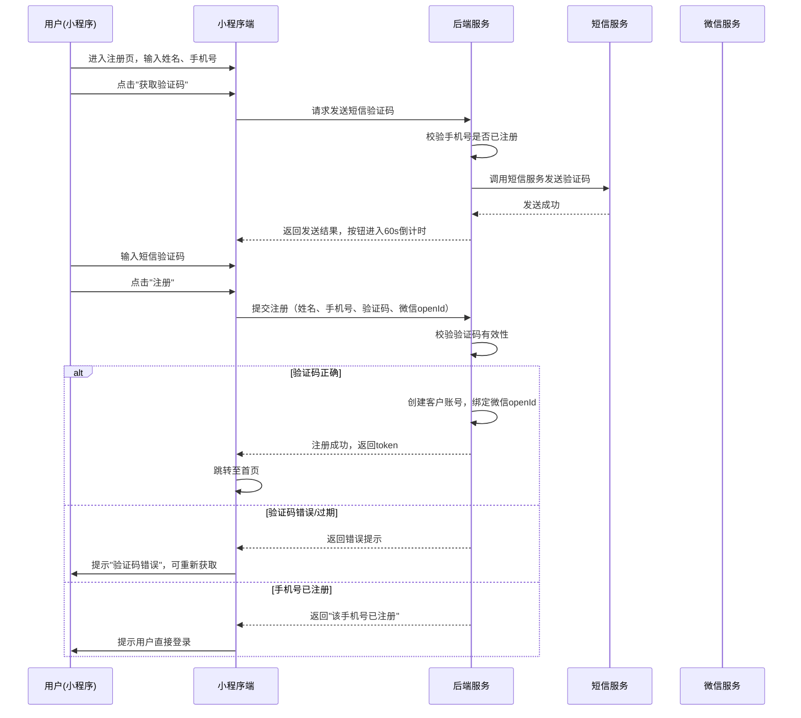
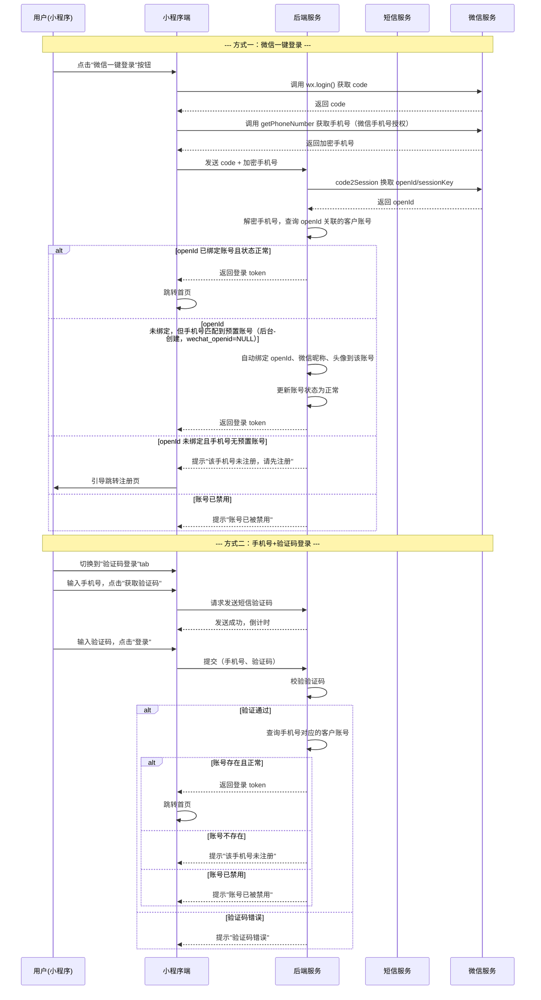
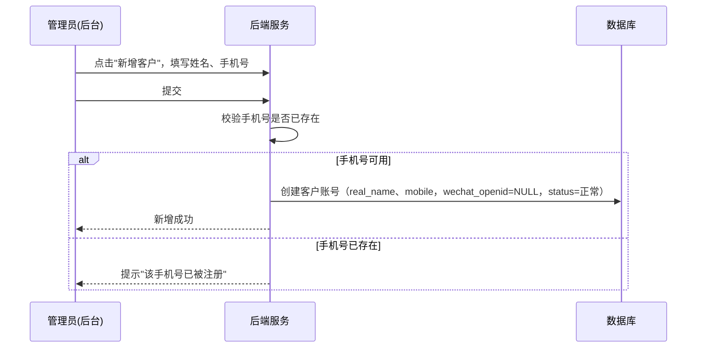
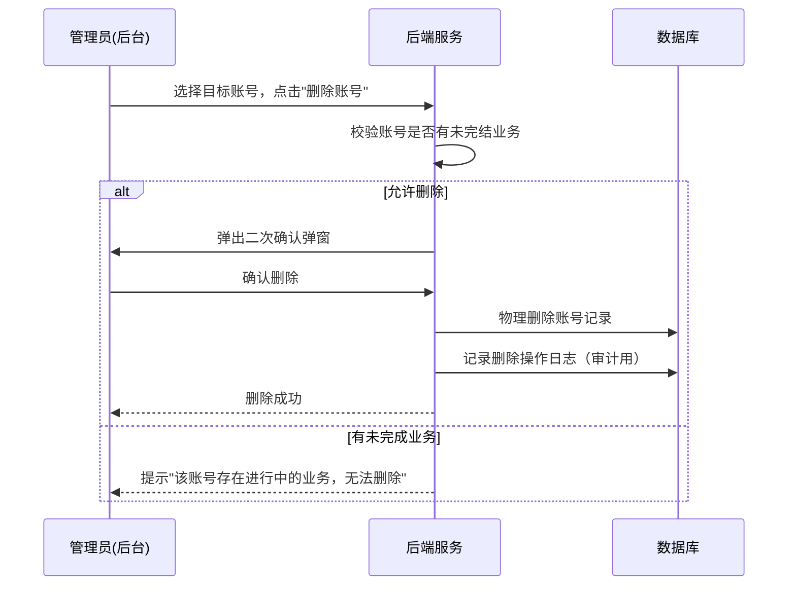
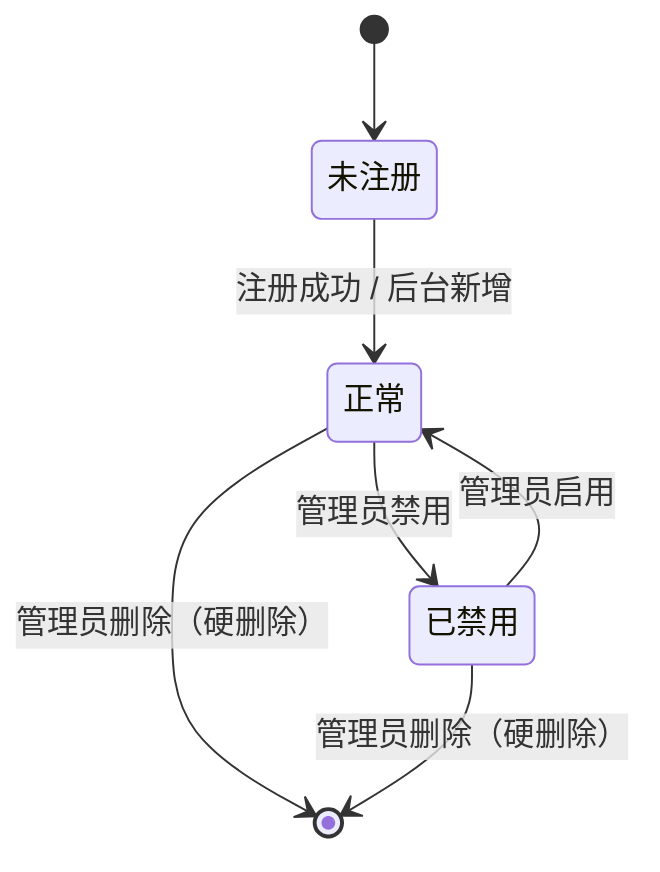

# 小程序登录注册模块 SPEC

> **归属中心**：02-客户中心
> **子模块**：注册
> **版本**：v1.3
>  **更新日期**：2026-06-26

------

## 1. 背景与目标 (Background & Objectives)

**背景**：B端客户需要在小程序端完成身份注册与登录，以使用平台提供的业务功能。当前缺乏统一的客户自助注册与多方式登录入口。

**目标**：提供手机号+验证码注册能力，支持微信一键登录与手机号+验证码两种登录方式，打通客户在小程序端的身份认证全流程。

------

## 2. 角色与使用场景 (Roles & Scenarios)

| 角色                  | 说明                     |
| --------------------- | ------------------------ |
| B端客户（新用户）     | 首次使用平台，需完成注册 |
| B端客户（已注册用户） | 已注册，需登录进入系统   |
| 系统管理员            | 管理客户账号状态         |

**使用场景**：

- 作为新客户，我在小程序端输入姓名、手机号并获取短信验证码后完成注册，以便后续登录使用平台服务。
- 作为已注册客户，我通过微信一键授权快速登录，无需重复输入手机号。
- 作为已注册客户，我也可以通过手机号+短信验证码方式登录（适用于非微信环境或更换微信账号的场景）。
- 作为系统管理员，我可以在后台新增客户账号，预置手机号和姓名；客户后续通过小程序微信登录并验证手机号后，微信信息自动绑定到该预置账号。
- 作为系统管理员，我可以在后台删除不再使用的客户账号（硬删除，物理删除不可恢复）；账号删除后该手机号被释放，允许重新注册。
- 作为客户（被管理员预置账号后），我通过小程序微信登录时，系统识别到我未绑定微信，引导我输入手机号验证，验证通过后自动绑定微信并登录。

------

## 3. 核心业务流程 (Core Business Flow)

### 3.1 注册流程



### 3.2 登录流程



### 3.3 管理员新增客户账号流程



**新增规则**：
- 后台新增的客户账号初始 wechat_openid 为 NULL，status 为"正常"
- 后台新增时不需要短信验证码，管理员直接设置姓名和手机号
- 客户后续通过小程序微信一键登录（含手机号授权）→ 系统自动匹配预置账号 → 绑定微信信息 → 登录成功，全程无需额外操作

### 3.4 管理员删除账号流程（硬删除）



**删除逻辑规则**：
- 删除为**硬删除**：账号数据从数据库中物理删除，不可恢复
- 删除后手机号**立即释放**，该手机号可被新用户注册使用
- 删除后微信 openId 随账号记录一并删除
- 删除后该账号的历史业务数据（订单、记录等）保留，通过客户ID脱敏关联
- 若账号存在未完结的业务（如待支付订单），提示管理员并阻止删除

### 3.5 状态流转

| 状态   | 说明                               | 触发条件           |
| ------ | ---------------------------------- | ------------------ |
| 未注册 | 手机号未在系统中创建账号           | 初始状态           |
| 正常   | 账号可用，可正常登录               | 注册/后台新增后    |
| 已禁用 | 账号被管理员禁用，无法登录         | 管理员操作         |



### 3.6 异常流与逆向流

| 异常场景                             | 处理方式                                                     |
| ------------------------------------ | ------------------------------------------------------------ |
| 短信发送失败                         | 提示"验证码发送失败，请稍后重试"，按钮恢复可点击             |
| 验证码过期（超过有效期）             | 提示"验证码已过期，请重新获取"                               |
| 验证码错误                           | 提示"验证码错误，请重新输入"，累计错误5次后当前验证码失效    |
| 手机号已注册（注册场景）             | 提示"该手机号已注册，请直接登录"并提供跳转登录入口           |
| 手机号未注册（登录场景）             | 提示"该手机号尚未注册，请先注册"并提供跳转注册入口           |
| 网络超时                             | 提示"网络异常，请检查网络后重试"                             |
| 微信授权失败（用户拒绝）             | 提示"微信授权已取消"，停留在登录页                           |
| 微信openId未绑定（登录场景）         | 引导用户进入手机号验证页，验证后自动绑定预置账号或引导注册   |
| 微信绑定-手机号无预置账号            | 提示"该手机号未注册，请先注册"，引导跳转注册页               |
| 管理员新增-手机号已存在              | 提示"该手机号已被注册"，阻止创建                             |
| 管理员删除账号（有未完结业务）       | 提示"该账号存在进行中的业务（如待支付订单），请先处理后再删除" |

------

## 4. 界面与交互说明 (UI & Interaction)

### 4.1 注册页

**界面布局**（自上而下）：

- 页面标题："注册账号"
- 输入区：
  - 姓名输入框（文本）
  - 手机号输入框（数字，11位）
  - 验证码输入框（数字，4-6位）+ "获取验证码"按钮（并排）
- 底部协议勾选区："我已认真阅读、理解和同意《钱鲜达服务协议》、《隐私政策》，授权使用本手机号码注册" + 勾选框
- 底部按钮："注册"（主按钮，满宽）
- 底部链接："已有账号？去登录"

**交互动作**：

- "获取验证码"点击后：校验手机号 → 调用发送接口 → 按钮置灰倒计时60s → 倒计时结束恢复
- "注册"按钮：所有字段填写完整且勾选协议后才可点击（未满足时置灰）
- 协议链接可点击，跳转至对应 H5 页面查看全文
- 点击"去登录"：跳转到登录页

**极限状态**：

- 空数据：输入框显示 placeholder 占位文案
- 加载中：注册按钮显示 loading + "注册中..."
- 验证码倒计时：按钮文案显示"XXs后重新获取"

### 4.2 登录页

**默认界面**（自上而下，仅显示）：

- 品牌 logo + "钱鲜达"
- 描述文案 + 微信一键登录按钮（绿色）
- `手机号登录` 灰色按钮+文字（灰色#f0f0f0，hover 变橙色）

- **合规协议勾选区**："我已认真阅读、理解和同意《钱鲜达服务协议》、《隐私政策》，授权使用本手机号码登录" + 勾选框（未勾选时，点击登录、微信一键登录按钮，弹出提示"已阅读并且同意协议"的内容弹框"先阅读并同意《钱鲜达服务协议》和《隐私政策》后再继续操作"，点击确定直接登录）
- **底部链接**："没有账号？去注册"

**点击「手机号登录」**：

- 半透明遮罩 + 底部 sheet 向上滑出（`cubic-bezier(0.32, 0.72, 0, 1)` 缓动）
- sheet 顶部有拖拽手柄 + "手机号登录" 标题 + 关闭 ✕ 按钮
- 手机号 + 验证码 + 登录按钮
- 点击遮罩或关闭按钮收起 sheet
- reduced-motion 下取消滑出动画

**交互动作**：

- 勾选状态共享
- "微信一键登录"：调用 `wx.login()` → 调后端登录接口 → 成功跳转首页（也需先勾选合规协议）
- "登录"与"微信一键登录"按钮：点击时，判断有没有勾选协议，没有则 弹出提示"已阅读并且同意协议"的内容弹框"先阅读并同意《钱鲜达服务协议》和《隐私政策》后再继续操作"，点击确定直接登录，并且执行登录流程。
- 合规协议文档链接可点击，跳转至对应 H5 页面查看协议全文

**极限状态**：

- 加载中：登录按钮显示 loading
- 首次进入：默认展示验证码登录
- 合规协议未勾选：点击 登录按钮/微信登录按钮 弹出提示"已阅读并且同意协议"的内容弹框"先阅读并同意《钱鲜达服务协议》和《隐私政策》后再继续操作"，点击确定直接登录

### 4.3 微信一键登录自动绑定（预置账号）

微信一键登录时，小程序通过 `getPhoneNumber` 接口获取用户授权手机号，后端直接匹配：
- openId 已绑定 → 直接登录
- openId 未绑定 + 手机号匹配到后台预置账号（wechat_openid=NULL）→ 自动绑定微信信息（openId、昵称、头像）→ 登录成功
- 手机号无匹配 → 提示"该手机号未注册" → 引导注册

无需单独的绑定手机号页面，整个绑定过程对用户透明。

### 4.4 后台客户管理页（管理员端）

**界面布局**（标准后台列表页 + 新增弹窗）：
- 搜索筛选区：客户姓名/手机号、注册来源、账号状态、"搜索"+"重置"
- 列表区（分页表格）：客户ID、姓名、手机号、注册来源、微信绑定状态、账号状态、注册时间、最近登录时间
- 工具栏：左侧"新增客户"按钮
- 操作列：「编辑」「禁用/启用」「删除」

**新增客户弹窗**：
- 姓名（文本输入，必填）、手机号（数字输入，11位，必填，校验唯一性）
- 提交后创建账号，wechat_openid=NULL，注册来源="后台"

------

## 5. 数据字典与字段级规则 (Data & Field Rules)

### 5.1 客户账号表字段

| 字段名称     | 字段类型      | 来源/依赖    | 默认值   | 读写权限         | 校验规则与约束                                 | 说明/占位符                 |
| ------------ | ------------- | ------------ | -------- | ---------------- | ---------------------------------------------- | --------------------------- |
| 客户ID       | String (UUID) | 系统生成     | -        | 只读             | 唯一主键                                       | -                           |
| 姓名         | String (50)   | 用户输入     | -        | 注册时可编辑     | 必填，1-50字符，不含特殊符号                   | placeholder: "请输入姓名"   |
| 手机号       | String (11)   | 用户输入     | -        | 注册时可编辑     | 必填，11位中国大陆手机号，正则 `^1[3-9]\d{9}$` | placeholder: "请输入手机号" |
| 微信openId   | String (128)  | 微信授权获取 | NULL     | 系统写入         | 唯一约束（已绑定不可重复绑定）                 | 首次注册或后续绑定          |
| 微信ID | String (128)  | 微信号ID | NULL     | 系统写入         | 可选                                           | 用于跨应用识别              |
| 微信昵称 | String (60) | 微信授权获取 | NULL | 系统写入 | 可选 | 微信登录时自动获取 | - |
| 账号状态     | Enum          | 系统管理     | "正常"   | 管理员可编辑     | 枚举值：正常、已禁用                | -                           |
| 注册时间     | DateTime      | 系统生成     | 当前时间 | 只读             | 自动记录                                       | 格式 `YYYY-MM-DD HH:mm:ss`  |
| 最近登录时间 | DateTime      | 系统更新     | -        | 只读             | 每次登录成功时更新                             | -                           |
| 注册来源     | Enum          | 系统记录     | "小程序" | 只读             | 枚举值：小程序、后台导入等                     | 后台新增为"后台"            |
| 已绑定客户 | Integer | 动态查询（关联 address_member_binding 表） | 0 | 只读 | 统计当前用户绑定的公司客户资料数量 | 点击可穿透查看绑定详情 |

### 5.2 短信验证码字段

| 字段名称     | 字段类型    | 来源/依赖 | 默认值                      | 读写权限 | 校验规则与约束      | 说明/占位符    |
| ------------ | ----------- | --------- | --------------------------- | -------- | ------------------- | -------------- |
| 手机号       | String (11) | 用户输入  | -                           | -        | 目标手机号          | -              |
| 验证码       | String (6)  | 系统生成  | -                           | -        | 6位数字随机码       | -              |
| 业务类型     | Enum        | 系统      | -                           | -        | 枚举：注册、登录    | 区分验证码用途 |
| 有效期       | Integer     | 系统      | 300s (5分钟)                | -        | 秒为单位            | -              |
| 发送时间     | DateTime    | 系统      | -                           | -        | 记录发送时刻        | -              |
| 已验证次数   | Integer     | 系统      | 0                           | -        | 累计错误5次自动失效 | -              |
| 发送频率限制 | -           | 系统      | 60s内同一手机号不可重复发送 | -        | -                   | -              |

### 5.3 展示逻辑

- 手机号展示：脱敏显示，中间4位替换为 `****`（如：138****1234）
- 日期时间：统一 `YYYY-MM-DD HH:mm:ss` 格式
- 金额：不涉及

### 5.4 编辑逻辑

- 手机号：注册时输入后不可修改（注册成功后如需修改手机号，需走独立的更换手机号流程）
- 姓名：注册时填写，后续可在个人中心修改
- 微信绑定：登录状态下可在个人中心绑定/解绑微信；账号删除后自动解绑
- 后台新增：管理员输入姓名和手机号即可创建账号，无需短信验证码；wechat_openid 初始为 NULL，注册来源标记为"后台"
- 微信自动绑定：客户通过微信登录+手机号验证后，系统自动将微信信息（openId、昵称、头像）绑定到预置账号
- 账号删除：仅管理员可在后台执行，硬删除，数据物理删除不可恢复；删除后手机号释放，该手机号可被新用户注册

------

## 6. 系统交互与边界 (System Integrations & Boundaries)

### 6.1 前置依赖

| 依赖项         | 说明                                                         |
| -------------- | ------------------------------------------------------------ |
| 短信服务商     | 需对接短信平台（如阿里云短信、腾讯云短信），具备发送验证码能力 |
| 微信小程序服务 | 需配置小程序 AppID/AppSecret，通过 `wx.login()` 获取 code，后端调用 `code2Session` 换取 openId |
| 客户管理模块   | 注册时在客户管理模块创建客户记录，登录时查询客户状态         |

### 6.2 上下游影响

| 关联模块 | 影响说明                                                     |
| -------- | ------------------------------------------------------------ |
| 客户管理 | 注册成功后创建客户记录，客户ID作为后续业务唯一标识；后台可新增客户账号（wechat_openid=NULL），微信登录时自动绑定 |
| 权限管理 | 注册客户默认分配"普通客户"角色，管理员可后续调整 |
| 日志审计 | 记录注册、登录、登出操作日志，包含时间、IP、设备信息   |

------

## 7. 非功能性需求 (Non-Functional Requirements)

### 7.1 性能要求

| 指标               | 要求      |
| ------------------ | --------- |
| 短信验证码发送响应 | < 3s      |
| 注册接口响应       | < 2s      |
| 登录接口响应       | < 1s      |
| 微信授权登录响应   | < 2s      |
| 并发登录支持       | ≥ 500 QPS |

### 7.2 安全要求

- 短信验证码：6位随机数字，有效期5分钟，同一手机号每天最多发送10条
- 验证码校验：单次验证码最多错误尝试5次，超出后失效需重新获取
- 登录凭证：使用 JWT token，有效期24小时，支持 refresh token 续期
- 传输安全：全链路 HTTPS 加密
- 敏感信息：手机号存储加密，日志中脱敏
- 微信 openId：服务端存储，禁止前端明文传递
- 防刷机制：同一 IP/设备高频请求触发图形验证码或限流

### 7.3 权限

| 层级     | 说明                                                         |
| -------- | ------------------------------------------------------------ |
| 操作权限 | 注册、登录、微信绑定为公开接口，无需前置鉴权；退出登录需登录态；新增/禁用/删除账号仅限管理员角色操作 |
| 数据权限 | 客户仅可查看和编辑自身账号信息；管理员可查看、新增、禁用、删除所有客户账号 |

------

## 8. 输出文档需求

本模块为**02-客户中心**下的**注册**子模块。

```
spec/
└── 02-客户中心/
    └── 注册/小程序登录注册模块.md    ← 本文档
```

后续客户管理模块下的其他子模块（如：客户信息管理、客户分级、客户标签等）将在同级目录下新增文档。
