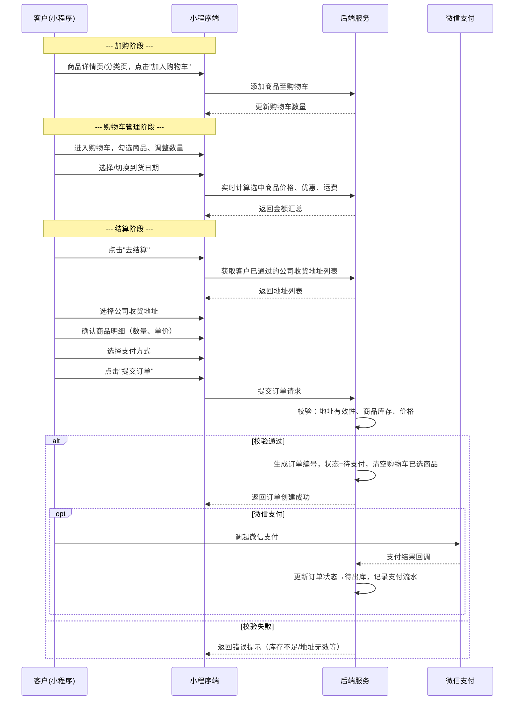
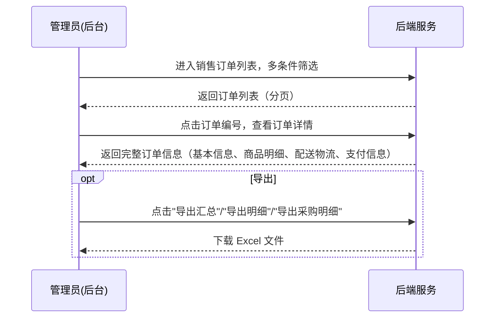
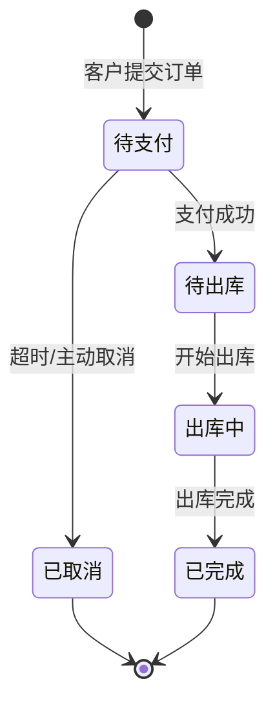

# 销售订单管理模块 SPEC

> **归属中心**：03-交易中心
> **子模块**：销售订单管理
> **版本**：v1.0
> **更新日期**：2026-07-03
>
> - **后台端（PC）**：面向运营/管理员，提供全量销售订单查询、导出、详情查看、退货单关联等管理能力。
> - **小程序端**：面向 B 端客户，下单全流程（商品加购→购物车→选地址→选支付→提交）及订单列表/详情查看。
> 两端共用同一套底层数据与状态机。

------

## 1. 背景与目标 (Background & Objectives)

**背景**：B端客户完成公司档案审核后即可下单采购。客户在小程序端浏览商品并加入购物车，在购物车中管理商品数量与到货日期，确认后进入结算页选择地址与支付方式，提交订单后系统生成订单数据并通过物流配送到客户手中。

**目标**：为后台运营提供全量订单查询、多维筛选、金额对账导出能力；为客户提供"浏览→加购→购物车管理→结算→支付"的流畅下单体验与订单跟踪能力。

------

## 2. 角色与使用场景 (Roles & Scenarios)

| 角色 | 说明 |
| --- | --- |
| 小程序客户（B端） | 已登录且公司档案已审核通过的客户，在小程序端下单采购 |
| 后台管理员/运营 | 在 PC 后台管理所有销售订单，查询、导出、关联退货单 |
| 业务员 | 查看名下客户的订单数据 |

**使用场景（User Story）**：

- 作为**后台管理员**，我希望通过下单日期、订单状态、客户信息、商品信息、销售大区等多维度筛选订单并导出 Excel，以便进行财务对账和运营分析。
- 作为**后台管理员**，我希望点击订单编号进入详情页，查看订单基本信息、商品明细（含金额拆分）、配送物流信息、支付流水，以便快速定位订单问题。
- 作为**后台管理员**，我希望能切换到"退货单"Tab 查看关联的退货信息，以便一站式处理售后问题。
- 作为**客户**，我希望在商品详情页将商品加入购物车，在购物车中调整数量、选择到货日期，以便灵活管理待购商品。
- 作为**客户**，我希望在购物车勾选商品后点击"去结算"，进入结算页选择公司收货地址和支付方式后提交订单，以便快速完成采购。
- 作为**客户**，我希望在订单列表按状态筛选并查看订单详情，以便跟踪订单的配送进度。
- 作为**业务员**，我希望查看名下客户的订单数据，以便了解客户采购情况。

------

## 3. 核心业务流程 (Core Business Flow)

### 3.1 客户下单主流程



### 3.2 后台管理流程



### 3.3 状态流转

| 起始状态 | 触发动作 | 目标状态 | 处理逻辑与影响说明 |
| --- | --- | --- | --- |
| - | 客户提交订单 | 待支付 | 创建订单记录，生成订单编号 |
| 待支付 | 支付成功 | 待出库 | 记录支付流水，进入出库队列 |
| 待支付 | 超时未支付 / 客户主动取消 | 已取消 | 释放库存，恢复优惠券 |
| 待出库 | 推送SAP仓库开始拣货 | 出库中 | 生成出库任务，并且推送SAP进行分拣，分配物流 |
| 出库中 | SAP回执出库单，出库完成 | 已完成 | 订单完结，记录物流信息（司机、物流单号、时间节点） |
| 待出库 | 客户申请退货 | 已取消 | 创建退货单，退货状态 → 已退货（关联退货管理模块） |
| 出库中/已完成 | 客户申请退货，需客服审核退货 | 已取消 | 客户创建退货单，客服审核完成 |



### 3.4 异常流与逆向流

| 异常场景 | 触发条件 | 系统处理方式 |
| --- | --- | --- |
| 库存不足 | 提交订单时商品库存 < 订购量 | Toast 提示"商品 [xxx] 库存不足，当前库存 x"，阻止提交 |
| 购物车商品失效 | 加购后商品下架或价格变更 | 商品行置灰标注"已下架/价格已更新"，复选框不可选，提示"部分商品已失效，请重新选择" |
| 地址无效 | 选择的收货地址非"已通过"状态 | 提示"该地址暂不可用，请重新选择" |
| 支付超时 | 微信支付回调超时 | 订单保持待支付，允许重新支付或手动取消 |
| 支付失败 | 微信支付返回失败 | 提示"支付失败，请重新支付"，订单保持待支付 |
| 出库差异 | 仓库实际出货与订单不一致 | 触发差补流程，记录差补状态为"未差补"，管理员可创建差补单 |
| 优惠券分摊异常 | 优惠券金额无法均分到各商品行 | 按金额比例加权分摊，尾差归入最后一行 |

------

## 4. 界面与交互说明 (UI & Interaction)

### 4.1 后台管理员端（PC 后台）

#### 4.1.1 销售订单列表页

**页面入口**：后台菜单 → 订单管理 → 销售订单

```
┌──────────────────────────────────────────────────────────────────────────────────────────────────┐
│  搜索区                                                                                           │
│  下单日期：[开始日期-结束日期 ____]  到货日期：[开始日期-结束日期 ____]  订单编号：[________]        │
│  订单状态：[全部 ▼]                  销售人员：[姓名/手机号 ____]                                   │
│                                                                                                   │
│  客户信息：[客户编码/名称 ____]      客户类型：[全部 ▼]             客户地址：[________]             │
│  所在城市：[省/市/区 ▼]             差补状态：[全部 ▼]                                             │
│                                                                                                   │
│  商品信息：[商品编码/名称 ____]      商品类目：[任意类目层级 ▼]      销售大区：[全部 ▼]              │
│  出库仓库：[全部 ▼]                 退货状态：[全部 ▼]                           [重置] [查询]     │
├──────────────────────────────────────────────────────────────────────────────────────────────────┤
│  [导出汇总] [导出明细] [导出采购明细]                                                  共 X 条记录 │
├──────────────────────────────────────────────────────────────────────────────────────────────────┤
│  数据表格（23列，横向可滚动）                                                                       │
│  ┌────┬────────┬──────┬──────┬──────────┬──────┬──────┬──────┬──────┬────┬────┬────┬────┬───  │
│  │序号│订单编号│结算  │销售  │下单时间  │到货  │客户  │客户  │订单  │SKU │订单│商品│促销│优惠 │
│  │    │        │类型  │大区  │          │日期  │编码  │名称  │状态  │数  │总金│总金│金额│券金 │
│  │    │        │      │      │          │      │      │      │      │    │额  │额  │    │额   │
│  ├────┼────────┼──────┼──────┼──────────┼──────┼──────┼──────┼──────┼────┼────┼────┼────┼─────┤
│  │ 1  │20012112│现结  │海南区│2026-06-06│2026- │7123456│大碗厨│待支付│ 1  │120 │100 │ 0  │ 10  │
│  │    │1       │      │      │10:23:34  │06-07 │      │      │      │    │    │    │    │     │
│  ├────┼────────┼──────┼──────┼──────────┼──────┼──────┼──────┼──────┼────┼────┼────┼────┼─────┤
│  │ 2  │20012112│账期  │广深区│2026-06-06│2026- │7123457│湘味轩│待出库│14  │580 │500 │ 0  │ 30  │
│  │    │2       │      │      │14:15:22  │06-08 │      │      │      │    │    │    │    │     │
│  └────┴────────┴──────┴──────┴──────────┴──────┴──────┴──────┴──────┴────┴────┴────┴────┴─────┘
│  （续上表）
│  ┌────┬──────┬──────┬──────┬────┬──────┬──────┬──────┬──────┬──────┬──────────┐
│  │折扣│商品实│运费  │实付  │差补│退货  │销售员│销售员│结算  │      │          │
│  │金额│付金额│      │总金额│状态│状态  │      │手机  │客户  │ 操作 │          │
│  ├────┼──────┼──────┼──────┼────┼──────┼──────┼──────┼──────┼──────┼──────────┤
│  │ 0  │ 90   │ 20   │ 110  │未差│未退货│张三  │156262│100123│[详情]│          │
│  │    │      │      │      │补  │      │      │70709 │4     │      │          │
│  ├────┼──────┼──────┼──────┼────┼──────┼──────┼──────┼──────┼──────┼──────────┤
│  │ 0  │ 470  │ 50   │ 520  │已差│未退货│李四  │138001│100123│[详情]│          │
│  │    │      │      │      │补  │      │      │38000 │5     │      │          │
│  └────┴──────┴──────┴──────┴────┴──────┴──────┴──────┴──────┴──────┴──────────┘
│  ┌─────────────────────────────────────────────────────────────────────────────┐
│  │ 红色标注计算规则：                                                           │
│  │ 订单总金额 = 商品总金额 + 运费 | 商品实付金额 = 商品总金额 - 促销 - 优惠券 - 折扣 │
│  │ 实付总金额 = 商品实付金额 + 运费                                             │
│  └─────────────────────────────────────────────────────────────────────────────┘
├──────────────────────────────────────────────────────────────────────────────────────────────────┤
│  分页器：                                        [< 上一页] [1] [2] [3] [下一页 >]  共 3 页       │
└──────────────────────────────────────────────────────────────────────────────────────────────────┘
```

**交互动作**：
- 点击 [查询]：触发全量筛选，列表刷新，分页回到第 1 页
- 点击 [重置]：清空所有筛选项恢复默认值（全部/空），不自动触发查询
- 点击 [导出汇总] / [导出明细] / [导出采购明细]：异步生成当前筛选条件下的 Excel 文件并下载
- 点击订单编号：跳转到订单详情页
- 点击 [详情]：跳转到订单详情页
- 表格横向滚动：列数较多时出现水平滚动条

**极限状态**：
- 空数据：居中插图 + "暂无数据"，隐藏导出按钮
- 加载中：表格区域展示骨架屏（灰底占位块）
- 导出中：导出按钮显示 loading 图标 + "导出中..."

#### 4.1.2 订单详情页

**页面入口**：列表页点击订单编号 / [详情] 按钮

```
┌──────────────────────────────────────────────────────────────────────────────────┐
│  [订单详情]  [退货单]                                                              │
│  ──────────                                                                       │
├──────────────────────────────────────────────────────────────────────────────────┤
│  基本信息（所有字段只读，灰底）                                                       │
│  ┌──────────────────────────────────────────────────────────────────────────────┐│
│  │ 订单编号：20232343443A  │ 仓库：B端仓库     │ 订单类型：普通订单 │ 订单状态：已完成 │ 下单时间：2026-10-10 10:23:34 ││
│  ├──────────────────────────────────────────────────────────────────────────────┤│
│  │ 客户类型：普通客户      │ 客户编码：714790  │ 客户名称：张三     │ 下单人：王五     │ 下单手机：15626270709        ││
│  ├──────────────────────────────────────────────────────────────────────────────┤│
│  │ 订单金额：¥120.00       │ 折扣金额：¥0.00  │ 优惠券金额：¥10.00 │ 促销金额：¥0.00  │ 物流运费：¥20.00             ││
│  ├──────────────────────────────────────────────────────────────────────────────┤│
│  │ 实付金额：¥110.00       │                  │                   │                 │                              ││
│  └──────────────────────────────────────────────────────────────────────────────┘│
├──────────────────────────────────────────────────────────────────────────────────┤
│  商品信息（12列表格）                                                                │
│  ┌──────┬──────┬──────┬──────┬──────┬──────┬──────┬──────┬──────┬──────┬──────┬──┐│
│  │配送  │商品  │商品  │结算  │订购  │商品  │商品  │促销  │优惠券│折扣  │商品  │附│是否 │SAP  │推送  │SAP分 ││
│  │仓库  │条码  │名称  │单位  │数量  │单价  │总金额│金额  │金额  │金额  │实付  │加│推送 │实际出│SAP   │拣出库││
│  │      │      │      │      │      │      │      │      │      │      │金额  │服│SAP  │库数量│时间  │单时间││
│  ├──────┼──────┼──────┼──────┼──────┼──────┼──────┼──────┼──────┼──────┼──────┼──┼─────┼─────┼──────┼──────┤│
│  │B端业 │20050 │冷鲜  │千克  │  1   │ 50   │  50  │  0   │  5   │  0   │  45  │  │已推送│  1  │06-06 │06-08 ││
│  │务仓  │306   │瘦肉  │      │      │      │      │      │      │      │      │  │     │     │10:30 │09:15 ││
│  ├──────┼──────┼──────┼──────┼──────┼──────┼──────┼──────┼──────┼──────┼──────┼──┼─────┼─────┼──────┼──────┤│
│  │A端业 │21153 │优鲜  │千克  │  2   │ 25   │  50  │  0   │  5   │  0   │  45  │  │已推送│  2  │06-06 │06-08 ││
│  │务仓  │037   │带颈  │      │      │      │      │      │      │      │      │  │     │     │10:30 │09:15 ││
│  │      │      │通排  │      │      │      │      │      │      │      │      │  │     │     │      │      ││
│  └──────┴──────┴──────┴──────┴──────┴──────┴──────┴──────┴──────┴──────┴──────┴──┴─────┴─────┴──────┴──────┘│
│  ┌──────────────────────────────────────────────────────────────────────────────┐│
│  │ 红色标注：商品总金额 = 订购数量 × 商品单价（无促销时）                              ││
│  │ 促销/优惠券/折扣金额为整单拆分后金额 | 商品实付 = 商品总金额 - 促销 - 优惠券 - 折扣  ││
│  └──────────────────────────────────────────────────────────────────────────────┘│
├──────────────────────────────────────────────────────────────────────────────────┤
│  配送信息                            │  物流信息                                    │
│  ┌────────────────────────────┐     │  ┌────────────────────────────┐              │
│  │ 配送方式：物流配送          │     │  │ 物流单号：8127287182        │              │
│  │ 收货人：张三                │     │  │ 司机姓名：张三              │              │
│  │ 收货地址：广东省广州市       │     │  │ 司机电话：15626270708       │              │
│  │           西乡街道          │     │  │ 发车时间：2025-08-08 10:34  │              │
│  │ 联系方式：15626270708       │     │  │ 到达时间：2025-08-08 10:34  │              │
│  │ 配送时间：2026-08-09 00:00  │     │  │ 卸货时间：2025-08-08 10:34  │              │
│  │          ~2026-08-08 05:00 │     │  └────────────────────────────┘              │
│  │ 备注：密码锁5200，放到      │     │                                              │
│  │       具体的冰柜            │     │                                              │
│  └────────────────────────────┘     │                                              │
├──────────────────────────────────────────────────────────────────────────────────┤
│  支付信息                                                                          │
│  ┌──────────────────────────────────────────────────────────────────────────────┐│
│  │ 支付方式：微信 │ 支付时间：2025-08-08 10:34:34 │ 商户号：13234241 │ 商户号名称：深圳供应链有限公司 ││
│  │ 支付流水：420000314720260610569710                              [查看流水]     ││
│  └──────────────────────────────────────────────────────────────────────────────┘│
└──────────────────────────────────────────────────────────────────────────────────┘
```

**交互动作**：
- 点击 [订单详情] / [退货单] Tab：切换对应内容区，当前激活 Tab 有蓝色下划线
- 点击 [查看流水]：弹出模态弹窗，展示微信支付网关回执详情（交易状态、付款银行、交易单号等）
- 所有表单字段均为只读，灰底展示

**极限状态**：
- 订单无物流信息：物流信息区显示"--"
- 订单无退货单：退货单 Tab 展示空状态"暂无退货记录"
- 支付流水未生成：[查看流水] 链接隐藏

### 4.2 小程序客户端

#### 4.2.1 购物车页

**页面入口**：小程序底部 Tab "购物车"

**界面布局**（自上而下）：

- **顶部导航栏**：标题"购物车"
- **内容区**：按"到货日期"分组展示商品，每组为一个白色圆角卡片

```
┌─────────────────────────────────┐
│  购物车                          │
├─────────────────────────────────┤
│  ┌─────────────────────────────┐│
│  │ ○ 06月16日 到货   切换到货日期 ▲││
│  ├─────────────────────────────┤│
│  │ ○ [图] 某某商品名称           ││
│  │        五花肉5斤装            ││
│  │        ¥0.5/盒        [-] 1 [+]│
│  ├─────────────────────────────┤│
│  │ ○ [图] 某某商品名称           ││
│  │        五花肉5斤装            ││
│  │        ¥0.5/盒        [-] 1 [+]│
│  ├─────────────────────────────┤│
│  │ ○ [图] 某某商品名称           ││
│  │        五花肉5斤装            ││
│  │        ¥0.5/盒        [-] 1 [+]│
│  │        已优惠 ¥10 元          ││
│  └─────────────────────────────┘│
│  （更多分组卡片...）              │
├─────────────────────────────────┤
│  共减 ¥10.0 ▾                    │
│  还差 ¥422 可减免运费 ¥25        │
│  ¥78.0            [去结算 3]     │
└─────────────────────────────────┘
```

**分组卡片结构**：
- **分组头部**：左侧圆形全选复选框 + 到货日期文案（如"06月16日 到货"）+ 右侧"切换到货日期"折叠箭头
- **商品行**（每个 SKU 一行）：
  - 左侧：圆形单选复选框
  - 商品图片（缩略图）
  - 商品名称（主文字）
  - 商品规格（灰色副文字，如"五花肉5斤装"）
  - 商品单价（红色加粗，如 `¥0.5/盒`）
  - 优惠标签（部分商品下方红色文字"已优惠 ¥10 元"）
  - 右侧：数量计数器 `[-] N [+]`

**底部固定操作栏**（始终可见）：
- 左区（可点击展开/收起 ▾）：
  - "共减 ¥X" — 选中商品的总优惠金额
  - "还差 ¥X 可减免运费 ¥Y" — 免运费差额提示
- 右区：
  - 实付总额 `¥XX`
  - [去结算 N] 红色胶囊按钮（N = 已选商品种数）

**交互动作**：
- 点击分组全选复选框 → 联动勾选/取消该组下所有商品；全选时按钮自动选中，部分选时半选态
- 点击商品行复选框 → 切换该商品选中状态，实时重算底部金额
- 点击 `+` → 数量 +1，实时重算金额
- 点击 `-` → 数量 -1；数量为 1 时继续点 `-` 弹出"确认删除该商品？"弹窗（或 `-` 置灰不可点）
- 点击"切换到货日期" → 弹出日期选择器，将该组商品整体调整到其他可配送日期
- 点击底部"共减"区 ▾ → 展开/收起价格明细（商品总额、促销立减、运费）
- 点击 [去结算 N] → 携带已勾选商品跳转支付结算页
- 未选中任何商品时，[去结算] 按钮置灰不可点击，数字显示 0

**金额联动计算**：
- 勾选/取消商品、修改数量、切换日期时，底部金额实时重算
- 选中商品总额 = Σ(选中商品单价 × 数量)
- 优惠总额 = Σ(选中商品促销立减金额)
- 运费按选中商品总金额和配送距离计算，满免运费门槛则免
- 实付总额 = 选中商品总额 - 优惠总额 + 运费

**极限状态**：
- 空购物车：居中插图 + "购物车是空的" + [去逛逛] 按钮
- 加载中：骨架屏
- 商品已下架/库存不足：商品行置灰，复选框不可选，标注"已下架"或"库存不足"

#### 4.2.2 支付结算页（下单页）

**页面入口**：购物车 → 点击"去结算"

```
┌─────────────────────────────────┐
│  ← 确认订单                      │
├─────────────────────────────────┤
│  收货地址                        │
│  ┌─────────────────────────────┐│
│  │ 张三  15626270708          ││
│  │ 广东省广州市西乡街道...     ││
│  │                        >   ││
│  └─────────────────────────────┘│
├─────────────────────────────────┤
│  商品明细                        │
│  ┌─────────────────────────────┐│
│  │ [图] 冷鲜瘦肉                ││
│  │      千克  ¥50.00  ×1  ¥50 ││
│  ├─────────────────────────────┤│
│  │ [图] 优鲜带颈通排            ││
│  │      千克  ¥25.00  ×2  ¥50 ││
│  └─────────────────────────────┘│
│  合计：¥100.00                   │
├─────────────────────────────────┤
│  支付方式                        │
│  ○ 微信支付                      │
│  ○ 账期支付                      │
├─────────────────────────────────┤
│  备注                            │
│  [如有特殊要求请备注 ________]    │
├─────────────────────────────────┤
│                                 │
│  合计：¥100.00    [提交订单]     │
└─────────────────────────────────┘
```

**交互动作**：
- 点击地址卡片 → 底部弹出地址选择器（仅展示"已通过"状态地址），选中后回填
- 切换支付方式 → 单选切换，账期支付不可用时置灰标注"暂无账期额度"
- 点击 [提交订单] → 全量校验 → loading → 成功跳转支付或订单详情

**极限状态**：
- 无可选地址：显示"暂无可用地址，请先添加公司收货地址" + [去添加] 按钮
- 提交中：按钮显示"提交中..."，不可重复点击
- 库存不足：toast 提示"商品 [xxx] 库存不足"

#### 4.2.3 订单列表页（小程序）

**页面入口**：小程序底部 Tab "订单"

```
┌─────────────────────────────────┐
│  我的订单                        │
├─────────────────────────────────┤
│  [全部] [待支付] [待出库] [出库中] [已完成]  │
├─────────────────────────────────┤
│  ┌─────────────────────────────┐│
│  │ 订单号：20232343443A  已完成 ││
│  │ [图] 共2种商品              ││
│  │ 实付：¥110.00               ││
│  │             [查看详情]      ││
│  └─────────────────────────────┘│
│  ┌─────────────────────────────┐│
│  │ 订单号：20232343444B  待支付 ││
│  │ [图] 共1种商品              ││
│  │ 实付：¥50.00                ││
│  │       [取消订单] [去支付]    ││
│  └─────────────────────────────┘│
│  ...（触底加载更多）             │
└─────────────────────────────────┘
```

**交互动作**：
- 顶部 Tab 切换 → 按状态筛选，列表刷新
- 下拉刷新 → 重新加载当前状态列表
- 触底 → 自动加载下一页
- 点击订单卡片 → 跳转订单详情页
- 待支付卡片：[取消订单] 弹出确认 → [去支付] 调起微信支付

**极限状态**：
- 空数据：居中插图 + "暂无订单" + [去逛逛] 按钮
- 加载中：骨架屏（灰色卡片占位）

#### 4.2.4 订单详情页（小程序）

**页面入口**：订单列表 → 点击订单卡片

```
┌─────────────────────────────────┐
│  ← 订单详情                      │
├─────────────────────────────────┤
│       ✅（图标）                  │
│      已完成                      │
│  订单已送达，感谢您的购买          │
├─────────────────────────────────┤
│  物流信息                        │
│  ┌─────────────────────────────┐│
│  │ 物流公司：顺丰速运            ││
│  │ 运单号：8127287182          ││
│  │ ● 2026-08-08 10:34 已签收   ││
│  │ ● 2026-08-08 08:00 派送中   ││
│  │ ● 2026-08-08 05:00 已发车   ││
│  └─────────────────────────────┘│
├─────────────────────────────────┤
│  收货信息                        │
│  张三  15626270708               │
│  广东省广州市西乡街道...          │
├─────────────────────────────────┤
│  商品明细                        │
│  ┌─────────────────────────────┐│
│  │ [图] 冷鲜瘦肉  千克          ││
│  │       ¥50.00 ×1      ¥50.00││
│  ├─────────────────────────────┤│
│  │ [图] 优鲜带颈通排  千克      ││
│  │       ¥25.00 ×2      ¥50.00││
│  └─────────────────────────────┘│
├─────────────────────────────────┤
│  价格明细                        │
│  商品总额         ¥100.00        │
│  优惠券抵扣        -¥10.00        │
│  运费              +¥20.00        │
│  实付金额          ¥110.00        │
├─────────────────────────────────┤
│  订单信息                        │
│  订单编号    20232343443A  [复制] │
│  下单时间    2026-10-10 10:23:34 │
│  支付方式    微信                 │
│  支付时间    2025-08-08 10:34:34 │
│  备注        --                  │
├─────────────────────────────────┤
│        [申请退货]                │
└─────────────────────────────────┘
```

**交互动作**：
- 点击订单编号 → 复制到剪贴板，toast "已复制"
- 点击商品行 → 跳转商品详情页
- 点击运单号 → 复制或跳转物流详情
- 底部按钮按状态变化：待支付→[取消订单] [去支付] / 待出库→[申请退货] / 已出库→[确认收货] [申请退货] / 已完成→[再次购买] [申请退货]

**极限状态**：
- 物流信息未产生：隐藏物流区块
- 待支付状态：物流区替换为支付倒计时提示"订单将在 XX:XX 后自动取消"

------

## 5. 数据字典与字段级规则 (Data & Field Rules)

### 5.1 销售订单主表

| 字段名称 | 字段类型 | 来源/依赖 | 默认值 | 读写权限 | 校验规则与约束 | 说明/占位符 |
| :--- | :--- | :--- | :--- | :--- | :--- | :--- |
| 订单ID | 文本(32位) | 系统生成 | - | 只读 | 唯一主键 | 内部标识 |
| 订单编号 | 文本(20位) | 系统生成 | - | 只读 | 唯一，不可重复 | 如 20232343443A，列表可点击跳转详情 |
| 订单类型 | 枚举 | 系统写入 | 普通订单 | 只读 | 普通订单、差补单 | 差补单关联原订单号 |
| 订单状态 | 枚举 | 系统/客户操作 | 待支付 | 只读（系统流转） | 待支付、待出库、出库中、已完成、已取消 | 带色彩标签展示 |
| 仓库ID | 文本(32位) | 仓库管理模块 | - | 系统写入 | 关联出库仓库 | 下单时分配 |
| 客户ID | 文本(32位) | 客户档案模块 | - | 系统写入 | 关联已通过公司档案 | |
| 客户编码 | 文本(30位) | 客户档案快照 | - | 只读 | 下单时快照 | 如 714790，不随后续变更 |
| 客户名称 | 文本(100字) | 客户档案快照 | - | 只读 | 下单时快照 | 如"大碗厨" |
| 客户类型 | 枚举 | 客户档案快照 | 普通客户 | 只读 | 如普通客户等 | 下单时快照 |
| 下单人ID | 文本(32位) | 小程序用户 | - | 只读 | 关联小程序注册用户 | |
| 下单人 | 文本(50字) | 快照 | - | 只读 | 下单人姓名 | 可能与客户名称不同（员工代下单） |
| 下单手机 | 文本(11位) | 快照 | - | 只读 | 11位手机号格式 | |
| 销售大区ID | 文本(32位) | 销售大区管理模块 | - | 系统写入 | 根据收货地址自动匹配 | |
| 收货人 | 文本(50字) | 客户选择 | - | 只读 | 必填，下单时快照 | |
| 收货电话 | 文本(11位) | 客户选择 | - | 只读 | 11位手机号格式 | |
| 收货地址 | 文本(500字) | 客户选择 | - | 只读 | 省市区+详细地址，下单时快照 | |
| 配送方式 | 枚举 | 系统 | 物流配送 | 只读 | 物流配送等 | |
| 配送时间起 | 日期时间 | 客户选择/快照 | - | 只读 | 格式 YYYY-MM-DD HH:mm | 收货时间窗口起始 |
| 配送时间止 | 日期时间 | 客户选择/快照 | - | 只读 | 必须大于起始时间 | 收货时间窗口结束 |
| 配送备注 | 文本(200字) | 客户填写 | 空 | 只读 | 选填，限 200 字 | 如"密码锁5200，放到具体的冰柜" |
| 下单时间 | 日期时间 | 系统写入 | 当前时间 | 只读 | YYYY-MM-DD HH:mm:ss | |
| 到货日期 | 日期 | 客户选择 | 空 | 只读 | YYYY-MM-DD，选填 | 期望到货日期 |
| 订单总金额 | 金额(元,2位) | 系统计算 | - | 只读 | = 商品总金额 + 运费 | |
| 商品总金额 | 金额(元,2位) | 系统计算 | - | 只读 | Σ(各行商品总金额) | 商品原价合计 |
| 促销金额 | 金额(元,2位) | 营销模块 | 0.00 | 只读 | 整单促销扣减总额 | 拆分到各行 |
| 优惠券金额 | 金额(元,2位) | 营销模块 | 0.00 | 只读 | 整单优惠券扣减总额 | 拆分到各行 |
| 折扣金额 | 金额(元,2位) | 系统/手动 | 0.00 | 只读 | 整单手动折扣总额 | 拆分到各行 |
| 商品实付金额 | 金额(元,2位) | 系统计算 | - | 只读 | = 商品总金额 - 促销 - 优惠券 - 折扣 | |
| 运费 | 金额(元,2位) | 系统计算 | 0.00 | 只读 | 物流配送费用 | |
| 实付总金额 | 金额(元,2位) | 系统计算 | - | 只读 | = 商品实付金额 + 运费 | 客户最终支付金额 |
| 结算类型 | 枚举 | 客户档案 | - | 只读 | 现结、账期 | 下单时快照 |
| 结算客户编码 | 文本(30位) | 系统 | - | 只读 | 结算主体客户编码 | 如 1001234 |
| 差补状态 | 枚举 | 系统 | 未差补 | 只读 | 未差补、无差补、已差补 | 出库差异触发 |
| 退货状态 | 枚举 | 退货管理模块 | 未退货 | 系统联动 | 未退货、已退货 | 与退货单状态联动 |
| 销售员ID | 文本(32位) | 客户档案 | - | 只读 | 归属业务员 | 下单时快照 |
| 支付方式 | 枚举 | 客户选择 | - | 只读 | 微信等 | 支付时确定 |
| 支付流水号 | 文本(64位) | 微信支付回调 | 空 | 系统回写 | 微信支付/账期确认后回写 | |
| 支付时间 | 日期时间 | 微信支付回调 | 空 | 系统回写 | YYYY-MM-DD HH:mm:ss | 待支付时为空 |
| 商户号 | 文本(32位) | 微信支付 | 空 | 系统回写 | | 收款商户号 |
| 商户号名称 | 文本(100字) | 微信支付 | 空 | 系统回写 | | 收款商户名称 |
| 物流单号 | 文本(50字) | TMS/物流 | 空 | 系统回写 | | 出库后回写 |
| 司机姓名 | 文本(50字) | TMS/物流 | 空 | 系统回写 | | |
| 司机电话 | 文本(11位) | TMS/物流 | 空 | 系统回写 | | |
| 发车时间 | 日期时间 | TMS/物流 | 空 | 系统回写 | | |
| 到达时间 | 日期时间 | TMS/物流 | 空 | 系统回写 | | |
| 卸货时间 | 日期时间 | TMS/物流 | 空 | 系统回写 | | |
| 关联原订单号 | 文本(20位) | 系统写入 | 空 | 只读 | 仅差补单有值 | 差补单关联 |
| 取消时间 | 日期时间 | 系统写入 | 空 | 只读 | 取消时写入 | |
| 最近更新时间 | 日期时间 | 系统写入 | 当前时间 | 只读 | 每次修改自动更新 | |

### 5.2 订单商品明细表

| 字段名称 | 字段类型 | 来源/依赖 | 默认值 | 读写权限 | 校验规则与约束 | 说明/占位符 |
| :--- | :--- | :--- | :--- | :--- | :--- | :--- |
| 明细ID | 文本(32位) | 系统生成 | - | 只读 | 唯一主键 | |
| 订单ID | 文本(32位) | 关联主表 | - | 只读 | 外键 | |
| 配送仓库ID | 文本(32位) | 仓库管理 | - | 只读 | 关联仓库 | 决定从哪个仓库出货 |
| 商品SKU ID | 文本(32位) | 商品管理 | - | 只读 | 关联商品SKU | |
| 商品条码 | 文本(50字) | 商品管理快照 | - | 只读 | 如 20050306 | |
| 商品名称 | 文本(100字) | 商品管理快照 | - | 只读 | 如"冷鲜瘦肉" | |
| 结算单位 | 文本(20字) | 商品管理快照 | - | 只读 | 如"千克"、"箱" | 出库结算计量单位 |
| 订购数量 | 整数 | 客户输入 | - | 只读 | ≥ 1，≤ 库存可用量 | |
| 商品单价 | 金额(元,2位) | 价格管理快照 | - | 只读 | 下单时销售价快照 | 单位价格 |
| 商品总金额 | 金额(元,2位) | 系统计算 | - | 只读 | = 订购数量 × 商品单价（无促销时） | 行级原价合计 |
| 促销金额 | 金额(元,2位) | 系统计算 | 0.00 | 只读 | 整单促销按比例分摊到本行 | 拆分后促销金额 |
| 优惠券金额 | 金额(元,2位) | 系统计算 | 0.00 | 只读 | 整单优惠券按比例分摊到本行 | 拆分后优惠券金额 |
| 折扣金额 | 金额(元,2位) | 系统计算 | 0.00 | 只读 | 整单折扣按比例分摊到本行 | 拆分后折扣金额 |
| 商品实付金额 | 金额(元,2位) | 系统计算 | - | 只读 | = 商品总金额 - 促销 - 优惠券 - 折扣 | 行级实付 |
| 附加服务 | 文本(200字) | 选填 | 空 | 只读 | 选填，限 200 字 | 如加急、保温包装等 |
| 是否推送SAP | 枚举 | 系统 | 否 | 只读 | 否、已推送、推送失败 | 该行商品是否已推送至SAP |
| SAP实际出库数量 | 整数 | SAP回写 | 空 | 只读 | ≥ 0 | SAP分拣回执后回写，与订购数量对比判断差补 |
| 推送SAP时间 | 日期时间 | 系统写入 | 空 | 只读 | YYYY-MM-DD HH:mm:ss | 系统向SAP推送该行商品的时间 |
| SAP分拣出库单时间 | 日期时间 | SAP回写 | 空 | 只读 | YYYY-MM-DD HH:mm:ss | SAP返回分拣出库单回执的时间 |

### 5.3 字段枚举值汇总

| 字段 | 可选值 |
| --- | --- |
| 订单状态 | 待支付、待出库、出库中、已完成、已取消 |
| 结算类型 | 现结、账期 |
| 订单类型 | 普通订单、差补单 |
| 客户类型 | 普通客户 等 |
| 差补状态 | 未差补、无差补、已差补 |
| 退货状态 | 未退货、已退货 |
| 配送方式 | 物流配送 等 |
| 支付方式 | 微信 等 |

### 5.4 金额计算汇总公式

| 层级 | 公式 |
| --- | --- |
| **订单级** | 订单总金额 = 商品总金额 + 运费 |
| **订单级** | 商品总金额 = Σ(各行商品总金额) |
| **订单级** | 商品实付金额 = 商品总金额 - 促销金额 - 优惠券金额 - 折扣金额 |
| **订单级** | 实付总金额 = 商品实付金额 + 运费 |
| **行级** | 商品总金额(行) = 订购数量 × 商品单价（无促销时） |
| **行级** | 商品实付金额(行) = 商品总金额(行) - 促销(分摊) - 优惠券(分摊) - 折扣(分摊) |

**优惠券/促销/折扣分摊规则**：按各行商品总金额占比加权分摊，尾差（因小数取舍产生的差额）归入金额最大的一行。

### 5.5 展示逻辑

- 金额：`¥` 前缀，两位小数，千分位分隔
- 日期时间：`YYYY-MM-DD HH:mm:ss`（列表）/ `YYYY-MM-DD HH:mm`（详情部分字段）
- 订单状态标签色彩：待支付=橙色 / 待出库=蓝色 / 出库中=紫色 / 已完成=绿色 / 已取消=灰色
- 手机号：后台端明文展示，小程序端列表脱敏 `135****5678`
- 订单编号：后台列表可点击跳转详情，小程序可复制
- 列表金额计算规则以红色小字标注在表格下方

### 5.6 编辑逻辑

所有订单数据创建后均为只读，不可通过前端编辑。状态变更由系统根据业务动作自动流转：

| 状态 | 可执行操作 | 字段变化 |
| --- | --- | --- |
| 待支付 | 客户取消 → 已取消；客户支付成功 → 待出库 | 取消时间、支付流水号、支付时间 |
| 待出库 | 开始出库 → 出库中 | — |
| 出库中 | 出库完成 → 已完成 | 物流单号、司机信息、发车/到达/卸货时间 |
| 已完成 | 可申请退货 | 退货状态由退货单联动 |

------

## 6. 系统交互与边界 (System Integrations & Boundaries)

### 6.1 前置依赖

| 依赖项 | 说明 |
| --- | --- |
| 客户档案 | 下单前需有至少一个"已通过"状态的公司收货地址 |
| 商品管理 | 商品 SKU、条码、名称、规格、结算单位、销售价格；商品详情页"加入购物车"入口 |
| 购物车服务 | 客户加购后管理商品（增减数量、勾选、切换日期），实时计算选中金额与优惠，提交后清空已选 |
| 微信支付 | 支付回调通知，支付流水记录 |
| 仓库管理 | 出库仓库选择、库存扣减 |
| 物流服务（TMS） | 物流单号、司机信息、配送时间节点回传 |
| 营销管理 | 优惠券核销、促销活动金额计算与分摊；运费减免规则 |

### 6.2 上下游影响

| 关联模块 | 影响说明 |
| --- | --- |
| 商品管理 | 下单时预占库存，出库时实扣库存，取消时释放库存 |
| 财务管理 | 支付成功时记录支付流水 |
| 营销管理 | 下单时核销优惠券，取消/退货时退回优惠券；促销金额拆分写入 |
| 退货管理 | 退货单关联订单，退货状态联动（未退货 ↔ 已退货） |
| 数据管理 | 订单数据作为商品报表、客户报表、销售员报表的数据源 |

### 6.3 外部接口概要

| 接口功能 | 调用方 | 说明 |
| --- | --- | --- |
| 后台订单列表查询 | 后台 | 15 维筛选 + 分页 + 排序 |
| 后台订单详情 | 后台 | 含基本信息、商品明细、配送物流、支付信息 |
| 导出汇总 | 后台 | 按筛选条件导出汇总 Excel |
| 导出明细 | 后台 | 按筛选条件导出订单明细 Excel |
| 导出采购明细 | 后台 | 按筛选条件导出采购维度 Excel |
| 查看支付流水 | 后台 | 弹窗展示微信支付网关回执 |
| 提交订单 | 小程序 | 客户提交订单，返回订单编号 |
| 订单列表 | 小程序 | 按状态筛选当前客户订单，分页 |
| 订单详情 | 小程序 | 查看完整订单信息 |
| 取消订单 | 小程序 | 仅待支付状态可操作 |
| 确认收货 | 小程序 | 出库中状态可操作 |

------

## 7. 非功能性需求 (Non-Functional Requirements)

### 7.1 性能要求

| 指标 | 要求 |
| --- | --- |
| 列表查询（含 15 维筛选） | < 1s（分页 20 条） |
| 订单详情查询 | < 500ms |
| Excel 导出 | 异步处理，超 5000 条时分片导出，导出完成站内信通知 |
| 订单提交 | < 2s（含库存校验、地址校验、订单创建） |
| 支付回调处理 | < 500ms |

### 7.2 权限矩阵

| 角色 | 查看权限（数据级） | 操作权限（按钮级） |
| --- | --- | --- |
| 小程序客户 | 仅自己的订单 | 提交订单、取消订单（待支付）、支付、确认收货、申请退货 |
| 后台管理员 | 全量订单（按数据权限配置） | 查看详情、导出（汇总/明细/采购明细）、查看支付流水 |
| 业务员 | 名下客户订单 | 仅查看列表与详情 |

### 7.3 安全要求

- 订单提交接口做幂等处理（防重复下单）
- 支付金额以服务端计算为准（防前端篡改）
- 全链路 HTTPS 传输
- 取消订单、确认收货等操作需校验订单归属（防越权）

------

## 8. 输出文档需求

本模块为 **03-交易中心** 下的 **销售订单管理** 子模块。

```
spec/
└── 03-交易管理/
    └── 销售订单.md                 ← 本文档
```

**依赖模块**：

| 模块 | 状态 | 说明 |
| --- | --- | --- |
| 客户档案 | 已有 | 下单前需已通过的公司收货地址 |
| 商品管理 | 已有 | 商品资料、价格、库存 |
| 购物车管理 | 待建 | 小程序端下单入口 |
| 退货管理 | 待建 | 订单详情关联退货单 Tab |
| 仓库管理 | 已有 | 出库仓库分配 |
| 营销管理-优惠券 | 已有 | 优惠券核销与行级金额拆分 |
