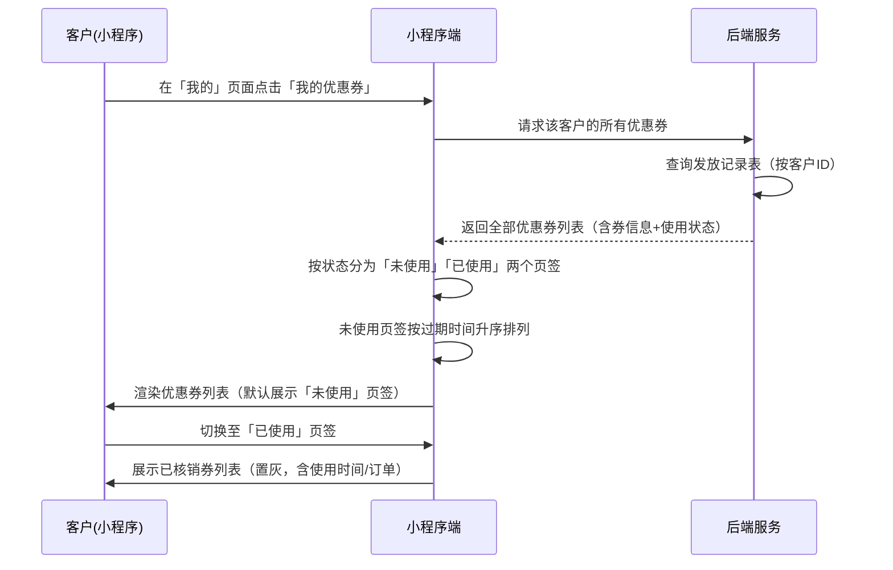

# 优惠券-小程序 SPEC

> **归属中心**：04-营销中心
> **子模块**：优惠券管理
> **终端**：小程序端
> **版本**：v1.1
> **更新日期**：2026-07-03
>
> - **小程序端**：面向 B 端客户，查看持有的优惠券及使用状态。每张券展示后台设定的适用品类信息。
> - **后台端**：优惠券的制作（含销售大区、适用品类绑定）、发放与数据管理详见 [优惠券管理.md](./优惠券管理.md)。

------

## 1. 背景与目标 (Background & Objectives)

**背景**：后台运营管理员已通过优惠券管理模块完成优惠券的制作与发放。B 端客户需要一个入口查看自己持有的优惠券，了解券的规则、有效期和使用状态。

**目标**：在小程序「我的」页面提供「我的优惠券」入口，客户可查看所有已发放给自己的优惠券，按使用状态分页签展示，清晰区分可用券、已过期券和已使用券。

------

## 2. 角色与使用场景 (Roles & Scenarios)

| 角色 | 说明 |
| --- | --- |
| B 端客户 | 已登录小程序的客户，查看自己持有的优惠券 |

**使用场景**：
- 作为 B 端客户，我可以在「我的」页面点击「我的优惠券」入口，进入优惠券列表页查看我持有的所有优惠券。
- 作为 B 端客户，我可以在「未使用」页签下看到尚未使用的优惠券（含已过期券），了解每张券的优惠规则、适用品类和有效期限，快过期的券优先展示。
- 作为 B 端客户，我可以在「已使用」页签下看到已核销的优惠券（置灰），并查看使用时间和关联订单信息。
- 作为 B 端客户，我在下单时系统会自动匹配可用优惠券，无需手动选择跳转。

------

## 3. 核心业务流程 (Core Business Flow)

### 3.1 查看优惠券流程



### 3.2 状态说明

优惠券在小程序端的展示基于发放记录的使用状态：

| 状态 | 所属页签 | 展示样式 | 说明 |
| --- | --- | --- | --- |
| 未使用 | 未使用 | 正常展示 | 在有效期内，下单时可自动匹配 |
| 已过期 | 未使用 | 正常展示 + 「已过期」标记 | 已超出使用期限，不可使用 |
| 已锁定 | 未使用 | 正常展示 | 下单时预锁定但未支付，支付后变为已使用 |
| 已使用 | 已使用 | 置灰 | 已核销，展示使用时间和关联订单 |

### 3.3 异常流与逆向流

| 异常场景 | 触发条件 | 系统处理方式 |
| --- | --- | --- |
| 无优惠券 | 客户未持有任何优惠券 | 展示空状态插图 + 「暂无优惠券」 |
| 网络异常 | 请求超时或失败 | 提示「网络异常，请下拉刷新重试」 |
| 未登录 | 客户未登录或登录态过期 | 跳转登录页 |

------

## 4. 界面与交互说明 (UI & Interaction)

### 4.1 「我的」页面入口

```
┌─────────────────────────────────┐
│  ← 我的                         │
├─────────────────────────────────┤
│  ┌──────────────────────────┐   │
│  │  👤 客户名称              │   │
│  │  手机号 138****1234       │   │
│  └──────────────────────────┘   │
│                                 │
│  ┌──────────────────────────┐   │
│  │  💰 我的钱包           >  │   │
│  └──────────────────────────┘   │
│  ┌──────────────────────────┐   │
│  │  🎫 我的优惠券         >  │   │  ← 点击进入优惠券列表
│  └──────────────────────────┘   │
│  ┌──────────────────────────┐   │
│  │  📦 我的订单           >  │   │
│  └──────────────────────────┘   │
│  ...                            │
└─────────────────────────────────┘
```

**交互**：「我的优惠券」行点击 → 跳转至优惠券列表页。

### 4.2 优惠券列表页

#### 4.2.1 整体布局

```
┌─────────────────────────────────┐
│  ← 我的优惠券                    │
├─────────────────────────────────┤
│  ┌─────────────┬─────────────┐  │
│  │   未使用     │   已使用    │  │  ← 页签切换
│  └─────────────┴─────────────┘  │
├─────────────────────────────────┤
│                                 │
│  ┌─────────────────────────┐   │
│  │  🏷 新春促销海鲜券       │   │  ← 正常展示
│  │  满 100 减 20            │   │
│  │  📂 海鲜类 冻品类        │   │  ← 适用品类标签
│  │  📅 2026-07-01~07-31    │   │  ← 有效期
│  └─────────────────────────┘   │
│                                 │
│  ┌─────────────────────────┐   │  ← ═══ 以下为已过期券，置灰沉底 ═══
│  │  🏷 蔬菜季优惠券    [已过期]│   │  ← 置灰 + 已过期标记
│  │  满 50 减 10             │   │
│  │  📂 蔬菜类 水果类        │   │
│  │  📅 2026-05-01~06-30    │   │
│  └─────────────────────────┘   │
│                                 │
└─────────────────────────────────┘
```

#### 4.2.2 页签切换

两个页签横向排列，各占 50% 宽度，当前选中页签高亮（品牌色下划线+加粗），未选中为灰色。

- **未使用**：默认选中，展示使用状态为「未使用」「已过期」「已锁定」的券
- **已使用**：展示使用状态为「已使用」的券

#### 4.2.3 优惠券卡片（未使用页签）

每张优惠券以卡片形式展示，卡片内容自上而下：

| 序号 | 信息项 | 说明 |
| --- | --- | --- |
| 1 | 优惠券名称 | 卡片顶部，较大字号，加粗 |
| 2 | 已过期标记 | 仅已过期券展示，标签样式，红色/橙色文字「已过期」，位于名称右侧或右上角 |
| 3 | 优惠规则 | 「满 X 减 Y」格式，醒目展示（如品牌色或大字号金额） |
| 4 | 适用品类 | 品类标签列表，每个品类一个圆角标签（灰色底），横向排列可换行。<br>**数据来源**：后台创建优惠券时绑定的品类关联表，与后台设定的品类信息完全一致 |
| 5 | 有效期 | 「YYYY-MM-DD ~ YYYY-MM-DD」格式，灰色辅助文字 |

**排序规则**：
- 未过期券（含已锁定）按使用结束日期升序排列（快过期的排最前面）
- 已过期券统一排在所有未过期券**之后**（底部），已过期券之间按使用结束日期倒序（最近过期的排前面）

**已过期券展示**：整张卡片置灰（与已使用券相同的不透明度处理），并在卡片右上角展示「已过期」标签。

**交互**：卡片不可点击（所有信息已展示，无详情页）。

#### 4.2.4 优惠券卡片（已使用页签）

整体结构与未使用券卡片一致，额外增加以下信息：

| 序号 | 信息项 | 说明 |
| --- | --- | --- |
| 6 | 使用时间 | 「使用时间：YYYY-MM-DD HH:mm」，灰色辅助文字 |
| 7 | 关联订单 | 「订单号：XXXXXX」，灰色辅助文字；「订单金额：¥XX.XX」 |

**展示样式**：整张卡片置灰（降低透明度或使用灰度滤镜），文字颜色变淡，与未使用券形成明显视觉差异。

**排序规则**：按使用时间倒序排列（最近使用的排在最前面）。

```
┌─────────────────────────────────┐
│  ← 我的优惠券                    │
├─────────────────────────────────┤
│  ┌─────────────┬─────────────┐  │
│  │   未使用     │  [已使用]   │  │  ← 已使用页签选中
│  └─────────────┴─────────────┘  │
├─────────────────────────────────┤
│                                 │
│  ┌─────────────────────────┐   │
│  │  🏷 新春促销海鲜券       │   │  ← 整卡置灰
│  │  满 100 减 20            │   │
│  │  📂 海鲜类 冻品类        │   │
│  │  📅 2026-07-01~07-31    │   │
│  │  ✅ 使用时间：2026-07-02 14:30 │
│  │  📋 订单号：OD20260702001      │
│  │     订单金额：¥356.00    │   │
│  └─────────────────────────┘   │
│                                 │
└─────────────────────────────────┘
```

### 4.3 极限状态

#### 4.3.1 空数据状态

当客户未持有任何优惠券时（两个页签均为空）：

```
┌─────────────────────────────────┐
│  ← 我的优惠券                    │
├─────────────────────────────────┤
│  ┌─────────────┬─────────────┐  │
│  │   未使用     │   已使用    │  │
│  └─────────────┴─────────────┘  │
├─────────────────────────────────┤
│                                 │
│         🎫 (空状态插图)          │
│                                 │
│         暂无优惠券                │
│                                 │
└─────────────────────────────────┘
```

#### 4.3.2 部分页签为空

- 「未使用」页签有数据、「已使用」页签为空时：已使用页签下展示「暂无已使用的优惠券」空状态文案
- 「未使用」页签为空、「已使用」页签有数据时：未使用页签下展示「暂无未使用的优惠券」空状态文案

#### 4.3.3 加载状态

进入页面时，卡片区域展示骨架屏（灰色色块模拟卡片形状），数据返回后替换为实际内容。

#### 4.3.4 数据量

一次性加载全部数据，不分页。若优惠券数量较多（>50 张），页面可滚动查看。

------

## 5. 数据字典与字段级规则 (Data & Field Rules)

### 5.1 接口响应字段

> 小程序端从后端获取的优惠券数据结构。后端聚合发放记录表与优惠券主表、品类关联表数据。

| 字段名称 | 字段类型 | 来源 | 说明 |
| :--- | :--- | :--- | :--- |
| 发放ID | String(UUID) | 发放记录表 | 唯一标识一次发放 |
| 优惠券ID | String(UUID) | 优惠券主表 | 券唯一标识 |
| 优惠券名称 | String(50) | 优惠券主表 | 展示用 |
| 满减门槛金额 | Decimal(10,2) | 优惠券主表 | 满 X 元 |
| 优惠金额 | Decimal(10,2) | 优惠券主表 | 减 Y 元 |
| 适用品类列表 | Array\<String\> | 品类关联表 | 品类名称列表，展示为标签 |
| 使用开始日期 | Date | 优惠券主表 | 有效期起始 |
| 使用结束日期 | Date | 优惠券主表 | 有效期截止，用于排序和过期判断 |
| 领取时间 | DateTime | 发放记录表 | 券发放给客户的时间 |
| 使用状态 | Enum | 发放记录表 | 未使用 \| 已锁定 \| 已使用 \| 已过期 |
| 使用时间 | DateTime | 发放记录表 | 核销时间，仅已使用状态有值 |
| 使用订单ID | String(UUID) | 发放记录表 | 关联的订单ID |
| 使用订单号 | String | 订单表 | 关联订单的订单号 |
| 订单金额 | Decimal(10,2) | 订单表 | 关联订单的实付金额 |

### 5.2 展示逻辑

| 展示项 | 格式/规则 |
| --- | --- |
| 优惠规则 | 「满 X 减 Y」（X 和 Y 为整数时去掉 `.00`） |
| 适用品类 | 每个品类一个圆角标签，灰色底色，多标签横向排列可换行。品类数据来源于后台创建时绑定的品类关联表，与后台设定严格一致 |
| 有效期 | `YYYY-MM-DD ~ YYYY-MM-DD` |
| 已过期标记 | 当前日期 > 使用结束日期时，卡片右上角展示红色/橙色「已过期」标签 |
| 使用时间 | `YYYY-MM-DD HH:mm`，仅已使用页签展示 |
| 订单号 | 原样展示，仅已使用页签展示 |
| 订单金额 | `¥X.XX`，两位小数，千分位逗号分隔，仅已使用页签展示 |
| 已过期卡片 | 在未使用页签中，已过期券整体置灰（`opacity: 0.45`），与已使用券相同的置灰效果，并沉底排列 |
| 已使用卡片 | 整体降低不透明度至 40%-50%（`opacity: 0.45`），置灰效果 |

### 5.3 排序逻辑

| 页签 | 排序规则 |
| --- | --- |
| 未使用 | 先按是否过期分组：未过期券在前（按使用结束日期升序，快过期的在前），已过期券在后（按使用结束日期倒序，最近过期的在前）；组内结束日期相同时按领取时间倒序 |
| 已使用 | 按使用时间倒序（最近使用的在前） |

### 5.4 过期判定

- **前端判定**：当前日期 > 使用结束日期 → 标记「已过期」
- **后端返回**：后端在查询时可自动将超过使用结束日期且状态为「未使用」的记录状态更新为「已过期」，确保数据一致性

### 5.5 编辑逻辑

小程序端对优惠券**无编辑权限**，所有字段均为只读展示。优惠券的制作、发放、修改均由后台端管理。

------

## 6. 系统交互与边界 (System Integrations & Boundaries)

### 6.1 前置依赖

| 依赖项 | 说明 |
| --- | --- |
| 优惠券管理模块（后台） | 优惠券的制作、发放、数据管理，详见 [优惠券管理.md](./优惠券管理.md) |
| 客户认证模块 | 客户需登录后才能查询自己的优惠券，登录机制详见 [小程序登录注册模块.md](../02-客户管理/小程序登录注册模块.md) |
| 订单模块 | 已使用券的关联订单号和金额来源于订单系统 |

### 6.2 下游影响

| 关联模块 | 影响说明 |
| --- | --- |
| 交易管理 — 购物车/结算 | 下单时系统读取客户持有的可用优惠券，根据品类和满减门槛自动匹配可选券 |
| 交易管理 — 订单 | 使用优惠券的订单在支付成功后回调更新券的使用状态（未使用 → 已使用），记录使用时间、订单ID |

### 6.3 接口定义

| 接口功能 | 方法 | 路径 | 说明 |
| --- | --- | --- | --- |
| 我的优惠券列表 | GET | `/api/marketing/coupon/my` | 获取当前登录客户的所有优惠券（含券信息+使用状态+关联订单），一次性返回全量数据 |

**请求参数**：无（客户 ID 从登录态获取）

**响应结构**：
```json
{
  "coupons": [
    {
      "distributionId": "uuid",
      "couponId": "uuid",
      "couponName": "新春促销海鲜券",
      "thresholdAmount": 100.00,
      "discountAmount": 20.00,
      "categories": ["海鲜类", "冻品类"],
      "startDate": "2026-07-01",
      "endDate": "2026-07-31",
      "receiveTime": "2026-07-01 10:30:00",
      "status": "UNUSED",
      "useTime": null,
      "orderId": null,
      "orderNo": null,
      "orderAmount": null
    }
  ]
}
```

**状态枚举**：`UNUSED`（未使用）、`LOCKED`（已锁定）、`USED`（已使用）、`EXPIRED`（已过期）

------

## 7. 非功能性需求 (Non-Functional Requirements)

### 7.1 性能要求

| 指标 | 要求 |
| --- | --- |
| 接口响应时间 | < 500ms |
| 列表渲染 | 一次性全量加载，不滚动分页 |
| 页面首屏加载 | < 1s（含接口请求+渲染） |
| 支持券数量 | 单客户最多持有优惠券 ≤ 200 张 |

### 7.2 权限与安全

| 层级 | 说明 |
| --- | --- |
| 操作权限 | 仅登录客户可查看，未登录跳转登录页 |
| 数据权限 | 客户仅可查看发放给自己的优惠券，不可查看他人券 |

------

## 8. 输出文档需求

本模块为 **04-营销中心** 下的 **优惠券管理** 子模块，小程序端。

```
spec/
└── 04-营销管理/
    ├── 优惠券管理.md        ← 后台端 SPEC
    └── 优惠券-小程序.md     ← 本文档（小程序端）
```

**关联模块**：

| 模块 | 状态 | 说明 |
| --- | --- | --- |
| 优惠券管理（后台） | 已有 | 优惠券的制作、发放、数据管理 |
| 小程序登录注册 | 已有 | 客户认证，详见 `spec/02-客户管理/小程序登录注册模块.md` |
| 销售订单（小程序） | 已有 | 下单时自动匹配券、支付后核销券 |
