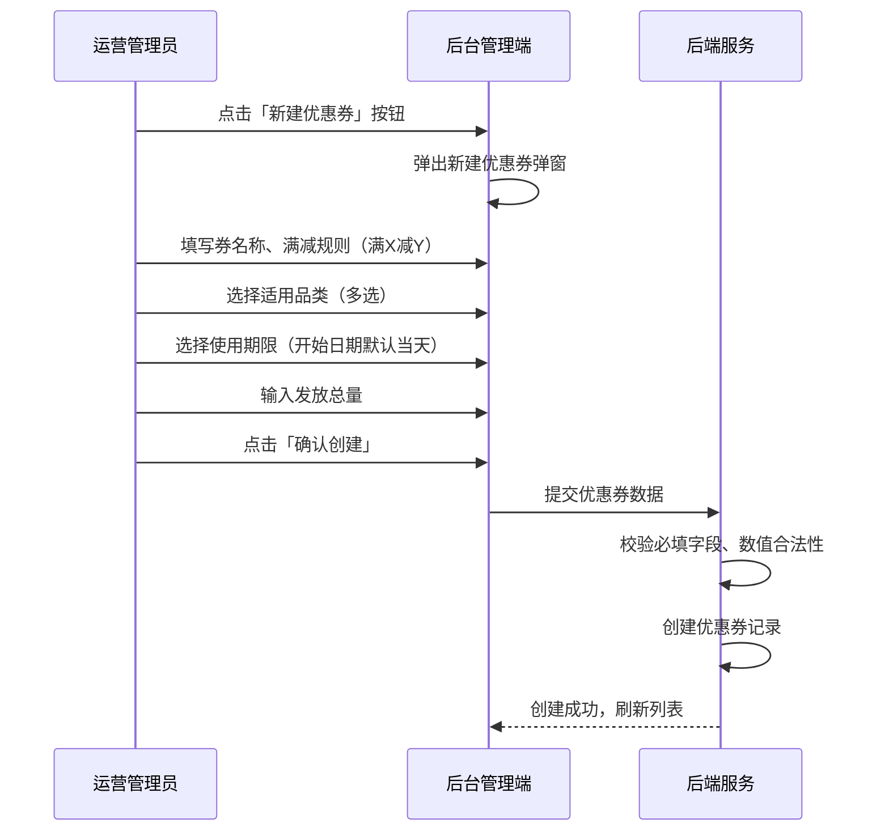
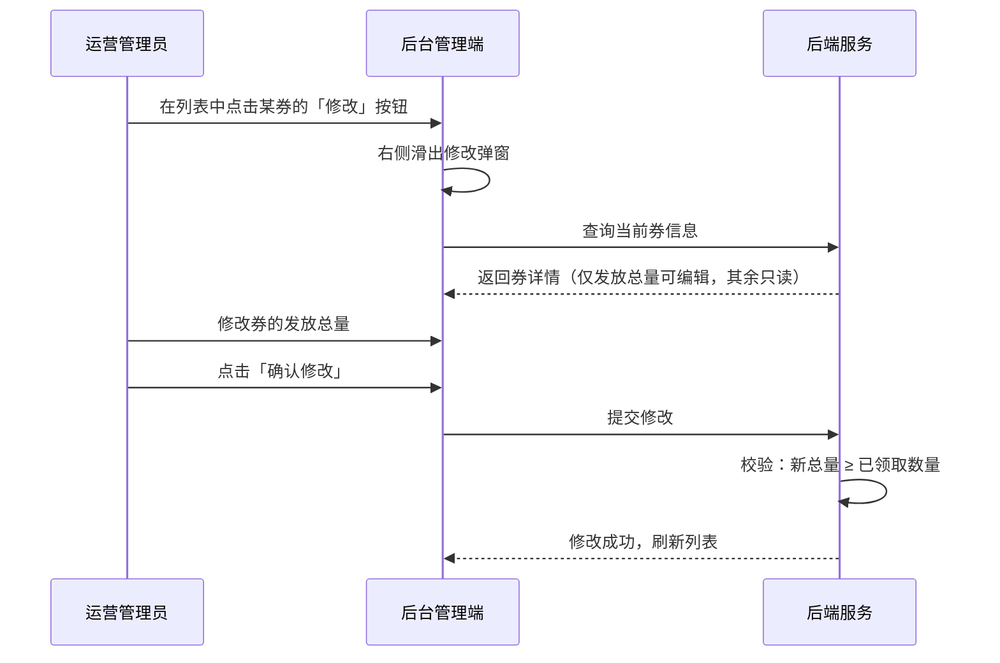
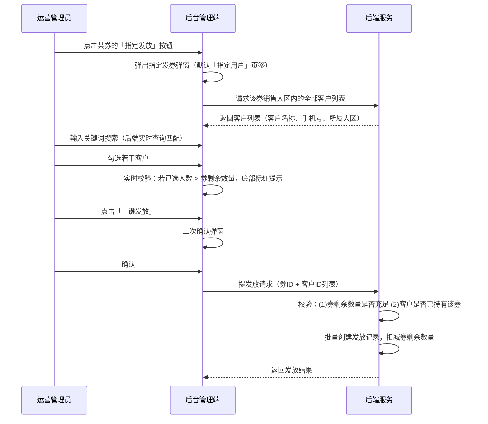
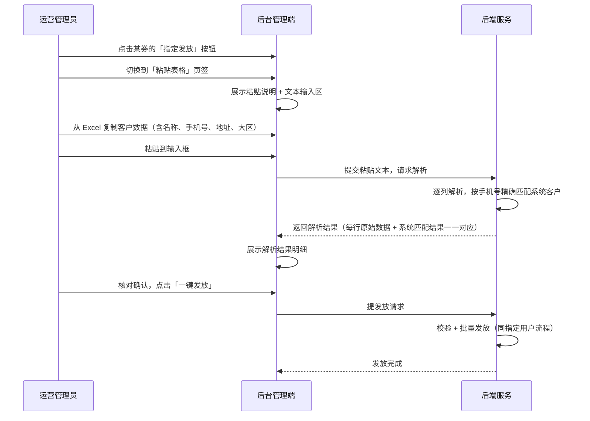
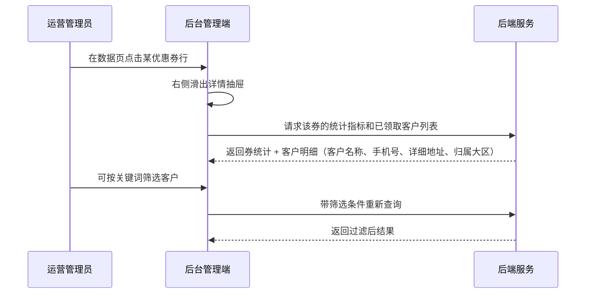

# 优惠券管理模块 SPEC

> **归属中心**：04-营销中心
> **子模块**：优惠券管理
> **版本**：v2.2
> **更新日期**：2026-07-10
>
> - **后台端**：面向运营/管理员，负责优惠券的制作、修改、指定发放与数据查看。
> - **小程序端**：面向 B 端客户，查看持有优惠券并在下单时使用（优惠券领取与使用详见交易管理模块）。

------

## 1. 背景与目标 (Background & Objectives)

**背景**：平台需要一套优惠券工具来促进客户下单、提升客单价和复购率。运营管理员可在后台制作满减优惠券，指定适用品类和发放对象，并追踪每张券的发放与使用数据。

**目标**：为运营管理员提供优惠券的全生命周期管理能力，包括制作优惠券（绑定品类、设定满减规则）、修改券的数量、向指定客户发放，以及查看和导出所有优惠券的使用数据。

------

## 2. 角色与使用场景 (Roles & Scenarios)

| 角色 | 说明 |
| --- | --- |
| 运营管理员 | 制作优惠券、修改券数量、指定客户发放、查看及导出优惠券数据 |

**使用场景**：
- 作为运营管理员，我可以通过弹窗新建一张优惠券，设定满减规则、适用品类、使用期限和发放总量。
- 作为运营管理员，我可以在列表中查看所有优惠券的基本信息（券额、发放进度、使用时间），并快速定位目标券。
- 作为运营管理员，我可以在右侧弹窗中修改某张券的发放数量（追加或减少）。
- 作为运营管理员，我可以通过「指定发放」功能，搜索并选择平台内客户进行定向发券（可重复发放给同一客户）。
- 作为运营管理员，我可以粘贴 Excel 表格内容，系统自动识别并准确匹配客户信息后批量发券。
- 作为运营管理员，我可以在数据页查看优惠券的整体使用总览，按多维度筛选每张券的使用数据，并导出全量数据。
- 作为运营管理员，我可以在数据页点击任意优惠券，右侧弹出该券的详细信息及其已领取客户明细。

------

## 3. 核心业务流程 (Core Business Flow)

### 3.1 制作优惠券流程



### 3.2 修改优惠券流程



### 3.3 指定发券流程

#### 3.3.1 指定用户发券



#### 3.3.2 粘贴表格发券



### 3.4 查看优惠券详情流程



### 3.5 异常流与逆向流

| 异常场景 | 触发条件 | 系统处理方式 |
| --- | --- | --- |
| 券名称重复 | 新建券时名称与已有券完全相同 | 提示「该优惠券名称已存在，请更换」 |
| 满减金额不合理 | 满X减Y中 Y ≥ X | 提示「优惠金额不能大于或等于门槛金额」 |
| 未选品类 | 新建券时未勾选任何品类 | 提示「请至少选择一个适用品类」 |
| 品类下拉为空 | 当前所有品类均无上架商品 | 下拉展示空状态提示「暂无可用品类，请先上架商品」，阻止创建 |
| 结束日期早于开始日期 | 新建时日期选择错误 | 提示「结束日期不能早于开始日期」 |
| 发放总量小于已领取数 | 修改券数量时新总量 < 已领数量 | 提示「发放总量不能小于已领取数量（当前已领 X 张）」 |
| 库存不足 | 发放时已领+本次发放 > 总量 | 提示「券库存不足，剩余可发 X 张」 |
| 勾选人数超券剩余 | 已选人数 > 券剩余数量 | 底部标红提示 + 「一键发放」按钮置灰 |
| — | — | — |
| 粘贴内容解析失败 | 粘贴文本格式无法识别 | 提示「未能识别有效客户数据，请检查格式后重试」 |
| 客户手机号未注册 | 粘贴表格时手机号在系统内不存在 | 该行标红，标记「未注册」，不参与发放 |
| 解析结果与原始数据不对应 | 粘贴内容字段映射错误 | 解析前校验列数，字段一一对应后再匹配 |
| 选择客户数为 0 | 未勾选任何客户 | 按钮置灰不可点击 |

------

## 4. 界面与交互说明 (UI & Interaction)

### 4.1 优惠券管理页

#### 4.1.1 页签切换

```
┌─────────────────────────────────────────────────────────────────┐
│  [ 优惠券管理 ]    [ 优惠券数据 ]                                  │
└─────────────────────────────────────────────────────────────────┘
```

两个页签，「优惠券管理」默认选中。

#### 4.1.2 优惠券管理 — 列表页

**界面布局**：

```
┌──────────────────────────────────────────────────────────────────────────────────┐
│  [新建优惠券]                                                          共 X 条记录 │
├──────────────────────────────────────────────────────────────────────────────────┤
│  ┌──────────┬────────┬──────────┬────────────────────┬──────────────┬────────┐  │
│  │优惠券名称│适用品类│券额      │发放数               │使用时间       │操作     │  │
│  ├──────────┼────────┼──────────┼────────────────────┼──────────────┼────────┤  │
│  │新春促销  │海鲜类  │满100减20 │已发放45张/剩余955张  │2026-07-01~  │[修改]   │  │
│  │海鲜券    │冻品类  │          │██████░░░░░░░░░░░░░░░│2026-07-31    │[指定发放]│  │
│  ├──────────┼────────┼──────────┼────────────────────┼──────────────┼────────┤  │
│  │蔬菜季    │蔬菜类  │满50减10  │已发放120张/剩余380张 │2026-07-01~  │[修改]   │  │
│  │优惠券    │水果类  │          │████████████░░░░░░░░░│2026-08-31    │[指定发放]│  │
│  └──────────┴────────┴──────────┴────────────────────┴──────────────┴────────┘  │
│  [分页器]                                                                         │
└──────────────────────────────────────────────────────────────────────────────────┘
```

**工具栏**：「新建优惠券」按钮

**列表区**（分页表格）：

| 列名 | 说明 |
| --- | --- |
| 优惠券名称 | 优惠券名称 |
| 适用品类 | 该券绑定的商品品类，以标签形式展示 |
| 券额 | 满X减Y |
| 发放数 | 第一行展示「已发放 X 张 / 剩余 Y 张」文字，第二行展示进度条 |
| 使用时间 | 有效期限（开始日期 ~ 结束日期） |
| 操作 | 修改、指定发放 |

**操作按钮**：

| 按钮 | 触发动作 |
| --- | --- |
| 修改 | 右侧滑出修改弹窗（仅可修改发放总量） |
| 指定发放 | 弹出指定发券弹窗（含两个页签） |

**极限状态**：
- 空数据：居中插图 + 「暂无优惠券，点击上方按钮创建」
- 加载中：表格骨架屏

#### 4.1.3 新建优惠券弹窗

**弹窗标题**：「新建优惠券」

**弹窗尺寸**：中等宽度（约 600px），居中弹出

| 序号 | 字段名称 | 必填 | 控件类型 | 默认值/提示 | 说明 |
| --- | --- | --- | --- | --- | --- |
| 1 | 销售大区 | 是 | 下拉单选 | 「请选择销售大区」 | 数据源：系统销售大区列表。用于限定该优惠券的适用大区范围，下发时仅该大区内的客户可接收 |
| 2 | 优惠券名称 | 是 | 文本输入框 | 「请输入优惠券名称」 | 最大 50 字，不可重复 |
| 3 | 优惠规则 | 是 | 组合输入：满 `[___]` 元 减 `[___]` 元 | 无 | 两个数值输入框，单位元，步长为 10 |
| 4 | 适用品类 | 是 | 下拉多选（仅选择，不可手动输入） | 无 | 数据源：当前有上架商品的一级品类列表（仅展示至少含 1 个上架商品的品类）。支持多选，至少选 1 个，选中后以标签展示，可逐个删除 |
| 5 | 使用期限 | 是 | 日期范围选择器 | 开始日期默认当天 | 开始日期 + 结束日期，结束日期 > 开始日期 |
| 6 | 发放总量 | 是 | 数值输入框 | 「请输入发放总量」 | 正整数，> 0，步长为 10 |

**品类选择交互**：下拉框仅展示当前有上架商品的一级品类（品类下至少含 1 个上架商品才出现在下拉列表中，无上架商品的品类自动隐藏）。支持勾选多选，不支持手动输入。选中品类以标签形式展示在输入框下方，每个标签右侧有 × 可删除。下拉列表支持搜索过滤（输入关键词快速定位品类）。

**销售大区选择交互**：下拉单选，数据源为系统内所有销售大区。选中后即确定该券的适用大区范围，后续指定发放时仅展示该大区内的客户。

**底部按钮**：「确认创建」（提交）、「取消」（关闭）

**提交校验**：
- 所有必填项非空
- 销售大区：必须选择一个有效大区
- 满减规则：优惠金额 < 门槛金额
- 适用品类：至少选择 1 个，所选品类必须当前有上架商品
- 使用期限：开始日期默认填充当天（可修改），结束日期 > 开始日期
- 发放总量 > 0

#### 4.1.4 修改优惠券弹窗（右侧滑出）

**弹窗标题**：「修改优惠券」

**弹出方式**：从页面右侧滑出，宽度约 480px

**只读展示区**：

| 字段 | 说明 |
| --- | --- |
| 销售大区 | 已绑定的销售大区，不可修改 |
| 优惠券名称 | 不可修改 |
| 优惠规则 | 满X减Y，不可修改 |
| 适用品类 | 已绑定的品类标签列表，不可修改 |
| 使用期限 | 时间段，不可修改 |
| 当前已领取 | 已领取数量（只读） |

**可编辑区**：

| 字段名称 | 必填 | 控件类型 | 校验规则 |
| --- | --- | --- | --- |
| 发放总量 | 是 | 数值输入框（步长 10） | ≥ 当前已领取数量，回填当前值 |

**底部按钮**：「确认修改」、「取消」

**说明提示**：「修改发放总量仅影响后续可发放数量，已领取的券不受影响。」

#### 4.1.5 指定发券弹窗

**弹窗标题**：「指定发放 — [优惠券名称]」

**弹窗尺寸**：大宽度（约 900px），居中弹出

**结构**：弹窗内含两个页签和一个底部操作区。

##### 页签一：指定用户

```
┌───────────────────────────────────────────────────────────────────┐
│  [ 指定用户 ]    [ 粘贴表格 ]                                       │
├───────────────────────────────────────────────────────────────────┤
│  搜索：客户名称/手机号 [________]  所属大区：[全部 ▼]  [查询] [重置] │
│  💡 列表展示该券销售大区内的全部客户，可重复发放；搜索为后端实时查询      │
├───────────────────────────────────────────────────────────────────┤
│  ☐   客户名称         手机号        所属大区                        │
│  ☐   张记食堂         13812341234   华东大区                        │
│  ☑   李记餐饮有限公司  13956785678   华南大区                        │
│  ☐   王记食品配送中心  13690129012   华东大区                        │
│  ☐   ...                                                          │
├───────────────────────────────────────────────────────────────────┤
│  已选择 X 位客户  │  剩余可发 Y 张                                   │
│                                                                     │
│  ⚠ 剩余优惠券不足（指定 X 人 / 剩余 Y 张）   ← 仅当已选 > 剩余时显示  │
│  [ 一键发放 ]                                         ← 不足时置灰    │
└───────────────────────────────────────────────────────────────────┘
```

**列表数据范围**：列表查询和展示**归属于该券所绑定销售大区**的全部平台客户（不排除已领取客户，支持重复发放）。搜索关键词（客户名称/手机号）提交到后端进行实时数据库查询匹配，确保搜索结果准确。

**搜索筛选区**：

| 筛选项 | 组件类型 | 说明 |
| --- | --- | --- |
| 客户名称/手机号 | 文本输入 | 后端模糊匹配查询 |
| 所属大区 | 下拉单选 | 全部 / 各大大区 |
| 查询 | 按钮 | 向后端发送请求 |
| 重置 | 按钮 | 清空条件并重新加载 |

**列表区**（分页表格，支持多选）：

| 列名 | 说明 |
| --- | --- |
| 复选框 | 多选，所有展示客户均可选 |
| 客户名称 | 客户公司名称 |
| 手机号 | 明文展示 |
| 所属大区 | 客户归属销售大区 |

**底部操作区**：
- 左侧：实时显示「已选择 X 位客户」和「剩余可发 Y 张」
- 当已选人数 > 券剩余数量时，显示红色警告
- 右侧：「一键发放」按钮（选择数为 0 或已选人数超过剩余数量时置灰）

**交互逻辑**：
- 勾选/取消勾选时实时校验
- 点击「一键发放」→ 二次确认弹窗 → 确认后执行发放
- 发放完成后展示结果，关闭后刷新优惠券列表

##### 页签二：粘贴表格

```
┌─────────────────────────────────────────────────────────────────┐
│  [ 指定用户 ]    [ 粘贴表格 ]                                     │
├─────────────────────────────────────────────────────────────────┤
│  粘贴说明：                                                       │
│  从 Excel 复制客户数据（含：客户名称、手机号码、地址、所属大区），    │
│  粘贴到下方输入框，系统将逐列解析后按手机号精确匹配平台客户。          │
│  支持的表头关键词：客户名称/公司名称/姓名、手机号/电话/联系方式、       │
│  地址/收货地址、大区/所属大区/区域                                  │
├─────────────────────────────────────────────────────────────────┤
│  ┌─────────────────────────────────────────────────────────────┐ │
│  │  (粘贴区域，多行文本输入框，高约 300px)                          │ │
│  │  提示文案：「在此粘贴 Excel 内容...」                            │ │
│  └─────────────────────────────────────────────────────────────┘ │
│  [ 解析并预览 ]                                                    │
├─────────────────────────────────────────────────────────────────┤
│  解析结果预览区（点击「解析并预览」后展示）：                          │
│  ┌────┬──────────┬───────────┬──────────┬────────┬────────┐     │
│  │序号│ 客户名称  │ 手机号     │ 地址      │ 大区    │ 匹配状态│     │
│  ├────┼──────────┼───────────┼──────────┼────────┼────────┤     │
│  │ 1  │ 张记食堂  │ 13812341234│ XX路1号   │ 华东大区 │ ✓ 已匹配│     │
│  │ 2  │ 李记餐饮  │ 13956785678│ XX路2号   │ 华南大区 │ ✓ 已匹配│     │
│  │ 3  │ 王记食品  │ 13690129012│ XX路3号   │ 华东大区 │ ✗ 未注册│     │
│  └────┴──────────┴───────────┴──────────┴────────┴────────┘     │
│  匹配成功 2 条 / 匹配失败 1 条（未注册客户将不会收到优惠券）          │
│  [ 一键发放 (仅发放已匹配的客户) ]                                   │
└─────────────────────────────────────────────────────────────────┘
```

**解析规则（后端实现）**：
- 按 Tab/逗号/空格分隔逐列解析，自动识别表头行
- **手机号为必匹配字段**，用于在客户数据库中精确查询
- 解析结果中每行的原始粘贴数据与系统匹配结果必须**一一对应**，不可出现错行
- 无法匹配（手机号未注册）的行标记为「未注册」
- 已注册客户均参与发放（支持重复发放，不区分是否已持有）
- 「未注册」的行不参与发放

**底部操作区**：
- 展示剩余可发张数和可发放人数
- 匹配成功人数超过剩余数量时标红警告 + 按钮置灰

### 4.2 优惠券数据页

#### 4.2.1 整体布局

```
┌──────────────────────────────────────────────────────────────────────────┐
│  [ 优惠券管理 ]    [ 优惠券数据 ]                                           │
├──────────────────────────────────────────────────────────────────────────┤
│  ┌─── 信息总览 ─────────────────────────────────────────────────────────┐ │
│  │  累计发券数      累计用券数      带动交易额       券核销率              │ │
│  │   12,580 张       3,420 张      ¥ 856,000.00     27.2%               │ │
│  └──────────────────────────────────────────────────────────────────────┘ │
├──────────────────────────────────────────────────────────────────────────┤
│  筛选：优惠券名称[____]  品类[____▼]  使用时间[____~____]                    │
│  [查询] [重置]                                                    [📥导出] │
├──────────────────────────────────────────────────────────────────────────┤
│  ┌──────────┬──────┬──────────┬────────┬────────┬──────────┬──────────┐             │
│  │优惠券名称│品类  │券额      │发放数量│使用数量│触发交易  │带动交易额 │             │
│  │          │      │          │        │        │笔数      │          │             │
│  ├──────────┼──────┼──────────┼────────┼────────┼──────────┼──────────┤             │
│  │新春促销  │海鲜类│满100减20 │ 320/   │ 85     │ 62       │¥25,600   │ ← 点击行     │
│  │海鲜券    │冻品类│          │ 1000   │        │          │          │   任意位置    │
│  ├──────────┼──────┼──────────┼────────┼────────┼──────────┼──────────┤             │
│  │蔬菜季    │蔬菜类│满50减10  │ 180/   │ 120    │ 98       │¥18,500   │             │
│  │优惠券    │水果类│          │ 500    │        │          │          │             │
│  └──────────┴──────┴──────────┴────────┴────────┴──────────┴──────────┘             │
│  [分页器]                                                                 │
└──────────────────────────────────────────────────────────────────────────┘
```

#### 4.2.2 信息总览区

横向 4 个指标卡片：

| 指标 | 说明 | 计算口径 |
| --- | --- | --- |
| 累计发券数 | 所有优惠券已发放的总张数 | SUM(所有券的已领取数量) |
| 累计用券数 | 所有优惠券已被使用的总张数 | SUM(所有券的已使用数量) |
| 带动交易额 | 使用优惠券的订单总金额 | SUM(含券订单的实付金额) |
| 券核销率 | 已使用券占已发券的比例 | 累计用券数 / 累计发券数 × 100% |

#### 4.2.3 筛选与导出

**筛选区**：

| 筛选项 | 组件类型 | 说明 |
| --- | --- | --- |
| 优惠券名称 | 文本输入 | 模糊搜索 |
| 品类 | 下拉单选 | 全部 / 各商品品类 |
| 使用时间 | 日期范围选择器 | 按优惠券有效期范围过滤 |
| 查询 | 按钮 | 执行搜索 |
| 重置 | 按钮 | 清空所有条件 |

**导出按钮**：搜索栏右侧放置导出图标按钮（📥），点击后导出当前筛选条件下的全量数据为 Excel 文件。

#### 4.2.4 优惠券数据列表

**列表区**（分页表格，点击行任意位置触发右侧详情抽屉）：

| 列名 | 说明 |
| --- | --- |
| 优惠券名称 | 券名称 |
| 品类 | 该券绑定的商品品类（多个以标签展示） |
| 券额 | 满X减Y |
| 发放数量 | 已发数量 / 总量 |
| 使用数量 | 已被使用的券张数 |
| 触发交易笔数 | 使用该券的订单数 |
| 带动交易额 | 含券订单的累计交易金额 |

**排序**：默认按创建时间倒序排列。

**行交互**：点击任意优惠券行的任意位置 → 右侧滑出详情抽屉。

#### 4.2.5 优惠券详情抽屉（右侧滑出）

**弹出方式**：从页面右侧滑出，宽度约 1300px

**内容结构**：

```
┌──────────────────────────────────────────────────────────────────────────┐
│  优惠券详情 — [优惠券名称]                                                  │
├──────────────────────────────────────────────────────────────────────────┤
│  券额 满X减Y ｜ 已发放 X 张 ｜ 已使用 Y 张 ｜ 带动交易额 ¥Z                    │
├──────────────────────────────────────────────────────────────────────────┤
│  筛选：客户名称/手机号 [________]  状态：[全部 ▼]  [查询] [重置]     [📥 导出]     │
├──────────────────────────────────────────────────────────────────────────┤
│  ┌────┬──────┬──────────────┬──────────┬──────────┬───────────┬──────────┬──────┐│
│  │序号│ 状态  │ 订单编号      │ 订单总金额 │ 客户名称  │ 手机号     │ 详细地址  │归属大区││
│  ├────┼──────┼──────────────┼──────────┼──────────┼───────────┼──────────┼──────┤│
│  │ 1  │ 已使用 │ OD20260214003│ ¥520.00  │ 张记食堂  │ 13812341234│ XX路1号   │华东大区││
│  │ 2  │ 未使用 │ --           │ --       │ 李记餐饮  │ 13956785678│ XX路2号   │华南大区││
│  │... │      │              │          │           │           │          │      ││
│  └────┴──────────────┴──────────┴──────────┴───────────┴──────────┴──────┘│
│  [分页器]                                                                  │
└──────────────────────────────────────────────────────────────────────────┘
```

**抽屉内容分区**：

| 区域 | 说明 |
| --- | --- |
| 统计摘要 | 展示券额（满X减Y）、发放数、使用数、带动交易额，并排一行 |
| 筛选区 | 按客户名称或手机号过滤已领取客户；右侧新增状态筛选（全部/已使用/未使用）；筛选区右侧提供「导出」按钮，导出当前筛选条件下的客户明细为 Excel 文件 |
| 客户明细列表 | 所有已领取该券的客户：序号、状态、订单编号、订单总金额、客户名称、手机号、详细地址、归属大区。<br/>**状态逻辑**：已使用 → 所有字段正常展示；未使用 → 订单编号和订单总金额为空，其他信息保留 |

**极限状态**：
- 空数据：Empty State 插图 + 「暂无优惠券数据」
- 加载中：表格骨架屏
- 总览区数据为空时：各指标显示 `--`

------

## 5. 数据字典与字段级规则 (Data & Field Rules)

### 5.1 优惠券主表

| 字段名称 | 字段类型 | 来源/依赖 | 默认值 | 读写权限 | 校验规则与约束 | 说明 |
| :--- | :--- | :--- | :--- | :--- | :--- | :--- |
| 优惠券ID | String(UUID) | 系统生成 | - | 只读 | 唯一主键 | - |
| 优惠券名称 | String(50) | 管理员输入 | - | 创建时写入 | 必填，不可重复，最大 50 字 | - |
| 销售大区ID | String(UUID) | 管理员选择 | - | 创建时写入，后续不可改 | 必填，关联销售大区表 | 限定券的适用大区 |
| 满减门槛金额 | Decimal(10,2) | 管理员输入 | - | 创建时写入，后续不可改 | 必填，> 0，> 优惠金额 | 满 X 元 |
| 优惠金额 | Decimal(10,2) | 管理员输入 | - | 创建时写入，后续不可改 | 必填，> 0，< 门槛金额 | 减 Y 元 |
| 使用开始日期 | Date | 管理员输入 | 当天 | 创建时写入 | 必填 | 新建弹窗默认填充当天 |
| 使用结束日期 | Date | 管理员输入 | - | 创建时写入 | 必填，> 开始日期 | - |
| 发放总量 | Integer | 管理员输入 | - | 可编辑（仅可增大） | 必填，> 0，≥ 已领取数量 | - |
| 已领取数量 | Integer | 系统计算 | 0 | 只读 | ≥ 0，≤ 发放总量 | - |
| 已使用数量 | Integer | 系统计算 | 0 | 只读 | ≥ 0，≤ 已领取数量 | - |
| 创建人ID | String(UUID) | 系统记录 | - | 只读 | 关联后台用户表 | - |
| 创建时间 | DateTime | 系统记录 | 当前时间 | 只读 | YYYY-MM-DD HH:mm:ss | 自动生成 |
| 更新时间 | DateTime | 系统记录 | 当前时间 | 只读 | YYYY-MM-DD HH:mm:ss | 每次更新自动记录 |

### 5.2 优惠券品类关联表

> 一张优惠券可绑定多个商品品类。

| 字段名称 | 字段类型 | 来源/依赖 | 默认值 | 读写权限 | 校验规则与约束 | 说明 |
| :--- | :--- | :--- | :--- | :--- | :--- | :--- |
| 关联ID | String(UUID) | 系统生成 | - | 只读 | 唯一主键 | - |
| 优惠券ID | String(UUID) | 关联主表 | - | 创建时写入 | 外键，与品类ID联合唯一 | - |
| 品类ID | String(UUID) | 关联商品分类表 | - | 创建时写入 | 外键，与券ID联合唯一 | - |
| 品类名称 | String(50) | 冗余存储 | - | 只读 | 创建时从分类表同步 | 方便列表展示 |

### 5.3 优惠券发放记录表

| 字段名称 | 字段类型 | 来源/依赖 | 默认值 | 读写权限 | 校验规则与约束 | 说明 |
| :--- | :--- | :--- | :--- | :--- | :--- | :--- |
| 发放ID | String(UUID) | 系统生成 | - | 只读 | 唯一主键 | - |
| 优惠券ID | String(UUID) | 关联主表 | - | 只读 | 外键 | - |
| 客户ID | String(UUID) | 关联客户表 | - | 只读 | 外键，与券ID联合唯一 | - |
| 客户名称 | String(100) | 关联客户表 | - | 只读 | 发放时冗余存储 | - |
| 手机号 | String(11) | 关联客户表 | - | 只读 | 发放时冗余存储 | 明文 |
| 详细地址 | String(500) | 关联客户表 | - | 只读 | 发放时冗余存储 | - |
| 归属大区 | String(50) | 关联客户表 | - | 只读 | 发放时冗余存储 | - |
| 发放方式 | Enum | 系统记录 | - | 只读 | 枚举：指定用户、粘贴表格 | - |
| 发放人ID | String(UUID) | 系统记录 | - | 只读 | 关联后台用户表 | - |
| 发放时间 | DateTime | 系统记录 | 当前时间 | 只读 | YYYY-MM-DD HH:mm:ss | - |
| 使用状态 | Enum | 系统/订单 | 未使用 | 只读 | 未使用、已锁定、已使用、已过期 | - |
| 使用订单ID | String(UUID) | 关联订单表 | - | 系统写入 | 外键，可为空 | - |
| 使用时间 | DateTime | 系统记录 | - | 系统写入 | 可为空 | - |

### 5.4 展示逻辑

- 金额保留两位小数，千分位逗号分隔
- 日期格式统一为 `YYYY-MM-DD`
- 日期时间格式统一为 `YYYY-MM-DD HH:mm:ss`
- 券额展示为：「满X减Y」
- 发放数展示：第一行文字「已发放 X 张 / 剩余 Y 张」，第二行进度条
- 券核销率展示为百分比，保留 1 位小数
- 品类以标签形式展示，每个品类一个标签

### 5.5 编辑逻辑

| 字段 | 创建时 | 创建后 | 说明 |
| --- | --- | --- | --- |
| 销售大区 | 可编辑 | 锁定 | 不可修改 |
| 优惠券名称 | 可编辑 | 锁定 | 不可修改 |
| 满减门槛金额 | 可编辑 | 锁定 | 不可修改 |
| 优惠金额 | 可编辑 | 锁定 | 不可修改 |
| 适用品类 | 可编辑 | 锁定 | 不可新增或移除品类 |
| 使用开始日期 | 可编辑 | 锁定 | 不可修改 |
| 使用结束日期 | 可编辑 | 锁定 | 不可修改 |
| 发放总量 | 可编辑 | 可编辑（仅可增大，步长 10） | 新值 ≥ 已领取数量 |

- 「已领取数量」由发放记录表自动聚合更新
- 「已使用数量」由发放记录表中使用状态变为「已使用」时自动聚合更新
- 不支持删除优惠券，如需停发可将发放总量调至已领取数量

### 5.6 发放约束

| 约束项 | 规则 |
| --- | --- |
| 券库存控制 | 发放时校验：已领取 + 本次发放 ≤ 发放总量 |
| 客户校验 | 仅向系统内已注册客户发放 |
| 大区校验 | 指定发放时仅展示券所绑定销售大区内的客户 |
| 过期不发 | 超期的券隐藏「指定发放」按钮 |
| 可重复发放 | 指定发放不限制客户是否已持有该券，同一客户可多次接收同一优惠券 |
| 指定用户列表过滤 | 展示归属该券销售大区的全部客户，不排除已领取客户 |
| 超量阻止 | 已选 > 剩余时标红警告 + 按钮置灰 |
| 有效日期默认 | 新建时开始日期默认当天 |
| 搜索准确性 | 搜索请求发送至后端进行数据库实时查询 |
| 粘贴解析准确性 | 按手机号精确匹配，原始数据与匹配结果一一对应 |

### 5.7 字段展现与控制规则

| 字段 | 列表页 | 新建弹窗 | 修改弹窗 | 指定发放 | 数据页 | 详情抽屉 |
| --- | --- | --- | --- | --- | --- | --- |
| 销售大区 | 可见 | 可编辑（下拉单选） | 只读 | — | — | — |
| 优惠券名称 | 可见 | 可编辑 | 只读 | 可见（标题） | 可见 | 可见（标题） |
| 券额 | 可见（满X减Y） | 可编辑（满减规则：满X减Y） | 只读 | — | 可见（满X减Y） | — |
| 适用品类 | 可见（标签） | 可编辑（下拉多选，仅展示有上架商品的品类） | 只读 | — | 可见 | — |
| 使用期限 | 可见 | 可编辑 | 只读 | — | — | — |
| 发放总量 | 可见（进度条） | 可编辑 | 可编辑 | — | 可见 | — |
| 已领取数量 | 可见（进度条） | — | 只读 | — | 可见 | 可见 |
| 已使用数量 | — | — | — | — | 可见 | 可见 |
| 使用状态 | — | — | — | — | — | 可见 |
| 订单编号 | — | — | — | — | — | 可见（未使用时为空） |
| 订单总金额 | — | — | — | — | — | 可见（未使用时为空） |
| 客户明细 | — | — | — | 可见 | — | 可见 |

------

## 6. 系统交互与边界 (System Integrations & Boundaries)

### 6.1 前置依赖

| 依赖项 | 说明 |
| --- | --- |
| 商品品类 | 品类选项动态过滤：仅展示当前有上架商品的一级品类（≥1 个上架商品才出现），无上架商品的品类在下拉框中隐藏 |
| 客户管理模块 | 客户列表来源于客户档案，发放时查询已注册客户 |
| 销售大区管理 | 大区筛选选项来源于销售大区 |

### 6.2 下游影响

| 关联模块 | 影响说明 |
| --- | --- |
| 交易管理 — 购物车/结算 | 下单时根据品类匹配可用优惠券，校验满减门槛 |
| 交易管理 — 订单 | 使用券的订单记录券ID、优惠金额，支付后更新券状态 |
| 小程序 — 我的优惠券 | 客户查看持有优惠券列表及使用状态 |

### 6.3 外部接口概要

| 接口功能 | 方法 | 路径 | 说明 |
| --- | --- | --- | --- |
| 优惠券列表 | GET | `/api/marketing/coupon/list` | 分页查询 |
| 创建优惠券 | POST | `/api/marketing/coupon` | 新建优惠券（含品类关联） |
| 优惠券详情 | GET | `/api/marketing/coupon/{id}` | 单张券信息 |
| 修改发放总量 | PUT | `/api/marketing/coupon/{id}/quantity` | 仅可增大 |
| 未领取客户列表 | GET | `/api/marketing/coupon/{id}/customers/available` | 指定用户页签，后端实时搜索 |
| 指定用户发放 | POST | `/api/marketing/coupon/{id}/distribute` | 向客户ID列表发券 |
| 粘贴内容解析 | POST | `/api/marketing/coupon/parse` | 解析粘贴文本，按手机号精确匹配 |
| 按表格发券 | POST | `/api/marketing/coupon/{id}/distribute/batch` | 基于解析结果发券 |
| 数据总览 | GET | `/api/marketing/coupon/stats/overview` | 4 项汇总指标 |
| 数据列表 | GET | `/api/marketing/coupon/stats/list` | 多条件筛选，分页 |
| 数据导出 | GET | `/api/marketing/coupon/stats/export` | 按筛选条件导出 Excel |
| 券详情统计 | GET | `/api/marketing/coupon/{id}/stats` | 单券发放/使用/交易汇总 |
| 券已领取客户 | GET | `/api/marketing/coupon/{id}/customers` | 已领取客户明细，支持搜索分页 |
| 券已领取客户导出 | GET | `/api/marketing/coupon/{id}/customers/export` | 按当前筛选条件导出客户明细为 Excel |

------

## 7. 非功能性需求 (Non-Functional Requirements)

### 7.1 性能要求

| 指标 | 要求 |
| --- | --- |
| 优惠券列表查询响应 | < 500ms（分页 20 条） |
| 创建优惠券响应 | < 1s |
| 客户列表搜索响应 | < 500ms（分页 20 条） |
| 粘贴内容解析响应 | < 2s（≤ 200 行） |
| 批量发放响应 | < 3s（≤ 200 人） |
| 数据总览查询响应 | < 1s |
| 数据导出响应 | < 5s（≤ 10000 行） |
| 详情抽屉客户列表响应 | < 500ms（分页 20 条） |

### 7.2 权限与安全

| 层级 | 说明 |
| --- | --- |
| 操作权限 | 创建、修改、发放、数据查看和导出仅限运营管理员及以上角色 |
| 数据权限 | 管理员可查看和操作全部优惠券数据 |

------

## 8. 输出文档需求

本模块为 **04-营销中心** 下的 **优惠券管理** 子模块。

```
spec/
└── 04-营销管理/
    └── 优惠券管理.md    ← 本文档
```

**依赖模块**：

| 模块 | 状态 | 说明 |
| --- | --- | --- |
| 商品分类管理 | 已有 | 品类选项数据源 |
| 客户档案 | 已有 | 客户列表数据源，详见 `spec/02-客户管理/客户档案.md` |
| 销售大区管理 | 已有 | 大区筛选数据源，详见 `spec/07-运营管理/销售大区管理.md` |
| 交易管理 — 购物车/订单 | 待建 | 券的消费端使用校验与核销 |
| 小程序 — 我的优惠券 | 待建 | 客户端券列表展示 |
