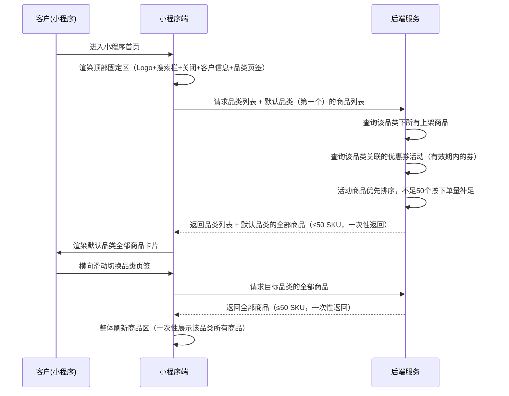
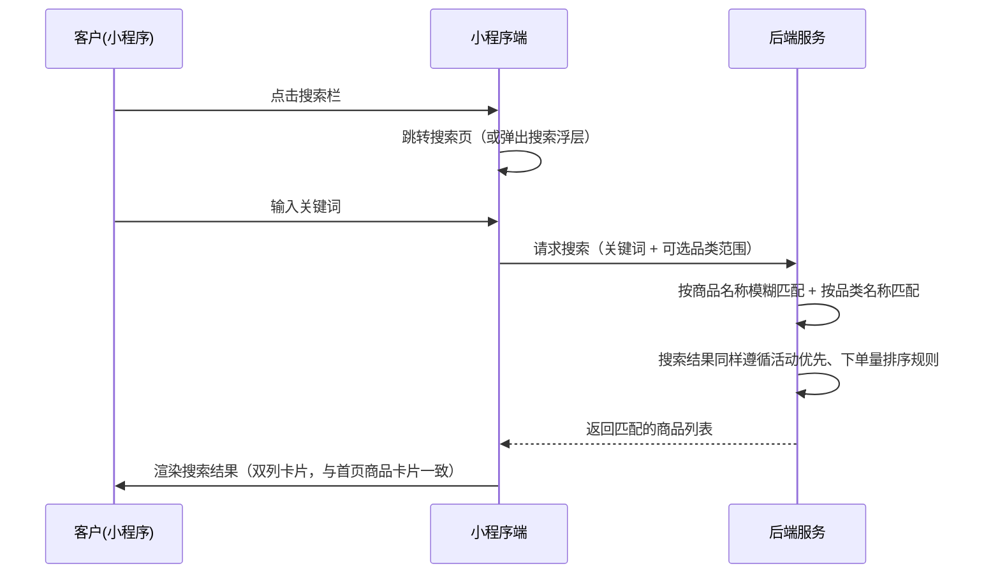

# 首页推荐商品展示-小程序 SPEC

> **归属中心**：04-营销中心
> **子模块**：首页推荐商品展示
> **终端**：小程序端
> **版本**：v1.1
> **更新日期**：2026-07-03
>
> - **小程序端**：面向 B 端客户，在小程序首页展示推荐商品，优先推荐有优惠券活动的品类商品，引导客户浏览和下单。

------

## 1. 背景与目标 (Background & Objectives)

**背景**：平台通过优惠券活动（按品类绑定）促进客户下单。小程序首页作为客户进入平台的第一入口，需要智能推荐商品：优先展示有优惠券活动的品类商品，活动商品不足时以历史下单量高的商品补足，帮助客户快速发现优惠商品和热门商品。

**目标**：在小程序首页构建品类商品展示区，按品类页签展示推荐商品，每个品类最多展示 50 个 SKU，顶部区域（品牌栏 + 客户信息 + 品类页签）整块固定吸顶，品类页签支持横向滑动切换，切换时一次性加载该品类全部商品，支持搜索商品品类、一键加购和跳转商品详情。

------

## 2. 角色与使用场景 (Roles & Scenarios)

| 角色 | 说明 |
| --- | --- |
| B 端客户（未登录） | 访客，可浏览首页商品品类和推荐商品，使用搜索，点击加购或详情时引导登录 |
| B 端客户（已登录） | 已登录客户，可浏览商品、搜索、加购和查看详情 |

**使用场景**：
- 作为未登录用户，我打开小程序首页可以看到品牌 Logo、搜索栏、品类页签和推荐商品列表，客户信息区显示「请登录  >」。
- 作为已登录客户，我进入首页时客户信息区显示我的名称（如「张记食堂  >」，字号与 Logo 相近），点击可查看个人信息。
- 作为客户，我可以通过点击搜索栏输入关键词，按商品名称/品类名称实时搜索匹配结果。
- 作为客户，我可以通过横向滑动品类页签切换不同品类的商品列表，页签宽度紧凑（仅容纳品类名），页签超出屏幕时继续滑动查看后续页签。
- 作为客户，切换品类页签时一次性加载该品类下全部推荐商品（≤50 SKU），无需滚动分页加载。
- 作为客户，向下滚动浏览商品时，顶部区域（品牌栏 + 客户信息 + 品类页签）整块固定在屏幕顶部不随滚动静默。
- 作为客户，我优先看到有优惠券活动的商品（标记「惠」标签），活动商品不足 50 个时自动补充下单量高的商品。
- 作为已登录客户，我可以在商品卡片右下角直接点击加购按钮将商品加入购物车（未登录时点击加购引导登录）。
- 作为客户，我点击商品卡片跳转至商品详情页查看更多信息。

------

## 3. 核心业务流程 (Core Business Flow)

### 3.1 首页加载与品类切换流程



### 3.2 搜索流程



### 3.3 商品排序规则

```
┌─────────────────────────────────────┐
│  请求某品类商品列表                   │
├─────────────────────────────────────┤
│  1. 获取该品类下所有上架商品          │
│  2. 查询该品类当前是否有生效的优惠券   │
│     （使用开始日期 ≤ 今天 ≤ 使用结束日期）│
│  3. 标记：有券品类下的商品 = 活动商品   │
│  4. 排序：                           │
│     ├─ 活动商品在前（按下单量降序）     │
│     └─ 非活动商品在后（按下单量降序）   │
│  5. 截断：取前 50 个 SKU              │
│  6. 一次性返回全部结果，前端全量渲染    │
└─────────────────────────────────────┘
```

### 3.4 无活动 / 全活动 / 混合场景

| 场景 | 说明 | 排序行为 |
| --- | --- | --- |
| 该品类无任何活动 | 没有生效中的优惠券覆盖此品类 | 全部商品按历史下单量降序，取前 50 |
| 该品类活动商品 ≥ 50 | 有券品类下商品足够多 | 活动商品按历史下单量降序，截断前 50 |
| 该品类活动商品 ＜ 50 | 活动商品不足，需补足 | 活动商品在前（下单量降序），剩余席位由非活动商品按下单量降序补足至 50 |
| 该品类无商品 | 品类下无上架商品 | 返回空列表，前端展示空状态 |

### 3.5 异常流与逆向流

| 异常场景 | 触发条件 | 系统处理方式 |
| --- | --- | --- |
| 品类列表为空 | 系统未配置任何商品品类 | 展示空状态插图 + 「暂无商品分类」 |
| 品类下无商品 | 某品类下无上架商品 | 该品类页签下展示「该品类暂无商品」 |
| 搜索无结果 | 关键词无匹配商品 | 展示「未找到相关商品，换个关键词试试」 |
| 网络异常 | 请求超时或失败 | 提示「网络异常，请下拉刷新重试」 |
| 未登录 | 客户未登录 | 首页正常展示，客户信息区显示「请登录  >」；点击加购或跳转详情时引导登录 |
| 加购失败 | 库存不足或接口异常 | Toast 提示具体失败原因 |

------

## 4. 界面与交互说明 (UI & Interaction)

### 4.1 首页整体布局

```
┌─────────────────────────────────┐
│ ╔══════════ 顶部固定区（吸顶） ═══════╗ │
│ ║ ┌────────┐                       ║ │
│ ║ │🔴钱鲜达│ ┌──────────────┐ [✕]  ║ │  ← Logo左 | 搜索栏中 | 关闭右
│ ║ └────────┘ └──────────────┘      ║ │
│ ║                                  ║ │
│ ║ 张记食堂                      >  ║ │  ← 客户信息（字号接近Logo）
│ ║ （未登录时：请登录            >） ║ │
│ ║                                  ║ │
│ ║ ┌──┬──┬──┬──┬──┬──┬──┬──→     ║ │  ← 窄页签，超出可横向滑动
│ ║ │猪肉│蔬菜│海鲜│冻品│粮油│禽蛋│乳品│…→ ║ │
│ ║ └──┴──┴──┴──┴──┴──┴──┴──→     ║ │
│ ╚══════════════════════════════════╝ │
├─────────────────────────────────────┤
│  ← 以下为可滚动区域                  │
│                                     │
│  ┌─────────┐  ┌─────────┐         │
│  │  [商品图]│  │  [商品图]│         │  ← 商品卡片（双列网格）
│  │          │  │          │         │
│  │ 五花肉   │  │ 排骨     │         │
│  │ [惠]     │  │         │         │  ← 活动标签（有活动时展示）
│  │ ¥32.50   │  │ ¥45.00   │         │
│  │      [+] │  │      [+] │         │  ← 加购按钮（右下角）
│  └─────────┘  └─────────┘         │
│                                     │
│  ┌─────────┐  ┌─────────┐         │
│  │  ...     │  │  ...     │         │
│  └─────────┘  └─────────┘         │
│                                     │
│  （一次性全量展示该品类所有商品，     │
│   无需滚动加载更多）                  │
│                                     │
└─────────────────────────────────────┘
```

### 4.2 顶部品牌区（固定吸顶）

**整体**：品牌区 + 客户信息 + 品类页签作为一整块固定区域，`position: sticky; top: 0`，滚动时始终可见。

**品牌行构成**（同一行，左中右布局）：
1. **品牌 Logo（左）**：「钱鲜达」红色艺术字，字体有设计感，独立品牌色块，固定宽度不缩放
2. **搜索栏（中）**：圆角输入框，占位文案「搜索商品/品类」，点击后进入搜索页（支持输入关键词按商品名称、品类名称实时搜索匹配），弹性宽度填满中间空间
3. **微信关闭控件（右）**：微信小程序原生关闭按钮（由小程序框架提供），紧邻搜索栏右侧

### 4.3 客户信息（固定吸顶）

- **位置**：品牌行下方、品类页签上方，属于顶部固定区的一部分
- **字号**：与品牌 Logo 艺术字视觉大小相近（约 16-18px），比普通正文明显更大
- **内容**：
  - **已登录**：`{客户名称}  >` （如「张记食堂  >」），右侧 `>` 为可点击控件
  - **未登录**：`请登录  >`
- **交互**：点击整个客户信息行（含 `>`）→ 跳转至个人信息页（已登录）/ 跳转登录页（未登录）

### 4.4 品类页签（固定吸顶 + 窄宽度 + 横向滑动）

- **位置**：客户信息下方，属于顶部固定区的最底部
- **页签宽度**：每个页签宽度仅包裹品类名文字 + 少量内边距（如 `padding: 6px 14px`），不再占满等分宽度
- **横向滑动**：`overflow-x: auto`，页签总宽度超出屏幕时手指左右滑动查看更多页签，隐藏滚动条
- **选中态**：当前选中页签红色胶囊底色 + 白色文字，未选中为灰色文字透明底
- **切换行为**：点击某品类 → 下方商品区整体刷新，一次性加载该品类全部商品（≤50 SKU）
- **默认选中**：第一个品类
- **极限状态**：品类较多时（如 15+ 个）继续横向滑动，无数量上限

### 4.5 搜索页

- **入口**：点击顶部搜索栏
- **页面结构**：
  - 顶部搜索输入框（自动聚焦），带「取消」按钮
  - 输入关键词后实时请求后端搜索
  - 搜索结果以双列商品卡片展示（与首页商品卡片样式一致，含「惠」标签和加购按钮）
  - 无结果时展示空状态
- **搜索范围**：商品名称（模糊匹配）+ 品类名称（模糊匹配，返回该品类下的商品）
- **排序**：搜索结果同样遵循活动商品优先、下单量降序排列

### 4.6 商品卡片（双列网格，可滚动区域）

每张商品卡片展示内容：

| 序号 | 信息项 | 位置 | 说明 |
| --- | --- | --- | --- |
| 1 | 商品图片 | 顶部，撑满卡片宽度 | 正方形或 4:3 比例，圆角顶部 |
| 2 | 活动标签 | 图片左上角 | 「惠」标签，仅活动商品展示，红色醒目底色 |
| 3 | 商品名称 | 图片下方 | 1-2 行，超出省略号 |
| 4 | 商品价格 | 名称下方 | 较大字号，红色醒目，格式 `¥XX.XX` |
| 5 | 加购按钮 | 卡片右下角 | 圆形 `+` 按钮，点击直接加购物车，有 toast 反馈 |

**排序规则**（单个品类内）：
- 活动商品优先（按历史下单量降序）
- 非活动商品在后（按历史下单量降序）
- 总数量截断至 50 SKU

**加载方式**：切换品类页签时一次性请求该品类全部商品（≤50 SKU），前端全量渲染，无需分页或滚动加载更多。

**交互动作**：
- 点击商品卡片 → `window.location.href` 跳转商品详情页
- 点击加购按钮 → 调用加购接口，成功 toast「已加入购物车」
- 点击加购按钮不触发卡片跳转（事件冒泡阻止）

**极限状态**：
- 空数据：居中插图 + 「该品类暂无商品」
- 加载中：骨架屏（双列灰色色块模拟卡片）
- 商品图片加载失败：展示默认占位图

------

## 5. 数据字典与字段级规则 (Data & Field Rules)

### 5.1 接口一：品类列表

| 接口功能 | 方法 | 路径 | 说明 |
| --- | --- | --- | --- |
| 品类列表 | GET | `/api/product/category/list` | 获取所有上架商品的一级品类及排序 |

**响应字段**：

| 字段名称 | 字段类型 | 来源 | 说明 |
| :--- | :--- | :--- | :--- |
| 品类ID | String(UUID) | 商品分类表 | 品类唯一标识 |
| 品类名称 | String(50) | 商品分类表 | 展示在页签上 |
| 排序序号 | Integer | 商品分类表 | 页签从左到右的排列顺序 |

### 5.2 接口二：品类商品列表（首页推荐）

| 接口功能 | 方法 | 路径 | 说明 |
| --- | --- | --- | --- |
| 品类推荐商品 | GET | `/api/product/home/recommend` | 一次性获取某品类下全部推荐商品（≤50 SKU，含活动标记） |

**请求参数**：

| 参数名 | 类型 | 必填 | 说明 |
| --- | --- | --- | --- |
| categoryId | String(UUID) | 是 | 品类 ID |

> 无需分页参数，后端一次性返回该品类下全部推荐商品（最多 50 个 SKU）。

**响应字段**：

| 字段名称 | 字段类型 | 来源 | 说明 |
| :--- | :--- | :--- | :--- |
| 商品ID | String(UUID) | 商品主表 | SKU 唯一标识 |
| 商品名称 | String(100) | 商品主表 | 展示在卡片上，最多 2 行 |
| 商品主图 | String(URL) | 商品主表 | 卡片图片 |
| 商品价格 | Decimal(10,2) | 商品价格表 | 展示单价 |
| 是否有活动 | Boolean | 后端计算 | 该商品所属品类是否有生效中的优惠券 |
| 历史下单量 | Integer | 订单统计表 | 历史累计下单数量，用于排序 |

### 5.3 接口三：商品搜索

| 接口功能 | 方法 | 路径 | 说明 |
| --- | --- | --- | --- |
| 商品搜索 | GET | `/api/product/home/search` | 按关键词搜索商品/品类，返回匹配商品列表 |

**请求参数**：

| 参数名 | 类型 | 必填 | 说明 |
| --- | --- | --- | --- |
| keyword | String | 是 | 搜索关键词，按商品名称模糊匹配 + 品类名称匹配 |
| categoryId | String(UUID) | 否 | 限定在某个品类内搜索，不传则全品类搜索 |

**响应字段**：与品类推荐商品接口结构一致，同样遵循活动优先 + 下单量排序规则。

### 5.4 排序字段来源

| 字段 | 来源表 | 用途 |
| --- | --- | --- |
| 是否有活动 | 实时查询优惠券表 → 券关联品类表 | 判定商品是否属于有券品类 |
| 历史下单量 | 订单商品表（按 SKU 聚合 count） | 活动商品内排序、非活动商品排序 |

### 5.5 展示逻辑

| 展示项 | 格式/规则 |
| --- | --- |
| 客户名称 | 已登录展示客户名称 + `>`；未登录展示「请登录」+ `>`；字号与 Logo 视觉大小相近（约 16-18px，加粗） |
| 品类页签 | 窄宽度（`padding: 6px 14px`），文字自适应，页签总宽超出屏幕时横向滑动 |
| 商品名称 | 最多展示 2 行，超出省略号（`line-clamp-2`） |
| 商品价格 | `¥X.XX`，两位小数，红色字体 |
| 活动标签 | 「惠」字，红色圆角标签，仅当 `是否有活动=true` 时展示 |
| 商品图片 | 正方形或 4:3，`object-fit: cover`，圆角顶部 |
| 顶部固定区 | 品牌栏 + 客户信息 + 品类页签整体 `position: sticky; top: 0`，滚动时吸顶 |

### 5.6 编辑逻辑

小程序端对首页商品**无编辑权限**。商品信息、品类、价格、上下架状态均由后台管理端维护。首页展示的商品均为「已上架」状态。

### 5.7 排序约束

| 约束项 | 规则 |
| --- | --- |
| 活动判定 | 品类关联的优惠券状态为有效（`startDate ≤ today ≤ endDate`） |
| 有多个活动覆盖同一品类 | 只要品类下任意一张券有效，该品类下所有商品标记为活动商品 |
| 活动商品排序 | 按历史下单量降序 |
| 非活动商品排序 | 按历史下单量降序 |
| 跨品类不比较 | 各品类独立排序，切换品类页签时独立加载 |
| SKU 上限 | 每个品类最多 50 个 SKU，超过截断 |
| 商品归属 | 一个商品属于多个品类时，仅在其主品类下展示，不跨品类重复 |

------

## 6. 系统交互与边界 (System Integrations & Boundaries)

### 6.1 前置依赖

| 依赖项 | 说明 |
| --- | --- |
| 商品分类模块 | 品类列表数据源，见 `spec/01-商品管理/`（待建） |
| 商品管理模块 | 商品主数据、价格、图片、上下架状态 |
| 优惠券管理模块 | 优惠券品类关联，判定活动商品，详见 [优惠券管理.md](./优惠券管理.md) |
| 订单模块 | 历史下单量统计数据源 |
| 购物车模块 | 加购按钮调用加购接口 |
| 小程序登录注册 | 客户认证，详见 [小程序登录注册模块.md](../02-客户管理/小程序登录注册模块.md) |

### 6.2 下游影响

| 关联模块 | 影响说明 |
| --- | --- |
| 商品详情页 | 首页商品卡片点击跳转至详情页 |
| 购物车 | 加购成功后购物车角标数量 +1 |
| 优惠券管理 | 优惠券的新增/过期/删除直接影响首页活动商品的标记 |
| 搜索页 | 点击搜索栏跳转搜索页，复用商品卡片组件 |

### 6.3 接口汇总

| 接口功能 | 方法 | 路径 | 说明 |
| --- | --- | --- | --- |
| 品类列表 | GET | `/api/product/category/list` | 获取有上架商品的品类，按排序序号排列 |
| 品类推荐商品 | GET | `/api/product/home/recommend` | 一次性获取某品类全部推荐商品，≤50 SKU |
| 商品搜索 | GET | `/api/product/home/search` | 按关键词搜索商品/品类，活动优先排序 |

------

## 7. 非功能性需求 (Non-Functional Requirements)

### 7.1 性能要求

| 指标 | 要求 |
| --- | --- |
| 品类列表接口响应 | < 200ms |
| 品类推荐商品接口响应 | < 800ms（一次性返回全品类 ≤50 SKU） |
| 搜索接口响应 | < 500ms |
| 首页首屏渲染 | < 1.5s（含接口请求 + UI 渲染） |
| 品类切换响应 | < 800ms（含全量请求 + 渲染） |
| 图片加载 | 懒加载 + CDN 加速 |
| 顶部吸顶 | 滚动时顶部固定区无抖动、无延迟 |

### 7.2 权限与安全

| 层级 | 说明 |
| --- | --- |
| 操作权限 | 首页浏览（含品类切换、商品列表查看、搜索）无需登录；加购、跳转详情需登录态，未登录时引导登录 |
| 数据权限 | 客户仅查看已上架商品；不同客户因所属大区可能看到的商品不同（如有大区商品隔离） |
| 加购频率 | 同一商品 1s 内不可重复加购（前端防抖 + 后端幂等） |

------

## 8. 输出文档需求

本模块为 **04-营销中心** 下的 **首页推荐商品展示** 子模块，小程序端。

```
spec/
└── 04-营销管理/
    ├── 优惠券管理.md                 ← 后台端 SPEC
    ├── 优惠券-小程序.md              ← 小程序端优惠券 SPEC
    └── 首页推荐商品展示-小程序.md     ← 本文档（小程序端首页）
```

**关联模块**：

| 模块 | 状态 | 说明 |
| --- | --- | --- |
| 优惠券管理（后台） | 已有 | 品类关联券判定活动商品 |
| 优惠券（小程序） | 已有 | 客户查看持有券 |
| 小程序登录注册 | 已有 | 客户认证 |
| 商品管理 | 待建 | 商品主数据、品类、价格、图片 |
| 购物车 | 已有 | 加购接口 |
| 商品详情 | 待建 | 点击商品卡片跳转目标 |
| 搜索页 | 待建 | 点击搜索栏跳转目标 |
