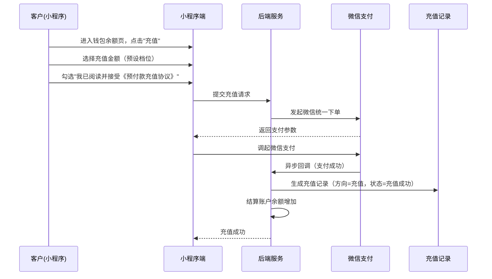
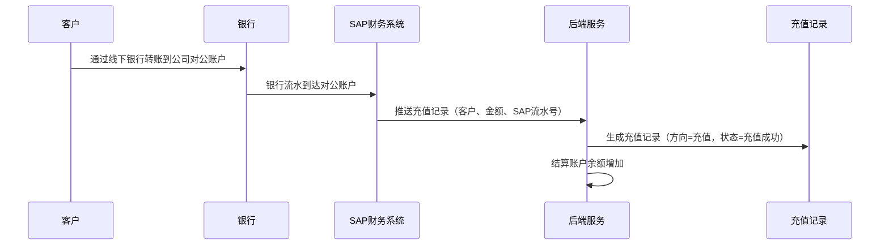
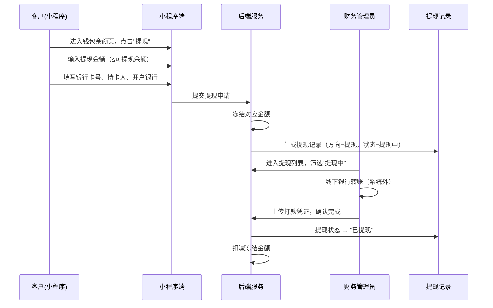
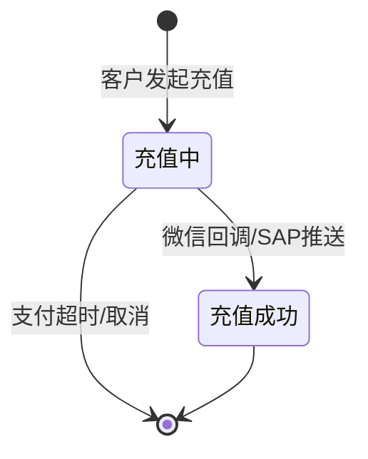

# 充值提现记录模块 SPEC

> **归属中心**：05-财务中心
> **模块**：聚合结算账户 / 充值提现记录
> **版本**：v2.0
> **更新日期**：2026-07-02

------

## 1. 背景与目标 (Background & Objectives)

**背景**：客户的预付款账户需要充值入口来补充余额，也需要提现入口来取回资金。充值支持微信支付直接充值，线下银行打款由 SAP 自动推送入账。提现由客户申请，财务审核后线下打款。充值与提现均产生资金流水。

**目标**：打通"充值（微信/SAP推送）→ 自动到账 → 余额更新"和"提现申请 → 财务打款 → 凭证确认"两条完整链路，统一管理结算账户的资金进出。

------

## 2. 角色与使用场景 (Roles & Scenarios)

| 角色 | 说明 |
| --- | --- |
| 小程序客户（B端） | 发起充值或提现申请 |
| 财务管理员 | 审核提现申请、线下打款、操作 SAP 推送 |
| 系统/SAP | 接收银行到账通知，自动推送充值记录 |

**使用场景**：
- 作为客户，我在小程序钱包余额页点击"充值"，选择微信支付直接充值到预付款账户。
- 作为客户，我通过银行转账方式打款到公司对公账户，SAP 收到银行流水后推送至系统自动生成充值成功记录。
- 作为客户，我提现预付款余额，输入提现金额和银行卡信息提交申请。
- 作为财务管理员，我查看 SAP 自动推送的线下充值到账记录。
- 作为财务管理员，我审核提现申请，线下打款后上传凭证完成提现。

------

## 3. 核心业务流程 (Core Business Flow)

### 3.1 充值流程一：微信直接充值



### 3.2 充值流程二：线下银行打款 → SAP 自动推送



### 3.3 提现流程



### 3.4 充值状态流转

| 状态 | 说明 | 触发条件 |
| --- | --- | --- |
| 充值中 | 支付处理中，等待回调 | 客户发起充值 |
| 充值成功 | 充值金额已到账，余额已更新 | 微信回调 / SAP 自动推送 |



### 3.5 提现状态流转

| 状态 | 说明 | 触发条件 |
| --- | --- | --- |
| 提现中 | 客户已提交提现申请，等待财务打款 | 客户提交 |
| 已提现 | 财务已完成线下打款 | 财务确认打款 |
| 提现失败 | 提现未通过，金额退回余额 | 财务驳回 |

### 3.6 异常流

| 异常场景 | 处理方式 |
| --- | --- |
| 充值金额为空或 ≤0 | 阻止提交 |
| 微信支付回调失败 | 充值记录状态标记"充值失败"（支付超时自动取消） |
| SAP 推送重复 | 幂等处理，不重复生成记录 |
| 提现金额超过可提现余额 | 阻止提交，提示"余额不足" |
| SAP 推送失败 | 系统告警，人工介入排查 SAP 对接 |

------

## 4. 界面与交互说明 (UI & Interaction)

### 4.1 小程序客户端

**钱包余额页**：

```
┌─────────────────────────────────┐
│  ← 我的钱包                      │
├─────────────────────────────────┤
│  预付款账户：王博A               │
│                                 │
│  可提现余额  ¥ 1,280.00          │
│  冻结金额     ¥ 200.00           │
│                                 │
│  ┌──────────┐ ┌──────────┐     │
│  │   充值   │ │   提现   │     │
│  └──────────┘ └──────────┘     │
│                                 │
│  ┌──────────────────────────────┐ │
│  │         查看交易流水           │ │
│  └──────────────────────────────┘ │
│  ┌──────────────────────────────┐ │
│  │         查看充值提现记录        │ │
│  └──────────────────────────────┘ │
└─────────────────────────────────┘
```

**充值申请页**：

```
┌─────────────────────────────────┐
│  ← 充值                          │
├─────────────────────────────────┤
│  充值到账账户                    │
│  王博A（预付款账户）              │
│                                 │
│  充值金额                        │
│  ┌──────┐┌───────┐┌───────┐    │
│  │ ¥5000││¥10000 ││¥15000 │    │
│  └──────┘└───────┘└───────┘    │
│  ┌───────┐┌───────┐┌───────┐   │
│  │¥20000 ││¥30000 ││¥40000 │   │
│  └───────┘└───────┘└───────┘   │
│  ┌───────────┐                  │
│  │  ¥50000   │                  │
│  └───────────┘                  │
│                                 │
│  预付款充值说明：                 │
│  1.平台不定期返券活动，随机选取   │
│    幸运商户参与充值返券活动...    │
│  2.使用方法：您在商城下单后使用   │
│    预付款付费视同于现金结算...    │
│  3.预付款余额不能转移、转赠；     │
│  4.预付款余额使用有效期：         │
│    至用完为止；                  │
│  5.正常情况下预存操作将实时到账   │
│    ...                          │
│                                 │
│  ☐ 我已阅读并接受                │
│    《预付款充值协议》             │
│                                 │
│  ┌─────────────────────────┐    │
│  │       确认充值（微信支付）│    │
│  └─────────────────────────┘    │
└─────────────────────────────────┘
```

**充值页字段说明：**

| 字段 | 组件类型 | 说明 |
| --- | --- | --- |
| 充值到账账户 | 只读文本 | 展示当前选中的预付款账户名称，选当前账户绑定的 客户资料里面开通预付款账户的客户公司资料 |
| 充值金额 | 预设金额按钮组 | 提供固定档位选择：5000/10000/15000/20000/30000/40000/50000，选中高亮，无需手动输入 |
| 预付款充值说明 | 折叠/展开文本 | 展示5条充值规则说明，默认展开，包含返券活动、使用方式、余额规则、有效期、到账时效，具体内容如下：1.平台不定期返券活动，随机选取幸运商户参与充值返券活动，选中的商户在活动周期内可仅参与一次充值返券活动，活动周期由平台随时调整；2.使用方法：您在商城下单后使用预付款付费视同于现金结算，您在下单时使用“预付款余额”支付即可；3.预付款余额不能转移、转赠；4.预付款余额使用有效期：至用完为止；5.正常情况下预存操作将实时到账，如果遇到网络、支付机构系统异常等问题产生的延迟，以最终到账时间为准。 |
| 协议勾选 | 复选框 | 必勾选，文案"我已阅读并接受《预付款充值协议》"，未勾选时点击确认按钮弹框提示用户确认后继续支付 |
| 确认充值 | 按钮 | 勾选协议后方可点击，调起微信支付 |
- 不提供支付方式选择，所有充值统一走微信支付，线下银行打款由 SAP 侧推送。
- 充值金额仅支持预设档位，如需其他金额请联系财务走线下流程。
- 必须勾选"我已阅读并接受《预付款充值协议》"后，确认充值按钮可直接支付；未勾选时点击确认按钮弹框提示"请阅读并接受预付款充值协议"，用户确认后视为已接受协议，继续支付流程。

### 4.2 后台管理端 — 充值与提现列表页

**界面布局**：

```
┌─────────────────────────────────────────────────────────────────┐
│  类型：○全部 ○充值 ○提现  状态：[全部 ▼]  结算账户：[__________]   │
│  入账时间：[2026-06-03 ~ 2026-07-02]                             │
│  [搜索] [清除条件]                                               │
├─────────────────────────────────────────────────────────────────┤
│  待处理提现金额 X 元                                              │
├─────────────────────────────────────────────────────────────────┤
│  入账时间 │单号│结算账户ID│结算账户名称│类型│金额│状态│收/付款方式│银行卡号│持卡人│银行名称│第三方流水号│打款凭证│操作人ID│操作人│创建人│操作│
│  ─────────────────────────────────────────────────────────────── │
│  07-01.. │WD..│ACC001│王博A  │充值│500│充值成功│微信        │-     │-     │-      │WX20..     │-      │-      │-    │张三  │查看│
│  06-30.. │WD..│ACC001│王博A  │充值│1000│充值成功│银行转账    │6222..│王博A │工商银行│SAP2026..  │-      │-      │-    │SAP  │查看│
│  06-29.. │WD..│ACC001│王博A  │提现│200│提现中│银行卡      │6228..│王博A │招商银行│-          │-      │-      │-    │李四  │打款/驳回│
│  06-28.. │WD..│ACC001│王博A  │提现│300│已提现│银行卡      │6228..│王博A │招商银行│TRN..     │已上传 │OP001  │财务1│张三  │查看│
│  ─────────────────────────────────────────────────────────────── │
│  [分页器]                                                        │
└─────────────────────────────────────────────────────────────────┘
```

**搜索筛选区**：
- 类型（充值/提现/全部）
- 状态（充值中/充值成功/提现中/已提现/提现失败）
- 结算账户、入账时间

**列表区**：

| 列名 | 说明 |
| --- | --- |
| 入账时间 | 充值或提现发起时间 |
| 单号 | 充值或提现单号，唯一 |
| 结算账户ID | 结算账户唯一标识 |
| 结算账户名称 | 结算账户名称 |
| 类型 | 充值 / 提现 |
| 金额 | 保留两位小数 |
| 状态 | 充值：充值中(橙) / 充值成功(绿)；提现：提现中(橙) / 已提现(绿) / 提现失败(红) |
| 付款/收款方式 | 微信 / 银行转账 / 银行卡 |
| 银行卡号 | 充值时为打款卡号，提现时为收款卡号，无则为"-" |
| 持卡人姓名 | 银行卡对应持卡人姓名 |
| 银行名称 | 开户银行名称 |
| 第三方流水号 | 通过联查流水表展示；微信支付为微信流水号，SAP推送的银行转账记录为SAP流水号，提现打款完成为财务填写的打款流水号 |
| 打款凭证 | 提现打款完成时上传的凭证，点击可预览图片，无则为"-" |
| 操作人ID | 财务确认/打款/驳回的操作人唯一标识 |
| 操作人 | 财务确认/打款/驳回的操作人姓名 |
| 创建人 | 记录创建来源：客户发起为"小程序登录账号"，SAP推送为"SAP" |
| 操作 | 提现中：完成打款+驳回；其他状态：查看详情 |

### 4.3 后台管理端 — 完成打款弹窗

| 字段名称 | 必填 | 控件类型 | 说明 |
| --- | --- | --- | --- |
| 转账银行卡号 | 否 | 文本输入 | 财务打款使用的银行卡号 |
| 打款凭证 | 是 | 图片上传 | 银行转账截图，jpg/png，≤5MB |
| 备注 | 否 | 文本输入 | 补充说明 |

### 4.4 后台管理端 — 驳回提现弹窗

| 字段名称 | 必填 | 控件类型 | 说明 |
| --- | --- | --- | --- |
| 驳回原因 | 是 | 多行文本 | 限 200 字，客户可见 |

------

## 5. 数据字典与字段级规则 (Data & Field Rules)

### 5.1 充值提现记录表

| 字段名称 | 字段类型 | 来源/依赖 | 默认值 | 读写权限 | 校验规则与约束 | 说明 |
| --- | --- | --- | --- | --- | --- | --- |
| 记录ID | UUID | 系统生成 | - | 只读 | 唯一主键 | - |
| 业务单号 | 文本(32) | 系统生成 | - | 只读 | 唯一 | - |
| 客户编号 | UUID | 关联客户表 | - | 只读 | 外键 | 提现时=申请人，充值时可为空 |
| 客户名称 | 文本(100) | 冗余存储 | 空 | 只读 | - | 写入时记录 |
| 结算账户编号 | UUID | 关联结算账户 | - | 只读 | 外键 | 充值/提现目标账户 |
| 结算账户名称 | 文本(100) | 冗余存储 | 空 | 只读 | - | 写入时记录 |
| 方向 | 枚举 | 系统判定 | - | 只读 | 充值 / 提现 | - |
| 金额 | 金额(10,2) | 客户输入 | - | 只读 | >0 | 单位：元 |
| 支付方式 | 枚举 | 客户选择 | 空 | 只读 | 微信 / 银行转账 / 银行卡 | 充值=微信或银行转账，提现=银行卡 |
| 状态 | 枚举 | 系统/财务 | 充值中 | 系统自动 | 充值：充值中/充值成功；提现：提现中/已提现/提现失败 | - |
| 银行卡号 | 文本(32) | 客户/财务 | 空 | 可读写 | 充值为打款卡号，提现为收款卡号 | - |
| 持卡人姓名 | 文本(50) | 客户/财务 | 空 | 可读写 | 银行卡对应持卡人 | - |
| 银行名称 | 文本(100) | 客户/财务 | 空 | 可读写 | 开户银行名称 | - |
| 第三方流水号 | 文本(64) | 微信/SAP/财务 | 空 | 可读写 | 通过联查流水表展示；微信=微信流水号，SAP推送=SAP流水号，提现=财务打款流水号 | - |
| 创建人 | 文本(50) | 系统记录 | 空 | 只读 | 客户发起="客户"，SAP推送="SAP"，财务操作=操作人姓名 | - |
| 打款凭证 | 文本(500) | 财务上传 | 空 | 财务可编辑 | 提现打款完成时必填 | 图片URL |
| 操作人编号 | UUID | 系统记录 | 空 | 只读 | - | 财务确认/打款/驳回的操作人 |
| 操作人名称 | 文本(50) | 冗余存储 | 空 | 只读 | - | 写入时记录 |
| 驳回原因 | 文本(500) | 财务输入 | 空 | 财务可编辑 | 提现驳回时必填 | 客户可见 |
| 请求时间 | 日期时间 | 系统生成 | 当前时间 | 只读 | - | - |
| 完成时间 | 日期时间 | 系统记录 | 空 | 只读 | 状态变更时写入 | - |
| 备注 | 文本(500) | 客户/财务 | 空 | 可读写 | 选填 | - |

### 5.2 展示逻辑

- 充值金额：绿色，前缀 `+`
- 提现金额：红色，前缀 `-`
- 状态标签：充值中/提现中(橙) / 充值成功/已提现(绿) / 提现失败(红)
- 日期：`YYYY-MM-DD HH:mm:ss`
- 金额：千分位逗号分隔

### 5.3 编辑逻辑

- 充值：微信支付和SAP推送均自动到账，状态由系统自动从"充值中"更新为"充值成功"
- 提现：申请时冻结金额；打款完成后扣减；驳回后解冻退回
- "充值成功"和"已提现"不可回退（需走退款/反向流程）
- "提现失败"为终态，金额退回余额

------

## 6. 系统交互与边界 (System Integrations & Boundaries)

### 6.1 前置依赖

| 依赖项 | 说明 |
| --- | --- |
| 结算账户模块 | 充值增加余额，提现扣减余额 |
| 微信支付 | 微信充值回调 |
| SAP 财务系统 | 银行到账推送充值记录 |
| 文件上传服务 | 打款凭证存储 |

### 6.2 外部接口

| 接口 | 调用方 | 说明 |
| --- | --- | --- |
| 客户充值提交 | 小程序 | POST `/api/recharge/submit` |
| 客户提现提交 | 小程序 | POST `/api/withdrawal/submit` |
| SAP 推送充值 | SAP | POST `/api/sap/recharge/push` |
| 后台充值提现列表 | 后台 | GET `/api/admin/fund/list` |
| 确认充值到账 | 后台 | POST `/api/admin/recharge/{id}/confirm` |
| 完成提现打款 | 后台 | POST `/api/admin/withdrawal/{id}/complete` |
| 驳回提现 | 后台 | POST `/api/admin/withdrawal/{id}/reject` |

------

## 7. 非功能性需求 (Non-Functional Requirements)

### 7.1 权限与安全

| 层级 | 说明 |
| --- | --- |
| 操作权限 | 充值/提现：客户登录后可操作；确认到账/完成打款：限财务管理员 |
| 数据权限 | 客户仅看自己的记录；财务管理员看全部 |
| 回调安全 | SAP 推送需验签；微信回调验签+幂等 |
