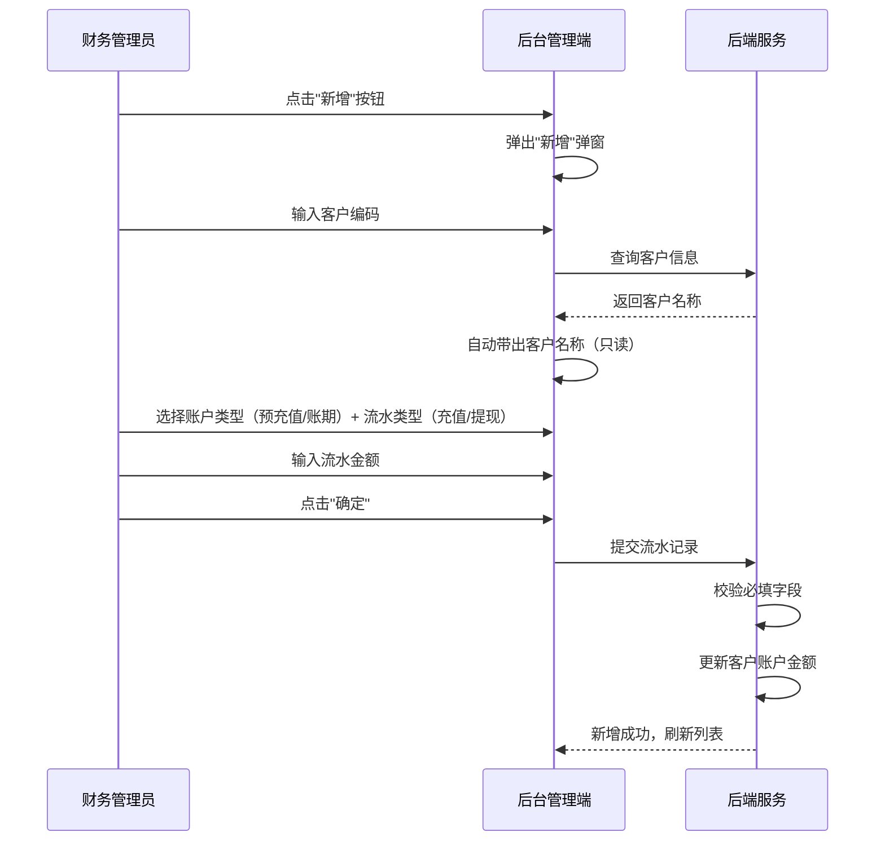

# 客户账户管理模块 SPEC

> **归属中心**：05-财务中心
> **模块**：客户账户管理
> **版本**：v1.0
> **更新日期**：2026-07-02

------

## 1. 背景与目标 (Background & Objectives)

**背景**：B端客户在平台下单后，需要通过预充值或账期方式进行资金结算。运营管理员需要对客户的账户余额、账期天数和资金流水进行统一管理。

**目标**：为运营管理员提供客户账户的全生命周期管理能力，包括客户账户信息查看、账户流水新增（充值/提现）、账户类型配置（预付款/账期），以及营业执照等资质信息的关联展示。

------

## 2. 角色与使用场景 (Roles & Scenarios)

| 角色 | 说明 |
| --- | --- |
| 财务管理员 | 管理所有客户账户资金、账期、流水 |
| 运营管理员 | 查看客户账户信息，为预充值客户新增充值流水 |

**使用场景**：
- 作为财务管理员，我可以通过客户编号/名称快速检索目标客户的账户信息。
- 作为财务管理员，我可以查看客户的账户金额、账户类型、账期天数和下一对账日期。
- 作为财务管理员，我点击"新增"为预充值客户添加充值流水记录。
- 作为财务管理员，我可以根据账户类型（预付款/账期）筛选客户列表。

------

## 3. 核心业务流程 (Core Business Flow)

### 3.1 新增账户流水流程



### 3.2 账户余额联动规则

| 流水类型 | 账户类型 | 金额变动 |
| --- | --- | --- |
| 充值 | 预充值 | 账户金额 + 流水金额 |
| 提现 | 预充值 | 账户金额 - 流水金额（不可为负） |
| - | 账期 | 金额记录不实时扣减，按账期天数对账结算 |

### 3.3 异常流

| 异常场景 | 处理方式 |
| --- | --- |
| 客户编码不存在 | 提示"客户编码不存在，请确认后重新输入" |
| 提现金额超过账户余额 | 提示"余额不足，当前余额：XX元" |
| 必填字段未填写 | 标红提示 + 阻止提交 |

------

## 4. 界面与交互说明 (UI & Interaction)

### 4.1 客户账户管理列表页

**界面布局**：

```
┌─────────────────────────────────────────────────────────────────┐
│  客户信息：[客户编号/名称____]  营业执照编号：[________]  账户类型：[全部 ▼]  [重置] [查询] │
├─────────────────────────────────────────────────────────────────┤
│  [新增]                                               共 X 条记录│
├─────────────────────────────────────────────────────────────────┤
│  表格列表（11列）                                                 │
│  ┌────┬──────┬──────┬──────┬──────┬────┬──────┬────┬────┬───┐  │
│  │序号│客户  │客户  │账户  │账户  │账期│下一  │备注│营业│...│  │
│  │    │编号  │名称  │金额  │类型  │天数│对账日│    │执照│   │  │
│  ├────┼──────┼──────┼──────┼──────┼────┼──────┼────┼────┼───┤  │
│  │ 1  │C001  │张三  │1,280 │预付款│ -  │  -   │ -  │... │   │  │
│  └────┴──────┴──────┴──────┴──────┴────┴──────┴────┴────┴───┘  │
│  [分页器]                                                        │
└─────────────────────────────────────────────────────────────────┘
```

**搜索筛选区**：

| 筛选项 | 组件类型 | 说明 |
| --- | --- | --- |
| 客户信息 | 文本输入 | 按客户编号/名称联合模糊搜索 |
| 营业执照编号 | 文本输入 | 按统一社会信用代码精确搜索 |
| 账户类型 | 下拉单选 | 全部 / 预付款 / 账期 |
| 查询 | 按钮 | 执行搜索 |
| 重置 | 按钮 | 清空所有搜索条件 |

**工具栏**："新增"按钮

**列表区**（分页表格，11 列）：

| 列名 | 说明 |
| --- | --- |
| 序号 | 行号 |
| 客户编号 | 客户的唯一编码 |
| 客户名称 | 客户姓名/公司名 |
| 账户金额 | 当前余额（元） |
| 账户类型 | 预付款 / 账期 |
| 账期天数 | 仅账期类型有值 |
| 下一对账日期 | 下次对账日期 |
| 备注 | 备注信息 |
| 营业执照编号 | 统一社会信用代码 |
| 公司名称 | 公司全称 |
| 营业执照照片 | 蓝色图片图标，点击可查看 |

### 4.2 新增弹窗

**弹窗标题**："新增"

| 字段名称 | 必填 | 控件类型 | 默认值/提示 | 说明 |
| --- | --- | --- | --- | --- |
| 客户编码 | 是 | 文本输入框 | "客户编码" | 序号角标 1，输入后自动查询带出客户名称 |
| 客户名称 | 是 | 文本输入框（置灰只读） | "根据编码自动带出" | 由客户编码联动填充 |
| 账户类型 | 是 | 单选 | ○ 预充值 / ○ 账期 | 默认选中预充值 |
| 流水类型 | 是 | 单选 | ○ 充值 / ○ 提现 | 默认选中充值 |
| 流水金额 | 是 | 数值输入框 | 无 | 序号角标 2，单位：元 |

**底部按钮**："确定"（提交）、"取消"（关闭）

**交互逻辑**：
- 客户编码输入后自动查询 → 客户名称只读回填
- 所有必填字段非空校验
- 账户类型和流水类型各选其一

**极限状态**：
- 空数据：表格 Empty State
- 加载中：表格骨架屏

------

## 5. 数据字典与字段级规则 (Data & Field Rules)

### 5.1 客户账户表核心字段

| 字段名称 | 字段类型 | 来源/依赖 | 默认值 | 读写权限 | 校验规则与约束 | 说明 |
| :--- | :--- | :--- | :--- | :--- | :--- | :--- |
| 账户ID | String(UUID) | 系统生成 | - | 只读 | 唯一主键 | - |
| 客户编号 | String(50) | 关联客户表 | - | 只读 | 外键 | 客户唯一编码 |
| 客户名称 | String(100) | 关联客户表 | - | 只读 | 自动带出 | 客户公司名称/姓名 |
| 账户金额 | Decimal(10,2) | 系统计算 | 0.00 | 只读 | ≥0 | 当前余额，单位：元 |
| 账户类型 | Enum | 管理员选择 | 预付款 | 可编辑 | 枚举：预付款、账期 | 预付款=先充值后消费，账期=先消费后结算 |
| 账期天数 | Integer | 管理员配置 | - | 可编辑 | 仅账期类型有值，>0 | 账期结算周期天数 |
| 下一对账日期 | Date | 系统计算 | - | 只读 | 上一对账日+账期天数 | 下次对账结算日期，订单的记账周期 |
| 备注 | String(500) | 管理员输入 | - | 可编辑 | 选填，最多500字符 | 备注说明 |
| 营业执照编号 | String(18) | 关联客户档案 | - | 只读 | 18位统一社会信用代码 | 客户资质信息 |
| 公司名称 | String(200) | 关联客户档案 | - | 只读 | - | 营业执照对应公司全称 |
| 营业执照照片 | String(500) | 关联客户档案 | - | 只读 | 图片URL | 点击可查看大图 |
| 创建时间 | DateTime | 系统记录 | 当前时间 | 只读 | 格式 YYYY-MM-DD HH:mm:ss | 自动生成 |
| 更新时间 | DateTime | 系统记录 | 当前时间 | 只读 | 格式 YYYY-MM-DD HH:mm:ss | 每次更新时自动记录 |

### 5.2 流水记录表核心字段

> 资金流水详见 [资金流水.md](./资金流水.md) 5.1 节，以下仅列出与账户管理直接相关的关键字段摘要。

| 字段名称 | 字段类型 | 来源/依赖 | 默认值 | 读写权限 | 校验规则与约束 | 说明 |
| :--- | :--- | :--- | :--- | :--- | :--- | :--- |
| 流水ID | String(UUID) | 系统生成 | - | 只读 | 唯一主键 | - |
| 流水号 | String(32) | 系统生成 | - | 只读 | 唯一，格式 YYYYMMDD+序号 | - |
| 入账时间 | DateTime | 系统记录 | 当前时间 | 只读 | - | 默认排序依据 |
| 结算账户编号 | String(UUID) | 关联结算账户表 | - | 只读 | 外键 | 资金实际归属，微信支付时为空 |
| 结算账户名称 | String(100) | 关联结算账户表 | - | 只读 | 写入时冗余存储 | - |
| 操作人编号 | String(UUID) | 关联用户表 | - | 只读 | 外键 | 执行操作的用户 |
| 操作人名称 | String(50) | 关联用户表 | - | 只读 | 写入时冗余存储 | - |
| 账务类型 | Enum | 系统判定 | - | 只读 | 充值/提现/下单/退款/转账/收款 | 充值、提现流水由账户管理模块触发 |
| 收支金额 | Decimal(10,2) | 系统计算 | - | 只读 | 收入为正、支出为负 | 单位：元 |
| 账户余额 | Decimal(10,2) | 系统计算 | - | 只读 | 结算账户交易后余额 | 单位：元 |
| 交易状态 | Enum | 系统/第三方 | 处理中 | 只读 | 处理中/成功/失败 | - |
| 备注 | String(500) | 系统/人工 | - | 只读 | 选填 | - |

### 5.3 展示逻辑

- 金额保留两位小数，千分位逗号分隔
- 账户类型展示：预付款（蓝色标签）/ 账期（橙色标签）
- 日期时间格式统一为 `YYYY-MM-DD HH:mm:ss`
- 营业执照照片以蓝色图片图标展示，点击可查看大图

### 5.4 编辑逻辑

- 账户金额由流水记录自动计算更新，不可手动编辑
- 账户类型为"账期"时，账期天数必填；为"预付款"时，账期天数置空
- 下一对账日期由系统根据上一对账日+账期天数自动计算

------

## 6. 系统交互与边界 (System Integrations & Boundaries)

### 6.1 前置依赖

| 依赖项 | 说明 |
| --- | --- |
| 客户管理模块 | 客户编号/名称来源于客户档案，输入时需实时查询校验 |
| 营业执照管理 | 营业执照编号、公司名称、照片从客户档案模块同步展示 |

### 6.2 外部接口

| 接口 | 说明 |
| --- | --- |
| 客户账户列表 | GET `/api/finance/account/list` |
| 查询客户信息 | GET `/api/finance/account/customer?code=xxx` |
| 新增流水 | POST `/api/finance/account/transaction` |

------

## 7. 非功能性需求 (Non-Functional Requirements)

### 7.1 权限与安全

| 层级 | 说明 |
| --- | --- |
| 操作权限 | 新增流水仅限财务管理员角色；查看列表限运营管理员以上 |
| 数据权限 | 管理员可查看全部客户账户数据 |
