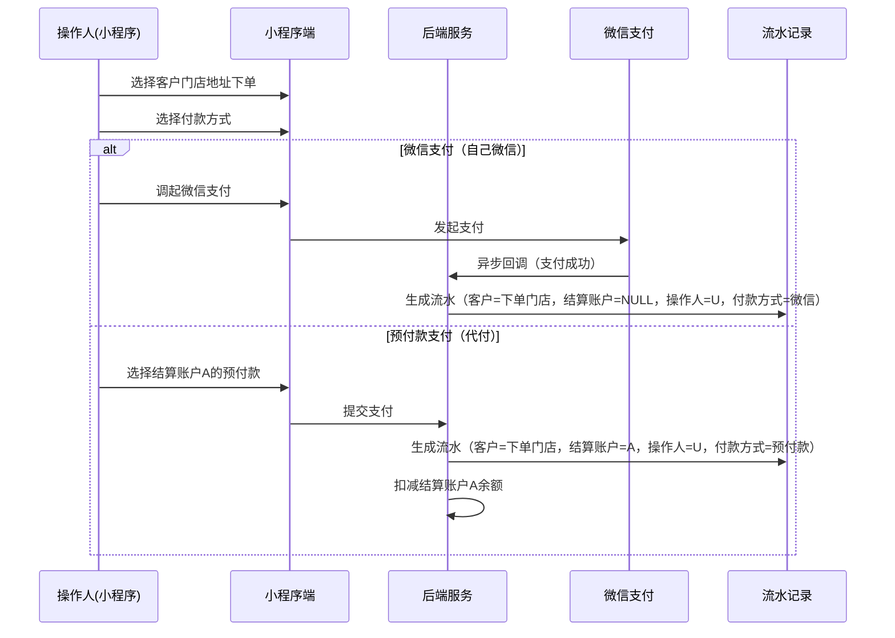
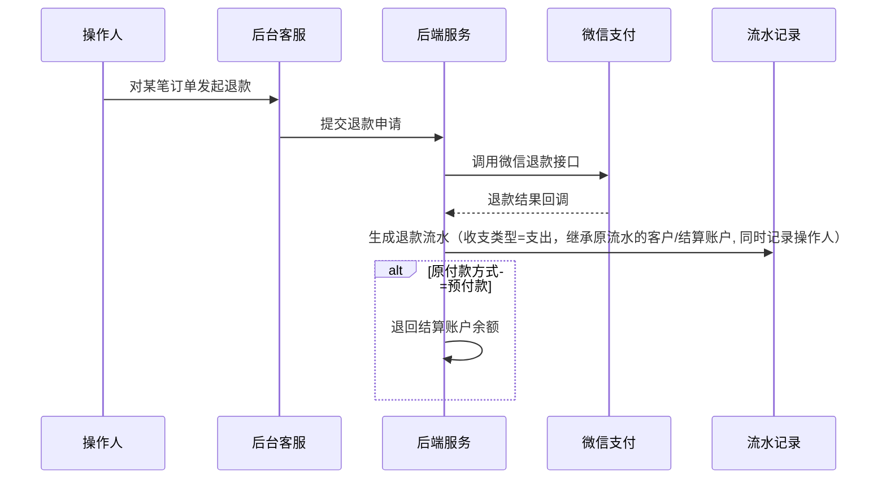

# 资金流水模块 SPEC

> **归属中心**：05-财务中心
> **模块**：资金流水
> **版本**：v2.0
> **更新日期**：2026-07-02

------

## 1. 背景与目标 (Background & Objectives)

**背景**：平台交易产生资金流水，涉及微信支付、预付款余额、账期挂账等多种付款方式。操作人下单必须选择客户门店，支付时可用微信支付，也可用该门店绑定的结算账户预付款代付。财务需要按客户、按结算账户、按操作人等多维度查询和核对流水。

**目标**：建设统一的资金流水查询平台，支持"客户门店 → 结算账户 → 操作人"三层实体的流水记录与多维度查询，对接微信支付等第三方渠道，支撑日终对账与财务审计。

------

## 2. 角色与使用场景 (Roles & Scenarios)

| 角色 | 说明 |
| --- | --- |
| 财务管理员 | 查询所有资金流水，多维度对账，导出报表 |
| 商户运营 | 查看本商户范围内的资金流水 |
| 系统 | 自动接收第三方支付回调，生成流水记录 |

**使用场景**：
- 作为财务管理员，我按客户门店（如万科公司）查看其下所有流水，不管谁下单、哪种方式支付。
- 作为财务管理员，我按结算账户（如王博A）查看预付款余额被哪些操作人、哪些门店消费使用。
- 作为财务管理员，我通过"第三方流水号"核对微信支付平台的对账数据。
- 作为财务管理员，我点击汇总卡片的"详细"链接下钻到对应收支类型的明细列表。
- 作为系统，接收到微信支付回调后自动生成流水记录。

------

## 3. 核心业务流程 (Core Business Flow)

### 3.1 支付流水生成流程



### 3.2 退款流水生成流程



### 3.3 状态流转

| 状态 | 说明 | 触发条件 |
| --- | --- | --- |
| 处理中 | 支付/退款已提交，等待第三方回调 | 交易发起 |
| 成功 | 第三方回调确认成功 | 第三方回调 |
| 失败 | 支付/退款失败 | 第三方回调失败或超时 |

### 3.4 异常流与逆向流

| 异常场景 | 处理方式 |
| --- | --- |
| 结算账户余额不足 | 提示"余额不足"，阻止提交 |
| 结算账户已冻结 | 提示"该账户已被冻结，无法使用"，阻止提交 |
| 微信回调失败 | 状态标记"失败"，流水不记录余额变动 |
| 微信重复回调 | 幂等处理，同一回调不重复生成流水 |

------

## 4. 界面与交互说明 (UI & Interaction)

### 4.1 资金流水列表页

**界面布局**：

```
┌──────────────────────────────────────────────────────────────────────────┐
│  微信商户号：[请选择 ▼]  收支类型：○全部 ○收入 ○支出                          │
│  查询时间：[?] [2026-06-03 00:00:00 ~ 2026-07-02 23:59:59]               │
│           今日  昨日  7日  [30日]                                          │
│  客户信息：[客户名称/编码__________]  结算账户：[账户名称/编号__________]    │
│  付款方式：[全部 ▼]  账务类型：[全部 ▼]                                    │
│  第三方流水号：[______________]  业务单号：[______________]                │
│  流水号：[______________]  订单号：[______________]                        │
│  操作人：[操作人姓名/手机__________]                                       │
│  [重置] [查询]                                                  [收起^]   │
├──────────────────────────────────────────────────────────────────────────┤
│  ┌──────────────────────┐  ┌──────────────────────┐                      │
│  │  收入                 │  │  支出                 │                      │
│  │  +360,000.00 元      │  │  -360,000.00 元      │                      │
│  │  61笔  [详细]         │  │  61笔  [详细]         │                      │
│  └──────────────────────┘  └──────────────────────┘                      │
├──────────────────────────────────────────────────────────────────────────┤
│  [导出] [打印] [列设置]                                                    │
├──────────────────────────────────────────────────────────────────────────┤
│  ☐│入账时间↓│流水号│账务类型│付款方式│客户│结算账户│操作人│收支金额│余额│业务单号│订单号│第三方流水号│备注│
│  ☐│06-20.. │202..│下单   │微信    │万科公司│ -       │张三    │-500.00│ -  │SL001  │ORD01│WX2026..   │    │
│  ☐│06-20.. │202..│下单   │预付款  │万科公司│王博A    │张三    │-500.00│3500│SL002  │ORD02│ -         │代付│
│  ☐│06-19.. │202..│充值   │微信    │ -      │王博A    │财务李  │+5000.0│5000│CZ001  │ -   │WX2026..   │    │
│  ──────────────────────────────────────────────────────────────────────── │
│  [分页器：共 122 条，每页 20 条]                                            │
└──────────────────────────────────────────────────────────────────────────┘
```

**搜索筛选区**（11 个筛选项）：

| 筛选项 | 控件类型 | 说明 |
| --- | --- | --- |
| 微信商户号 | 下拉选择 | 多商户隔离 |
| 收支类型 | 单选按钮 | 全部 / 收入 / 支出 |
| 查询时间 | 日期范围 + 快捷选项 | 默认近30天；今日/昨日/7日/30日 |
| 客户信息 | 文本输入 | 按客户公司名称/编码模糊搜索 |
| 结算账户 | 文本输入 | 按结算账户名称/编号搜索 |
| 付款方式 | 下拉选择 | 全部 / 微信 / 预付款 / 账期 |
| 账务类型 | 下拉选择 | 全部 / 充值 / 转账 / 退款 / 提现 / 下单 |
| 第三方流水号 | 文本输入 | 微信/支付宝平台流水号，用于对账 |
| 业务单号 | 文本输入 | 关联业务单据编号 |
| 流水号 | 文本输入 | 系统内部流水号 |
| 操作人 | 文本输入 | 操作人姓名/手机号 |

**汇总数据区**：
- 收入卡片：总收入金额（绿色，前缀 `+`）、收入笔数、[详细] 下钻链接
- 支出卡片：总支出金额（红色，前缀 `-`）、支出笔数、[详细] 下钻链接
- 点击 [详细] 自动切换收支类型筛选并刷新列表

**列表区**（14 列）：

| 列名 | 说明 |
| --- | --- |
| ☐ 选择框 | 批量导出或打印 |
| 入账时间 | 支持排序，YYYY-MM-DD HH:mm:ss |
| 流水号 | 系统唯一流水号 |
| 账务类型 | 充值 / 转账 / 退款 / 提现 / 下单 |
| 付款方式 | 微信 / 预付款 / 账期 |
| 客户 | 下单门店/公司名称（编号+名称冗余存储） |
| 结算账户 | 资金归属账户名称（编号+名称冗余存储，微信支付为空） |
| 操作人 | 执行操作的用户姓名（编号+名称冗余存储） |
| 收支金额 | 收入 +绿 / 支出 -红 |
| 账户余额 | 结算账户交易后余额（微信支付为空） |
| 业务单号 | 关联业务单据 |
| 订单号 | 关联销售订单 |
| 第三方流水号 | 微信 `transaction_id` 等，对账关键字段 |
| 备注 | 附加说明 |

**交互动作**：
- 快捷日期切换自动更新起止时间
- 汇总卡片 [详细] 联动筛选收支类型
- 入账时间列头点击排序
- 收起^ 折叠筛选项行

**极限状态**：
- 空数据：居中"暂无流水记录"
- 加载中：表格骨架屏
- 导出中：按钮 loading

------

## 5. 数据字典与字段级规则 (Data & Field Rules)

### 5.1 资金流水表

| 字段名称 | 字段类型 | 来源/依赖 | 默认值 | 读写权限 | 校验规则与约束 | 说明 |
| --- | --- | --- | --- | --- | --- | --- |
| 流水ID | UUID | 系统生成 | - | 只读 | 唯一主键 | - |
| 流水号 | 文本(32) | 系统生成 | - | 只读 | 唯一，格式 YYYYMMDD+序号 | - |
| 入账时间 | 日期时间 | 系统生成 | 当前时间 | 只读 | 索引字段 | 默认排序依据 |
| 客户编号 | UUID | 订单关联 | 空 | 只读 | 外键，关联客户资料表 | 下单必填（所选门店），充值/提现为空 |
| 客户名称 | 文本(100) | 订单关联 | 空 | 只读 | 写入时冗余存储 | 下单时记录，后续改名不影响流水记录 |
| 结算账户编号 | UUID | 订单关联 | 空 | 只读 | 外键，关联结算账户表 | 资金实际归属，微信支付时为空 |
| 结算账户名称 | 文本(100) | 订单关联 | 空 | 只读 | 写入时冗余存储 | 下单/充值/提现时记录账户名称 |
| 操作人编号 | UUID | 操作关联 | 空 | 只读 | 外键，关联用户表 | 执行操作的用户 |
| 操作人名称 | 文本(50) | 操作关联 | 空 | 只读 | 写入时冗余存储 | 下单时=小程序用户，充值/提现时=财务人员 |
| 收支类型 | 枚举 | 系统判定 | - | 只读 | 收入 / 支出 | - |
| 账务类型 | 枚举 | 系统判定 | - | 只读 | 充值 / 转账 / 退款 / 提现 / 下单 / 收款 | - |
| 付款方式 | 枚举 | 客户选择 | - | 只读 | 微信 / 预付款 / 账期 / 银行卡 | 支持扩展银行卡等 |
| 收支金额 | 金额(10,2) | 系统计算 | - | 只读 | 收入为正、支出为负 | 单位：元 |
| 账户余额 | 金额(10,2) | 系统计算 | 空 | 只读 | 结算账户交易后余额，微信支付为空 | 单位：元 |
| 业务单号 | 文本(50) | 关联业务 | 空 | 只读 | 关联提现/充值/销售订单/退款单 | - |
| 订单号 | 文本(50) | 关联订单 | 空 | 只读 | 仅由订单产生的流水记录，例如下单，订单退款，订单收款等产生流水则记录 | - |
| 微信商户号 | 文本(20) | 微信回调 | 空 | 只读 | 仅微信支付时有值 | 不同订单收款商户号可能不同 |
| 第三方流水号 | 文本(64) | 第三方回调 | 空 | 只读 | 微信 `transaction_id` / 支付宝 `trade_no` | 对账关键字段 |
| 交易状态 | 枚举 | 系统/第三方 | 处理中 | 只读 | 处理中 / 成功 / 失败 | - |
| 业务描述 | 文本(200) | 系统生成 | 空 | 只读 | 交易摘要 | - |
| 备注 | 文本(500) | 系统/人工 | 空 | 只读 | 选填 | - |

### 5.2 三层实体支付场景对照

| 场景 | 客户(编号+名称) | 结算账户(编号+名称) | 操作人(编号+名称) | 付款方式 | 余额扣减 | 说明 |
| --- | --- | --- | --- | --- | --- | --- |
| 张三代万科微信付 | 万科 / 万科公司 | 空 | 张三 / 张三 | 微信 | 无 | 下单 |
| 张三代万科用王博A预付付 | 万科 / 万科公司 | 王博A / 王博A | 张三 / 张三 | 预付款 | 王博A - | 下单代付 |
| 财务给王博A充值 | 空 | 王博A / 王博A | 财务李 / 李财务 | 微信 | 王博A + | 充值 |
| 王博A提现 | 空 | 王博A / 王博A | 财务李 / 李财务 | 银行卡 | 王博A - | 提现 |

**规则**：编号+名称冗余存储，写入时记录当时名称，后续实体改名不影响流水历史可追溯。

### 5.3 展示逻辑

- 收入金额：绿色，前缀 `+`
- 支出金额：红色，前缀 `-`
- 交易状态：成功(绿) / 失败(红) / 处理中(橙)
- 账户余额：保留两位小数，微信支付时显示 `-`
- 日期：`YYYY-MM-DD HH:mm:ss`
- 金额：千分位逗号分隔

### 5.4 编辑逻辑

- 流水记录只读，不可编辑和删除
- 退款通过退款流程生成冲正流水（支出方向），继承原流水的客户/结算账户/操作人
- 第三方流水号由回调自动写入，不可人工修改

------

## 6. 系统交互与边界 (System Integrations & Boundaries)

### 6.1 前置依赖

| 依赖项 | 说明 |
| --- | --- |
| 客户资料模块 | 客户编号来源，下单门店/公司 |
| 结算账户模块 | 结算账户编号来源，预付款余额管理 |
| 小程序用户模块 | 操作人编号来源 |
| 微信支付 | 统一下单、支付回调、退款接口 |
| 订单模块 | 订单号、业务单号关联 |

### 6.2 第三方支付对接

| 支付渠道 | 对接方式 | 第三方流水号来源 |
| --- | --- | --- |
| 微信支付 | API V3 统一下单 + 回调通知 | `transaction_id` |
| 支付宝 | 预下单 + 异步通知 | `trade_no` |
| 银行卡 | 银企直连 | 银行流水号 |

所有第三方回调需验签、幂等处理，并自动写入第三方流水号。

### 6.3 外部接口

| 接口 | 调用方 | 说明 |
| --- | --- | --- |
| 资金流水列表 | 后台 | GET `/api/finance/flow/list` |
| 流水汇总统计 | 后台 | GET `/api/finance/flow/summary` |
| 微信支付回调 | 微信 | POST `/api/callback/wechat/pay` |
| 退款回调 | 微信 | POST `/api/callback/wechat/refund` |
| 导出流水 | 后台 | GET `/api/finance/flow/export` |

------

## 7. 非功能性需求 (Non-Functional Requirements)

### 7.1 性能要求

| 指标 | 要求 |
| --- | --- |
| 流水列表查询 | < 1s（分页20条，含筛选） |
| 汇总统计 | < 500ms |
| 微信回调处理 | < 2s（含验签+入库） |
| 导出 | 异步处理，大数据量分批 |

### 7.2 权限与安全

| 层级 | 说明 |
| --- | --- |
| 操作权限 | 查看流水限财务管理员及商户运营；导出限财务管理员 |
| 数据权限 | 多商户按商户号隔离；管理员可跨商户查看 |
| 回调安全 | 微信/支付宝回调验签，防止伪造；幂等防重复 |

------

## 8. 小程序客户端 — 账单明细

### 8.1 页面布局

```
┌─────────────────────────────────┐
│  ← 账单明细                      │
├─────────────────────────────────┤
│  2026年08月08日 ▼    支出  收入   │
│  支出 ¥175.0   收入 ¥200.0      │
├─────────────────────────────────┤
│  ┌ 2026年08月08日 ────────────┐ │
│  │ 支出 ¥175.0   收入 ¥200.0 │ │
│  ├────────────────────────────┤ │
│  │ ┌──────────────────────┐   │ │
│  │ │ [ico] 交易订单-微信支付│   │ │
│  │ │       230232323       │   │ │
│  │ │       23:23:45  -175.00│  │ │
│  │ └──────────────────────┘   │ │
│  │ ┌──────────────────────┐   │ │
│  │ │ [ico] 预付款充值-充值  │   │ │
│  │ │       230232323       │   │ │
│  │ │       23:23:45  +200.00│  │ │
│  │ └──────────────────────┘   │ │
│  └────────────────────────────┘ │
│  ┌ 2026年08月08日 ────────────┐ │
│  │ 支出 ¥175.0   收入 ¥0.0   │ │
│  ├────────────────────────────┤ │
│  │ ┌──────────────────────┐   │ │
│  │ │ [ico] 交易订单-预付款支付│   │ │
│  │ │       230232323       │   │ │
│  │ │       23:23:45  -100.00│  │ │
│  │ └──────────────────────┘   │ │
│  │ ┌──────────────────────┐   │ │
│  │ │ [ico] 交易订单-订单退款│   │ │
│  │ │       230232323       │   │ │
│  │ │       22:15:30   +75.00│  │ │
│  │ └──────────────────────┘   │ │
│  └────────────────────────────┘ │
└─────────────────────────────────┘
```

### 8.2 区域说明

**顶部导航栏**：标题"账单明细"，左侧返回箭头。

**日期与筛选区**：

| 元素 | 组件类型 | 说明 |
| --- | --- | --- |
| 日期选择 | 日期选择器 | 展示当前选中日期（YYYY年MM月DD日），点击弹出日期选择弹窗 |
| 支出按钮 | 胶囊按钮 | 点击筛选仅展示支出流水，默认不筛选 |
| 收入按钮 | 胶囊按钮 | 点击筛选仅展示收入流水，默认不筛选 |
| 汇总行 | 文本 | 展示当日支出总额（黑色）和收入总额（红色） |

**列表区**：按日期分组，每组包含分组头（日期+当日汇总）和明细卡片。

### 8.3 明细卡片字段

| 字段 | 说明 |
| --- | --- |
| 交易图标 | 根据业务类型展示对应图标（充值/提现/下单/退款等） |
| 交易名称 | 格式 `业务大类-业务小类`，如"交易订单-微信支付"、"交易订单-预付款支付"、"预付款充值-充值" |
| 单号 | 关联的订单号或流水号 |
| 时间 | 具体交易时间，格式 HH:mm:ss |
| 金额 | 支出：黑色 `-X.XX`；收入：红色 `+X.XX` |

### 8.4 交互逻辑

- 日期切换：点击日期选择器，后端重新查询该日数据，刷新列表与汇总
- 收支筛选：点击胶囊按钮前端本地过滤；再次点击取消筛选恢复全部
- 卡片点击：跳转该笔交易详情页

### 8.5 展示逻辑

- 收入金额：红色，前缀 `+`，如 `+200.00`
- 支出金额：黑色，前缀 `-`，如 `-175.00`
- 日期格式：`YYYY年MM月DD日`，时间格式：`HH:mm:ss`
- 汇总金额保留 1 位小数，明细金额保留 2 位

### 8.6 外部接口

| 接口 | 说明 |
| --- | --- |
| 流水明细列表 | GET `/api/mall/flow/detail?date=2026-08-08` |
| 流水详情 | GET `/api/mall/flow/detail/{id}` |

### 8.7 权限

- 客户登录后可查看自己的流水
- 仅展示当前登录客户的流水数据
