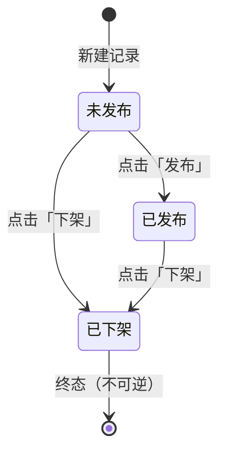
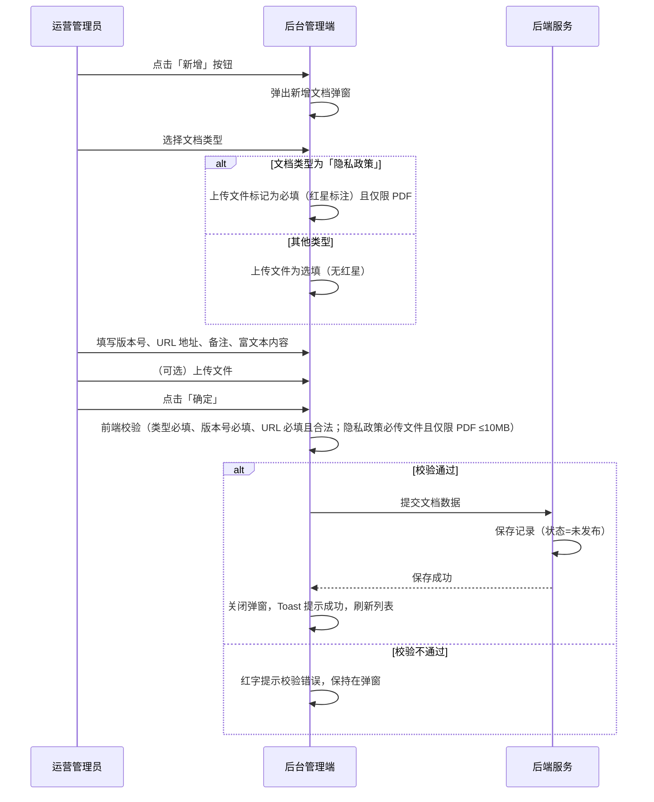
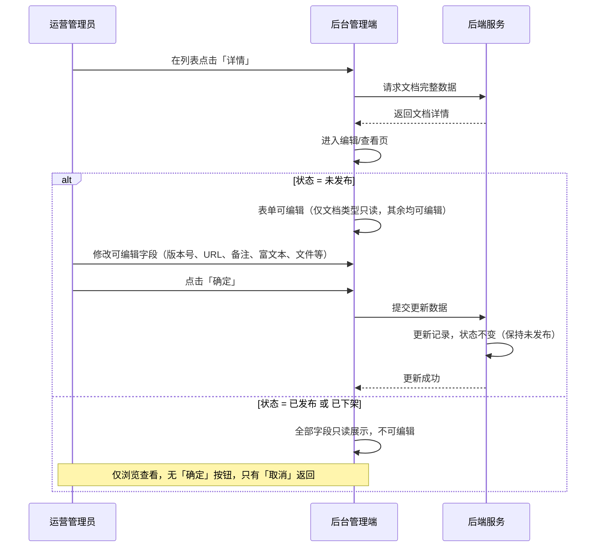

# 小程序隐私政策管理 SPEC

> **归属中心**：06-基础管理中心
> **模块**：小程序隐私政策管理
> **终端**：后台管理端
> **版本**：v1.0
> **更新日期**：2026-07-08
>
> - **后台端**：本文档，运营管理员维护小程序隐私法律文档（创建、编辑、发布、下架），以及查看用户授权记录。
> - **小程序端**：B 端客户在「我的 → 设置」中查看已发布的隐私政策等法律文档，详见 [隐私政策-小程序.md](./隐私政策-小程序.md)。

------

## 1. 背景与目标 (Background & Objectives)

**背景**：小程序平台需要向用户公示隐私政策、用户协议等法律合规文档，同时记录用户的授权行为以满足合规审计要求。运营管理员需要一套后台工具维护这些文档的全生命周期（创建 → 发布 → 下架），并查看用户授权记录。

**目标**：提供后台管理能力，支撑以下两大职能：
1. **小程序隐私文档维护**：管理 6 种法律文档类型的创建、编辑、发布与下架，其中「隐私政策」支持多版本并存及 PDF 文件管理。
2. **用户授权记录**：记录并查询小程序端用户对各种隐私文档的授权历史，支持按条件筛选和导出。

------

## 2. 角色与使用场景 (Roles & Scenarios)

| 角色 | 说明 |
| --- | --- |
| 运营管理员 | 全局管理小程序隐私文档，负责文档的创建、编辑、发布、下架，查看用户授权记录 |

**使用场景**：

- 作为运营管理员，我可以在「小程序隐私文档维护」页签下创建新的法律文档（隐私政策、用户协议等 6 种类型），填写版本号、H5 链接、富文本内容等，并提交保存。
- 作为运营管理员，我可以编辑「未发布」状态的文档内容（文档类型不可修改，其余均可修改）。
- 作为运营管理员，我可以在列表中对「未发布」的文档点击「发布」使其在小程序端可见，对「已发布」的文档点击「下架」使其在小程序端不可见。
- 作为运营管理员，我可以为任意文档类型上传文件（隐私政策类型时必填、其余类型选填），在已发布状态下可下载该文件。
- 作为运营管理员，我可以通过文档类型下拉和版本号输入框筛选文档列表。
- 作为运营管理员，我可以切换到「用户授权记录」页签，按 openid、手机号、授权类型筛选用户的授权历史，并导出记录。

------

## 3. 核心业务流程 (Core Business Flow)

### 3.1 整体页面结构

本模块为一个页面，顶部提供两个 Tab 页签切换：

| 页签 | 功能 |
| --- | --- |
| 小程序隐私文档维护 | 文档的列表查询、新增、编辑、发布、下架、下载 |
| 用户授权记录 | 授权记录的列表查询与导出 |

### 3.2 文档状态流转模型

#### 3.2.1 统一三态流转（全部 6 种文档类型适用）



**关键规则**：

| 规则 | 说明 |
| --- | --- |
| 新建默认状态 | 「未发布」，前台不可见 |
| 发布 | 未发布 → 已发布，前台可见 |
| 下架 | 未发布或已发布 → 已下架，前台不可见 |
| 终态 | 「已下架」为终态，不可再发布 |
| 编辑权限 | 仅「未发布」状态的文档可编辑；已发布和已下架状态的文档仅可只读查看，不可编辑 |
| 状态不回退 | 编辑保存不会改变文档状态，仍保持「未发布」 |

#### 3.2.2 操作按钮显隐规则

| 状态 | 复制地址 | 详情 | 发布 | 下架 | 下载文件 |
| --- | --- | --- | --- | --- | --- |
| 未发布 | ✅ | ✅ | ✅ | ✅ | ❌ |
| 已发布 | ✅ | ✅ | ❌ | ✅ | ✅（仅隐私政策 + 已上传文件） |
| 已下架 | ✅ | ✅ | ❌ | ❌ | ❌ |

> **注意**：「下载文件」按钮仅在**已发布**状态下显示，且仅对「隐私政策」类型且已上传了文件的记录显示。

#### 3.2.3 差异化规则：隐私政策 vs 其他 5 种类型

| 特性 | 隐私政策 | 其他 5 种类型 |
| --- | --- | --- |
| 版本管理 | 多版本并存（客户可切换查看历代版本） | 单版本管理 |
| 上传文件 | **必填**，仅限 PDF，≤10MB | 选填（有上传功能但不强制） |
| 下载文件 | 已发布状态显示「下载文件」按钮 | 已发布状态显示「下载文件」按钮（若已上传文件） |
| 文档类型 | 隐私政策 | 隐私政策摘要、用户管理规则及公约、个人信息收集清单、第三方共享个人信息清单、用户协议 |

### 3.3 新增文档流程



### 3.4 编辑文档流程



### 3.5 异常流与逆向流

| 异常场景 | 触发条件 | 系统处理方式 |
| --- | --- | --- |
| 表单校验不通过 | 必填字段为空或格式不合法 | 对应字段下方红字提示，阻止提交 |
| 文件类型错误 | 隐私政策上传非 PDF 文件 | Toast 提示「仅支持 PDF 格式」 |
| 文件过大 | 上传文件超过 10MB | Toast 提示「文件大小不能超过 10MB」 |
| URL 格式不合法 | 输入的 URL 不是 http/https 协议 | 字段下方红字提示「请输入合法的 http/https 链接」 |
| 网络请求失败 | 保存/发布/下架请求超时或失败 | Toast 提示「操作失败，请重试」 |
| 重复发布 | 对已发布文档再次点击发布（并发场景） | 后端幂等处理，返回成功 |
| 对已下架文档操作 | 尝试对终态文档点击发布/下架 | 按钮不显示，后端接口也需校验拒绝 |

------

## 4. 界面与交互说明 (UI & Interaction)

### 4.1 页签切换

```
┌──────────────────────────────────────────────────────────────────┐
│  ┌─────────────────────┐  ┌─────────────────────┐               │
│  │ 小程序隐私文档维护    │  │ 用户授权记录         │               │
│  └─────────────────────┘  └─────────────────────┘               │
├──────────────────────────────────────────────────────────────────┤
│  （当前页签内容区域）                                              │
└──────────────────────────────────────────────────────────────────┘
```

**交互**：点击页签切换显示对应内容，页签之间有选中态高亮样式区分。页签上方不显示额外的页面标题，页签本身即为导航。

---

### 4.2 页签一：小程序隐私文档维护

#### 4.2.1 整体布局

```
┌──────────────────────────────────────────────────────────────────┐
│  搜索区                                                          │
│  文档类型：[全部 ▼]    版本号：[________]    [查询]  [新增]  [导出]   │
├──────────────────────────────────────────────────────────────────┤
│  数据表格（11列）                                      共 X 条记录 │
│  ┌──┬────┬──────┬────┬───┬──┬────┬──────┬──────┬──────┬──────┐ │
│  │序│状态│文档  │H5  │版 │备│创建│创建  │最后  │最后  │操作  │ │
│  │号│    │类型  │地址│本 │注│人  │时间  │更新人│更新  │      │ │
│  │  │    │      │    │号 │  │    │      │      │时间  │      │ │
│  ├──┼────┼──────┼────┼──┼─┼───┼──────┼──────┼──────┼──────┤ │
│  │1 │已  │隐私  │http│v2│ -│张三│07-01 │张三  │07-05 │复制  │ │
│  │  │发布│政策  │s://│.0│  │    │10:00 │      │14:20 │地址  │ │
│  │  │    │      │... │  │  │    │      │      │      │详情  │ │
│  │  │    │      │    │  │  │    │      │      │      │下架  │ │
│  │  │    │      │    │  │  │    │      │      │      │下载  │ │
│  │  │    │      │    │  │  │    │      │      │      │文件  │ │
│  ├──┼────┼──────┼────┼──┼─┼───┼──────┼──────┼──────┼──────┤ │
│  │2 │未  │用户  │http│v1│ -│李四│07-02 │李四  │07-03 │复制  │ │
│  │  │发布│协议  │s://│.0│  │    │09:00 │      │10:00 │地址  │ │
│  │  │    │      │... │  │  │    │      │      │      │详情  │ │
│  │  │    │      │    │  │  │    │      │      │      │发布  │ │
│  └──┴────┴──────┴────┴──┴─┴───┴──────┴──────┴──────┴──────┘ │
│                                                    [分页组件]     │
└──────────────────────────────────────────────────────────────────┘
```

#### 4.2.2 搜索区

| 字段名 | 组件类型 | 默认值 | 说明 |
| --- | --- | --- | --- |
| 文档类型 | 下拉单选 | `全部` | 选项：全部、隐私政策、隐私政策摘要、用户管理规则及公约、个人信息收集清单、第三方共享个人信息清单、用户协议 |
| 版本号 | 文本输入框 | 空 | 模糊匹配 |
| 查询 | 按钮 | - | 触发列表重新加载 |
| 新增 | 按钮 | - | 弹出新增文档弹窗（位于搜索区右侧） |
| 导出 | 按钮 | - | 位于「新增」按钮右侧，根据当前筛选条件导出全量文档数据为 Excel |

**交互**：
- 点击「查询」：携带当前筛选条件请求列表数据，分页重置为第 1 页。
- 点击「新增」：弹出空白新增文档弹窗。
- 点击「导出」：根据当前筛选条件，导出符合条件的全部记录为 Excel 文件（.xlsx），导出字段与表格列一致。导出时显示 loading 状态，完成后触发浏览器下载。
- 无「重置」按钮，用户手动清空筛选条件后点击「查询」即可。

#### 4.2.3 数据表格列定义

| 列序号 | 列名 | 宽度 | 说明 |
| --- | --- | --- | --- |
| 1 | 序号 | 固定 | 自动编号，从 1 递增（跨分页连续，如第 2 页首行为 21） |
| 2 | 状态 | - | 标签展示：未发布（灰）、已发布（绿）、已下架（红） |
| 3 | 文档类型 | - | 6 种类型之一 |
| 4 | H5 地址 | - | 超长截断 + 悬浮 tooltip 展示完整链接 |
| 5 | 版本号 | - | 文本展示 |
| 6 | 备注 | - | 超长截断 + 悬浮 tooltip |
| 7 | 创建人 | - | 创建者用户名 |
| 8 | 创建时间 | - | `YYYY-MM-DD HH:mm` |
| 9 | 最后更新人 | - | 最后编辑者用户名 |
| 10 | 最后更新时间 | - | `YYYY-MM-DD HH:mm` |
| 11 | 操作 | 固定 | 动态按钮组（见 3.2.2 按钮显隐规则） |

#### 4.2.4 操作按钮交互

| 按钮 | 触发条件 | 交互行为 |
| --- | --- | --- |
| 复制地址 | 所有状态 | 将 H5 地址复制到剪贴板，Toast 提示「复制成功」 |
| 详情 | 所有状态 | 跳转至编辑/查看页。未发布→可编辑（文档类型只读）；已发布/已下架→全部只读 |
| 发布 | 仅「未发布」状态 | 二次确认弹窗：「确认发布该文档？发布后小程序端可见。」→ 确认后状态变更为「已发布」，刷新列表 |
| 下架 | 「未发布」或「已发布」状态 | 二次确认弹窗：「确认下架该文档？下架后小程序端不可见，且不可再次发布。」→ 确认后状态变更为「已下架」，刷新列表 |
| 下载文件 | 仅「已发布」状态 + 已上传文件 | 触发浏览器下载文件到本地 |

#### 4.2.5 分页

- 每页 20 条记录。
- 默认按创建时间倒序排列（最新创建的在前）。
- 分页组件包含：总条数、上一页、页码列表、下一页、跳转至第 N 页。

---

#### 4.2.6 新增弹窗

```
┌──────────────────────────────────────────────────────────┐
│  新增文档                                          [✕]   │
├──────────────────────────────────────────────────────────┤
│                                                          │
│  文档类型：[请选择 ▼]  *必填                               │
│                                                          │
│  ┌────────────────────┬──────────────────────────────┐   │
│  │ 版本号：[________]  │ 上传文件：[选择文件] 仅限PDF  │   │
│  └────────────────────┴──────────────────────────────┘   │
│                                                          │
│  URL 地址：[________________________________]  *必填      │
│                                                          │
│  备注：[________________________________]                 │
│  （选填，最多 200 字）                                     │
│                                                          │
│  ┌──────────────────────────────────────────────────┐   │
│  │  富文本编辑区                                     │   │
│  │  ┌──────────────────────────────────────────┐    │   │
│  │  │ [B] [I] [U] [H1] [H2] [H3] [≡] [1.]     │    │   │
│  │  │ [•] [链接] [图片] [引用] [清除格式]        │    │   │
│  │  ├──────────────────────────────────────────┤    │   │
│  │  │                                          │    │   │
│  │  │  （富文本编辑内容区域）                     │    │   │
│  │  │                                          │    │   │
│  │  │                                          │    │   │
│  │  └──────────────────────────────────────────┘    │   │
│  └──────────────────────────────────────────────────┘   │
│                                                          │
├──────────────────────────────────────────────────────────┤
│                              [取消]          [确定]       │
└──────────────────────────────────────────────────────────┘
```

**新增弹窗字段明细**：

| 字段名 | 组件类型 | 必填 | 占位提示/默认值 | 校验规则 |
| --- | --- | --- | --- | --- |
| 文档类型 | 下拉单选 | 是 | `请选择` | 6 种类型之一，新增时可选择，**编辑时禁用修改** |
| 版本号 | 文本输入框 | 是 | `请输入版本号` | 必填。与上传文件并列在同一行 |
| 上传文件 | 文件上传 | 条件必填 | `选择文件` | **始终显示**。文档类型=隐私政策时标记红星必填，仅限 `.pdf`，≤10MB。其他类型时无红星为选填。UI 上在控件旁标注「仅限 PDF 格式」。与版本号并列在同一行 |
| URL 地址 | 文本输入框 | 是 | `请输入 URL 地址` | 合法 http/https 链接，独占一行 |
| 备注 | 多行文本域 | 否 | `请输入备注` | 最多 200 字，独占一行 |
| 富文本内容 | 富文本编辑器 | 是 | - | 支持加粗、斜体、下划线、标题（H1-H3）、有序/无序列表、链接、图片、引用、清除格式等，宽高尽量撑满弹窗 |

**弹窗底部按钮**：
- **取消**：关闭弹窗，不保存任何内容。
- **确定**：校验表单并提交保存，成功后关闭弹窗并刷新列表。

**富文本编辑器要求**：
- 提供类似 Word 的编辑工具栏，至少包含：**加粗**、*斜体*、<u>下划线</u>、标题（H1/H2/H3）、有序列表、无序列表、插入链接、插入图片、引用块、清除格式。
- 编辑区域为方形框，宽度略小于弹窗宽度，高度尽量最大化，让用户可在上面直接编辑内容。
- 工具栏固定在编辑区域顶部，内容区域可滚动。

#### 4.2.7 编辑/查看页

**未发布状态 — 可编辑模式**：

与新增弹窗布局一致，但：
- **文档类型**：下拉禁用（灰色只读），不可修改。
- **版本号、URL 地址、备注、富文本内容、上传文件**：均可编辑。
- 底部显示「取消」「确定」按钮。
- 点击「确定」保存后状态不变，仍保持「未发布」。

**已发布 / 已下架状态 — 只读模式**：

- 所有字段以只读形式展示（文本展示或禁用控件）。
- 富文本内容以渲染后的 HTML 只读展示。
- 底部仅显示「取消」按钮（用于返回列表）。
- 不提供任何编辑能力，不可修改任何字段。

#### 4.2.8 极限状态

| 状态 | 处理方式 |
| --- | --- |
| 列表无数据 | 展示空状态插图 + 「暂无文档数据」文案 |
| 列表加载中 | 展示骨架屏或 loading 动画 |
| 数据量大 | 分页展示，每页 20 条 |
| 筛选无结果 | 展示「未找到匹配的文档」提示 |

---

### 4.3 页签二：用户授权记录

#### 4.3.1 整体布局

```
┌──────────────────────────────────────────────────────────────────┐
│  搜索区                                                          │
│  openid：[请输入____]  手机号：[请输入____]  类型：[全部 ▼]  [查询] [导出] │
├──────────────────────────────────────────────────────────────────┤
│  数据表格                                         每页20条 共X条  │
│  ┌──────┬──────────┬──────────┬──────────┬──────────────┐       │
│  │openid│ 手机号码  │   类型   │   版本   │   授权时间    │       │
│  ├──────┼──────────┼──────────┼──────────┼──────────────┤       │
│  │oABC..│138****.. │ 隐私政策  │  v2.0    │2026-07-01..  │       │
│  ├──────┼──────────┼──────────┼──────────┼──────────────┤       │
│  │oXYZ..│139****.. │ 用户协议  │  v1.0    │2026-07-02..  │       │
│  └──────┴──────────┴──────────┴──────────┴──────────────┘       │
│                                                    [分页组件]     │
└──────────────────────────────────────────────────────────────────┘
```

#### 4.3.2 搜索区

| 字段名 | 组件类型 | 默认值 | 说明 |
| --- | --- | --- | --- |
| openid | 文本输入框 | 空（placeholder: `请输入`） | 精确匹配用户的微信 openid |
| 手机号 | 文本输入框 | 空（placeholder: `请输入`） | 精确匹配手机号码 |
| 类型 | 下拉单选 | `全部` | 选项：全部、相机、相册、隐私政策、隐私政策摘要、用户管理规则与公约、用户协议、个人信息下载 |
| 查询 | 按钮 | - | 触发列表重新加载 |
| 导出 | 按钮 | - | 位于「查询」按钮右侧，根据当前筛选条件导出全量记录 |

#### 4.3.3 数据表格列定义

| 列名 | 说明 |
| --- | --- |
| openid | 用户的微信 openid |
| 手机号码 | 用户手机号，中间四位脱敏展示 |
| 类型 | 授权类型（相机/相册/隐私政策/隐私政策摘要/用户管理规则与公约/用户协议/个人信息下载） |
| 版本 | 授权时对应文档的版本号 |
| 授权时间 | 用户授权操作的时间，格式 `YYYY-MM-DD HH:mm:ss` |

#### 4.3.4 导出功能

- 「导出」按钮位于「查询」按钮右侧，与其他筛选条件在同一行。
- 点击「导出」：根据当前筛选条件，导出符合条件的全部记录为 Excel 文件（.xlsx）。
- 导出字段：openid、手机号码、类型、版本、授权时间。
- 导出时显示 loading 状态，完成后触发浏览器下载。
- 若筛选结果为空，提示「当前筛选条件下无数据可导出」。

#### 4.3.5 极限状态

| 状态 | 处理方式 |
| --- | --- |
| 列表无数据 | 展示空状态插图 + 「暂无授权记录」文案 |
| 数据量大 | 分页展示，每页 20 条；导出不受分页限制，导出全量 |
| 导出数据量大 | 导出过程展示 loading，支持大量数据导出（建议后端异步处理或流式导出） |

------

## 5. 数据字典与字段级规则 (Data & Field Rules)

### 5.1 文档主表字段

| 字段名称 | 字段类型 | 来源/依赖 | 默认值 | 读写权限 | 校验规则与约束 | 说明 |
| :--- | :--- | :--- | :--- | :--- | :--- | :--- |
| 文档ID | String(UUID) | 系统生成 | - | 只读 | 主键 | 唯一标识 |
| 文档类型 | Enum(String) | 新增/编辑时选择 | - | 新增时可编辑，编辑时只读 | 必填，枚举：隐私政策、隐私政策摘要、用户管理规则及公约、个人信息收集清单、第三方共享个人信息清单、用户协议 | 编辑时不可修改 |
| 版本号 | String | 新增/编辑时输入 | - | 可编辑（仅未发布状态） | 必填 | 未发布状态下可修改 |
| H5地址 | String | 新增/编辑时输入 | - | 可编辑（仅未发布状态） | 必填，须为合法 http/https URL | URL 格式校验 |
| 上传文件 | File | 上传 | - | 可编辑（仅未发布状态） | 隐私政策时必填（红星标注），其他类型选填；仅限 .pdf，≤10MB | 始终显示上传控件 |
| 备注 | String(200) | 新增/编辑时输入 | - | 可编辑（仅未发布状态） | 选填，最多 200 字 | 多行文本域 |
| 富文本内容 | LONGTEXT | 新增/编辑时输入 | - | 可编辑（仅未发布状态） | 必填 | 存储 HTML 格式内容 |
| 状态 | Enum(String) | 系统控制 | 未发布 | 通过操作按钮变更 | 枚举：未发布 / 已发布 / 已下架 | 编辑保存不改变状态 |
| 创建人 | String | 系统记录 | 当前登录用户 | 只读 | - | 创建者用户名 |
| 创建时间 | DateTime | 系统记录 | 当前时间 | 只读 | 格式 YYYY-MM-DD HH:mm:ss | 自动生成 |
| 最后更新人 | String | 系统记录 | 当前登录用户 | 只读 | - | 最后一次编辑者 |
| 最后更新时间 | DateTime | 系统记录 | 更新时间 | 只读 | 格式 YYYY-MM-DD HH:mm:ss | 每次编辑后更新 |

### 5.2 用户授权记录表字段

| 字段名称 | 字段类型 | 来源/依赖 | 默认值 | 读写权限 | 校验规则与约束 | 说明 |
| :--- | :--- | :--- | :--- | :--- | :--- | :--- |
| 记录ID | String(UUID) | 系统生成 | - | 只读 | 主键 | 唯一标识 |
| openid | String | 用户授权时记录 | - | 只读 | - | 微信用户 openid |
| 手机号码 | String | 用户授权时记录 | - | 只读 | 11 位手机号 | 列表展示时中间四位脱敏 |
| 类型 | Enum(String) | 用户授权时记录 | - | 只读 | 枚举：相机、相册、隐私政策、隐私政策摘要、用户管理规则与公约、用户协议、个人信息下载 | 授权类型 |
| 版本 | String | 用户授权时记录 | - | 只读 | - | 授权时对应文档的版本号 |
| 授权时间 | DateTime | 系统记录 | 当前时间 | 只读 | 格式 YYYY-MM-DD HH:mm:ss | 用户点击授权的时间 |

### 5.3 展示逻辑

| 展示项 | 格式/规则 |
| --- | --- |
| 状态标签 | 未发布（灰色标签）、已发布（绿色标签）、已下架（红色标签） |
| 日期时间 | 创建时间、最后更新时间展示为 `YYYY-MM-DD HH:mm`；授权时间展示为 `YYYY-MM-DD HH:mm:ss` |
| H5 地址 | 超长截断 + 悬浮 tooltip 展示完整链接 |
| 备注 | 超长截断 + 悬浮 tooltip 展示完整内容 |
| 手机号码 | 列表展示时中间四位脱敏（如 `138****5678`） |
| 序号 | 跨分页连续编号，第 N 页首条 = `(N-1) × 20 + 1` |
| 空状态 | 列表无数据时展示空状态插图 + 对应文案 |

### 5.4 编辑逻辑汇总

| 场景 | 文档类型 | 版本号 | URL地址 | 备注 | 富文本内容 | 上传文件 | 状态变化 |
| --- | --- | --- | --- | --- | --- | --- | --- |
| 新增 | 可选择 | 可输入 | 可输入 | 可输入 | 可编辑 | 可上传 | → 未发布 |
| 编辑（未发布） | **只读（禁用）** | 可编辑 | 可编辑 | 可编辑 | 可编辑 | 可编辑 | 不变（保持未发布） |
| 查看（已发布） | 只读 | 只读 | 只读 | 只读 | 只读 | 只读 | 不变 |
| 查看（已下架） | 只读 | 只读 | 只读 | 只读 | 只读 | 只读 | 不变 |
| 发布 | - | - | - | - | - | - | 未发布 → 已发布 |
| 下架 | - | - | - | - | - | - | 未发布/已发布 → 已下架 |

### 5.5 多版本管理规则（仅隐私政策）

| 规则 | 说明 |
| --- | --- |
| 多版本并存 | 「隐私政策」类型的多条记录可同时处于「已发布」状态，即允许多个版本同时在线 |
| 客户端切换 | 小程序端提供版本切换能力，客户可查看历代不同版本的隐私政策 |
| 其他类型 | 其他 5 种类型为单版本管理，同一类型只能有一条记录处于「已发布」状态。若某类型已有已发布记录，再次发布同类型新版本时，旧版本自动变为已下架 |
| 新建不受限 | 所有类型均可新建多条记录（处于不同状态），不受已存在记录限制 |

------

## 6. 系统交互与边界 (System Integrations & Boundaries)

### 6.1 前置依赖

| 依赖项 | 说明 |
| --- | --- |
| 用户认证与权限 | 运营管理员需登录后台系统，具备相应操作权限 |
| 文件存储服务 | PDF 文件上传需对接文件存储服务（如 OSS/S3），获取文件访问 URL |
| 小程序隐私政策模块 | 小程序端展示的文档来源于本模块发布的记录，详见 [隐私政策-小程序.md](./隐私政策-小程序.md) |

### 6.2 上下游影响

| 关联模块 | 影响说明 |
| --- | --- |
| 小程序「我的 → 设置 → 隐私政策」 | 后台发布/下架文档直接影响小程序端文档列表的可见性 |
| 小程序注册/登录页 | 《隐私政策》《用户协议》链接指向的 H5 地址由本模块配置 |
| 小程序授权弹窗 | 用户在小程序端同意隐私政策等授权时，生成授权记录写入本模块 |

### 6.3 接口定义

#### 6.3.1 文档维护接口

| 接口功能 | 方法 | 路径 | 说明 |
| --- | --- | --- | --- |
| 文档列表查询 | GET | `/api/miniapp/privacy/docs` | 支持类型、版本号筛选，分页，按创建时间倒序 |
| 文档详情 | GET | `/api/miniapp/privacy/docs/{id}` | 返回文档完整信息 |
| 新增文档 | POST | `/api/miniapp/privacy/docs` | 创建文档（含文件上传），状态=未发布 |
| 编辑文档 | PUT | `/api/miniapp/privacy/docs/{id}` | 更新文档，状态不变 |
| 发布文档 | PUT | `/api/miniapp/privacy/docs/{id}/publish` | 状态 → 已发布 |
| 下架文档 | PUT | `/api/miniapp/privacy/docs/{id}/withdraw` | 状态 → 已下架 |
| 下载文件 | GET | `/api/miniapp/privacy/docs/{id}/file` | 返回已上传的文件流 |

#### 6.3.2 用户授权记录接口

| 接口功能 | 方法 | 路径 | 说明 |
| --- | --- | --- | --- |
| 授权记录列表 | GET | `/api/miniapp/privacy/auth-records` | 支持 openid、手机号、类型筛选，分页 |
| 授权记录导出 | GET | `/api/miniapp/privacy/auth-records/export` | 根据筛选条件导出全量 Excel |

------

## 7. 非功能性需求 (Non-Functional Requirements)

### 7.1 性能要求

| 指标 | 要求 |
| --- | --- |
| 文档列表接口响应 | < 500ms |
| 文档详情接口响应 | < 300ms |
| 授权记录列表接口响应 | < 500ms |
| 授权记录导出 | 支持至少 10 万条记录导出，超 30s 建议异步处理并通知下载 |
| 文件上传 | < 5s（10MB 以内） |
| 页面首屏加载 | < 1s |

### 7.2 权限与安全

| 层级 | 说明 |
| --- | --- |
| 页面权限 | 需登录后台系统，具备「小程序隐私政策管理」菜单权限 |
| 操作权限 | 新增、编辑、发布、下架受 RBAC 按钮级权限控制 |
| 文件安全 | 文件上传服务端校验 MIME 类型和大小，仅允许 PDF |
| XSS 防护 | 富文本内容存储前需做 XSS 过滤（白名单标签），小程序端渲染前再次过滤 |
| 接口防护 | 发布/下架接口需校验状态流转合法性（已下架不可再发布，后端拒绝非法状态流转） |
| 手机号脱敏 | 授权记录列表展示时，手机号中间四位脱敏处理 |

### 7.3 业务规则

- 隐私政策允许多版本同时「已发布」，其他 5 种类型同一类型至多一条「已发布」。
- 下架为终态，不可逆。操作下架前必须二次确认。
- 编辑仅限「未发布」状态，已发布和已下架只读不可编辑。
- 编辑保存不改变文档状态。
- 编辑时仅文档类型不可修改，版本号等其他字段均可修改。
- 「下载文件」按钮仅在「已发布」状态下显示，且记录需已上传文件。

------

## 8. 附录

### 8.1 功能清单汇总

| 页签 | 功能项 | 说明 |
| --- | --- | --- |
| 小程序隐私文档维护 | 文档列表查询 | 按类型、版本号筛选，分页展示 11 列 |
| 小程序隐私文档维护 | 新增文档 | 弹窗表单，填写类型、版本号、URL、备注、富文本。上传文件始终显示（隐私政策必填红星标注，其他选填） |
| 小程序隐私文档维护 | 编辑文档 | 仅未发布记录可编辑（仅文档类型只读），已发布/已下架只读查看 |
| 小程序隐私文档维护 | 发布 | 未发布 → 已发布，小程序端可见 |
| 小程序隐私文档维护 | 下架 | 未发布/已发布 → 已下架，小程序端不可见，终态不可逆 |
| 小程序隐私文档维护 | 复制地址 | 复制 H5 地址到剪贴板 |
| 小程序隐私文档维护 | 下载文件 | 仅已发布状态 + 已上传文件的记录可用 |
| 用户授权记录 | 授权记录查询 | 按 openid、手机号、类型筛选，分页展示 5 列 |
| 用户授权记录 | 导出 | 根据筛选条件导出全量 Excel |

### 8.2 文档类型差异化对照总表

| 特性 | 隐私政策 | 其他 5 种类型 |
| --- | --- | --- |
| 版本管理 | 多版本并存 | 单版本管理 |
| 上传文件 | **必填**（红星标注），仅限 PDF，≤10MB | 选填（有上传功能但不强制） |
| 下载文件按钮 | 已发布状态下显示 | 已发布状态下显示（若已上传文件） |
| 已发布数量限制 | 允许多条同时已发布 | 同一类型至多 1 条已发布 |

### 8.3 状态流转与按钮显隐速查

| 当前状态 | 可执行操作 | 下一状态 | 编辑权限 |
| --- | --- | --- | --- |
| 未发布 | 发布 → 已发布 | 已发布 | ✅ 可编辑（文档类型只读） |
| 未发布 | 下架 → 已下架 | 已下架 | ✅ 可编辑（文档类型只读） |
| 已发布 | 下架 → 已下架 | 已下架 | ❌ 只读 |
| 已下架 | （无操作，终态） | - | ❌ 只读 |

### 8.4 与其他模块的关系

| 关联模块 | 关系说明 |
| --- | --- |
| 隐私政策-小程序 | 后台发布/下架文档直接影响小程序端文档列表的可见内容。小程序端按版本切换查看隐私政策历史版本 |
| 小程序登录注册 | 注册/登录页底部的《隐私政策》《用户协议》链接地址由本模块配置的 H5 地址决定 |
| 小程序授权弹窗 | 用户在小程序端的授权操作生成授权记录，写入本模块「用户授权记录」 |

### 8.5 变更记录

| 版本 | 日期 | 变更内容 | 变更人 |
| --- | --- | --- | --- |
| v1.0 | 2026-07-08 | 初始版本，定义小程序隐私政策管理后台功能 | - |
