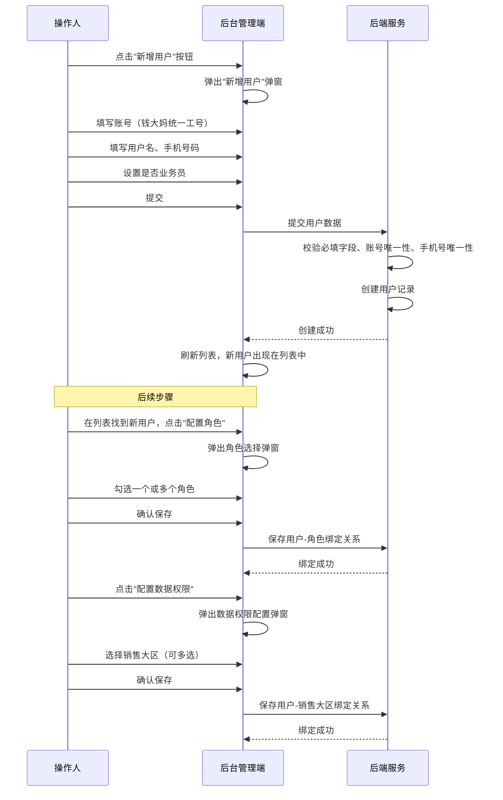
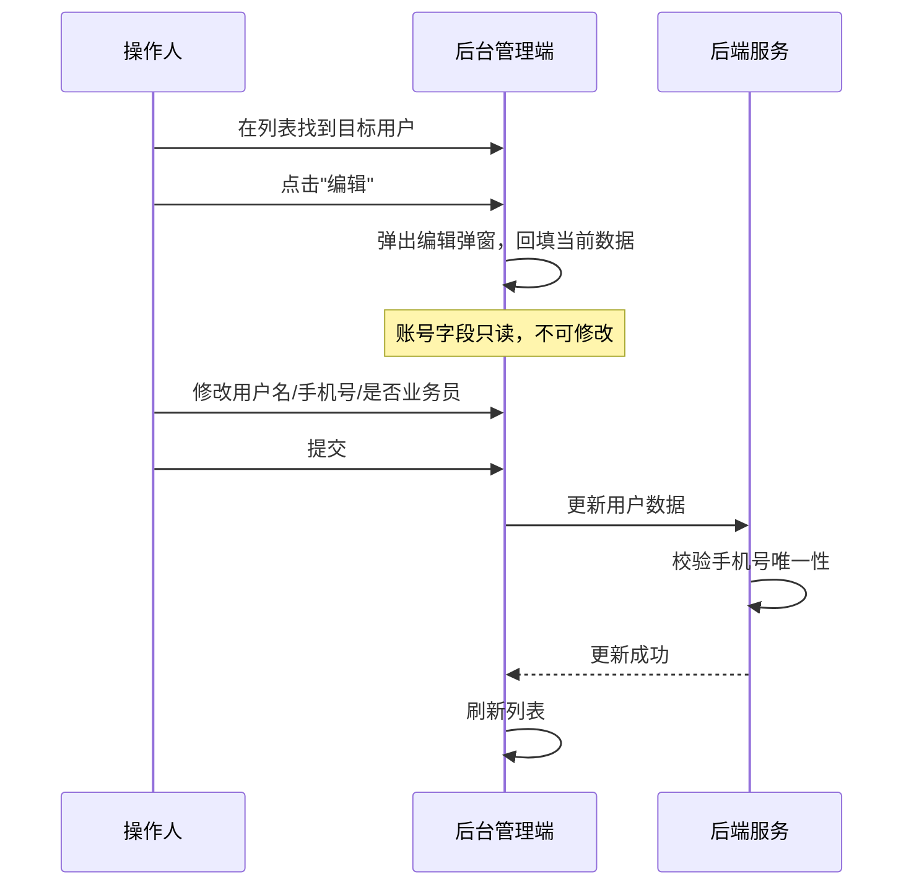
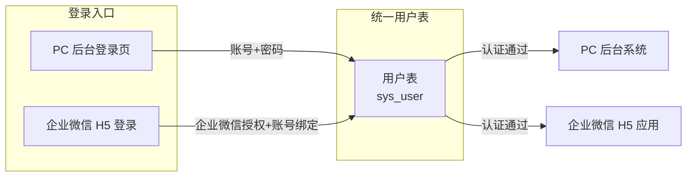

# 用户管理模块 SPEC

> **归属中心**：06-基础管理中心
> **模块**：用户管理
> **版本**：v1.1
> **更新日期**：2026-07-03

------

## 1. 背景与目标 (Background & Objectives)

**背景**：平台后台管理系统和企业微信 H5 端需要统一的用户账号体系，不同用户需按角色和数据权限进行访问控制。用户的登录数据源覆盖 PC 后台和企微 H5 两端，需确保账号体系统一。

**目标**：为系统管理员提供用户的全生命周期管理能力，包括用户的新增、编辑、查询，以及角色绑定和数据权限配置，确保每个用户具备正确的系统访问权限和数据可见范围。

------

## 2. 角色与使用场景 (Roles & Scenarios)

| 角色 | 说明 |
| --- | --- |
| 系统管理员 | 负责用户的创建、编辑、角色分配和数据权限配置 |
| 普通用户 | 被管理的对象，通过后台或企微 H5 登录后使用系统功能 |

**使用场景**：

- 在后台新增一个用户账号，为其配置角色和数据权限。
- 编辑已有用户的信息（如修改用户名、手机号、是否业务员等）。
- 通过列表筛选条件快速查找特定用户。
- 使用钱大妈统一的工号在后台或企微 H5 端登录系统。
- 标记为"业务员"的用户，在某些表单中受"是否业务员"标识控制操作权限。

------

## 3. 核心业务流程 (Core Business Flow)

### 3.1 新增用户流程



### 3.2 编辑用户流程



### 3.3 登录数据来源



### 状态映射

| 状态字段 | 可选值 | 触发条件 |
| --- | --- | --- |
| 状态 | 启用/停用 | 新增时默认启用，编辑时可切换 |
| 是否业务员 | 是/否 | 新增或编辑时手动设置 |

------

## 4. 界面与交互说明 (UI & Interaction)

### 4.1 列表页面布局

```
┌──────────────────────────────────────────────────────────────────┐
│  用户管理                                                        │
├──────────────────────────────────────────────────────────────────┤
│  账号：[___________]  用户名：[___________]  状态：[全部 ▼]       │
│  是否业务员：[全部 ▼]  手机号码：[___________]                    │
├──────────────────────────────────────────────────────────────────┤
│  [新增用户]  [查询]  [重置]                                       │
├──────────────────────────────────────────────────────────────────┤
│  表格列表                                                        │
│  ┌────┬──────┬──────┬────┬──────┬──────┬──────┬──────┬────┐    │
│  │账号│用户名│手机号│状态│是否  │创建  │最后  │创建人│操作│    │
│  │    │      │      │    │业务员│时间  │登录  │      │    │    │
│  ├────┼──────┼──────┼────┼──────┼──────┼──────┼──────┼────┤    │
│  │1001│张三  │138.. │启用│  是  │06-29 │06-30 │李四  │编辑│    │
│  │    │      │      │    │      │      │      │      │角色│    │
│  │    │      │      │    │      │      │      │      │权限│    │
│  └────┴──────┴──────┴────┴──────┴──────┴──────┴──────┴────┘    │
│                                                  [分页控件]       │
└──────────────────────────────────────────────────────────────────┘
```

### 4.2 新增/编辑用户弹窗

| 序号 | 字段名 | 组件类型 | 说明 |
| --- | --- | --- | --- |
| 1 | 账号 | 文本输入框 | 必填，唯一，钱大妈统一工号。**新增时可输入，编辑时只读不可修改** |
| 2 | 用户名 | 文本输入框 | 必填，可修改 |
| 3 | 手机号码 | 文本输入框 | 必填，唯一，可修改，格式校验 11 位手机号 |
| 4 | 状态 | 单选（启用/停用） | 新增时默认启用 |
| 5 | 是否业务员 | 单选（是/否） | 可编辑，默认否。用于某些功能表单中控制权限 |

> **注意**：创建时间、创建人、最后登录时间由系统自动记录，不在弹窗中展示或编辑。

### 4.3 配置角色弹窗

```
┌──────────────────────────────────────────┐
│  配置角色 — 用户：张三（1001）             │
├──────────────────────────────────────────┤
│  ☑ 系统管理员                             │
│  ☑ 运营管理员                             │
│  ☐ 仓库管理员                             │
│  ☐ 财务人员                               │
│  ☐ 业务员                                 │
│  ...                                     │
├──────────────────────────────────────────┤
│  [取消]                      [保存]       │
└──────────────────────────────────────────┘
```

- 角色列表来源于【角色管理】模块
- 支持勾选多个角色
- 已绑定的角色默认勾选展示
- 保存时全量覆盖用户-角色绑定关系

### 4.4 配置数据权限弹窗

```
┌──────────────────────────────────────────┐
│  配置数据权限 — 用户：张三（1001）          │
├──────────────────────────────────────────┤
│  数据维度：销售大区                        │
│  ┌────────────────────────────────────┐  │
│  │ ☑ 华南大区                          │  │
│  │ ☑ 华东大区                          │  │
│  │ ☐ 华中大区                          │  │
│  │ ☐ 西南大区                          │  │
│  │ ...                                │  │
│  └────────────────────────────────────┘  │
├──────────────────────────────────────────┤
│  [取消]                      [保存]       │
└──────────────────────────────────────────┘
```

- 数据权限维度为**销售大区**
- 销售大区数据来源于【运营管理 → 销售大区管理】
- 支持勾选多个销售大区
- 已绑定的大区默认勾选展示
- 保存时全量覆盖用户-销售大区绑定关系

### 4.5 极限状态

- **空数据状态**：列表无数据时展示"暂无用户数据"空状态占位图
- **加载状态**：列表区域展示骨架屏或 loading 动画
- **数据极多**：列表分页展示，默认每页 20 条
- **角色列表为空**：配置角色弹窗中提示"暂无可用角色，请先在角色管理中创建角色"
- **大区列表为空**：配置数据权限弹窗中提示"暂无可用销售大区，请先在运营管理中创建销售大区"

------

## 5. 数据字典与字段级规则 (Data & Field Rules)

### 5.1 用户表核心字段

| 字段名称 | 字段类型 | 来源/依赖 | 默认值 | 读写权限 | 校验规则与约束 | 说明/占位符 |
| :--- | :--- | :--- | :--- | :--- | :--- | :--- |
| 账号 | String | 新增时输入 | - | 新增时可编辑，编辑时只读 | 必填，唯一，钱大妈统一工号 | 不可修改 |
| 用户名 | String | 新增时输入 | - | 可编辑 | 必填 | 用户姓名或昵称 |
| 手机号码 | String | 新增时输入 | - | 可编辑 | 必填，唯一，11 位手机号格式 | 可修改 |
| 状态 | Enum | 配置 | 启用 | 可编辑 | 枚举：启用/停用 | 停用后无法登录 |
| 是否业务员 | Boolean | 配置 | 否 | 可编辑 | 枚举：是/否 | 用于某些功能表单中控制权限 |
| 推荐码 | String(4) | 系统生成 | 自动生成 | 只读 | 4位字符，从 0001 开始自增，唯一 | 隐性字段，不在列表和表单中展示；创建用户时自动生成，不可修改 |
| 创建时间 | DateTime | 系统记录 | 当前时间 | 只读 | 格式 YYYY-MM-DD HH:mm:ss | 自动生成 |
| 创建人 | String | 系统记录 | 当前登录用户 | 只读 | - | 自动记录 |
| 最后登录时间 | DateTime | 系统记录 | - | 只读 | 格式 YYYY-MM-DD HH:mm:ss | 每次登录后更新 |

### 5.2 用户-角色关联

| 字段名称 | 字段类型 | 来源/依赖 | 默认值 | 读写权限 | 校验规则与约束 | 说明 |
| :--- | :--- | :--- | :--- | :--- | :--- | :--- |
| 用户ID | Long | 用户表 | - | 只读 | 外键关联 sys_user | - |
| 角色ID | Long | 角色管理模块 | - | 可编辑 | 外键关联 sys_role | 一个用户可绑定多个角色 |

### 5.3 用户-数据权限关联

| 字段名称 | 字段类型 | 来源/依赖 | 默认值 | 读写权限 | 校验规则与约束 | 说明 |
| :--- | :--- | :--- | :--- | :--- | :--- | :--- |
| 用户ID | Long | 用户表 | - | 只读 | 外键关联 sys_user | - |
| 销售大区ID | Long | 运营管理-销售大区管理 | - | 可编辑 | 外键关联销售大区表 | 一个用户可绑定多个大区 |

### 5.4 编辑逻辑

- **新增时**：账号、用户名、手机号码、是否业务员均可输入/选择，状态默认启用；推荐码由系统自动生成（4位自增），无需人工输入
- **编辑时**：账号只读不可修改，推荐码不可见不可修改，用户名、手机号码、状态、是否业务员可编辑
- **配置角色时**：打开弹窗加载全部可用角色列表，已绑定角色默认勾选，保存时全量覆盖
- **配置数据权限时**：打开弹窗加载全部可用销售大区列表，已绑定大区默认勾选，保存时全量覆盖

### 5.5 展示逻辑

- 日期时间格式统一为 `YYYY-MM-DD HH:mm:ss`
- 状态列展示：启用（绿色标签）/ 停用（灰色标签）
- 是否业务员列展示：是（蓝色标签）/ 否（默认文本）
- 手机号码展示时中间四位脱敏（如 `138****5678`）

------

## 6. 系统交互与边界 (System Integrations & Boundaries)

### 6.1 前置依赖

- 需先完成**角色管理**模块的数据维护（角色列表依赖）
- 需先完成**运营管理 → 销售大区管理**模块的数据维护（数据权限下拉列表依赖）
- 用户账号（工号）需与钱大妈统一工号体系保持一致

### 6.2 上下游影响

- **角色管理**：修改角色后，绑定该角色的用户权限随之变更
- **销售大区管理**：删除销售大区时，需检查是否存在用户绑定，如有绑定则提示不可删除或级联解绑
- **登录认证**：用户状态为"停用"时，禁止登录后台和企微 H5 端
- **功能表单权限**：标记为"业务员"的用户，在特定功能表单中受额外权限控制（如只能查看自己的数据等）
- **数据权限**：用户在后台和企微 H5 登录后，列表数据的可见范围受绑定的销售大区限制

### 6.3 表前缀约束

- 用户相关表统一使用 `sys_` 前缀
- 角色表 `sys_role`，用户表 `sys_user`，用户角色关联表 `sys_user_role`
- 数据权限关联表 `sys_user_data_permission`
- 跨模块获取销售大区数据时，通过应用层组合或内部 API 调用，**禁止直接 JOIN 查询**

------

## 7. 非功能性需求 (Non-Functional Requirements)

### 7.1 权限与安全

- **数据权限（Data 级）**：用户列表数据按当前登录用户的数据权限范围过滤，管理员只能看到其管辖范围内的用户
- **操作权限（Button 级）**：新增、编辑、配置角色、配置数据权限操作需具备对应角色权限
- **手机号脱敏**：列表展示时手机号中间四位脱敏处理
- **登录安全**：停用状态用户禁止登录，连续登录失败需锁定账号

### 7.2 性能要求

- 用户列表查询支持分页，单页数据量不超过 50 条
- 配置角色弹窗加载时，角色列表一次性加载（角色数量通常 < 100）
- 配置数据权限弹窗加载时，销售大区列表一次性加载（大区数量通常 < 50）

### 7.3 业务规则

- 账号（工号）一旦创建不可修改，如需变更需通过后台数据库操作
- 推荐码由系统在创建用户时自动生成，4 位字符从 0001 开始自增（如 0001 → 0002 → ... → 9999），全局唯一，不可修改
- 推荐码为隐性字段，不在后台列表、表单中展示，仅供下游业务通过 API 查询使用
- 手机号码全局唯一，修改时需校验是否与其他用户冲突
- 停用用户不影响历史数据关联关系
- 用户-角色绑定关系在编辑用户时不自动清除，仅在配置角色弹窗中修改

------

## 8. 附录

### 8.1 功能清单汇总

| 功能项 | 说明 |
| --- | --- |
| 用户列表查询 | 支持按账号、用户名、手机号、状态、是否业务员多条件筛选，分页展示 |
| 新增用户 | 填写账号（工号）、用户名、手机号，设置是否业务员，默认启用 |
| 编辑用户 | 修改用户名、手机号、状态、是否业务员，账号不可修改 |
| 配置角色 | 为用户绑定一个或多个角色，支持全量覆盖保存 |
| 配置数据权限 | 为用户绑定一个或多个销售大区，支持全量覆盖保存 |

### 8.2 与其他模块的关系

| 关联模块 | 关系说明 |
| --- | --- |
| 角色管理 | 用户通过"配置角色"弹窗绑定角色，角色列表来源于角色管理模块。角色变更后，绑定该角色的用户权限随之变更 |
| 销售大区管理 | 用户通过"配置数据权限"弹窗绑定销售大区，大区列表来源于运营管理-销售大区管理。删除大区时需检查是否存在用户绑定 |
| 登录认证 | 用户使用账号（工号）在 PC 后台或企微 H5 端登录，停用状态用户禁止登录 |

### 8.3 特殊业务场景

**场景一：业务员权限控制**

当用户标记为"业务员"后，在特定功能表单中会触发额外的权限控制逻辑。例如：业务员在审批待办列表中只能查看自己相关的审批记录，而非业务员可按数据权限查看更广范围的数据。具体受控表单由各业务模块自行定义。

**场景二：用户停用影响**

停用用户后：
- 该用户无法登录后台和企微 H5 端
- 历史操作记录（创建人、修改人等）不受影响，仍保留原有账号信息
- 角色绑定和数据权限绑定关系保留不清除，重新启用后即恢复

**场景三：账号与工号体系对接**

账号来源于钱大妈统一工号体系，在新增用户时需与工号系统保持一致。账号一旦创建不可在产品界面修改，如需变更工号，需在后台数据库层面操作。

### 8.4 变更记录

| 版本 | 日期 | 变更内容 | 变更人 |
| --- | --- | --- | --- |
| v1.0 | 2026-06-30 | 初始版本，定义用户管理核心功能 | - |
| v1.1 | 2026-07-03 | 新增隐性字段「推荐码」：4位字符从0001自增，创建用户时自动生成，不在界面展示 | - |
