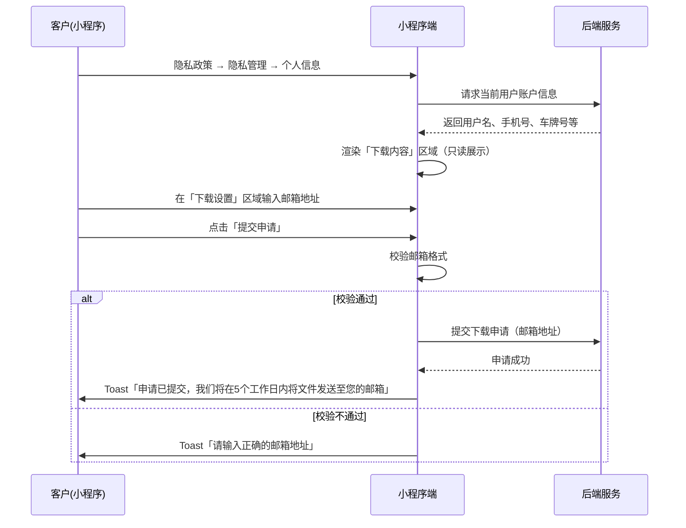
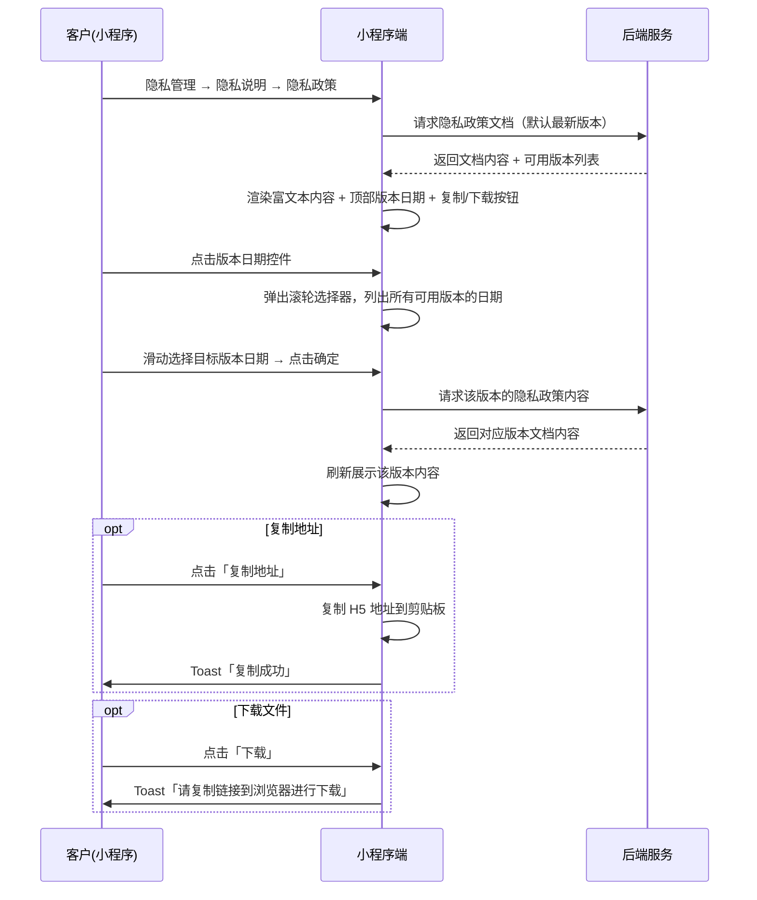
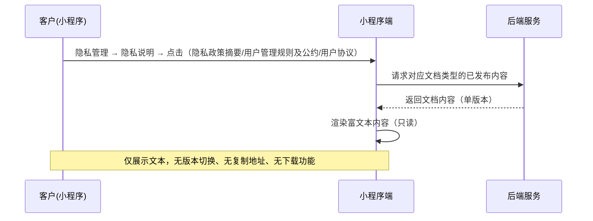
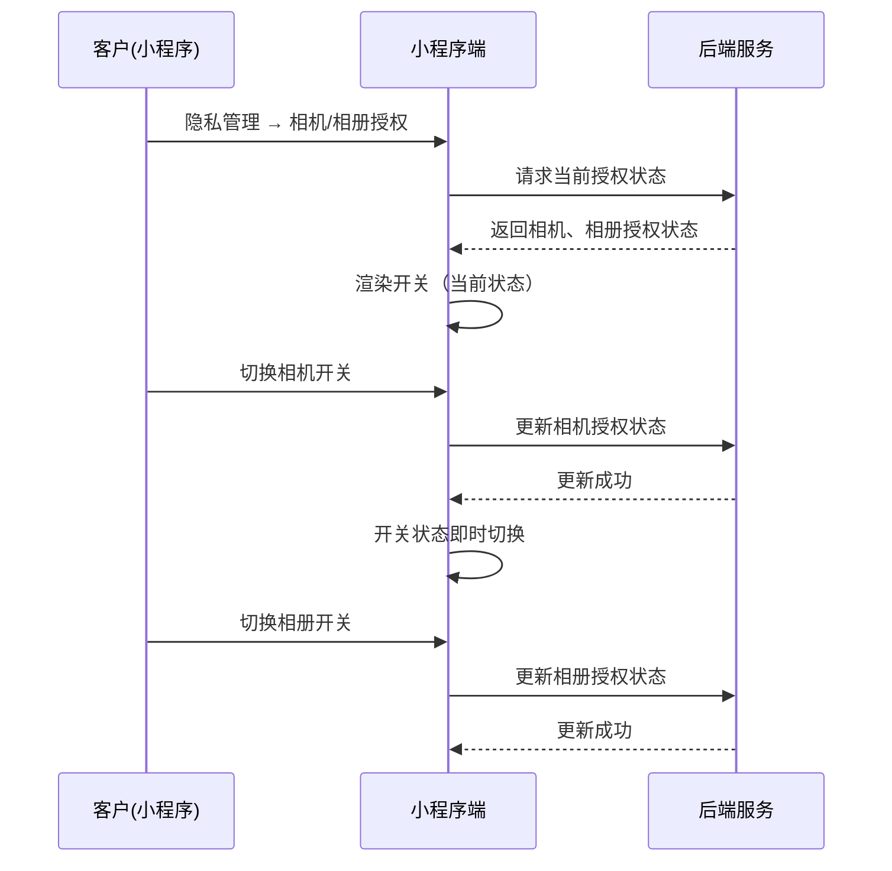

# 隐私政策-小程序 SPEC

> **归属中心**：06-基础管理
> **子模块**：隐私政策管理
> **终端**：小程序端
> **版本**：v2.0
> **更新日期**：2026-07-08
>
> - **小程序端**：面向 B 端客户，在「我的 → 设置」中查看平台发布的隐私政策、用户协议等法律文档，管理个人信息下载与授权。
> - **后台端**：隐私政策的创建、编辑、发布/下架由运营管理员在后台维护，详见 [小程序隐私政策管理.md](./小程序隐私政策管理.md)。

------

## 1. 背景与目标 (Background & Objectives)

**背景**：运营管理员已在后台隐私政策管理模块完成文档的创建与发布。B 端客户需要一个综合入口查看平台公示的隐私政策、用户协议等法律文档，管理个人信息下载与授权设置，同时满足合规要求。

**目标**：在小程序「我的 → 设置 → 隐私政策」页面提供完整隐私管理功能，包含以下六大入口：
- **后台控制**：隐私管理、个人信息收集清单、第三方共享个人信息清单（内容由后台发布控制）
- **前端固定**：投诉与举报、用户注销、客服热线（固定文案，不依赖后台）

------

## 2. 角色与使用场景 (Roles & Scenarios)

| 角色 | 说明 |
| --- | --- |
| B 端客户 | 已登录小程序的客户，查看隐私政策文档、管理个人信息下载、设置授权开关 |

**使用场景**：

- 作为 B 端客户，我可以在隐私政策一级页面看到 6 个功能入口。
- 作为 B 端客户，我可以进入「隐私管理」查看个人信息、管理相机/相册授权、浏览隐私说明文档。
- 作为 B 端客户，我可以在「个人信息」中申请下载我的账户数据（发送 Excel 到邮箱）。
- 作为 B 端客户，我可以开关相机和相册的授权。
- 作为 B 端客户，我可以在「隐私说明」中查看隐私政策（含版本切换、复制链接、下载 PDF）、隐私政策摘要、用户管理规则及公约、用户协议。
- 作为 B 端客户，我可以查看「个人信息收集清单」和「第三方共享个人信息清单」的完整内容。
- 作为 B 端客户，我可以查看投诉与举报、用户注销、客服热线的固定说明信息。

------

## 3. 核心业务流程 (Core Business Flow)

### 3.1 整体导航结构

```
我的（一级入口嵌入）
  └── 设置区域
        ├── 消息公告 → 跳转消息公告页
        ├── 隐私管理 ────────────────────────────── 二级页面（自带返回+标题）
        │     ├── 个人信息 ────────────────────────── 三级页面（自带返回+标题）
        │     │     ├── 下载内容（账户信息展示）
        │     │     └── 下载设置（邮箱输入 + 提交）
        │     ├── 相机/相册授权（开关控件）
        │     └── 隐私说明
        │           ├── 隐私政策 ──────────────────── 四级详情页（自带返回+标题，多版本/可下载/可复制）
        │           ├── 隐私政策摘要 ──────────────── 四级详情页（自带返回+标题，只读）
        │           ├── 用户管理规则及公约 ────────── 四级详情页（自带返回+标题，只读）
        │           └── 用户协议 ──────────────────── 四级详情页（自带返回+标题，只读）
        ├── 个人信息收集清单 ──────────────────────── 二级页面（自带返回+标题，只读文本）
        ├── 第三方共享个人信息清单 ────────────────── 二级页面（自带返回+标题，只读文本）
        ├── 投诉与举报 ───────────────────────────── 展开面板（「我的」页内展开，固定内容）
        ├── 用户注销 ─────────────────────────────── 展开面板（「我的」页内展开，固定内容）
        └── 客服热线 ─────────────────────────────── 展开面板（「我的」页内展开，固定号码）
```

> **说明**：一级入口（隐私管理、个人信息收集清单、第三方共享个人信息清单、投诉与举报、用户注销、客服热线）直接嵌入「我的」页面的设置区域，位于「消息公告」下方。其中前三项跳转至独立子页面（每个子页面自带顶部导航栏：返回键 + 标题），后三项在「我的」页内展开/收起。

### 3.2 隐私管理 — 个人信息下载流程



### 3.3 隐私说明 — 隐私政策查看流程（含版本切换）



### 3.4 隐私说明 — 其他文档查看流程（单版本只读）



### 3.5 相机/相册授权流程



### 3.6 异常流与逆向流

| 异常场景 | 触发条件 | 系统处理方式 |
| --- | --- | --- |
| 未登录 | 客户未登录或登录态过期 | 跳转登录页 |
| 网络请求失败 | 请求超时或失败 | Toast「加载失败，请下拉刷新重试」 |
| 文档内容为空 | 后台某类型文档无已发布记录 | 展示空状态「暂无内容」 |
| 邮箱格式错误 | 下载设置中输入非法邮箱 | Toast「请输入正确的邮箱地址」 |
| 隐私政策无多版本 | 仅一个已发布版本 | 版本日期控件不可点击，仅展示当前日期 |

------

## 4. 界面与交互说明 (UI & Interaction)

### 4.1 一级入口：嵌入「我的」页面设置区域

六个隐私相关入口直接嵌入「我的」页面中「设置」区域，位于「消息公告」下方：

```
（「我的」页面 — 设置区域）
┌─────────────────────────────────┐
│  设置                            │
├─────────────────────────────────┤
│  📢 消息公告                  >  │
│  🔒 隐私管理                  >  │  ← 跳转子页面
│  📋 个人信息收集清单          >  │  ← 跳转子页面
│  📤 第三方共享个人信息清单    >  │  ← 跳转子页面
│  📝 投诉与举报              ▼/▶ │  ← 页内展开
│  ┌─ 展开内容 ─────────────────┐ │
│  │ （固定投诉文案）             │ │
│  └────────────────────────────┘ │
│  🚫 用户注销              ▼/▶ │  ← 页内展开
│  📞 客服热线              ▼/▶ │  ← 页内展开
│  400-0612-888                  │
└─────────────────────────────────┘
```

**交互**：
- 前三项（隐私管理、个人信息收集清单、第三方共享个人信息清单）：点击跳转至对应子页面（二级页面）。
- 后三项（投诉与举报、用户注销、客服热线）：点击在「我的」页面内展开/收起面板，展示固定文案，不跳转页面。

**子页面通用规范**：
- 所有跳转后的子页面（二级/三级/四级）均自带顶部导航栏：左侧返回键（←）+ 居中标题。
- 点击返回键：返回上一级页面（通过 iframe 内部视图切换或 `postMessage` 通知父框架返回）。
- 标题文字为该页面名称（如「隐私管理」「个人信息」「隐私政策」等）。

---

### 4.2 二级页面：隐私管理

```
┌─────────────────────────────────┐
│  ← 隐私管理                      │  ← 自带导航栏：返回键 + 标题
├─────────────────────────────────┤
│                                 │
│  ┌──────────────────────────┐   │
│  │ 👤 个人信息           >  │   │
│  └──────────────────────────┘   │
│                                 │
│  ┌──────────────────────────┐   │
│  │ 📷 相机/相册授权         │   │
│  │                          │   │
│  │  相机              [开关] │   │
│  │  相册              [开关] │   │
│  └──────────────────────────┘   │
│                                 │
│  ┌──────────────────────────┐   │
│  │ 📄 隐私说明              │   │
│  │  ┌────────────────────┐  │   │
│  │  │ 隐私政策         > │  │   │  ← 多版本/可下载/可复制
│  │  ├────────────────────┤  │   │
│  │  │ 隐私政策摘要     > │  │   │  ← 只读
│  │  ├────────────────────┤  │   │
│  │  │ 用户管理规则及公约> │  │   │  ← 只读
│  │  ├────────────────────┤  │   │
│  │  │ 用户协议         > │  │   │  ← 只读
│  │  └────────────────────┘  │   │
│  └──────────────────────────┘   │
│                                 │
└─────────────────────────────────┘
```

**交互**：
- 个人信息：点击跳转三级页面。
- 相机/相册开关：直接在当前页面切换，即时生效，调用后端接口更新授权状态。
- 隐私说明下的四个入口：点击进入各自详情页。

---

### 4.3 三级页面：个人信息

```
┌─────────────────────────────────┐
│  ← 个人信息                      │  ← 自带导航栏：返回键 + 标题
├─────────────────────────────────┤
│                                 │
│  ┌─ 下载内容 ──────────────┐   │
│  │                          │   │
│  │  用户名：张三             │   │
│  │  手机号码：138****5678    │   │
│  │  车牌号：粤A12345         │   │
│  │  ...（其他账户信息）       │   │
│  │                          │   │
│  └──────────────────────────┘   │
│                                 │
│  ┌─ 下载设置 ──────────────┐   │
│  │                          │   │
│  │  邮箱地址：              │   │
│  │  ┌────────────────────┐  │   │
│  │  │ 请输入您的邮箱地址   │  │   │
│  │  └────────────────────┘  │   │
│  │                          │   │
│  │  备注：我们将在5个工作日内 │   │
│  │  将文件以Excel格式发送至  │   │
│  │  您的邮箱。               │   │
│  │                          │   │
│  │  [提交申请]              │   │
│  └──────────────────────────┘   │
│                                 │
└─────────────────────────────────┘
```

**字段明细**：

| 区域 | 字段 | 类型 | 说明 |
| --- | --- | --- | --- |
| 下载内容 | 用户名 | 只读文本 | 客户姓名 |
| 下载内容 | 手机号码 | 只读文本 | 脱敏展示 |
| 下载内容 | 车牌号 | 只读文本 | 绑定车辆 |
| 下载内容 | （其他） | 只读文本 | 账户相关信息 |
| 下载设置 | 邮箱地址 | 文本输入框 | placeholder: `请输入您的邮箱地址`，校验邮箱格式 |
| 下载设置 | 提交申请 | 按钮 | 点击后提交，校验通过后 Toast「申请已提交，我们将在5个工作日内将文件以Excel格式发送至您的邮箱」 |

**提交备注文案**（固定展示）：
> 我们将在5个工作日内将文件以Excel格式发送至您的邮箱。

---

### 4.4 隐私说明详情页

#### 4.4.1 隐私政策详情（特殊：多版本 + 可下载 + 可复制）

```
┌─────────────────────────────────┐
│  ← 隐私政策                      │  ← 自带导航栏：返回键 + 标题
├─────────────────────────────────┤
│                                 │
│  [2026年07月01日 ▼]  [复制地址] [下载]  │  ← 三者横向同行
│                                 │
│  ┌─────────────────────────┐   │
│  │                         │   │
│  │  （富文本 HTML 渲染区）    │   │
│  │                         │   │
│  │  完整的隐私政策文档内容，   │   │
│  │  包含标题、段落、         │   │
│  │  加粗、列表等格式         │   │
│  │                         │   │
│  └─────────────────────────┘   │
│                                 │
└─────────────────────────────────┘
```

**顶部控件说明**：

| 控件 | 类型 | 交互 |
| --- | --- | --- |
| 版本日期 | 滚轮选择器 | 点击后弹出竖向滑动滚轮，列出所有可用版本日期（YYYY年MM月DD日），滑动选择后点击「确定」加载对应版本内容，点击「取消」关闭滚轮 |
| 复制地址 | 按钮 | 复制当前隐私政策的 H5 地址到剪贴板，Toast「复制成功」 |
| 下载 | 按钮 | Toast 提示「请复制链接到浏览器进行下载」 |

**版本切换滚轮交互**：
- 格式：`XXXX年XX月XX日`（如 2026年07月01日）
- 弹出为底部半屏滚轮选择器，竖向滑动选择
- 底部带「取消」「确定」按钮
- 确定后刷新下方富文本内容为所选版本

#### 4.4.2 隐私政策摘要 / 用户管理规则及公约 / 用户协议详情（只读）

```
┌─────────────────────────────────┐
│  ← 隐私政策摘要                  │  ← 自带导航栏：返回键 + 标题（动态）
├─────────────────────────────────┤
│                                 │
│  ┌─────────────────────────┐   │
│  │                         │   │
│  │  （富文本 HTML 渲染区）    │   │
│  │                         │   │
│  │  完整文档内容，只读        │   │
│  │                         │   │
│  └─────────────────────────┘   │
│                                 │
└─────────────────────────────────┘
```

**说明**：
- 仅展示后台已发布的该类型文档的富文本内容。
- 单版本管理，无版本切换功能。
- 无复制地址、无下载功能。
- 若后台无已发布内容，展示空状态「暂无内容」。

---

### 4.5 个人信息收集清单 / 第三方共享个人信息清单（二级页面）

```
┌─────────────────────────────────┐
│  ← 个人信息收集清单              │  ← 自带导航栏：返回键 + 标题（动态）
├─────────────────────────────────┤
│                                 │
│  ┌─────────────────────────┐   │
│  │                         │   │
│  │  （富文本 HTML 渲染区）    │   │
│  │                         │   │
│  │  后台发布的完整文本内容，  │   │
│  │  只读                    │   │
│  │                         │   │
│  └─────────────────────────┘   │
│                                 │
└─────────────────────────────────┘
```

**说明**：与隐私政策摘要的展示方式一致，从一级页面直接进入，只读展示后台已发布内容。

---

### 4.6 固定内容：投诉与举报 / 用户注销 / 客服热线

#### 4.6.1 投诉与举报

```
┌─────────────────────────────────┐
│  ← 隐私政策                      │
├─────────────────────────────────┤
│  ...（上方入口列表）              │
│                                 │
│  ┌──────────────────────────┐   │
│  │ 📝 投诉与举报          ▼  │   │  ← 展开态
│  ├──────────────────────────┤   │
│  │                          │   │
│  │  如您有任何关于网络安全、  │   │
│  │  数据安全、个人信息保护；  │   │
│  │  帐号信息管理；网络信息内  │   │
│  │  容；与钱大妈提供的移动互  │   │
│  │  联网应用程序信息服务、推  │   │
│  │  荐服务、互联网弹窗信息推  │   │
│  │  送服务等有关的或其他任何  │   │
│  │  方面的投诉、举报信息，均  │   │
│  │  可以联系在线客服进行反馈  │   │
│  │  或者拨打客服热线          │   │
│  │  (400-061-2888)进行反馈。 │   │
│  │                          │   │
│  └──────────────────────────┘   │
│                                 │
└─────────────────────────────────┘
```

**交互**：点击展开/收起，展开时箭头从 › 变为 ▼，下方展示固定文案。

#### 4.6.2 用户注销

点击展开，展示固定文案：
> 如您希望注销账号的，您可以通过企业微信联系【供应链IT客服】进行申请，我们会将您的申请进行审核，符合条件的，我们会及时为您注销账号，注销后，您将无法继续登录使用本产品，请谨慎申请。

#### 4.6.3 客服热线

点击展开，展示：
> 400-0612-888

---

### 4.7 极限状态

| 场景 | 处理方式 |
| --- | --- |
| 后台无已发布文档 | 对应文档入口点击后展示空状态插图 + 「暂无内容」 |
| 网络加载失败 | Toast「加载失败，请下拉刷新重试」 |
| 未登录 | 跳转登录页 |
| 隐私政策仅一个版本 | 版本日期仅展示文本，不可点击弹出选择器 |
| 个人信息中某些字段为空 | 展示「-」占位 |

------

## 5. 数据字典与字段级规则 (Data & Field Rules)

### 5.1 一级页面功能入口分类

| 入口名称 | 内容来源 | 跳转目标 | 说明 |
| --- | --- | --- | --- |
| 隐私管理 | 后台控制 | 二级页面 | 包含个人信息、授权、隐私说明 |
| 个人信息收集清单 | 后台控制 | 二级页面（只读文本） | 获取后台「个人信息收集清单」类型已发布文档 |
| 第三方共享个人信息清单 | 后台控制 | 二级页面（只读文本） | 获取后台「第三方共享个人信息清单」类型已发布文档 |
| 投诉与举报 | 前端固定 | 展开面板 | 固定文案 |
| 用户注销 | 前端固定 | 展开面板 | 固定文案 |
| 客服热线 | 前端固定 | 展开面板 | 固定号码 |

### 5.2 个人信息（下载内容）字段

| 字段名称 | 字段类型 | 来源 | 读写权限 | 说明 |
| :--- | :--- | :--- | :--- | :--- |
| 用户名 | String | 用户账户表 | 只读 | 客户姓名 |
| 手机号码 | String | 用户账户表 | 只读 | 脱敏展示（中间四位） |
| 车牌号 | String | 用户账户表 | 只读 | 绑定车辆 |
| （其他字段） | - | 用户账户表 | 只读 | 按产品需求扩展 |

### 5.3 隐私政策版本选择器字段

| 字段名称 | 字段类型 | 来源 | 说明 |
| :--- | :--- | :--- | :--- |
| 版本日期列表 | Array\<String\> | 后端隐私政策多版本数据 | 格式 `YYYY年MM月DD日`，所有已发布隐私政策的版本日期 |
| 当前选中版本 | String | 默认最新版本 | 滚轮默认定位到最新版本日期 |

### 5.4 展示逻辑

| 展示项 | 格式/规则 |
| --- | --- |
| 隐私政策版本日期 | 格式 `XXXX年XX月XX日`（如 2026年07月01日） |
| 手机号码 | 列表/信息展示时中间四位脱敏（如 `138****5678`） |
| 富文本内容 | 使用小程序 `rich-text` 组件渲染 HTML |
| 空状态 | 居中展示空状态插图 + 「暂无内容」 |
| 固定内容文案 | 前端硬编码，不依赖接口 |
| 客服热线 | `400-0612-888` |

### 5.5 编辑逻辑

小程序端所有内容为只读展示，无编辑权限。例外：
- 相机/相册开关：可切换（写入授权状态）
- 个人信息 → 邮箱地址：可输入（提交下载申请）

------

## 6. 系统交互与边界 (System Integrations & Boundaries)

### 6.1 前置依赖

| 依赖项 | 说明 |
| --- | --- |
| 小程序隐私政策管理（后台） | 文档的创建、编辑、发布/下架，详见 [小程序隐私政策管理.md](./小程序隐私政策管理.md) |
| 客户认证模块 | 客户需登录后才能查看，登录机制详见 [小程序登录注册模块.md](../02-客户管理/小程序登录注册模块.md) |
| 小程序「我的」页面 | 作为一级入口「隐私政策」的容器页面 |

### 6.2 接口定义

| 接口功能 | 方法 | 路径 | 说明 |
| --- | --- | --- | --- |
| 获取已发布文档列表 | GET | `/api/privacy/docs/published` | 返回所有已发布文档（id、标题、类型） |
| 获取指定类型文档详情 | GET | `/api/privacy/docs/type/{docType}` | 返回该类型已发布文档完整内容（单版本类型） |
| 获取隐私政策版本列表 | GET | `/api/privacy/docs/privacy-policy/versions` | 返回所有已发布隐私政策的版本日期列表 |
| 获取指定版本隐私政策 | GET | `/api/privacy/docs/privacy-policy/{versionId}` | 返回指定版本隐私政策完整内容 |
| 获取用户账户信息 | GET | `/api/user/profile` | 返回用户名、手机号、车牌号等账户信息 |
| 提交数据下载申请 | POST | `/api/user/data-download` | body: { email }，提交个人信息下载申请 |
| 获取授权状态 | GET | `/api/user/auth-status` | 返回相机、相册等授权开关状态 |
| 更新授权状态 | PUT | `/api/user/auth-status` | body: { type, enabled }，更新某项授权状态 |

### 6.3 上下游影响

| 关联模块 | 影响说明 |
| --- | --- |
| 小程序隐私政策管理（后台） | 后台发布/下架文档直接影响本文档各入口的可见内容 |
| 小程序「我的 → 设置」 | 作为入口容器，需提供「隐私政策」入口 |
| 小程序注册/登录页 | 底部协议链接指向本文档的「隐私说明」下对应文档详情 |

------

## 7. 非功能性需求 (Non-Functional Requirements)

### 7.1 性能要求

| 指标 | 要求 |
| --- | --- |
| 文档内容接口响应 | < 500ms |
| 用户信息接口响应 | < 300ms |
| 授权状态更新 | < 500ms（即时反馈） |
| 页面首屏加载 | < 1s |

### 7.2 权限与安全

| 层级 | 说明 |
| --- | --- |
| 操作权限 | 需登录后访问，未登录跳转登录页 |
| 数据权限 | 仅展示后台「已发布」状态的文档 |
| 个人信息保护 | 手机号码脱敏展示；邮箱传输使用 HTTPS |
| XSS 防护 | 富文本内容渲染前做 XSS 过滤 |

------

## 8. 附录

### 8.1 功能入口分类总表

| 入口 | 来源 | 层级 | 交互方式 | 特殊功能 |
| --- | --- | --- | --- | --- |
| 隐私管理 | 后台 | 二级 | 页面跳转 | 含个人信息下载、授权开关、隐私说明 |
| 个人信息收集清单 | 后台 | 二级 | 页面跳转 | 只读文本 |
| 第三方共享个人信息清单 | 后台 | 二级 | 页面跳转 | 只读文本 |
| 投诉与举报 | 前端固定 | 一级展开 | 展开面板 | 固定文案 |
| 用户注销 | 前端固定 | 一级展开 | 展开面板 | 固定文案 |
| 客服热线 | 前端固定 | 一级展开 | 展开面板 | 固定号码 400-0612-888 |

### 8.2 隐私说明下文档差异化对照

| 文档 | 版本管理 | 版本切换 | 复制地址 | 下载 | 编辑 |
| --- | --- | --- | --- | --- | --- |
| 隐私政策 | 多版本并存 | ✅ 滚轮选择 | ✅ | ✅ | ❌ |
| 隐私政策摘要 | 单版本 | ❌ | ❌ | ❌ | ❌ |
| 用户管理规则及公约 | 单版本 | ❌ | ❌ | ❌ | ❌ |
| 用户协议 | 单版本 | ❌ | ❌ | ❌ | ❌ |

### 8.3 固定内容文案

**投诉与举报**：
> 如您有任何关于网络安全、数据安全、个人信息保护；帐号信息管理；网络信息内容；与钱大妈提供的移动互联网应用程序信息服务、推荐服务、互联网弹窗信息推送服务等有关的或其他任何方面的投诉、举报信息，均可以联系在线客服进行反馈或者拨打客服热线（400-061-2888）进行反馈。

**用户注销**：
> 如您希望注销账号的，您可以通过企业微信联系【供应链IT客服】进行申请，我们会将您的申请进行审核，符合条件的，我们会及时为您注销账号，注销后，您将无法继续登录使用本产品，请谨慎申请。

**客服热线**：
> 400-0612-888

### 8.4 变更记录

| 版本 | 日期 | 变更内容 | 变更人 |
| --- | --- | --- | --- |
| v2.0 | 2026-07-08 | 重构为完整隐私管理中心：新增个人信息下载、相机/相册授权、隐私说明（含版本切换）、投诉举报、用户注销、客服热线 | - |
| v1.0 | 2026-07-07 | 初始版本，基础文档列表和详情查看 | - |
