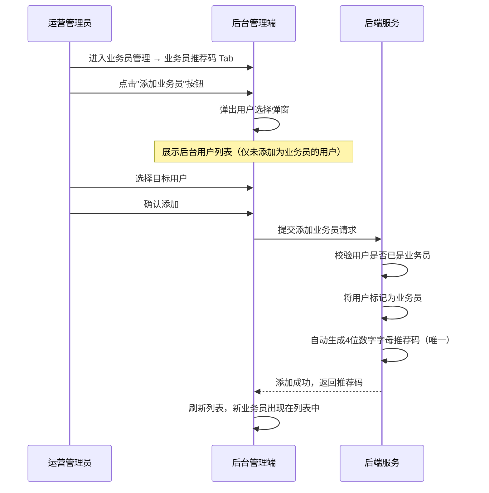
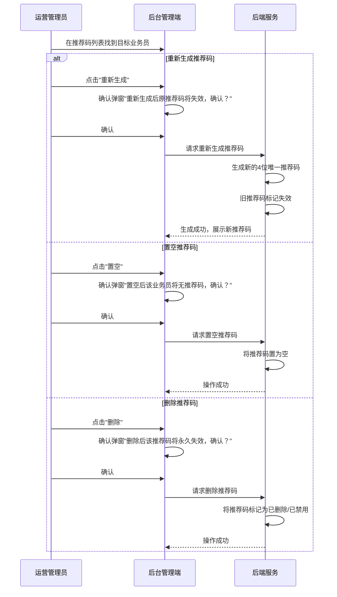
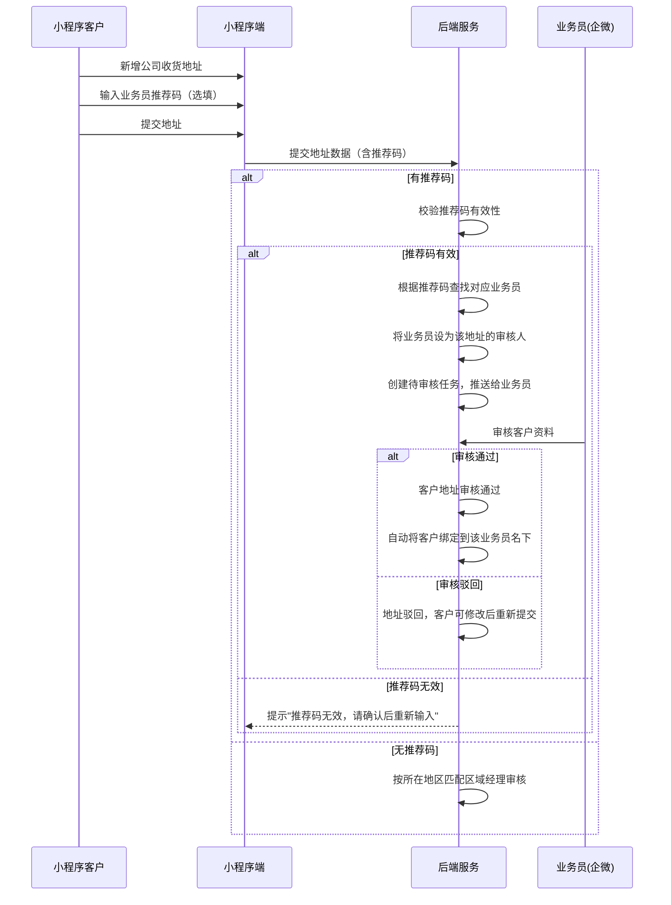
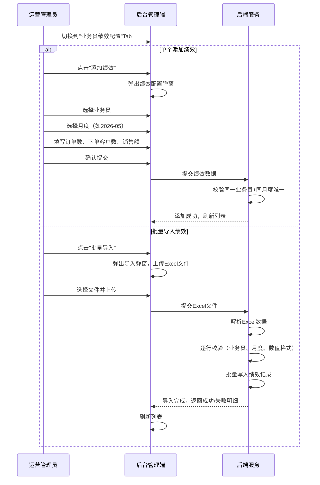

# 业务员管理模块 SPEC

> **归属中心**：07-运营管理中心
> **模块**：业务员管理
> **版本**：v1.0
> **更新日期**：2026-07-01

------

## 1. 背景与目标 (Background & Objectives)

**背景**：业务员是平台B端销售体系的核心角色，负责发展客户、审核客户资料、维护客户关系。需要一套完整的业务员管理体系，包括业务员身份标识、推荐码机制、以及月度绩效目标配置，支撑业务员的日常工作与业绩考核。

**目标**：为运营管理员提供业务员的全生命周期管理能力，包括将后台用户添加为业务员并自动生成推荐码、推荐码的维护（重新生成/置空/删除）、客户通过推荐码绑定业务员的审核链路，以及业务员月度绩效目标的配置与管理。

------

## 2. 角色与使用场景 (Roles & Scenarios)

| 角色 | 说明 |
| --- | --- |
| 运营管理员 | 负责业务员的添加、推荐码管理、绩效配置 |
| 业务员 | 被管理的对象，拥有推荐码，负责审核客户资料并绑定客户关系 |
| 小程序客户 | 在下单客户地址表单中可输入业务员推荐码，提交后由该业务员审核 |

**使用场景**：

- 作为运营管理员，我可以将后台已有用户添加为业务员，系统自动为该业务员生成4位数推荐码。
- 作为运营管理员，我可以在业务员推荐码列表中查看业务员姓名、手机号、名下客户数、推荐码，并对推荐码进行重新生成、置空或删除操作。
- 作为小程序客户，我在提交公司收货地址时可输入业务员推荐码，提交后由对应业务员审核，审核通过后自动绑定该业务员。
- 作为运营管理员，我可以在绩效配置页为业务员配置月度绩效目标，包括订单数、下单客户数、销售额。
- 作为运营管理员，我可以通过批量导入方式一次性为多个业务员配置多个月份的绩效目标。

------

## 3. 核心业务流程 (Core Business Flow)

### 3.1 添加业务员流程



### 3.2 推荐码管理流程



### 3.3 客户提交推荐码审核流程



### 3.4 业务员绩效配置流程



### 状态映射

| 状态字段 | 可选值 | 触发条件 |
| --- | --- | --- |
| 推荐码状态 | 有效/已置空/已失效 | 生成时有效，置空操作后为空，重新生成或删除后旧码失效 |

------

## 4. 界面与交互说明 (UI & Interaction)

### 4.1 业务员管理页整体布局

```
┌──────────────────────────────────────────────────────────────────┐
│  业务员管理                                                      │
├──────────────────────────────────────────────────────────────────┤
│  [ 业务员推荐码 ]  [ 业务员绩效配置 ]                              │
├──────────────────────────────────────────────────────────────────┤
│                                                                  │
│  （下方为当前选中 Tab 的内容区）                                    │
│                                                                  │
└──────────────────────────────────────────────────────────────────┘
```

顶部使用 Tab 切换两个子页面，默认展示"业务员推荐码"。

---

### 4.2 业务员推荐码 Tab

#### 4.2.1 列表页面布局

```
┌──────────────────────────────────────────────────────────────────┐
│  业务员管理                                                      │
├──────────────────────────────────────────────────────────────────┤
│  [ 业务员推荐码 ]  [ 业务员绩效配置 ]                              │
├──────────────────────────────────────────────────────────────────┤
│  业务员姓名：[___________]  手机号：[___________]  [查询] [重置]   │
├──────────────────────────────────────────────────────────────────┤
│  [添加业务员]                                                     │
├──────────────────────────────────────────────────────────────────┤
│  ┌──────────┬──────────┬──────────┬──────────┬──────────┬──────────┬────────┐   │
│  │业务员姓名│业务员手机号│销售客户数 │  推荐码   │  修改人  │最后修改时间│  操作  │   │
│  ├──────────┼──────────┼──────────┼──────────┼──────────┼──────────┼────────┤   │
│  │  张三    │138****5678│    12    │  A3K9   │  管理员  │06-30 09:15│重新生成│   │
│  │          │          │          │          │          │          │  置空  │   │
│  │          │          │          │          │          │          │  删除  │   │
│  ├──────────┼──────────┼──────────┼──────────┼──────────┼──────────┼────────┤   │
│  │  李四    │139****1234│     5    │   —     │  管理员  │06-28 14:20│重新生成│   │
│  │          │          │          │（已置空） │          │          │        │   │
│  └──────────┴──────────┴──────────┴──────────┴──────────┴──────────┴────────┘   │
│                                                  [分页控件]       │
└──────────────────────────────────────────────────────────────────┘
```

#### 4.2.2 添加业务员弹窗

| 序号 | 字段名 | 组件类型 | 说明 |
| --- | --- | --- | --- |
| 1 | 选择用户 | 下拉搜索选择器 | 展示后台用户列表，支持按姓名/手机号搜索，仅展示未添加为业务员的用户 |

- 选中用户后点击"确认添加"，系统自动将该用户标记为业务员并生成4位推荐码。
- 添加成功后列表刷新，新业务员出现在列表中，推荐码自动展示。

#### 4.2.3 操作按钮

| 操作 | 说明 | 前置条件 |
| --- | --- | --- |
| 重新生成 | 为业务员生成新的4位推荐码，旧码立即失效 | 无限制 |
| 置空 | 将业务员的推荐码置为空，该业务员暂无推荐码 | 当前有推荐码 |
| 删除 | 将推荐码标记为已删除/失效，该码永久不可用 | 当前有推荐码 |

- 重新生成、置空、删除操作均需二次确认弹窗。
- 置空后，操作列"置空"和"删除"按钮隐藏，仅展示"重新生成"按钮。

#### 4.2.4 列表字段说明

| 字段 | 说明 |
| --- | --- |
| 业务员姓名 | 业务员的真实姓名 |
| 业务员手机号 | 中间四位脱敏展示（如 138****5678） |
| 销售客户数 | 统计通过该业务员推荐码提交并通过审核的客户资料数量 |
| 推荐码 | 4位数字字母组合；置空时显示"—" |
| 修改人 | 最近一次修改该推荐码记录的操作人 |
| 最后修改时间 | 最近一次修改的时间，格式 YYYY-MM-DD HH:mm:ss |

#### 4.2.5 极限状态

- **空数据状态**：列表无数据时展示"暂无业务员"空状态占位图
- **加载状态**：列表区域展示骨架屏或 loading 动画
- **数据极多**：列表分页展示，默认每页 20 条
- **用户列表为空**：添加业务员弹窗中提示"暂无可添加的用户"

---

### 4.3 业务员绩效配置 Tab

#### 4.3.1 列表页面布局

```
┌──────────────────────────────────────────────────────────────────┐
│  业务员管理                                                      │
├──────────────────────────────────────────────────────────────────┤
│  [ 业务员推荐码 ]  [ 业务员绩效配置 ]                              │
├──────────────────────────────────────────────────────────────────┤
│  业务员信息：[___________]   月度：[___________]  [查询] [重置]              │
├──────────────────────────────────────────────────────────────────┤
│  [添加绩效]  [批量导入]                                           │
├──────────────────────────────────────────────────────────────────┤
│  ┌──────────┬──────────┬────────┬──────────┬──────────┬──────────┬──────────┬────┐  │
│  │  业务员  │   月度   │订单数  │下单客户数│销售额(元)│  修改人  │最后修改时间│操作│  │
│  ├──────────┼──────────┼────────┼──────────┼──────────┼──────────┼──────────┼────┤  │
│  │  张三    │ 2026-05  │   50   │    10    │ 500,000  │  管理员  │06-30 10:00│编辑│  │
│  ├──────────┼──────────┼────────┼──────────┼──────────┼──────────┼──────────┼────┤  │
│  │  张三    │ 2026-06  │   60   │    12    │ 600,000  │  管理员  │06-30 10:05│编辑│  │
│  ├──────────┼──────────┼────────┼──────────┼──────────┼──────────┼──────────┼────┤  │
│  │  李四    │ 2026-05  │   30   │     8    │ 300,000  │  管理员  │06-29 16:20│编辑│  │
│  └──────────┴──────────┴────────┴──────────┴──────────┴──────────┴──────────┴────┘  │
│                                                  [分页控件]       │
└──────────────────────────────────────────────────────────────────┘
```

- **业务员信息** 查询 姓名/手机号模糊查询

#### 4.3.2 添加绩效弹窗

| 序号 | 字段名 | 组件类型 | 说明 |
| --- | --- | --- | --- |
| 1 | 业务员 | 下拉选择器 | 必填，从已添加的业务员列表中选择 |
| 2 | 月度 | 月份选择器 | 必填，格式 YYYY-MM，如 2026-05 |
| 3 | 订单数 | 数字输入框 | 必填，正整数，该月的目标订单数 |
| 4 | 下单客户数 | 数字输入框 | 必填，正整数，该月的目标下单客户数 |
| 5 | 销售额 | 数字输入框 | 必填，正数（保留两位小数），该月的目标销售额（元） |

- 同一业务员 + 同一月度唯一，重复添加时提示"该业务员该月度的绩效已存在"。
- 支持编辑：在列表中点击"编辑"，弹出弹窗回填已有数据，修改后保存。

#### 4.3.3 批量导入弹窗

```
┌──────────────────────────────────────────┐
│  批量导入绩效                             │
├──────────────────────────────────────────┤
│                                          │
│  1. 下载模板：[点击下载Excel模板]          │
│                                          │
│  2. 按模板格式填写数据后上传：              │
│     ┌──────────────────────────────┐     │
│     │  拖拽文件到此处或点击上传      │     │
│     └──────────────────────────────┘     │
│                                          │
│  3. 导入结果：                            │
│     ┌──────────────────────────────┐     │
│     │  成功导入 15 条，失败 2 条      │     │
│     │  - 第3行：业务员"王五"不存在    │     │
│     │  - 第8行：月度格式错误         │     │
│     └──────────────────────────────┘     │
│                                          │
│  [取消]                        [确认]     │
└──────────────────────────────────────────┘
```

**导入模板字段**：

| 列 | 字段名 | 必填 | 说明 |
| --- | --- | --- | --- |
| A | 业务员手机号 | 是 | 用于匹配业务员 |
| B | 月度 | 是 | 格式 YYYY-MM |
| C | 订单数 | 是 | 正整数 |
| D | 下单客户数 | 是 | 正整数 |
| E | 销售额（元） | 是 | 正数，保留两位小数 |

**导入逻辑**：
- 通过"业务员手机号"匹配业务员，匹配不到则记录失败行。
- 同一文件中同一业务员+同月度重复时，后一条覆盖前一条。
- 逐行校验，校验通过的行写入，失败的行记录原因。
- 导入完成后展示成功/失败统计及失败明细。

#### 4.3.4 极限状态

- **空数据状态**：列表无数据时展示"暂无绩效数据"空状态占位图
- **加载状态**：列表区域展示骨架屏或 loading 动画
- **数据极多**：列表分页展示，默认每页 20 条
- **业务员列表为空**：添加绩效弹窗中提示"暂无业务员，请先在推荐码Tab中添加业务员"
- **导入文件格式错误**：提示"文件格式不正确，请上传 .xlsx 或 .xls 文件"
- **导入全部失败**：展示失败明细，不关闭弹窗

------

## 5. 数据字典与字段级规则 (Data & Field Rules)

### 5.1 业务员推荐码表核心字段

| 字段名称 | 字段类型 | 来源/依赖 | 默认值 | 读写权限 | 校验规则与约束 | 说明/占位符 |
| :--- | :--- | :--- | :--- | :--- | :--- | :--- |
| 推荐码ID | Long | 系统生成 | - | 只读 | 唯一主键 | - |
| 业务员ID | Long | 后台用户表 | - | 只读 | 外键关联后台用户表，唯一 | 一个用户只能有一个推荐码记录 |
| 推荐码 | String(4) | 系统生成 | - | 管理员可编辑 | 4位数字组合，唯一（有效码范围内） | 系统自动生成，可重新生成/置空/删除 |
| 推荐码状态 | Enum | 系统管理 | 有效 | 管理员可编辑 | 枚举：有效、已置空、已失效 | 置空时状态为"已置空"，重新生成或删除后旧码状态为"已失效" |
| 创建时间 | DateTime | 系统记录 | 当前时间 | 只读 | 格式 YYYY-MM-DD HH:mm:ss | 自动生成 |
| 修改人 | String | 系统记录 | 当前登录用户 | 只读 | - | 最近一次修改该记录的操作人 |
| 更新时间 | DateTime | 系统记录 | 当前时间 | 只读 | 格式 YYYY-MM-DD HH:mm:ss | 每次更新时自动记录 |

### 5.2 业务员与客户绑定关系

| 字段名称 | 字段类型 | 来源/依赖 | 默认值 | 读写权限 | 校验规则与约束 | 说明 |
| :--- | :--- | :--- | :--- | :--- | :--- | :--- |
| 客户资料ID | String(UUID) | 客户资料表 | - | 只读 | 外键关联客户资料表 | - |
| 业务员ID | Long | 业务员推荐码表 | - | 只读（系统写入） | 外键关联业务员 | 审核通过时自动绑定 |

> 客户资料提交时如有推荐码，审核通过后自动将客户资料与推荐码对应业务员绑定。绑定关系写入客户资料表的业务员ID字段（参见 `02-客户管理/客户档案.md` 5.1 节）。

### 5.3 业务员月度绩效表核心字段

| 字段名称 | 字段类型 | 来源/依赖 | 默认值 | 读写权限 | 校验规则与约束 | 说明/占位符 |
| :--- | :--- | :--- | :--- | :--- | :--- | :--- |
| 绩效ID | Long | 系统生成 | - | 只读 | 唯一主键 | - |
| 业务员ID | Long | 业务员推荐码表 | - | 管理员可编辑 | 外键关联业务员 | - |
| 月度 | String(7) | 管理员选择 | - | 管理员可编辑 | 格式 YYYY-MM，如 2026-05 | 同一业务员+同月度唯一 |
| 订单数 | Integer | 管理员输入 | - | 管理员可编辑 | 必填，正整数 | 该月目标订单数 |
| 下单客户数 | Integer | 管理员输入 | - | 管理员可编辑 | 必填，正整数 | 该月目标下单客户数 |
| 销售额 | BigDecimal | 管理员输入 | - | 管理员可编辑 | 必填，正数，保留两位小数 | 该月目标销售额（元） |
| 创建时间 | DateTime | 系统记录 | 当前时间 | 只读 | 格式 YYYY-MM-DD HH:mm:ss | 自动生成 |
| 修改人 | String | 系统记录 | 当前登录用户 | 只读 | - | 最近一次修改该记录的操作人 |
| 更新时间 | DateTime | 系统记录 | 当前时间 | 只读 | 格式 YYYY-MM-DD HH:mm:ss | 每次更新时自动记录 |

### 5.4 推荐码唯一性约束

- 有效状态的推荐码全局唯一
- 已置空和已失效的推荐码不参与唯一性校验
- 重新生成时，新码不与任何有效码重复

### 5.5 展示逻辑

- 日期时间格式统一为 `YYYY-MM-DD HH:mm:ss`
- 手机号展示时中间四位脱敏（如 `138****5678`）
- 推荐码状态：有效（绿色标签）/ 已置空（灰色标签 + "—"）/ 已失效（灰色标签 + 删除线）
- 销售额展示千分位分隔，保留两位小数（如 `500,000.00`）

### 5.6 编辑逻辑

- **推荐码**：不可手动编辑，仅可通过"重新生成"/"置空"/"删除"操作变更
- **绩效**：支持新增和编辑，同一业务员+同月度唯一

------

## 6. 系统交互与边界 (System Integrations & Boundaries)

### 6.1 前置依赖

| 依赖项 | 说明 |
| --- | --- |
| 用户管理 | 业务员来源于后台用户（sys_user），需先有后台用户账号才能添加为业务员 |
| 客户资料管理 | 客户提交地址时输入推荐码，审核通过后绑定业务员关系 |

### 6.2 上下游影响

| 关联模块 | 影响说明 |
| --- | --- |
| 客户档案 | 客户资料审核通过时，根据推荐码自动绑定业务员，回写业务员ID到客户资料表 |
| 销售员统计报表 | 业务员绩效目标为报表提供对比基准 |
| 数据管理（销售员统计） | 实际业绩（订单数、客户数、销售额）与绩效目标对比分析 |

### 6.3 表前缀约束

- 业务员推荐码表和绩效表统一使用 `sys_` 前缀
- 业务员身份通过后台用户表（`sys_user` / `sys_admin`）中的类型字段标识
- 客户资料表归属 `cst_` 前缀，跨前缀数据关联通过应用层组合处理，**禁止直接 JOIN 查询**
- 获取客户资料统计数据（销售客户数）时，通过应用层查询组合，不跨前缀 JOIN

### 6.4 外部接口概要

| 接口 | 调用方 | 说明 |
| --- | --- | --- |
| 获取业务员推荐码列表 | 后台 | GET `/api/admin/salesman/referral/list` |
| 添加业务员 | 后台 | POST `/api/admin/salesman/add` |
| 重新生成推荐码 | 后台 | POST `/api/admin/salesman/referral/{id}/regenerate` |
| 置空推荐码 | 后台 | PUT `/api/admin/salesman/referral/{id}/clear` |
| 删除推荐码 | 后台 | DELETE `/api/admin/salesman/referral/{id}` |
| 校验推荐码 | 小程序 | GET `/api/mall/referral/validate?code=xxx` |
| 获取绩效配置列表 | 后台 | GET `/api/admin/salesman/performance/list` |
| 添加/编辑绩效 | 后台 | POST/PUT `/api/admin/salesman/performance` |
| 批量导入绩效 | 后台 | POST `/api/admin/salesman/performance/import` |
| 下载导入模板 | 后台 | GET `/api/admin/salesman/performance/template` |

------

## 7. 非功能性需求 (Non-Functional Requirements)

### 7.1 权限与安全

- **操作权限（Button 级）**：添加业务员、推荐码管理、绩效配置需具备对应角色权限
- **手机号脱敏**：列表展示时手机号中间四位脱敏处理
- **推荐码校验接口**限流：同一IP 60s内最多校验10次

### 7.2 性能要求

- 业务员推荐码列表查询支持分页，单页数据量不超过 20 条
- 绩效列表查询支持分页，单页数据量不超过 20 条
- 批量导入支持单次最多 500 条记录
- 推荐码生成需保证唯一性，冲突时自动重试（最多3次）

### 7.3 业务规则

- 同一后台用户只能添加为业务员一次
- 推荐码为4位数字字母组合（排除易混淆字符如 0/O、1/I/l），共约30个字符空间，可容纳约 30^4 ≈ 81万 个组合
- 推荐码重新生成后，旧码立即失效，已通过该旧码绑定的客户关系不受影响
- 推荐码置空后，该业务员暂不可通过推荐码发展新客户
- 同一业务员+同月度的绩效记录唯一，重复添加时视为编辑更新
- 批量导入时，同一文件内相同业务员+月度的记录后一条覆盖前一条

------

## 8. 附录

### 8.1 功能清单汇总

| 功能项 | 说明 |
| --- | --- |
| 添加业务员 | 选择后台用户添加为业务员，自动生成4位推荐码 |
| 业务员推荐码列表 | 展示业务员姓名、手机号（脱敏）、销售客户数、推荐码，支持按姓名/手机号筛选 |
| 重新生成推荐码 | 为业务员生成新的4位推荐码，旧码立即失效 |
| 置空推荐码 | 将业务员推荐码置空，该业务员暂无推荐码 |
| 删除推荐码 | 将推荐码标记为已失效，永久不可用 |
| 推荐码校验（小程序端） | 客户填写推荐码时失焦校验有效性 |
| 绩效配置列表 | 展示各业务员各月度的绩效目标，支持按业务员/月度筛选 |
| 添加/编辑绩效 | 为单个业务员配置单个月度的绩效目标 |
| 批量导入绩效 | 通过Excel批量导入多个业务员多个月度的绩效目标 |
| 下载导入模板 | 下载批量导入绩效的Excel模板文件 |

### 8.2 与其他模块的关系

| 关联模块 | 关系说明 |
| --- | --- |
| 用户管理 | 业务员来源于后台用户，需先有用户账号 |
| 客户档案 | 客户资料审核通过时，通过推荐码自动绑定业务员；销售客户数统计依赖此绑定关系 |
| 销售员统计报表 | 实际业绩与绩效目标对比，绩效数据为此报表提供目标基准 |
| 统一代办 | 有推荐码的客户资料提交后，创建待办任务推送给对应业务员 |

### 8.3 特殊业务场景

**场景一：业务员离职**

业务员离职后：
- 推荐码标记为已失效，不可再用于新客户绑定
- 已绑定的客户关系保留，客户资料中的业务员ID不清除
- 可重新分配给其他业务员（需在客户档案模块操作）
- 绩效数据保留，用于历史统计

**场景二：推荐码冲突处理**

系统生成推荐码时，如与已有有效码冲突（概率极低），自动重试生成，最多重试3次。如3次均冲突，提示管理员手动处理。

**场景三：批量导入部分失败**

批量导入绩效时，每行独立校验，成功行写入数据库，失败行跳过并记录失败原因。导入完成后返回汇总结果（成功数、失败数、失败明细）。

### 8.4 变更记录

| 版本 | 日期 | 变更内容 | 变更人 |
| --- | --- | --- | --- |
| v1.0 | 2026-07-01 | 初始版本，定义业务员管理核心功能 | - |
