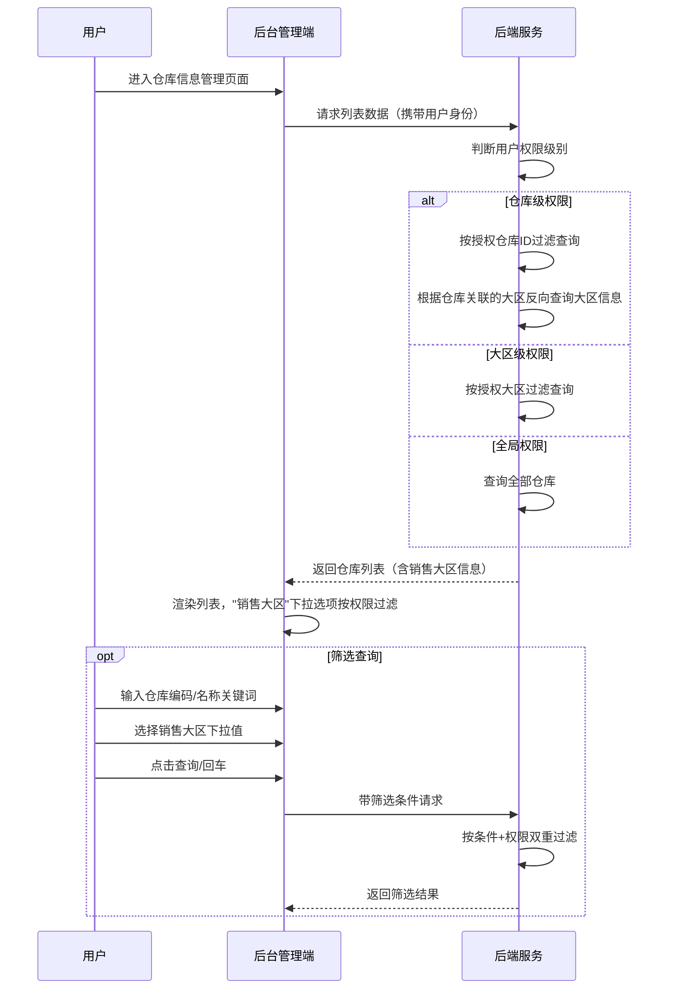
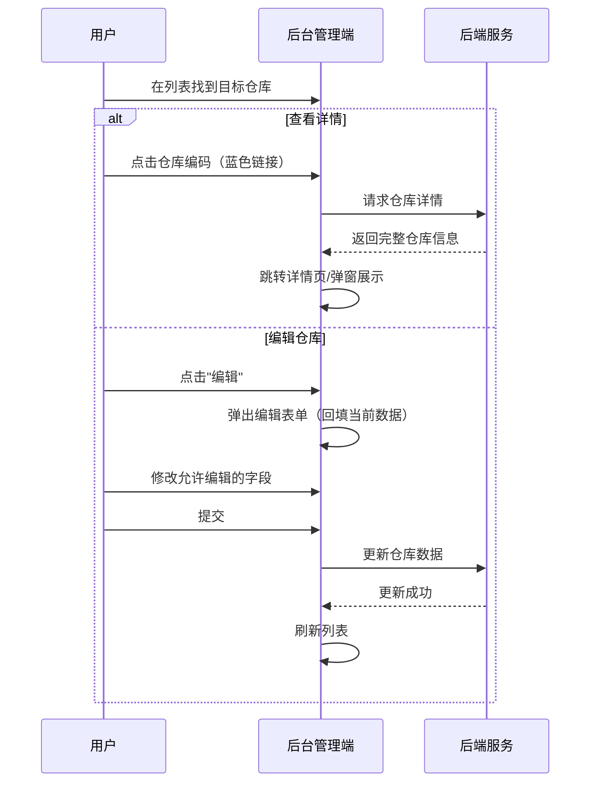
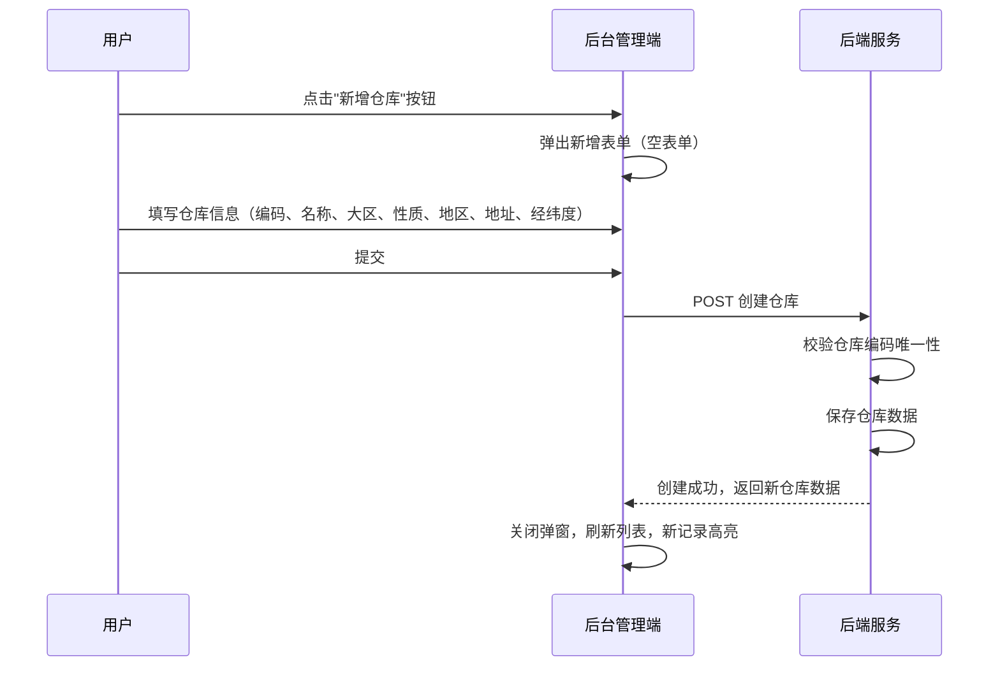

# 仓库信息管理模块 SPEC

> **归属中心**：07-运营中心
> **模块**：仓库信息管理
> **版本**：v1.0
> **更新日期**：2026-06-30

------

## 1. 背景与目标 (Background & Objectives)

**背景**：仓库作为供应链核心节点，需要与销售大区进行关联绑定，以便订单路由、配送范围计算和库存寻源。

**目标**：在仓库管理基础上新增"销售大区"维度的展示列与查询筛选项，同时引入基于销售大区和仓库级别的数据权限控制，使仓库管理在运营维度上更加精细和可控。

------

## 2. 角色与使用场景 (Roles & Scenarios)

| 角色 | 说明 |
| --- | --- |
| 运营管理员 | 全局管理所有仓库信息，查看、编辑、筛选仓库 |
| 区域运营经理 | 仅能查看和管理管辖大区内的仓库数据 |
| 仓管人员 | 仅能查看和管理被授权仓库的数据 |

**使用场景**：

- 作为运营管理员，我可以通过仓库编码/名称快速检索到目标仓库，查看其关联的销售大区。
- 作为运营管理员，我可以通过销售大区下拉筛选，查看该大区下所有仓库的列表。
- 作为区域运营经理，我登录后搜索"销售大区"下拉仅显示我管辖的大区，列表自动过滤为权限范围内的仓库。
- 作为仓管人员，我被分配了特定仓库的权限，登录后只能看到授权仓库，且大区信息由仓库反向推导展示。
- 作为运营管理员，我点击仓库编码可跳转查看仓库详情，点击编辑可修改仓库信息。
- 作为运营管理员，我可以点击"新增仓库"按钮，填写仓库信息后创建新仓库。

------

## 3. 核心业务流程 (Core Business Flow)

### 3.1 仓库查询流程



### 3.2 仓库详情与编辑流程



### 3.3 新增仓库流程



### 迭代变更说明

本次迭代为仓库管理增加销售大区维度，编辑功能与原有逻辑保持一致（特殊标注）。

------

## 4. 界面与交互说明 (UI & Interaction)

### 4.1 页面布局

```
┌──────────────────────────────────────────────────────────────┐
│  仓库信息：[仓库编码/名称____]   销售大区：[全部 ▼]          │
├──────────────────────────────────────────────────────────────┤
│  表格列表（11列数据 + 操作列）                                │
│  ┌──────┬──────┬──────┬──────┬────┬──────┬──────┬ ... ┐    │
│  │仓库  │仓库  │销售  │仓库  │仓库  │仓库  │经度  │ ... │    │
│  │编码  │名称  │大区  │性质  │地区  │地址  │      │     │    │
│  ├──────┼──────┼──────┼──────┼──────┼──────┼──────┼ ... ┤    │
│  │D011  │某某  │海南区│蔬果仓│海南省│详细  │坐标  │ ... │编辑│    │
│  │      │仓库  │      │      │海口市│地址  │      │     │    │
│  │      │      │      │      │龙华区│      │      │     │    │
│  └──────┴──────┴──────┴──────┴────┴──────┴──────┴ ... ┘    │
└──────────────────────────────────────────────────────────────┘
```

### 4.2 搜索区字段

| 字段名 | 组件类型 | Placeholder/默认值 | 说明 |
| --- | --- | --- | --- |
| 仓库信息 | 文本输入框 | `仓库编码/名称` | 支持编码或名称模糊检索 |
| 销售大区 | 下拉单选 | `全部` | 选项受用户权限过滤（本次新增） |

### 4.3 工具栏与列表操作

- **新增仓库**：工具栏右侧"新增仓库"按钮，点击弹出新增表单
- **仓库编码**：蓝色链接样式，点击弹框显示仓库编辑详情
- **编辑**：蓝色文字按钮，点击弹出编辑表单

### 4.4 极限状态

- **空数据状态**：列表无数据时展示"暂无数据"空状态占位图
- **加载状态**：列表表格展示骨架屏或 loading 动画
- **数据极多**：列表分页展示，默认每页 20 条

------

## 5. 数据字典与字段级规则 (Data & Field Rules)

### 5.1 列表字段

| 字段名称 | 字段类型 | 来源/依赖 | 默认值 | 读写权限 | 校验规则与约束 | 说明 |
| :--- | :--- | :--- | :--- | :--- | :--- | :--- |
| 仓库编码 | String | 新增时输入 | - | 只读（列表） | 唯一 |  |
| 仓库名称 | String | 新增/编辑时输入 | - | 可编辑 | 必填 | - |
| 销售大区 | String | 新增/编辑时输入 | - | 可编辑 | 必填 |  |
| 仓库性质 | Enum | 新增/编辑时选择 | - | 可编辑 | 枚举：蔬果仓、猪肉仓等，取字典配置 | - |
| 仓库地区 | String | 省/市/区级联选择 | - | 可编辑 | 级联选择后自动拼接为"省 市 区"格式展示 | 列表展示时将省、市、区拼接为一个字段 |
| 仓库地址 | String | 新增/编辑时输入 | - | 可编辑 | - | 详细地址 |
| 经度 | Decimal | 地图选点 | - | 可编辑 | 范围 -180~180 | 地图定位用 |
| 纬度 | Decimal | 地图选点 | - | 可编辑 | 范围 -90~90 | 地图定位用 |
| 修改人 | String | 系统记录 | - | 只读 | 当前登录用户 | - |
| 修改时间 | DateTime | 系统记录 | - | 只读 | 格式 YYYY-MM-DD HH:mm:ss | - |

### 5.2 新增与编辑逻辑

- 点击"新增仓库"弹出空表单，仓库编码可输入
- 点击"编辑"弹出编辑表单，回填当前数据
- 仓库编码创建后不可修改，新增时需校验唯一性
- 仓库与销售大区的关联关系通过表单中的大区选择器维护
- 修改人和修改时间由系统自动记录

### 5.3 展示逻辑

- 仓库编码以蓝色链接样式展示，点击弹框显示仓库编辑详情
- 仓库地区由省、市、区拼接为一个字段展示（如"广东省 广州市 白云区"），新增/编辑时通过级联选择器选择
- 经纬度保留 6 位小数

------

## 6. 系统交互与边界 (System Integrations & Boundaries)

### 6.1 前置依赖

- 需先完成销售大区管理模块的数据维护（仓库关联大区下拉来源）
- 用户权限体系需已配置完成（数据权限过滤依赖）

### 6.2 上下游影响

- **上游**：销售大区表提供"销售大区"下拉选项数据源
- **下游**：仓库编码被订单路由、库存寻源、配送范围计算等模块引用
- **大区关联**：仓库关联大区后，影响订单按大区的路由分配逻辑
- **编辑兼容**：本次迭代不修改编辑表单逻辑，仅新增列表列和筛选条件

------

## 7. 非功能性需求 (Non-Functional Requirements)

### 7.1 权限与安全

- **大区级权限**：列表中的"销售大区"列数据及搜索下拉选项均按用户大区权限过滤，用户只能看到管辖范围内的数据
- **仓库级权限**：当用户权限精确到具体仓库时：
  - 列表数据直接按授权仓库 ID 过滤查询
  - 列表及搜索中的大区信息，通过授权仓库反向查询其所属大区后展示
- **全局权限**：超级管理员无过滤限制

### 7.2 性能要求

- 列表查询需考虑仓库级权限反向查询大区的查询效率，建议对仓库-大区关联关系做缓存或 JOIN 优化

------

## 8. 附录

### 8.1 与销售大区管理的关系

本模块的"销售大区"数据来源于销售大区管理模块。一个仓库只关联一个大区，多个仓库可以关联同一个大区
