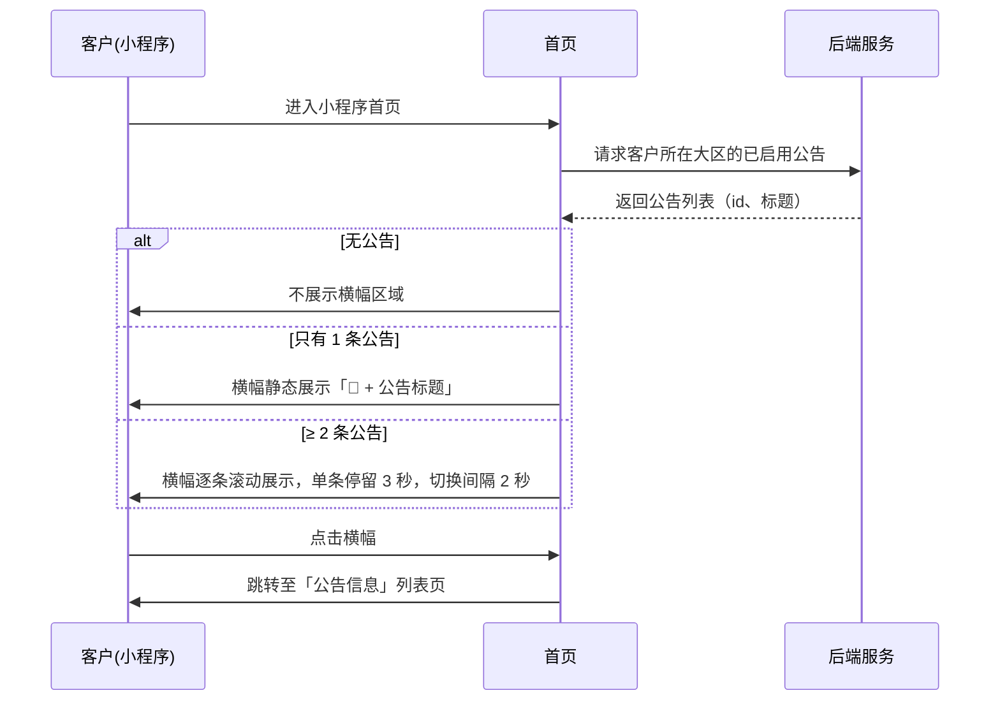
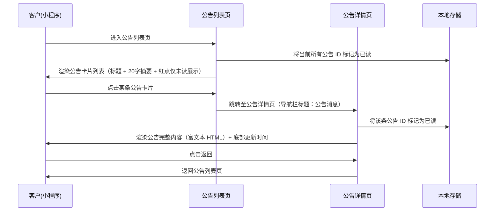
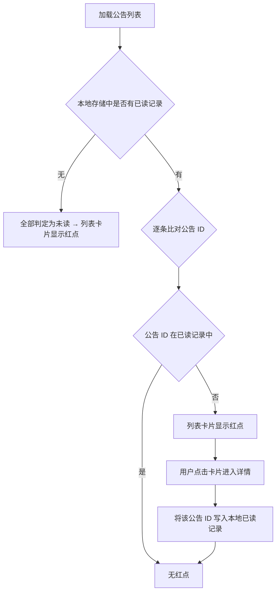

# 消息公告-小程序 SPEC

> **归属中心**：07-运营中心
> **子模块**：公告管理
> **终端**：小程序端
> **版本**：v2.0
> **更新日期**：2026-07-07
>
> - **小程序端**：在首页客户信息行下方展示公告滚动横幅（仅图标+标题），点击横幅进入公告列表页，再点击卡片进入详情页。
> - **后台端**：公告的创建、编辑、启用/禁用由运营管理员在后台维护，详见 [公告管理.md](./公告管理.md)。

------

## 1. 背景与目标 (Background & Objectives)

**背景**：运营管理员已在后台按销售大区配置并发布了公告。B 端客户进入小程序首页后，在客户名称下方、品类页签上方看到一条公告横幅，自动轮播所在大区的已启用公告标题。

**目标**：横幅仅展示图标+公告标题，简洁不打扰。客户点击横幅后进入「公告信息」列表页，通过卡片列表浏览全部公告，再点击单条卡片查看完整内容（导航栏标题为「公告消息」）。未读公告在列表卡片上以红点标识，已读后红点消失。

**核心交互流**：
```
首页横幅（图标+标题） → 点击 → 公告列表（卡片+红点） → 点击卡片 → 公告详情（导航栏标题：公告消息）
```

------

## 2. 角色与使用场景 (Roles & Scenarios)

| 角色 | 说明 |
| --- | --- |
| B 端客户 | 已登录小程序的客户，查看所在大区的消息公告 |

**使用场景**：

- 作为 B 端客户，我进入小程序首页后，在客户名称下方看到一条公告横幅（仅📢图标+公告标题），自动轮播我所在大区的已启用公告。
- 作为 B 端客户，当有多条公告时，横幅自动逐条滚动播放，滚动速度缓慢，我有足够时间阅读每条公告的标题。
- 作为 B 端客户，我点击首页公告横幅后进入「公告信息」列表页，看到全部公告以卡片列表展示，每张卡片包含标题和 20 字摘要。
- 作为 B 端客户，我在公告列表页中，未读公告的卡片上有红点标识；点击卡片进入详情页后该公告标记为已读。
- 作为 B 端客户，我在公告详情页（导航栏标题为「公告消息」）查看公告的完整内容（支持富文本 HTML 渲染），阅读完毕后返回列表页。

------

## 3. 核心业务流程 (Core Business Flow)

### 3.1 首页横幅 → 公告列表



### 3.2 公告列表 → 公告详情



### 3.3 红点（未读）判定逻辑



**说明**：
- 已读记录以公告 ID 集合的形式存储在小程序本地存储中
- 用户点击首页横幅进入公告列表 → 该大区当前所有已启用公告标记为已读
- 用户点击单条公告卡片进入详情 → 该条公告标记为已读
- **红点仅在列表页卡片上展示**，首页横幅和详情页均不展示红点

### 3.4 异常流与逆向流

| 异常场景 | 触发条件 | 系统处理方式 |
| --- | --- | --- |
| 无公告 | 客户所在大区无已启用公告 | 首页不展示横幅区域 |
| 网络请求失败 | 请求超时或失败 | 首页不展示横幅（静默失败）；公告列表页展示「加载失败，请下拉重试」 |
| 未登录 | 客户未登录或登录态过期 | 不请求公告接口，不展示横幅 |
| 公告内容为空 | 后台保存了公告但内容为空 | 详情页展示「暂无内容」 |
| 客户无归属大区 | 客户未绑定销售大区 | 不展示横幅和公告 |

------

## 4. 界面与交互说明 (UI & Interaction)

### 4.1 首页公告横幅（位于首页，非公告列表页）

#### 4.1.1 位置与布局

横幅位于首页客户信息行（张记食堂）下方、品类页签上方：

```
┌─────────────────────────────────┐
│  🏠 钱鲜达           🔍 搜索... │  ← 品牌行 + 搜索栏
├─────────────────────────────────┤
│  张记食堂                    ›   │  ← 客户信息行
├─────────────────────────────────┤
│  ┌─────────────────────────┐    │
│  │ 📢 每日满500元享95折优惠       │    │  ← 公告横幅（图标+标题，无红点）
│  └─────────────────────────┘    │
├─────────────────────────────────┤
│  全部  蔬菜  水果  海鲜  冻品... │  ← 品类页签
├─────────────────────────────────┤
│  （商品列表）                     │
└─────────────────────────────────┘
```

#### 4.1.2 横幅规格

| 属性 | 说明 |
| --- | --- |
| 宽度 | 满宽，左右各 12px 边距 |
| 高度 | 约 40px |
| 背景色 | 浅红色底（`#fef2f2`） |
| 左侧图标 | 📢 喇叭图标 |
| 文本 | 当前公告标题，单行展示，超出省略号截断 |
| 点击区域 | 整条横幅可点击，点击后跳转至公告列表页 |
| 圆角 | 8px |
| 红点 | **不展示** |

#### 4.1.3 滚动规则

| 规则 | 说明 |
| --- | --- |
| 1 条公告 | 静态展示，不滚动 |
| ≥ 2 条公告 | 自动逐条滚动播放 |
| 单条展示时长 | 3 秒 |
| 切换间隔 | 2 秒 |
| 切换动画 | 淡入淡出，速度缓慢柔和 |
| 循环 | 轮播到末尾后回到第一条，持续循环 |
| 暂停 | 手指触摸横幅时暂停轮播，松开后继续 |

### 4.2 公告列表页

> 点击首页横幅后进入，页面自带顶部导航栏，标题为「公告信息」。

#### 4.2.1 整体布局

```
┌─────────────────────────────────┐
│  ← 公告信息                      │  ← 导航栏
├─────────────────────────────────┤
│                                 │
│  ┌─────────────────────────┐   │
│  │  📢 每日满500元享95折优惠   │   │  ← 公告卡片（已读，无红点）
│  │  为回馈广大客户，每日订...  │   │
│  │                      ›   │   │
│  └─────────────────────────┘   │
│                                 │
│  ┌─────────────────────────┐   │
│  │  📢 新客户首单8折优惠  🔴  │   │  ← 公告卡片（未读，有红点）
│  │  欢迎新客户加入！首单...  │   │
│  │                      ›   │   │
│  └─────────────────────────┘   │
│                                 │
│  ┌─────────────────────────┐   │
│  │  📢 春节期间物流调整通知   │   │  ← 公告卡片（已读，无红点）
│  │  春节期间（1月28日至2...  │   │
│  │                      ›   │   │
│  └─────────────────────────┘   │
│                                 │
└─────────────────────────────────┘
```

#### 4.2.2 公告卡片

| 序号 | 信息项 | 说明 |
| --- | --- | --- |
| 1 | 左侧图标 | 📢 喇叭图标 |
| 2 | 公告标题 | 卡片主体，加粗，单行展示 |
| 3 | 红点 | 标题右侧，直径 8px 红色圆点（`#dc2626`），**仅未读公告展示** |
| 4 | 内容摘要 | 标题下方灰色文字，截取纯文本前 20 字，超出省略号 |
| 5 | 右箭头 › | 卡片右侧，暗示可点击进入详情 |

**排序规则**：按后台更新时间倒序排列。

**交互**：点击卡片 → 跳转至公告详情页；进入时将本条公告 ID 标记为已读。

### 4.3 公告详情页

> 点击列表页卡片后进入，页面自带顶部导航栏，标题固定为「**公告消息**」。

#### 4.3.1 整体布局

```
┌─────────────────────────────────┐
│  ← 公告消息                      │  ← 导航栏标题固定为「公告消息」
├─────────────────────────────────┤
│                                 │
│  ┌─────────────────────────┐   │
│  │                         │   │
│  │  （富文本 HTML 渲染区）    │   │
│  │                         │   │
│  │  完整的公告内容，          │   │
│  │  包含文字样式、段落等      │   │
│  │                         │   │
│  └─────────────────────────┘   │
│                                 │
│  更新时间：2026-07-01 14:20      │  ← 底部展示
│                                 │
└─────────────────────────────────┘
```

#### 4.3.2 详情页说明

| 信息项 | 说明 |
| --- | --- |
| 导航栏 | 标题固定为「**公告消息**」，左侧返回箭头 |
| 文档内容 | 使用 `rich-text` 组件渲染后端返回的 HTML 内容 |
| 更新时间 | 页面底部灰色辅助文字 |

**交互**：
- 点击返回箭头 → 返回公告列表页
- 进入详情页时，将当前公告 ID 写入本地已读记录

### 4.4 导航与框架约束

| 规则 | 说明 |
| --- | --- |
| 页面自带导航栏 | 列表页和详情页均自带顶部导航栏 |
| 导航栏仅含两个元素 | 左侧返回箭头 + 居中标题 |
| 列表页返回行为 | 点击返回箭头 → 通知父框架返回首页 Tab |
| 详情页返回行为 | 点击返回箭头 → 页面内部切回列表视图 |

### 4.5 极限状态

#### 4.5.1 首页无公告

客户所在大区无已启用公告时，首页横幅区域**不展示**（完全隐藏，不占用空间）。

#### 4.5.2 公告列表为空

手动进入公告列表页但无公告时：

```
┌─────────────────────────────────┐
│  ← 公告信息                      │
├─────────────────────────────────┤
│                                 │
│          📢                     │
│                                 │
│       暂无公告                    │
│                                 │
└─────────────────────────────────┘
```

#### 4.5.3 加载状态

- **首页横幅**：请求未返回时不展示横幅（避免闪烁），数据就绪后平滑出现
- **公告列表页**：卡片区域展示骨架屏（2-3 个灰色色块占位），数据返回后替换

#### 4.5.4 数据量

公告数量通常较少（每个大区 ≤ 10 条），一次性加载全部数据，不分页。

------

## 5. 数据字典与字段级规则 (Data & Field Rules)

### 5.1 接口响应字段

#### 5.1.1 公告列表接口（首页横幅 & 列表页共用）

| 字段名称 | 字段类型 | 来源 | 说明 |
| :--- | :--- | :--- | :--- |
| 公告ID | Long | 公告主表 | 唯一标识 |
| 公告标题 | String | 公告主表 | 横幅和卡片标题展示 |
| 公告摘要 | String | 公告主表 | 纯文本，列表页卡片展示前 20 字 |
| 更新时间 | DateTime | 公告主表 | 排序和详情页底部展示 |

#### 5.1.2 公告详情接口

| 字段名称 | 字段类型 | 来源 | 说明 |
| :--- | :--- | :--- | :--- |
| 公告ID | Long | 公告主表 | 唯一标识 |
| 公告标题 | String | 公告主表 | 详情页内容区标题展示 |
| 公告内容 | String(HTML) | 公告主表 | 完整 HTML 内容，通过 rich-text 渲染 |
| 销售大区 | String | 公告主表 | 公告关联的销售大区名称 |
| 更新时间 | DateTime | 公告主表 | 页面底部展示 |

### 5.2 展示逻辑

| 展示项 | 格式/规则 |
| --- | --- |
| 首页横幅 | 📢 + 公告标题，单行滚动，无红点 |
| 公告标题（卡片） | 加粗单行展示 |
| 内容摘要 | 列表卡片中截取纯文本前 20 字，超出以 `...` 省略 |
| 公告内容 | 详情页使用 `rich-text` 组件渲染 HTML |
| 更新时间 | 格式 `YYYY-MM-DD HH:mm` |
| 红点 | 仅列表页卡片展示，直径 8px，`#dc2626` |

### 5.3 数据过滤规则

| 规则 | 说明 |
| --- | --- |
| 按大区过滤 | 仅拉取客户所属销售大区的公告 |
| 仅已启用公告 | `status = 启用` 的公告才展示 |
| 客户无大区 | 不请求公告接口，不展示横幅 |

### 5.4 未读判定规则

| 规则 | 说明 |
| --- | --- |
| 存储方式 | 小程序本地存储（`wx.setStorageSync`），key 为 `read_announcement_ids` |
| 存储内容 | JSON 数组，存储已读公告 ID 列表 |
| 判定逻辑 | 公告 ID 不在已读列表 → 未读 → 列表卡片显示红点 |
| 标记已读时机 | (1) 点击首页横幅进入列表页 → 全部标记已读 (2) 点击单条卡片进入详情 → 该条标记已读 |
| 红点刷新 | 标记已读后，列表页对应卡片红点即时消失 |

### 5.5 编辑逻辑

小程序端对公告**无编辑权限**，所有字段均为只读展示。公告的创建、编辑、启用/禁用均由后台端管理。

------

## 6. 系统交互与边界 (System Integrations & Boundaries)

### 6.1 前置依赖

| 依赖项 | 说明 |
| --- | --- |
| 公告管理模块（后台） | 公告的创建、编辑、启用/禁用，详见 [公告管理.md](./公告管理.md) |
| 后台需新增「公告标题」字段 | 当前后台公告管理仅有「公告内容」字段，需新增独立的「公告标题」字段 |
| 客户认证模块 | 客户需登录后才能查看公告 |
| 销售大区管理 | 客户所属大区来源于销售大区模块，公告按大区过滤 |

### 6.2 下游影响

无。公告为单向推送展示，不与其他业务模块产生数据联动。

### 6.3 接口定义

| 接口功能 | 方法 | 路径 | 说明 |
| --- | --- | --- | --- |
| 首页公告横幅 | GET | `/api/announcement/banner` | 根据客户所属大区返回已启用公告列表（id、标题） |
| 公告列表 | GET | `/api/announcement/list` | 返回全量已启用公告（id、标题、摘要、更新时间） |
| 公告详情 | GET | `/api/announcement/{id}` | 返回公告完整内容（标题、HTML 内容、大区、更新时间） |

**公告列表响应结构**：
```json
{
  "announcements": [
    {
      "id": 1,
      "title": "每日满500元享95折优惠",
      "summary": "为回馈广大客户，每日订单满500元即可享受95折优惠。",
      "updatedAt": "2026-07-01 14:20:00"
    }
  ]
}
```

**公告详情响应结构**：
```json
{
  "id": 1,
  "title": "每日满500元享95折优惠",
  "content": "<p>为回馈广大客户，即日起每日订单满500元即可享受95折优惠...</p>",
  "region": "华南大区",
  "updatedAt": "2026-07-01 14:20:00"
}
```

------

## 7. 非功能性需求 (Non-Functional Requirements)

### 7.1 性能要求

| 指标 | 要求 |
| --- | --- |
| 首页横幅接口响应 | < 300ms（不阻塞首页渲染） |
| 公告列表接口响应 | < 300ms |
| 公告详情接口响应 | < 500ms |
| 横幅滚动动画 | 60fps，无卡顿 |

### 7.2 权限与安全

| 层级 | 说明 |
| --- | --- |
| 操作权限 | 需登录后访问，未登录不请求公告接口 |
| 数据权限 | 仅拉取客户所属销售大区的已启用公告，不可跨大区查看 |

------

## 8. 输出文档需求

```
spec/
└── 07-运营管理/
    ├── 公告管理.md              ← 后台端 SPEC
    ├── 公告管理-原型.html        ← 后台端原型
    ├── 公告-小程序.md           ← 本文档（小程序端 SPEC）
    └── 公告-小程序-原型.html     ← 小程序端原型
```

### 8.1 后台需配套修改

> ⚠️ 本小程序端 SPEC 依赖后台公告管理新增「公告标题」字段：

| 改动项 | 说明 |
| --- | --- |
| 数据库 | 公告表新增 `title` 字段（VARCHAR 100） |
| 新增/编辑弹窗 | 新增「公告标题」输入框（必填，最长 50 字），放在「销售大区」下方、「公告内容」上方 |
| 列表展示 | 列表增加「公告标题」列，展示在「销售大区」右侧 |
| 接口响应 | 公告列表和详情接口返回 `title` 字段 |
