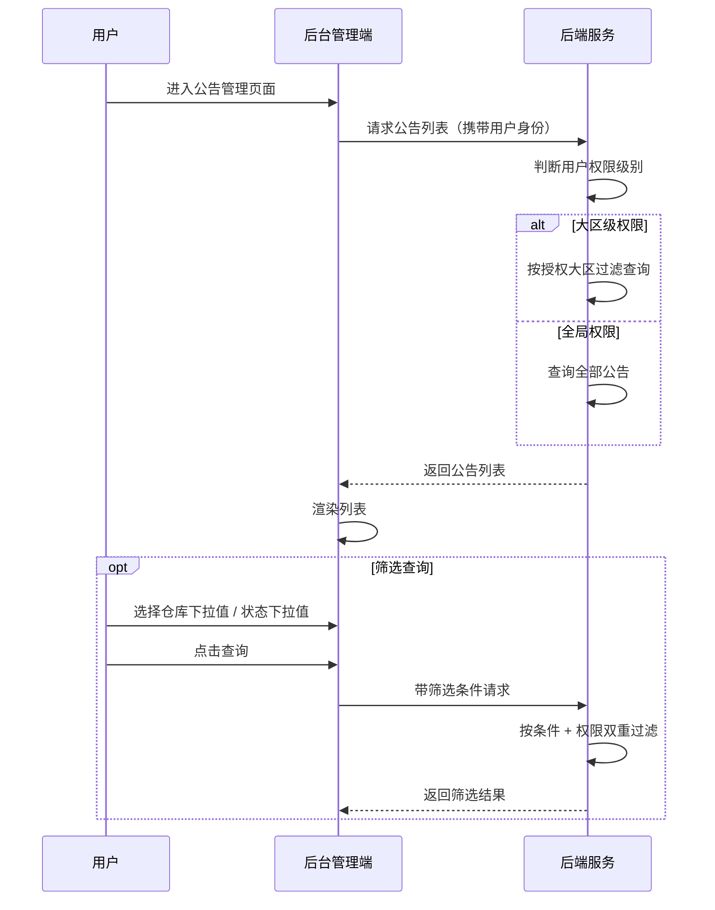
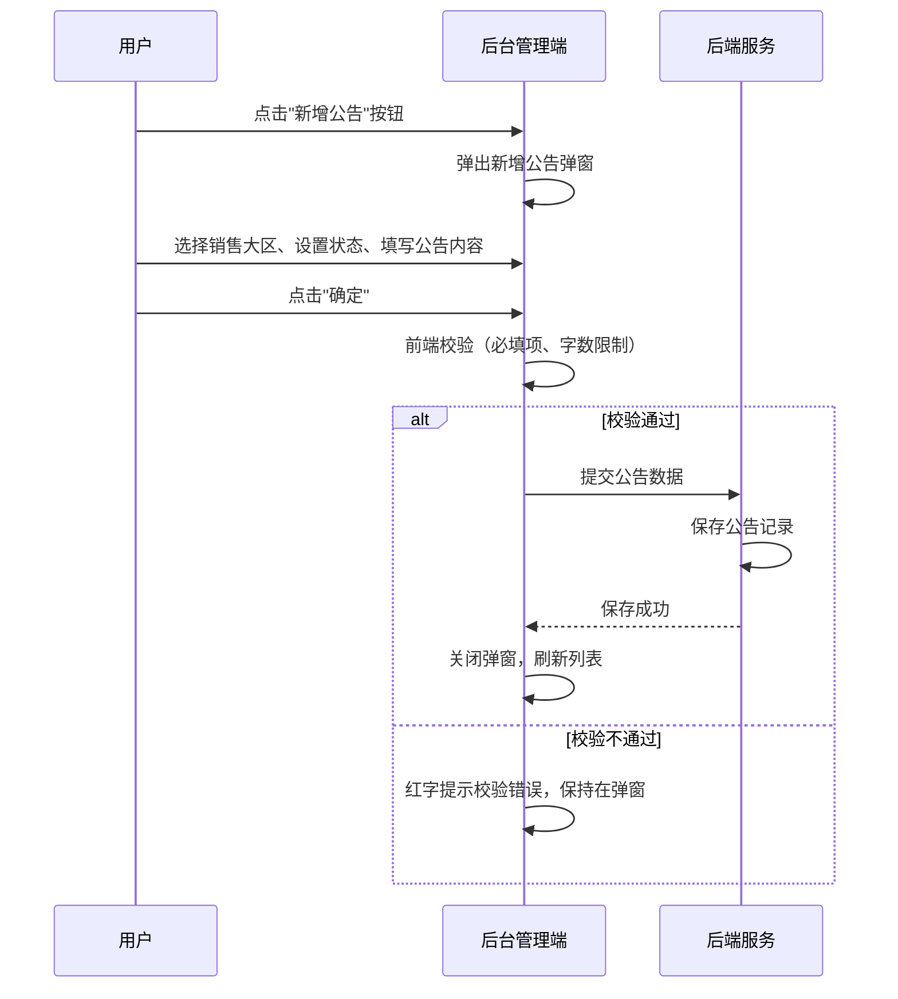
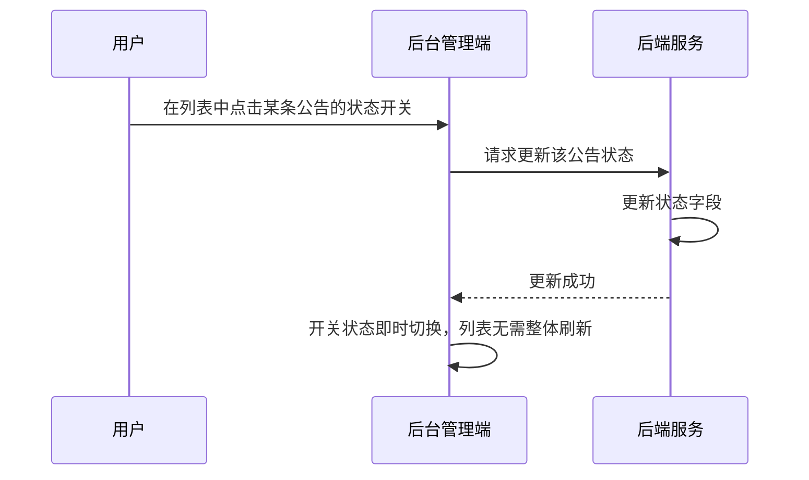
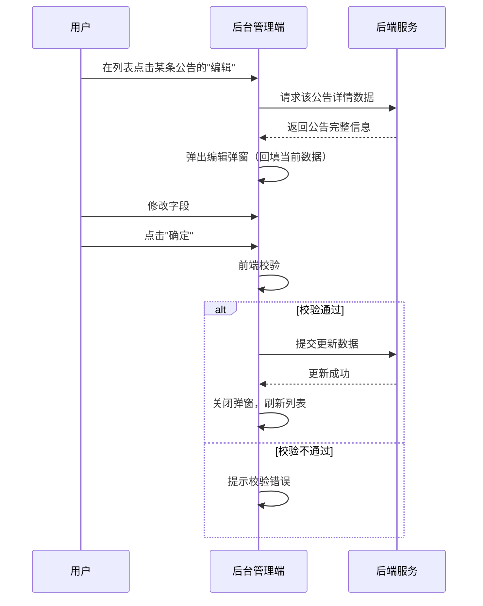

# 公告管理模块 SPEC

> **归属中心**：07-运营中心
> **模块**：公告管理
> **版本**：v1.0
> **更新日期**：2026-06-30

------

## 1. 背景与目标 (Background & Objectives)

**背景**：运营管理员需要按销售大区灵活配置公告内容，对不同区域的客户展示差异化的运营通知（如运费政策、促销信息、公告提醒等），以提升区域运营效率。

**目标**：提供后台公告配置能力，支持按销售大区维护公告内容，支持启用/禁用快速开关，公告数据推送至小程序消息公告模块展示。

------

## 2. 角色与使用场景 (Roles & Scenarios)

| 角色 | 说明 |
| --- | --- |
| 运营管理员 | 全局管理所有大区的公告，新增、编辑、筛选、启停公告 |
| 区域运营经理 | 仅能查看和管理管辖大区内的公告数据 |

**使用场景**：

- 作为运营管理员，我可以通过仓库和状态下拉筛选快速定位目标公告。
- 作为运营管理员，我可以在列表中直接开关公告状态，无需进入编辑页。
- 作为运营管理员，我点击"新增公告"按钮，填写大区、状态和公告内容后提交，列表自动刷新。
- 作为运营管理员，我点击某条公告的"编辑"，弹出编辑表单并回显当前数据，修改后提交即可更新。
- 作为区域运营经理，我登录后仅能查看和操作管辖大区内的公告。

------

## 3. 核心业务流程 (Core Business Flow)

### 3.1 公告查询流程



### 3.2 公告新增流程



### 3.3 快捷状态修改流程



### 3.4 公告编辑流程



------

## 4. 界面与交互说明 (UI & Interaction)

### 4.1 页面布局

```
┌──────────────────────────────────────────────────────────────────┐
│  公告管理                                                        │
├──────────────────────────────────────────────────────────────────┤
│  搜索区                                                          │
│  销售大区：[全部 ▼]    状态：[全部 ▼]    [查询]                      │
├──────────────────────────────────────────────────────────────────┤
│  列表区                                          [新增公告]       │
│  ┌──────────┬──────────────┬──────┬────────┬──────────┬──────┐  │
│  │ 销售大区  │ 公告内容      │ 状态  │ 更新人  │ 更新时间   │ 操作 │  │
│  ├──────────┼──────────────┼──────┼────────┼──────────┼──────┤  │
│  │ 海南区    │ 每日满500元.. │ 启用（标签） │ 张三   │2026-06-..│ 编辑 │  │
│  │ 广深区    │ 新客户首单..  │ 禁用（标签）│ 李四   │2026-06-..│ 编辑 │  │
│  └──────────┴──────────────┴──────┴────────┴──────────┴──────┘  │
│                                                    [分页组件]     │
└──────────────────────────────────────────────────────────────────┘
```

### 4.2 搜索区字段

| 字段名 | 组件类型 | Placeholder/默认值 | 说明 |
| --- | --- | --- | --- |
| 销售大区 | 下拉单选 | `全部` | 按销售大区维度筛选公告，选项来源于销售大区管理模块 |
| 状态 | 下拉单选 | `全部` | 枚举值：全部 / 启用 / 禁用 |

### 4.3 列表操作

- **编辑**：蓝色文字链接，点击弹出编辑弹窗，回填当前数据
- **新增公告**：列表区右上角按钮，点击弹出空白新增弹窗

### 4.4 新增/编辑弹窗字段

| 字段名 | 组件类型 | 必填 | 占位提示/默认值 | 说明 |
| --- | --- | --- | --- | --- |
| 销售大区 | 下拉单选 | 是 | - | 选择公告适用的销售大区 |
| 状态 | 单选组件 | 是 | 默认开启 | 控制公告是否生效 |
| 公告内容 | 富文本/多行文本 | 是 | `最多输入500字符` | 支持富文本编辑，限制 500 字符 |

### 4.5 弹窗操作按钮

- **取消按钮**：关闭弹窗，放弃当前编辑，不保存
- **确定按钮**：校验表单并提交保存，成功后关闭弹窗并刷新列表

### 4.6 极限状态

- **空数据状态**：列表无数据时展示"暂无数据"空状态占位图
- **加载状态**：列表加载时展示骨架屏或 loading 动画
- **数据极多**：列表分页展示，默认每页 20 条

------

## 5. 数据字典与字段级规则 (Data & Field Rules)

### 5.1 列表字段

| 字段名称 | 字段类型 | 来源/依赖 | 默认值 | 读写权限 | 校验规则与约束 | 说明 |
| :--- | :--- | :--- | :--- | :--- | :--- | :--- |
| id | Long | 系统生成 | - | 只读 | 主键 | 公告唯一标识 |
| 销售大区 | String | 销售大区管理模块，新增编辑时选择 | - | 可编辑（列表） | 必填 | 展示公告关联的销售大区名称 |
| 公告摘要 | String | 新增/编辑时根据具体内容提交后自动截取 | - | 只读（列表） | 非必填，最大 200 字符 | 超出长度以省略号截断展示 |
| 公告内容 | txt | 新增/编辑时输入 | - | 可编辑 | 必填 | 超出长度以省略号截断展示 |
| 状态 | Boolean | 新增/编辑时设置 | true | 可编辑（开关） | true=启用, false=禁用 | 绿色=启用，红色=禁用 |
| 更新人 | String | 系统记录 | - | 只读 | 当前登录用户 | 最后一次修改人 |
| 更新时间 | DateTime | 系统记录 | - | 只读 | 格式 YYYY-MM-DD HH:mm:ss | 最后一次修改时间 |

### 5.2 展示逻辑

- 公告内容列超出长度时以省略号 (...) 截断展示
- 状态列使用开关组件：绿色（启用） / 红色（禁用）
- 更新时间格式：`YYYY-MM-DD HH:mm:ss`
- 编辑操作为蓝色文字链接

### 5.3 编辑逻辑

- 点击"编辑"弹出编辑弹窗，回填当前公告的全部字段数据
- 点击"新增公告"弹出空白新增弹窗，状态默认开启
- 公告内容支持富文本编辑
- 提交时前端校验：销售大区、状态、公告内容均必填，公告内容不超过 500 字符
- 弹窗可通过"取消"按钮、关闭图标或点击遮罩层关闭

------

## 6. 系统交互与边界 (System Integrations & Boundaries)

### 6.1 前置依赖

- 销售大区管理模块需先完成数据维护（公告的销售大区下拉数据源）
- 用户权限体系需已配置完成（大区级数据权限过滤依赖）

### 6.2 上下游影响

- **上游**：销售大区模块提供"销售大区"下拉选项；
- **下游**：公告数据推送至小程序"消息公告"模块，客户在小程序首页轮播公告及公告列表页查看
- **权限联动**：公告列表按用户的大区权限过滤，区域运营经理仅能看到管辖大区的公告

------

## 7. 非功能性需求 (Non-Functional Requirements)

### 7.1 权限与安全

- **大区级权限**：列表数据及操作均按用户大区权限过滤，用户只能看到和操作管辖范围内的公告
- **操作权限**：新增、编辑、状态切换受 RBAC 控制

### 7.2 性能要求

- 列表查询需考虑大区权限过滤效率，建议对大区-公告关联做索引优化
- 状态切换为轻量级操作，无需全列表刷新

------

## 8. 附录

### 8.1 与消息公告（小程序端）的关系

本模块为后台管理端公告配置入口。公告发布后，小程序端通过"消息公告"模块展示：
- 小程序首页轮播展示启用状态的公告
- 消息公告列表页展示全部公告及 HTML 富文本内容

### 8.2 与销售大区管理的关系

公告按销售大区维度进行差异化配置。一个公告关联一个销售大区，一个销售大区可有多条公告。销售大区下拉选项数据来源于销售大区管理模块。
