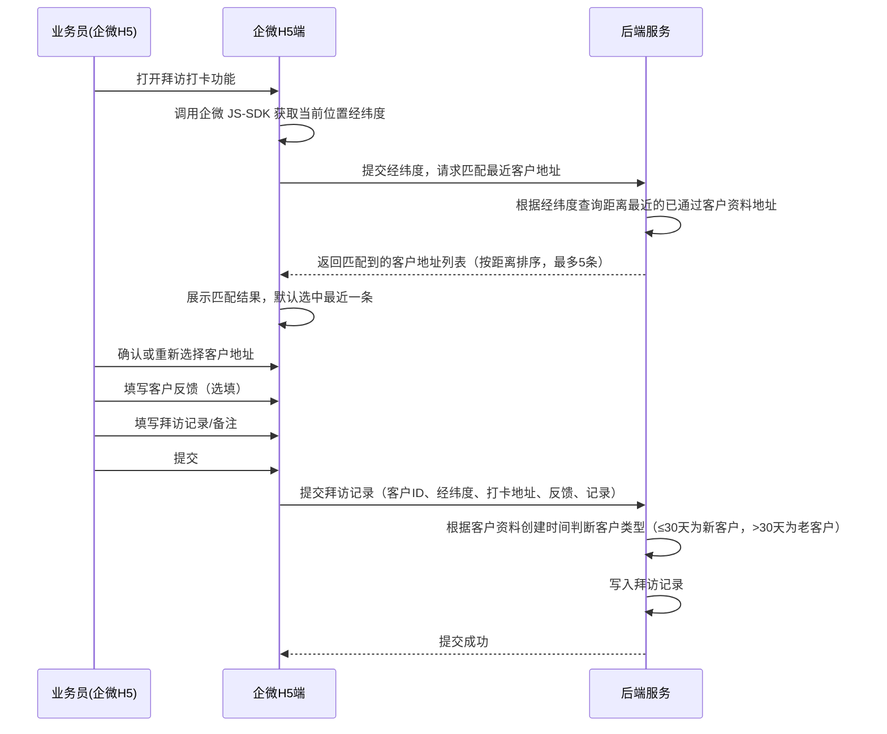
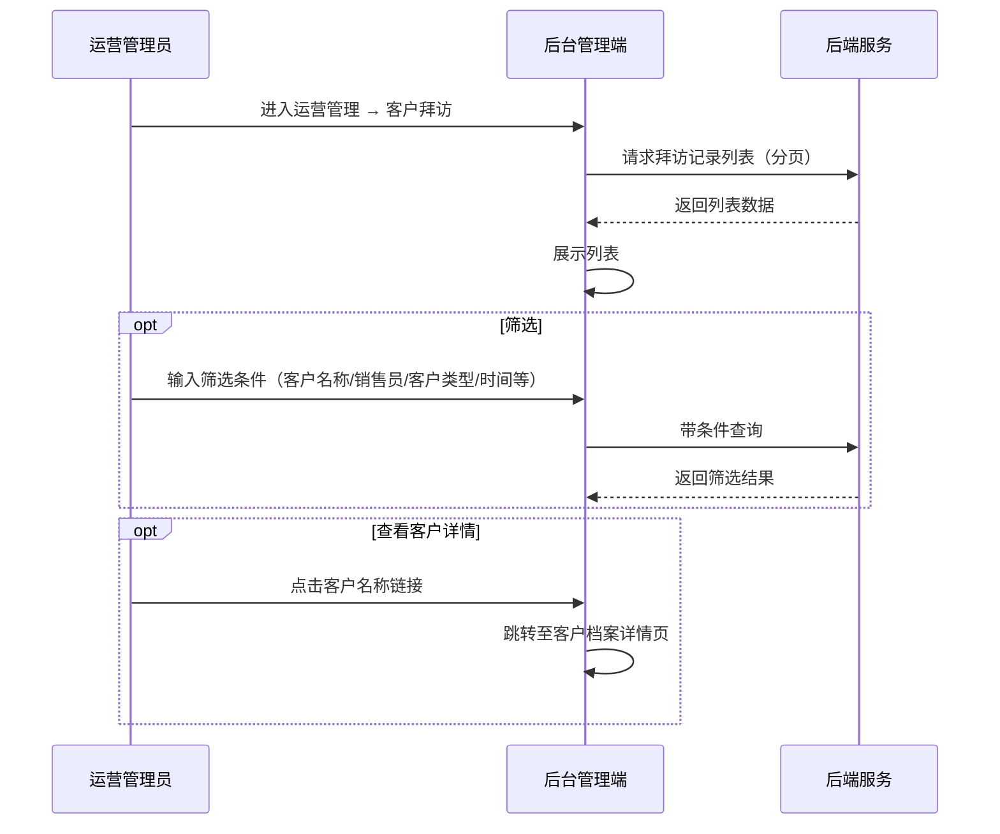

# 客户拜访管理模块 SPEC

> **归属中心**：07-运营管理中心
> **模块**：客户拜访管理
> **版本**：v1.0
> **更新日期**：2026-07-01

------

## 1. 背景与目标 (Background & Objectives)

**背景**：业务员需要定期或不定期上门拜访客户，了解客户经营状况、收集客户反馈，维护客情关系。拜访分为新客拜访和老客拜访，需要记录拜访时间、打卡位置、客户反馈等信息，便于运营管理员追踪业务员的拜访执行情况和客户满意度。

**目标**：为业务员提供企微端的拜访打卡能力（含定位自动匹配客户地址、客户反馈录入），为运营管理员提供后台端的拜访记录全量查询能力，打通"业务员上门 → 定位打卡 → 匹配客户 → 提交反馈 → 后台查看"的完整链路。

------

## 2. 角色与使用场景 (Roles & Scenarios)

| 角色 | 说明 |
| --- | --- |
| 业务员 | 通过企微 H5 端进行客户拜访打卡，提交客户反馈和拜访记录 |
| 运营管理员 | 在后台查看所有业务员的拜访记录，掌握拜访执行情况 |

**使用场景**：

- 作为业务员，我在企微 H5 端打开拜访打卡功能，系统自动定位获取当前位置，自动匹配距离最近的客户资料地址，我确认或修改匹配的客户后，填写客户反馈和拜访记录并提交。
- 作为业务员，我可以查看自己的拜访历史记录列表。
- 作为运营管理员，我在后台查看全量拜访记录，支持按客户名称、销售员、客户类型、时间范围等筛选，点击客户名称可跳转查看客户详情。

------

## 3. 核心业务流程 (Core Business Flow)

### 3.1 业务员拜访打卡流程（企微 H5 端）



### 3.2 后台查看拜访记录流程



### 3.3 客户类型判定规则

| 条件 | 客户类型 | 说明 |
| --- | --- | --- |
| 客户资料创建时间 ≤ 30天 | 新客户 | 以客户资料审核通过的创建时间为准 |
| 客户资料创建时间 > 30天 | 老客户 | - |

> 客户类型在拜访提交时由后端自动判定，无需业务员手动选择。

### 状态映射

| 状态字段 | 可选值 | 触发条件 |
| --- | --- | --- |
| 定位匹配状态 | 成功/失败 | 定位获取经纬度成功/失败 |

### 异常流与逆向流

| 异常场景 | 处理方式 |
| --- | --- |
| 定位失败（未授权或网络异常） | 提示"请授权定位或检查网络"，允许手动选择客户地址 |
| 定位成功但未匹配到附近客户 | 提示"未找到附近的客户地址"，允许手动搜索选择客户 |
| 匹配到多个客户地址 | 按距离排序展示，默认选中最近一条，业务员可切换选择 |
| 企微 SDK 初始化失败 | 提示"请在企业微信中打开"，降级为手动选择模式 |

------

## 4. 界面与交互说明 (UI & Interaction)

### 4.1 后台管理端 — 客户拜访记录列表

#### 4.1.1 列表页面布局

```
┌──────────────────────────────────────────────────────────────────────────────┐
│  客户拜访                                                                     │
├──────────────────────────────────────────────────────────────────────────────┤
│  客户名称：[___________]  销售员：[___________]  客户类型：[全部 ▼]            │
│  提交时间：[____-____]  [查询] [重置]                                          │
├──────────────────────────────────────────────────────────────────────────────┤
│  [导出]                                                                       │
├──────────────────────────────────────────────────────────────────────────────┤
│  ┌──────────┬────────┬──────┬──────────┬──────────┬──────────────┬──────────────┬────────┬────────┐│
│  │客户名称  │客户类型│联系人│联系电话  │  销售员  │ 提交拜访时间  │   打卡地址    │客户反馈│拜访记录││
│  ├──────────┼────────┼──────┼──────────┼──────────┼──────────────┼──────────────┼────────┼────────┤│
│  │金鹏员工食堂│ 老客户 │ 老板 │152****1693│ 钟秀辉   │2026-07-01    │广东省广州市  │        │拜访了解││
│  │          │        │      │          │          │21:07:44      │黄埔区联和... │        │经营状况││
│  ├──────────┼────────┼──────┼──────────┼──────────┼──────────────┼──────────────┼────────┼────────┤│
│  │ 农家土猪  │ 新客户 │ 邓   │186****6002│ 朱浩然   │2026-07-01    │广东省广州市  │        │首次拜访││
│  │          │        │      │          │          │19:03:20      │黄埔区大沙... │        │了解需求││
│  └──────────┴────────┴──────┴──────────┴──────────┴──────────────┴──────────────┴────────┴────────┘│
│                                                              [分页控件]                  │
└──────────────────────────────────────────────────────────────────────────────┘
```

#### 4.1.2 列表字段说明

| 字段 | 说明 |
| --- | --- |
| 客户名称 | 蓝色链接文字，点击跳转至该客户档案详情页 |
| 客户类型 | 系统自动判定：新客户（创建≤30天）/ 老客户（创建>30天），以标签展示 |
| 联系人 | 客户资料中的联系人姓名 |
| 联系电话 | 客户资料中的联系人手机号，中间四位脱敏 |
| 销售员 | 拜访打卡提交人（业务员）姓名 |
| 提交拜访时间 | 打卡提交时间，格式 YYYY-MM-DD HH:mm:ss |
| 打卡地址 | 企微定位获取的详细地址，超出宽度省略号截断，hover 展示完整内容 |
| 客户反馈 | 业务员填写的客户反馈内容，为空时显示"—" |
| 拜访记录 | 业务员填写的拜访记录内容，必填字段，记录本次拜访主要内容和下一步跟进计划 |

#### 4.1.3 筛选条件

| 筛选项 | 组件类型 | 说明 |
| --- | --- | --- |
| 客户名称 | 文本输入 | 支持模糊搜索 |
| 销售员 | 文本输入 | 按销售员姓名搜索 |
| 客户类型 | 下拉选择 | 全部 / 新客户 / 老客户 |
| 提交时间 | 日期范围选择器 | 按拜访提交时间范围筛选 |

#### 4.1.4 极限状态

- **空数据状态**：列表无数据时展示"暂无拜访记录"空状态占位图
- **加载状态**：列表区域展示 skeleton 骨架屏或 loading 动画
- **数据极多**：列表分页展示，默认每页 20 条
- **打卡地址过长**：超出列宽截断显示省略号，hover 时 Tooltip 展示完整地址

---

### 4.2 企微 H5 端 — 业务员拜访打卡

#### 4.2.1 拜访打卡页布局

```
┌───────────────────────────────────────┐
│  客户拜访打卡                          │
├───────────────────────────────────────┤
│                                       │
│  📍 当前位置                           │
│  ┌─────────────────────────────────┐  │
│  │ 广东省广州市黄埔区联和街道科汇...  │  │
│  │                      [重新定位]  │  │
│  └─────────────────────────────────┘  │
│                                       │
│  🏢 匹配客户                           │
│  ┌─────────────────────────────────┐  │
│  │ ○ 金鹏员工食堂  （距 120m）      │  │
│  │   联系人：老板  152****1693      │  │
│  ├─────────────────────────────────┤  │
│  │ ○ 恒信客家王    （距 350m）      │  │
│  │   联系人：李经理  138****5678    │  │
│  ├─────────────────────────────────┤  │
│  │ ○ 深耕食堂      （距 520m）      │  │
│  │   联系人：王总  137****9012     │  │
│  └─────────────────────────────────┘  │
│  [手动搜索选择客户]                     │
│                                       │
│  📝 客户反馈（选填）                    │
│  ┌─────────────────────────────────┐  │
│  │ placeholder: "记录客户经营状况、  │  │
│  │  需求变化、反馈意见等"            │  │
│  └─────────────────────────────────┘  │
│                                       │
│  📋 拜访记录                          │
│  ┌─────────────────────────────────┐  │
│  │ placeholder: "记录本次拜访主要    │  │
│  │  内容、下一步跟进计划等"          │  │
│  └─────────────────────────────────┘  │
│                                       │
│  [提交拜访记录]                        │
│                                       │
└───────────────────────────────────────┘
```

#### 4.2.2 表单字段

| 序号 | 字段名 | 组件类型 | 说明 |
| --- | --- | --- | --- |
| 1 | 当前位置 | 企微定位获取 + 文本展示 | 自动获取经纬度后逆地理编码为详细地址，不可手动编辑，可点击"重新定位"刷新 |
| 2 | 匹配客户 | 单选列表（自动匹配） | 根据经纬度查询最近5条已通过客户地址，按距离升序排列，默认选中最近一条。支持手动搜索选择其他客户 |
| 3 | 客户反馈 | 多行文本输入 | 选填，最多500字符，记录客户经营状况、需求变化、反馈意见等 |
| 4 | 拜访记录 | 多行文本输入 | 必填，最多1000字符，记录本次拜访主要内容、下一步跟进计划等 |

#### 4.2.3 匹配客户规则

- 仅在客户资料状态为"已通过"的地址中匹配
- 根据当前经纬度与客户地址经纬度计算直线距离
- 按距离升序排列，最多返回5条
- 匹配范围为半径5公里内
- 超出5公里范围或数量为0时，提示"未找到附近的客户地址"，展示手动搜索入口

#### 4.2.4 极限状态

- **定位失败**：提示"定位失败，请检查定位权限或网络连接"，展示手动搜索客户入口
- **附近无客户**：提示"未找到附近的客户地址"，展示手动搜索客户入口
- **手动搜索无结果**：提示"未找到匹配的客户"
- **提交中**：按钮显示 loading + "提交中..."
- **定位回调超时**：10秒未获取到定位信息则提示超时，引导手动选择

---

## 5. 数据字典与字段级规则 (Data & Field Rules)

### 5.1 客户拜访记录表核心字段

| 字段名称 | 字段类型 | 来源/依赖 | 默认值 | 读写权限 | 校验规则与约束 | 说明/占位符 |
| :--- | :--- | :--- | :--- | :--- | :--- | :--- |
| 拜访ID | Long | 系统生成 | - | 只读 | 唯一主键 | - |
| 客户资料ID | Long | 客户资料表 | - | 只读（系统写入） | 外键关联客户资料表（cst_前缀） | 业务员选择匹配的客户地址后写入 |
| 业务员ID | Long | 当前登录用户 | - | 只读 | 外键关联后台用户表（sys_前缀） | 业务员企微登录身份 |
| 经度 | Decimal(10,7) | 企微定位获取 | - | 只读 | 范围：73-135（中国经度范围） | 打卡时定位 |
| 纬度 | Decimal(10,7) | 企微定位获取 | - | 只读 | 范围：18-54（中国纬度范围） | 打卡时定位 |
| 打卡地址 | String(500) | 逆地理编码 | - | 只读 | 定位逆地理编码结果 | 企微地图逆解析的详细地址 |
| 客户类型 | Enum | 系统自动判定 | - | 只读 | 枚举：新客户（创建≤30天）、老客户（创建>30天） | 根据客户资料创建时间与拜访提交时间差值判定 |
| 客户反馈 | Text(500) | 业务员输入 | - | 业务员可编辑 | 选填，最多500字符 | placeholder: "记录客户经营状况、需求变化、反馈意见等" |
| 拜访记录 | Text(1000) | 业务员输入 | - | 业务员可编辑 | 必填，最多1000字符 | placeholder: "记录本次拜访主要内容、下一步跟进计划等" |
| 提交时间 | DateTime | 系统记录 | 当前时间 | 只读 | 格式 YYYY-MM-DD HH:mm:ss | 拜访打卡提交时间 |
| 创建时间 | DateTime | 系统记录 | 当前时间 | 只读 | 格式 YYYY-MM-DD HH:mm:ss | 自动生成 |

### 5.2 客户类型判定逻辑

```
客户类型 = (拜访提交时间 - 客户资料创建时间) ≤ 30天 ? "新客户" : "老客户"
```

- 判定基准日：客户资料审核通过的创建时间
- 天数为自然天数差，不足24小时按1天计
- 判定逻辑在后端实现，拜访记录写入时自动赋值

### 5.3 展示逻辑

- 日期时间格式统一为 `YYYY-MM-DD HH:mm:ss`
- 手机号展示时中间四位脱敏（如 `138****5678`）
- 客户类型标签：新客户（绿色标签）/ 老客户（蓝色标签）
- 客户名称：蓝色链接文字，可点击跳转客户档案详情
- 打卡地址：超出列宽截断省略号，hover 时 Tooltip 展示完整地址
- 客户反馈为空时显示"—"
- 拜访记录超出列宽截断省略号，hover 时 Tooltip 展示完整内容

### 5.4 编辑逻辑

- 拜访记录一旦提交不可编辑、不可删除
- 后台仅可查看，不可修改

------

## 6. 系统交互与边界 (System Integrations & Boundaries)

### 6.1 前置依赖

| 依赖项 | 说明 |
| --- | --- |
| 客户资料管理 | 拜访打卡需匹配已通过的客户资料地址，客户资料需含经纬度字段 |
| 企业微信 JS-SDK | 调用 `wx.getLocation` 获取当前位置经纬度，需企微环境 |
| 腾讯地图/高德地图 API | 逆地理编码（经纬度 → 详细地址），计算两点间直线距离 |
| 业务员管理 | 业务员身份来源于业务员管理模块，仅业务员可使用拜访打卡功能 |

### 6.2 上下游影响

| 关联模块 | 影响说明 |
| --- | --- |
| 客户档案 | 拜访记录与客户资料关联，点击客户名称可跳转客户详情；拜访记录可作为客户活跃度参考 |
| 业务员管理 | 拜访次数可作为业务员绩效考核的参考指标 |
| 销售员统计报表 | 拜访记录数据可汇总进销售员工作统计报表 |

### 6.3 表前缀约束

- 拜访记录表使用 `sys_` 前缀
- 客户资料表归属 `cst_` 前缀，业务员表归属 `sys_` 前缀
- 跨前缀数据关联通过应用层组合处理，**禁止直接 JOIN 查询**
- 获取客户资料信息（名称、联系人、手机号）时，通过内部 API 调用查询

### 6.4 外部接口概要

| 接口 | 调用方 | 说明 |
| --- | --- | --- |
| 拜访记录列表（后台） | 后台 | GET `/api/admin/visit/list` |
| 提交拜访打卡（企微） | 企微 H5 | POST `/api/h5/visit/submit` |
| 根据经纬度匹配客户 | 企微 H5 | GET `/api/h5/visit/match-customer?lng=xxx&lat=xxx` |
| 搜索客户（手动选择） | 企微 H5 | GET `/api/h5/visit/search-customer?keyword=xxx` |
| 我的拜访记录（企微） | 企微 H5 | GET `/api/h5/visit/my` |

------

## 7. 非功能性需求 (Non-Functional Requirements)

### 7.1 权限与安全

- **企微环境校验**：提交拜访打卡接口需校验请求来源为企业微信环境
- **数据权限**：后台拜访记录列表按当前登录用户的数据权限范围过滤
- **操作权限**：仅业务员角色可使用企微端的拜访打卡功能
- **手机号脱敏**：后台列表展示时客户联系电话中间四位脱敏

### 7.2 性能要求

- 拜访记录列表查询 < 1s（分页 20 条）
- 定位匹配客户 < 2s（含逆地理编码 + 距离计算）
- 拜访记录提交 < 1s

### 7.3 业务规则

- 同一业务员对同一客户每天可多次拜访打卡，不限次数
- 拜访记录一旦提交不可修改或删除
- 客户匹配范围为半径5公里内，超出范围的客户不展示
- 无经纬度的客户资料地址不参与匹配
- 客户类型由后端在提交时自动判定，前端不传递

------

## 8. 附录

### 8.1 功能清单汇总

| 功能项 | 终端 | 说明 |
| --- | --- | --- |
| 拜访记录列表 | 后台 | 全量拜访记录查询，支持按客户名称、销售员、客户类型、时间范围筛选，分页展示 |
| 客户详情跳转 | 后台 | 点击客户名称链接跳转至客户档案详情 |
| 定位匹配客户 | 企微 H5 | 获取当前经纬度，自动匹配最近5条已通过客户地址 |
| 手动搜索客户 | 企微 H5 | 定位失败或无匹配结果时，支持手动搜索选择客户 |
| 提交拜访记录 | 企微 H5 | 填写客户反馈和拜访记录后提交 |
| 我的拜访记录 | 企微 H5 | 业务员查看自己的拜访历史列表 |

### 8.2 与其他模块的关系

| 关联模块 | 关系说明 |
| --- | --- |
| 客户档案 | 拜访打卡需匹配已通过审核的客户地址；拜访列表可跳转客户详情 |
| 业务员管理 | 仅业务员可使用拜访打卡功能；拜访次数可作绩效考核参考 |
| 企业微信 JS-SDK | 依赖企微定位 API 获取当前位置 |
| 地图服务 | 依赖逆地理编码和距离计算 API |

### 8.3 特殊业务场景

**场景一：定位偏差处理**

当企微定位偏差较大（如高楼密集区、信号弱区域），可能导致匹配到距离较远或不准确的客户。此时业务员可以：
- 点击"重新定位"尝试获取更准确的位置
- 使用"手动搜索选择客户"功能直接从客户列表中选择目标客户

**场景二：无匹配客户**

当业务员拜访的客户尚未在系统中创建客户资料（或客户资料尚未审核通过）时，系统无法匹配。业务员应先通知客户提交资料审核，或联系管理员在后台创建客户档案后再进行拜访打卡。

**场景三：多个客户距离相近**

同一栋楼或相邻店铺存在多个客户的情况（如美食广场、批发市场），匹配列表按距离排序，业务员需仔细确认选中正确的客户。

### 8.4 变更记录

| 版本 | 日期 | 变更内容 | 变更人 |
| --- | --- | --- | --- |
| v1.0 | 2026-07-01 | 初始版本，定义客户拜访管理核心功能 | - |
