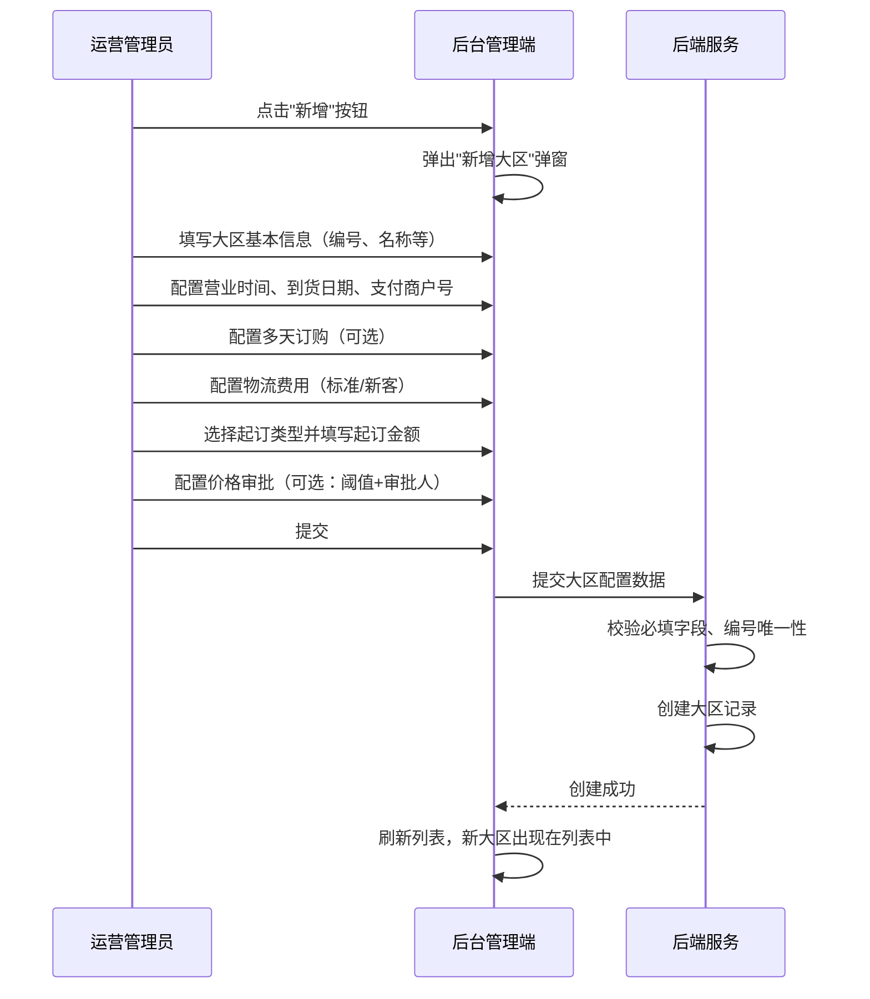
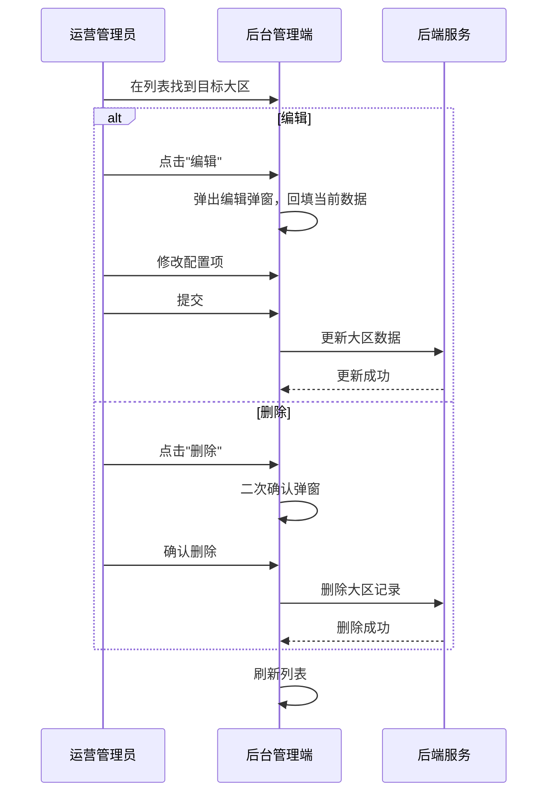
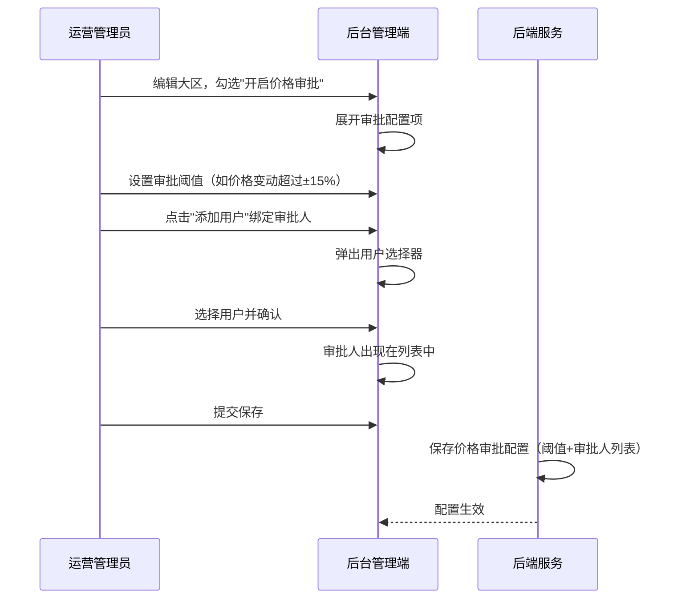

# 销售大区管理模块 SPEC

> **归属中心**：07-运营中心
> **模块**：销售大区管理
> **版本**：v1.0
> **更新日期**：2026-06-30

------

## 1. 背景与目标 (Background & Objectives)

**背景**：平台业务按地理区域划分为多个销售大区，不同大区的营业时间、配送规则、起订门槛、物流费用及价格审批机制存在差异，需要统一的配置管理能力。

**目标**：为运营管理人员提供销售大区的全生命周期管理，包括大区的新增、编辑、删除、查询，以及营业规则、物流费用、起订规则、价格审批等配置的集中维护。

------

## 2. 角色与使用场景 (Roles & Scenarios)

| 角色 | 说明 |
| --- | --- |
| 运营管理员 | 负责销售大区的创建、配置和维护 |
| 区域运营经理 | 查看和管理所辖大区的配置信息 |

**使用场景**：

- 作为运营管理员，我需要在后台新增一个销售大区，配置其基本信息、营业时间、物流费用、起订规则等。
- 作为运营管理员，我需要编辑已有大区的配置信息（如调整起订金额、修改物流费用等）。
- 作为运营管理员，我可以通过搜索条件筛选查看特定大区，并对无用大区进行删除。
- 作为运营管理员，我可以为大区开启价格审批功能，配置审批阈值和审批人员。
- 作为区域运营经理，我登录后只能看到自己权限范围内的销售大区数据。

------

## 3. 核心业务流程 (Core Business Flow)

### 3.1 新增大区流程



### 3.2 编辑/删除大区流程



### 3.3 价格审批联动流程



### 状态映射

| 状态字段 | 可选值 | 触发条件 |
| --- | --- | --- |
| 下单服务启用 | 启用/停用 | 新增或编辑时手动设置 |
| 支持多天订购 | 开启/关闭 | 勾选复选框切换 |
| 开启价格审批 | 开启/关闭 | 勾选复选框切换，开启时联动展示审批配置 |

------

## 4. 界面与交互说明 (UI & Interaction)

### 4.1 页面布局

```
┌──────────────────────────────────────────────────────────┐
│  销售大区：[全部 ▼]   下单服务启用：[全部 ▼]              │
├──────────────────────────────────────────────────────────┤
│  [新增]  [查询]                                          │
├──────────────────────────────────────────────────────────┤
│  表格列表（19列数据 + 操作列）                            │
│  ┌────┬──────┬──────┬────┬──────┬──────┬ ... ┬──────┬──────┬────┐  │
│  │编号│ 名称 │启用  │多天│区域  │覆盖  │ ... │修改人│修改时│操作│  │
│  │    │      │      │    │经理  │城市  │     │      │      │    │  │
│  ├────┼──────┼──────┼────┼──────┼──────┼ ... ┼──────┼──────┼────┤  │
│  │HN01│海南  │启用  │开启│张三  │海口  │ ... │张三  │06-29 │编辑│  │
│  │    │大区  │      │    │李四  │三亚  │     │      │      │删除│  │
│  └────┴──────┴──────┴────┴──────┴──────┴ ... ┴──────┴──────┴────┘  │
└──────────────────────────────────────────────────────────┘
```

### 4.2 新增大区弹窗（左右两栏布局）

**左栏 — 基本配置：**

| 序号 | 字段名 | 组件类型 | 说明 |
| --- | --- | --- | --- |
| 1 | 销售大区编号 | 文本输入框 | 必填，大区唯一编码 |
| 2 | 销售大区名称 | 文本输入框 | 必填 |
| 3 | 下单服务启用 | 单选（启用/停用） | 默认启用 |
| 4 | 营业时间 | 时间范围选择器 | 必填，开始时间+结束时间 |
| 5 | 到货日期 | 下拉选择 | 如 T+1、T+2，右侧提示"配送日期 T+N" |
| 6 | 支付商户号 | 下拉单选 | 必填 |
| 7 | 支持多天订购 | 复选框+数字输入 | 开启后可设置最少订购天数（最小2） |
| 8 | 开启价格审批 | 复选框+联动配置 | 开启后展示：审批阈值(%) + 审批人列表+添加按钮 |

**区域经理管理：**

| 序号 | 字段名 | 组件类型 | 说明 |
| --- | --- | --- | --- |
| 1 | 区域经理列表 | 列表+添加/移除按钮 | 每个大区可设置多个区域经理，支持从后台用户中选择添加，已添加的经理可移除 |

**覆盖城市配置：**

| 序号 | 字段名 | 组件类型 | 说明 |
| --- | --- | --- | --- |
| 1 | 覆盖城市列表 | 标签+添加/删除 | 每个大区可配置多个覆盖城市，通过级联选择器选择城市后添加，用于客户资料注册时根据所在城市自动匹配绑定大区 |

**右栏 — 物流与起订规则：**

| 序号 | 字段名 | 组件类型 | 说明 |
| --- | --- | --- | --- |
| 1 | 标准免运费金额 | 数字输入 | 单位：元 |
| 2 | 标准运费 | 数字输入 | 单位：元 |
| 3 | 新客免运费金额 | 数字输入 | 单位：元 |
| 4 | 新客运费 | 数字输入 | 单位：元 |
| 5 | 规则说明 | 只读文本 | 自动展示运费规则文案 |
| 6 | 起订类型 | 复选框 | 默认勾选"按金额" |
| 7 | 起订金额 | 输入框 | 单位：元 |

### 4.3 极限状态

- **空数据状态**：列表无数据时展示"暂无数据"空状态占位图
- **加载状态**：列表区域展示骨架屏或 loading 动画
- **数据极多**：列表分页展示，默认每页 20 条

------

## 5. 数据字典与字段级规则 (Data & Field Rules)

### 5.1 列表字段

| 字段名称 | 字段类型 | 来源/依赖 | 默认值 | 读写权限 | 校验规则与约束 | 说明 |
| :--- | :--- | :--- | :--- | :--- | :--- | :--- |
| 销售大区编号 | String | 新增时输入 | - | 新增时可编辑，编辑时只读 | 必填，唯一 | 大区唯一标识 |
| 销售大区名称 | String | 新增时输入 | - | 可编辑 | 必填 | - |
| 下单服务启用 | Boolean | 配置 | 启用 | 可编辑 | - | 启用/停用 |
| 支持多天订购 | Boolean | 配置 | 关闭 | 可编辑 | 开启后需填写最少订购天数 | 开启/关闭 |
| 最少订购天数 | Integer | 配置 | - | 可编辑 | 开启支持多天订购，才可以编辑，切必填，值大大于等于2 | - |
| 营业时间 | String | 配置 | - | 可编辑 | 可为空 | 格式 HH:mm ~ HH:mm |
| 起订类型 | Enum | 配置 | 按金额 | 可编辑 | 枚举：按金额、按重量 | - |
| 起订金额/重量 | Decimal | 配置 | - | 可编辑 | 按整天累计计算 | - |
| 到货日期 | Integer | 配置 | - | 可编辑 | 默认1，可设置大于1，当设置未2则表示今天T日下单，要T+2日才到货 | 配送时效 |
| 开启价格审批 | Boolean | 配置 | 关闭 | 可编辑 | 开启后需配置阈值和审批人 | - |
| 已关联仓库 | Integer | 系统关联 | 0 | 只读 | 根据仓库资料管理的大区查询汇总展示 | 显示关联数量 |
| 标准物流费用 | Decimal | 配置 | 0 | 可编辑 | 为空视为 0 | 单位：元 |
| 订单免运费金额 | Decimal | 配置 | - | 可编辑 | 为空视为 0 | 单位：元 |
| 新客免运费金额 | Decimal | 配置 | - | 可编辑 | 为空视为 0 | 单位：元 |
| 新客物流费用 | Decimal | 配置 | - | 可编辑 | 为空视为 0 | 单位：元 |
| 商户号 | String | 下拉选择 | - | 可编辑 | 必填 | 支付商户号 |
| 商户号名称 | String | 系统回填 | - | 只读 | 根据商户号自动带出 | - |
| 区域经理 | JSON Array | 新增/编辑时选择 | [] | 可编辑 | 支持添加多个后台用户 | 每个大区可设置多个区域经理，用于审核和数据权限管理 |
| 覆盖城市 | JSON Array | 新增/编辑时选择 | [] | 可编辑 | 通过级联选择器添加城市 | 客户资料注册时根据所在城市自动匹配大区 |
| 修改人 | String | 系统记录 | - | 只读 | 当前登录用户 | - |
| 修改时间 | DateTime | 系统记录 | - | 只读 | 格式 YYYY-MM-DD HH:mm:ss | - |

### 5.2 编辑逻辑

- **新增时**：所有可编辑字段均可输入
- **编辑时**：销售大区编号不可修改，其余字段可编辑
- **删除时**：需二次确认，删除后不可恢复
- 物流费用相关字段留空时，系统视为 0 元

### 5.3 展示逻辑

- 日期时间格式统一为 `YYYY-MM-DD HH:mm:ss`
- 金额保留两位小数
- 布尔字段展示为"启用/停用"、"开启/关闭"

------

## 6. 系统交互与边界 (System Integrations & Boundaries)

### 6.1 前置依赖

- 需先完成商户号的基础数据维护（支付商户号下拉来源）
- 需先完成仓库的基础数据维护（关联仓库功能依赖）
- 用户权限体系需已配置完成（数据权限过滤依赖）

### 6.2 上下游影响

- **下游影响**：大区配置变更后，影响该大区下所有客户的下单规则（起订金额、运费、营业时间等）
- **仓库关联**：当前版本一个大区只关联一个仓库，但表结构需预留多选扩展能力
- **价格审批**：开启后，该大区商品价格变动超过阈值时将触发审批流程

------

## 7. 非功能性需求 (Non-Functional Requirements)

### 7.1 权限与安全

- **数据权限（Data 级）**：列表数据按当前登录用户的权限范围过滤，用户只能看到其管辖范围内的大区
- **操作权限（Button 级）**：新增、编辑、删除操作需具备对应角色权限
- **关联仓库**：仓库查询不受权限过滤限制

### 7.2 业务规则

- **起订金额累计规则**：起订金额按整天累计计算。例如起订金额为 200 元，客户第一笔订单 200 元满足起订，当天第二笔订单即使只有 100 元也可正常提交
- **多天订购**：开启后最小订购天数默认为 2
- **新客规则**：新客下单日起 T+6 天内，按新客运费规则计算

------

## 8. 附录

### 8.1 区域经理管理

每个销售大区可配置多个区域经理，区域经理负责该大区内的客户资料审核、业务员管理等工作。

| 配置项 | 说明 |
| --- | --- |
| 区域经理列表 | 从后台用户中选择添加，支持添加多名区域经理 |
| 添加用户 | 弹出用户选择器，支持按姓名/手机号搜索，仅展示具备"区域经理"角色的用户 |
| 移除 | 从列表中移除该区域经理，不影响历史数据关联 |

**与客户资料审核的关联**：当客户提交公司收货地址且无推荐码时，根据地址中的城市匹配所属大区，由该大区的区域经理负责审核。参见 `02-客户管理/客户档案.md`。

### 8.2 覆盖城市配置

每个大区可配置多个覆盖城市，用于客户注册填写地址时自动匹配所属销售大区，实现客户与大区的自动绑定。

| 配置项 | 说明 |
| --- | --- |
| 覆盖城市列表 | 通过省/市级联选择器选择城市后添加，以标签形式展示已添加的城市 |
| 匹配规则 | 优先按区县匹配 → 其次按城市匹配 → 最后按省份匹配，匹配到最近一个启用的大区即为该客户所属销售大区 |
| 自动绑定 | 客户在小程序端填写公司收货地址时，系统根据所在地区自动匹配大区并绑定，无需客户手动选择 |

### 8.3 价格审批扩展配置

价格审批为可选的子功能，当"开启价格审批"勾选后展示：

| 配置项 | 说明 |
| --- | --- |
| 审批阈值 | 价格变动超过 ±N% 时需审批后生效 |
| 审批人员 | 支持添加/删除审批用户，列表展示用户名称和手机号 |

### 8.2 运费规则文案

- 新客规则：新客下单日起 T+6 天内，一天内订单满 [X] 元免运费，少于 [X] 元则支付运费每单 [Y] 元
- 标准规则：一天内订单满 [X] 元免运费，少于 [X] 元每单 [Y] 元
