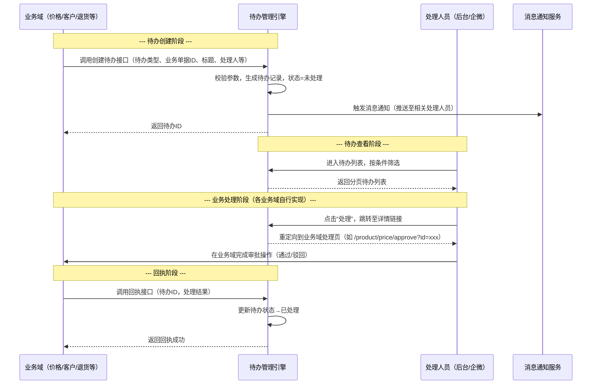
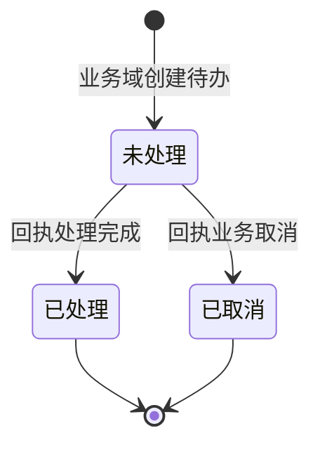

# 待办管理模块 SPEC

> **归属中心**：08-审批管理
> **子模块**：待办管理
> **版本**：v1.0
> **更新日期**：2026-07-04
>
> - **后台端（PC）**：面向运营/管理员，提供全量待办列表查询与消息通知能力。
> - **企微端**：面向业务员，查看名下相关待办事项。
> - 本模块仅负责待办列表展示与消息通知，具体业务处理详情由各业务域自行实现。

------

## 1. 背景与目标 (Background & Objectives)

**背景**：系统中的价格审核、客户审核、退货审批、提现审核等业务场景会产生待处理事项，分散在各业务模块中。需要一个统一的待办汇聚与分发中心，让运营人员和管理员能够在一个入口看到所有待处理事项。

**目标**：建立统一的待办管理引擎，提供标准的待办创建与回执接口供各业务域调用，在后台和企微端提供集中待办列表，并通过消息通知提醒相关处理人员及时处理。

------

## 2. 角色与使用场景 (Roles & Scenarios)

| 角色 | 说明 |
| :--- | :--- |
| 后台管理员/运营 | 在 PC 后台查看全量待办列表（按数据权限），点击跳转至各业务域处理页 |
| 业务员 | 在企微端查看名下客户的待办事项 |
| 各业务域系统 | 通过标准接口创建待办、回执待办已处理 |

**使用场景（User Story）**：

- 作为**后台管理员**，我希望在"工作台→待办处理"看到所有待审批事项，按类型、状态、紧急程度筛选，点击进入对应的业务处理页面，以便一站式管理所有审批工作。
- 作为**业务员**，我希望在企微端看到待我处理的客户审核、价格审核等事项，并及时收到消息推送，以便快速响应客户需求。
- 作为**价格管理模块**，我希望在价格变更提交审核时，调用待办创建接口生成一条待办记录，并在审核完成后收到回执更新待办状态。
- 作为**客户管理模块**，我希望在客户档案变更提交审核时，调用待办创建接口生成待办，审核通过或驳回后回执待办已处理。

------

## 3. 核心业务流程 (Core Business Flow)

### 3.1 待办全生命周期



### 3.2 待办状态流转

| 起始状态 | 触发动作 | 目标状态 | 处理逻辑与影响说明 |
| :--- | :--- | :--- | :--- |
| - | 业务域调用创建接口 | 未处理 | 生成待办记录，推送消息通知，记录创建时间与最晚处理时间 |
| 未处理 | 业务域调用回执接口（处理完成） | 已处理 | 记录处理时间，移除处理人员的未处理计数 |
| 未处理 | 业务域调用回执接口（业务取消） | 已取消 | 如订单取消后关联的退货审批自动取消 |
| 未处理 | 超过最晚处理时间 | 未处理（标记逾期） | 待办不自动关闭，紧急程度自动升级一档，继续推送催办通知 |



### 3.3 异常流

| 异常场景 | 触发条件 | 系统处理方式 |
| :--- | :--- | :--- |
| 重复创建 | 同一业务单据ID + 同一待办类型已存在未处理记录 | 返回已有待办ID（幂等），不重复创建，不重复通知 |
| 业务单据已处理 | 回执时待办已被其他流程处理 | 返回"待办已处理"，不做变更 |
| 待办类型未注册 | 创建时传入未注册的待办类型 | 返回错误"待办类型无效"，需先在字典中注册 |
| 处理人不存在 | 创建时指定的处理人员ID在系统中不存在 | 记录告警日志，仍创建待办但处理人置空，由管理员手动分配 |
| 回执超时 | 业务域处理完成后回调失败 | 提供重试机制，业务域可重新调用回执接口（幂等） |

------

## 4. 界面与交互说明 (UI & Interaction)

### 4.1 后台端 - 待办列表页

**页面入口**：后台菜单 → 工作台 → 待办处理

**界面布局**（自上而下）：

```
┌──────────────────────────────────────────────────────────────────────────────┐
│  待办处理                                                                       │
│  所有待审批事项统一入口，包括价格审核、客户审核、退货审批、提现审核等。                  │
├──────────────────────────────────────────────────────────────────────────────┤
│  搜索区                                                                        │
│  待办类型：[全部 ▼]              处理状态：[全部 ▼]            紧急程度：[全部 ▼]  │
│  销售大区：[全部 ▼]              创建时间：[开始日期-结束日期 ____]                │
│  关键字：[请输入标题/业务单据ID ____]                          [重置] [查询]      │
├──────────────────────────────────────────────────────────────────────────────┤
│  [未处理 N]  [已处理]  [已取消]                                        共 X 条  │
├──────────────────────────────────────────────────────────────────────────────┤
│  数据表格                                                                       │
│  ┌────┬──────────┬──────────┬──────────┬──────┬──────┬──────────┬──────┬──────┬────┐ │
│  │序号│待办类型   │业务单据ID │待办标题   │紧急  │处理  │销售大区   │创建  │处理  │操作│ │
│  │    │          │          │          │程度  │状态  │          │时间  │人员  │    │ │
│  ├────┼──────────┼──────────┼──────────┼──────┼──────┼──────────┼──────┼──────┼────┤ │
│  │ 1  │价格审核   │PRC-2026  │商品[SKU  │急  │未处理│海南区    │06-06 │张三, │[处 │ │
│  │    │          │0701-0034 │-10234]价 │      │      │          │10:30 │李四  │理] │ │
│  │    │          │          │格变更待审 │      │      │          │      │      │    │ │
│  │    │          │          │核        │      │      │          │      │      │    │ │
│  ├────┼──────────┼──────────┼──────────┼──────┼──────┼──────────┼──────┼──────┼────┤ │
│  │ 2  │客户审核   │CUS-2026  │客户[天福 │高    │未处理│广深区    │06-06 │张三  │[处 │ │
│  │    │          │0701-0015 │茗茶]资料 │      │      │          │09:15 │      │理] │ │
│  │    │          │          │变更待审核 │      │      │          │      │      │    │ │
│  ├────┼──────────┼──────────┼──────────┼──────┼──────┼──────────┼──────┼──────┼────┤ │
│  │ 3  │退货审批   │ORD-2026  │订单[ORD  │中    │已处理│海南区    │06-05 │李四  │[查 │ │
│  │    │          │0630-0089 │-20260630 │      │      │          │16:45 │      │看] │ │
│  │    │          │          │-0034]退  │      │      │          │      │      │    │ │
│  │    │          │          │货申请    │      │      │          │      │      │    │ │
│  └────┴──────────┴──────────┴──────────┴──────┴──────┴──────────┴──────┴──────┴────┘ │
│  [< 上一页] 1 2 3 [下一页 >]                                                    │
└──────────────────────────────────────────────────────────────────────────────┘
```

**交互动作**：

- 点击顶部 Tab（未处理/已处理/已取消）→ 按处理状态筛选，刷新列表
- 点击 [查询] → 全量筛选条件生效，列表刷新，分页回到第 1 页
- 点击 [重置] → 清空筛选项恢复默认值，不自动触发查询
- 点击 [处理] → 跳转到该待办的**后台详情链接**（由创建时传入的 `detailUrl` 决定跳转目标）
- 点击 [查看] → 同 [处理]，展示已处理/已取消待办的关联业务详情
- 表格中待办类型以彩色标签展示（价格审核=warning / 客户审核=primary / 退货审批=danger / 提现审核=info）
- 紧急程度以标签色彩区分：急=红色 / 高=橙色 / 中=蓝色 / 低=灰色

**极限状态**：

- 空数据：居中插图 + "暂无待办事项"
- 加载中：表格区域骨架屏
- 数据极多：分页展示，每页 20 条

### 4.2 企微端 - 待办列表

**页面入口**：企微工作台 → 待办处理

**界面布局**（自上而下）：

```
┌─────────────────────────────────┐
│  待办处理                        │
├─────────────────────────────────┤
│  ┌──────────┬──────────┬────────┐│
│  │ 未处理 5  │  已处理   │  已取消 ││
│  └──────────┴──────────┴────────┘│
├─────────────────────────────────┤
│  ┌─────────────────────────────┐│
│  │ [急] 价格审核                ││
│  │ 商品 [SKU-10234] 价格变更待审核││
│  │ 业务单据：PRC-20260701-0034   ││
│  │ 提交人：王五 | 销售大区：海南区 ││
│  │ 创建时间：07-01 10:30          ││
│  │ 最晚处理：07-03 10:30          ││
│  │                        处理 > ││
│  └─────────────────────────────┘│
│  ┌─────────────────────────────┐│
│  │ [高] 客户审核                  ││
│  │ 客户 [天福茗茶] 资料变更待审核   ││
│  │ 业务单据：CUS-20260701-0015    ││
│  │ 提交人：赵六 | 销售大区：广深区 ││
│  │ 创建时间：07-01 09:15          ││
│  │ 最晚处理：07-03 09:15          ││
│  │                        处理 > ││
│  └─────────────────────────────┘│
│  ┌─────────────────────────────┐│
│  │ [中] 退货审批                  ││
│  │ 订单 [ORD-20260630-0034] 退货  ││
│  │ 业务单据：ORD-20260630-0089    ││
│  │ 提交人：张三 | 销售大区：海南区 ││
│  │ 创建时间：06-30 16:45          ││
│  │ 最晚处理：07-02 16:45          ││
│  │                        查看 > ││
│  └─────────────────────────────┘│
│                                 │
│  ── 上拉加载更多 ──               │
└─────────────────────────────────┘
```

**卡片结构**（每条待办）：

- **顶部左侧**：紧急程度标签（急=红底白字 / 高=橙底白字 / 中=蓝底白字 / 低=灰底白字）+ 待办类型文字（加粗）
- **标题区**：待办标题正文（最多两行，超出省略）
- **信息区**（灰色辅助文字，三行）：
  - 业务单据：{业务单据ID}
  - 提交人：{创建人员} | 销售大区：{销售大区名称}
  - 创建时间 / 最晚处理时间
- **右侧**：[处理 >] 或 [查看 >]（已处理/已取消时显示"查看"）

**顶部 Tab 栏**：

- 三个 Tab 等宽分布：未处理 / 已处理 / 已取消
- 当前激活 Tab 有蓝色下划线，加粗
- "未处理"Tab 上叠加红色角标数字（如"未处理 5"）

**交互动作**：

- 顶部 Tab 点击切换 → 列表刷新，当前 Tab 高亮
- 下拉 → 触发刷新，顶部出现 loading 指示器，刷新当前 Tab 列表
- 触底 → 自动加载下一页（上拉加载更多），底部显示"加载中..."或"没有更多了"
- 点击卡片 → 跳转到该待办的**移动端详情链接**（由创建时传入的 `mobileUrl` 决定跳转目标）
- 未处理卡片右侧显示 [处理 >]，已处理/已取消显示 [查看 >]
- 逾期未处理的卡片：整卡左侧加红色边框，紧急程度标签闪烁

**极限状态**：

- 空数据：居中插图 + "暂无待办" + 插图下方提示文字"暂无待处理的审批事项"
- 加载中：骨架屏（灰色圆角矩形占位卡片 × 3，模拟卡片高度）
- 网络异常：居中提示"网络异常，请下拉重试" + [重试] 按钮
- 数据极多：触底分页加载，每页 15 条

### 4.3 消息通知

当新待办创建时，通过消息通知服务推送给处理人员：

- **企微端**：推送卡片消息，包含待办标题、类型、紧急程度，点击跳转至对应业务处理页
- **后台端**：顶部导航栏消息铃铛增加未读红点，展开显示最新待办列表摘要
- **通知频率**：创建时即时推送，逾期前 1 天推送催办提醒

------

## 5. 数据字典与字段级规则 (Data & Field Rules)

### 5.1 待办主表

| 字段名称 | 字段类型 | 来源/依赖 | 默认值 | 读写权限 | 校验规则与约束 | 说明/占位符 |
| :--- | :--- | :--- | :--- | :--- | :--- | :--- |
| 待办ID | 文本(32位) | 系统生成 | - | 只读 | 唯一主键 | 内部标识 |
| 待办类型 | 枚举 | 业务域传入 | - | 创建时写入 | 必填，需在字典中注册 | 如：价格审核、客户审核、退货审批、提现审核 |
| 业务单据ID | 文本(64位) | 业务域传入 | - | 创建时写入 | 必填，与待办类型组合唯一（未处理状态下） | 关联的业务场景唯一标识，如订单编号"ORD-20260701-0034" |
| 待办标题 | 文本(200字) | 业务域传入 | - | 创建时写入 | 必填，限 200 字 | 如"商品 [SKU-10234] 价格变更待审核" |
| 处理状态 | 枚举 | 系统流转 | 未处理 | 系统更新 | 未处理、已处理、已取消 | 由回执接口更新 |
| 创建时间 | 日期时间 | 系统写入 | 当前时间 | 只读 | YYYY-MM-DD HH:mm:ss | |
| 创建人员 | 文本(50字) | 业务域传入 | - | 创建时写入 | 选填 | 提交审核的人员名称 |
| 处理人员 | 文本(500字) | 业务域传入 | - | 创建时写入 | 必填，多个以逗号分隔 | 可多个人处理，如"张三,李四" |
| 销售大区ID | 文本(32位) | 业务域传入 | - | 创建时写入 | 选填 | 关联销售大区，用于数据隔离 |
| 销售大区名称 | 文本(100字) | 业务域传入 | - | 创建时写入 | 选填 | 大区中文名，如"海南区" |
| 最晚处理时间 | 日期时间 | 业务域传入 | 创建时间+48h | 创建时写入 | 必填，必须大于创建时间 | 逾期后紧急程度自动升级 |
| 紧急程度 | 枚举 | 业务域传入 | 中 | 创建时写入 | 急、高、中、低 | 逾期后系统自动升一档 |
| 后台详情链接 | 文本(500字) | 业务域传入 | - | 创建时写入 | 必填，合法 URL 格式 | PC 后台端跳转至业务域处理页的路径 |
| 移动端详情链接 | 文本(500字) | 业务域传入 | - | 创建时写入 | 必填，合法 URL 格式 | 企微 H5 端跳转至业务域处理页的路径 |
| 处理时间 | 日期时间 | 系统写入 | 空 | 回执时写入 | YYYY-MM-DD HH:mm:ss | 未处理时为空 |
| 处理结果 | 文本(200字) | 业务域传入 | 空 | 回执时写入 | 选填 | 如"审核通过"、"审核驳回"、"业务已取消" |
| 最近更新时间 | 日期时间 | 系统写入 | 当前时间 | 只读 | 每次修改自动更新 | |

### 5.2 字段枚举值汇总

| 字段 | 可选值 |
| :--- | :--- |
| 处理状态 | 未处理、已处理、已取消 |
| 紧急程度 | 急、高、中、低 |
| 待办类型 | 价格审核、客户审核、退货审批、提现审核（可扩展，由字典管理） |

### 5.3 展示逻辑

- 日期时间：列表展示 `YYYY-MM-DD HH:mm`，详情展示 `YYYY-MM-DD HH:mm:ss`
- 待办类型：彩色标签，价格审核=橙色 / 客户审核=蓝色 / 退货审批=红色 / 提现审核=灰色
- 处理状态：未处理=红色圆点+文字 / 已处理=绿色圆点+文字 / 已取消=灰色圆点+文字
- 紧急程度：急=红色标签 / 高=橙色标签 / 中=蓝色标签 / 低=灰色标签
- 逾期未处理：行背景为浅红色，紧急程度标签闪烁

### 5.4 编辑逻辑

| 状态 | 可执行操作 | 说明 |
| :--- | :--- | :--- |
| 未处理 | 点击"处理"跳转业务域处理页 | 实际处理由各业务域完成，处理后回执 |
| 已处理 | 点击"查看"跳转业务域详情页 | 不可再次处理 |
| 已取消 | 点击"查看"跳转业务域详情页 | 不可再次处理 |

------

## 6. 系统交互与边界 (System Integrations & Boundaries)

### 6.1 开放接口

#### 6.1.1 创建待办

| 项目 | 说明 |
| :--- | :--- |
| 接口路径 | `POST /api/v1/todo/create` |
| 调用方 | 各业务域（价格管理、客户管理、退货管理、提现管理等） |
| 请求体 | `{ todoType, businessId, title, handlerIds, regionId, deadline, urgency, detailUrl, mobileUrl, creator? }` |
| 响应 | `{ code: 0, data: { todoId } }` |
| 幂等 | 同一 `todoType` + `businessId` 未处理时重复调用返回已有 `todoId` |

#### 6.1.2 回执待办

| 项目 | 说明 |
| :--- | :--- |
| 接口路径 | `POST /api/v1/todo/acknowledge` |
| 调用方 | 各业务域（业务处理完成后调用） |
| 请求体 | `{ todoId, status: "PROCESSED" \| "CANCELLED", result? }` |
| 响应 | `{ code: 0 }` |
| 幂等 | 同一 `todoId` 重复回执不报错 |

### 6.2 前置依赖

| 依赖项 | 说明 |
| :--- | :--- |
| 字典管理 | 待办类型需先在字典中注册，创建时校验类型有效性 |
| 用户管理 | 处理人员需为系统合法用户，创建时校验 |
| 销售大区管理 | 销售大区ID需为有效大区 |
| 消息通知服务 | 待办创建后推送通知至处理人员 |

### 6.3 上下游影响

| 关联模块 | 影响说明 |
| :--- | :--- |
| 各业务域 | 业务域需在审核/审批流程节点接入待办创建和回执接口 |
| 消息通知服务 | 待办创建、催办时触发消息推送 |
| 数据管理 | 可统计各类型待办的处理效率、平均处理时长等 |

------

## 7. 非功能性需求 (Non-Functional Requirements)

### 7.1 性能要求

| 指标 | 要求 |
| :--- | :--- |
| 创建待办接口 | < 200ms（含参数校验与通知发送） |
| 回执接口 | < 100ms |
| 列表查询 | < 500ms（分页 20 条） |
| 消息通知送达 | < 5s（创建到推送完成） |

### 7.2 权限矩阵

| 角色 | 查看权限（数据级） | 操作权限 |
| :--- | :--- | :--- |
| 后台管理员 | 按数据权限配置（全部或指定大区） | 点击处理/查看（跳转由各业务域控制权限） |
| 业务员 | 仅待办处理人列表中包含自己的记录 | 点击处理（跳转至业务域处理页） |
| 各业务域系统 | 无界面权限 | 调用创建接口、回执接口 |

### 7.3 安全要求

- 创建接口需校验调用方身份（内部服务间认证）
- 回执接口需校验待办存在且未处理，防止重复回执
- 详情链接需校验为内部合法路径，防止开放重定向
- 处理人员信息展示需脱敏（企微端手机号脱敏）

------

## 8. 输出文档需求

本模块为 **08-审批管理** 下的 **待办管理** 子模块。

```
spec/
└── 08-审批管理/
    ├── 待办管理.md                 ← 本文档
    └── 待办管理-后台-原型.html               ← 待办列表原型页面
```

**依赖模块**：

| 模块 | 状态 | 说明 |
| :--- | :--- | :--- |
| 字典管理 | 已有 | 待办类型等枚举值注册 |
| 用户管理 | 已有 | 处理人员校验与通知 |
| 销售大区管理 | 已有 | 大区数据隔离 |
| 消息通知服务 | 已有 | 待办创建与催办消息推送 |
| 价格管理 | 已有 | 价格审核待办创建与回执 |
| 客户管理 | 已有 | 客户审核待办创建与回执 |
| 退货管理 | 待建 | 退货审批待办创建与回执 |
| 提现管理 | 已有 | 提现审核待办创建与回执 |

**后续扩展**：
- 待办转交：处理人可将待办转交给他人
- 待办评论：处理人可在待办下留言
- 批量处理：同类型待办批量审批
- 处理时效统计：SLA 达成率报表
