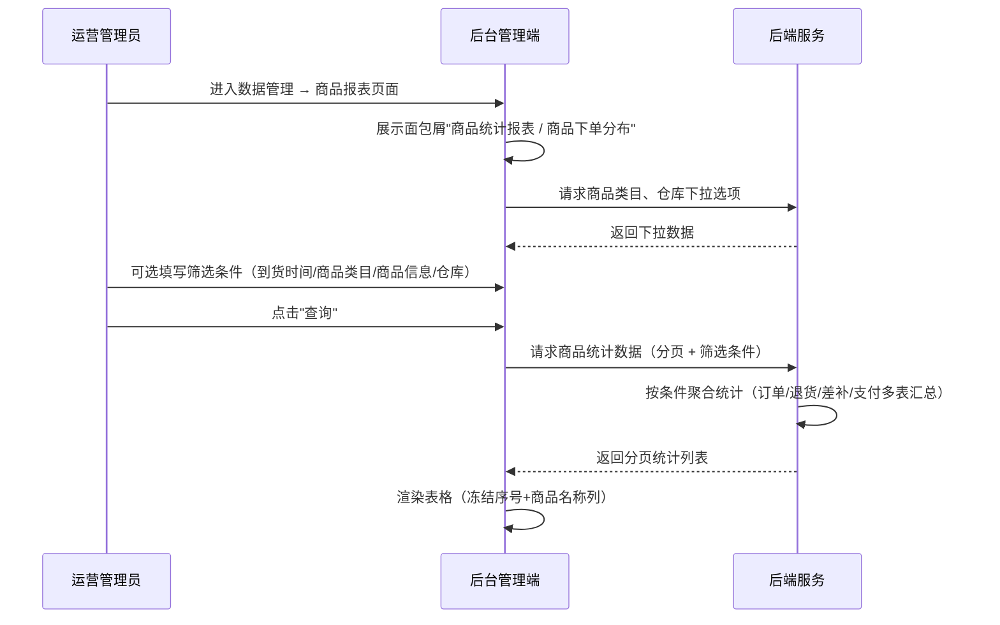
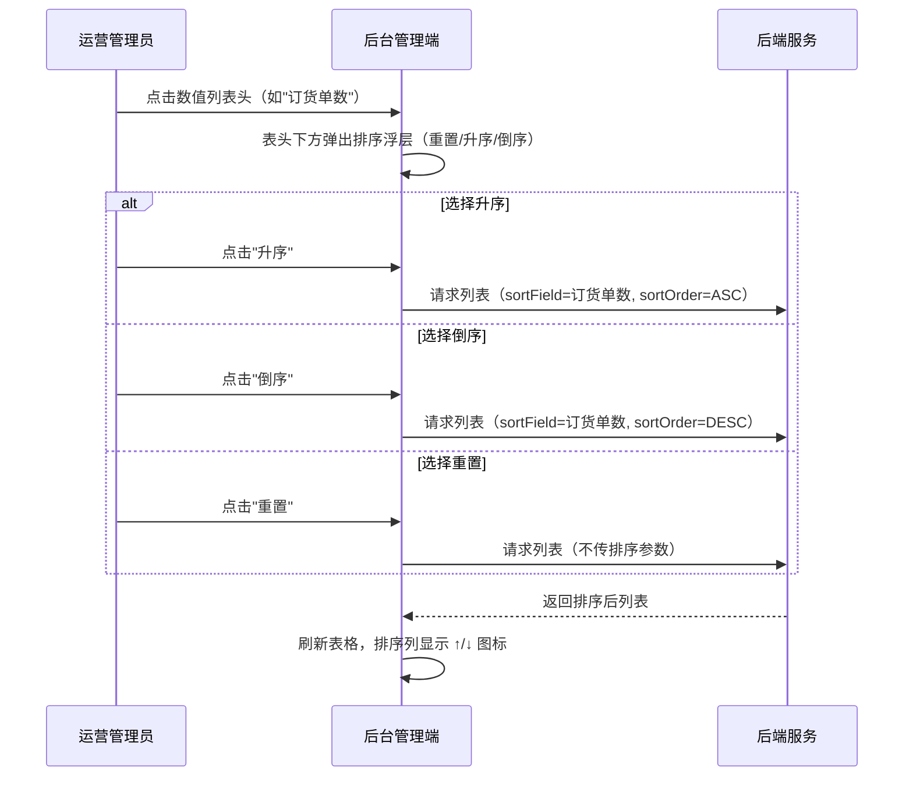
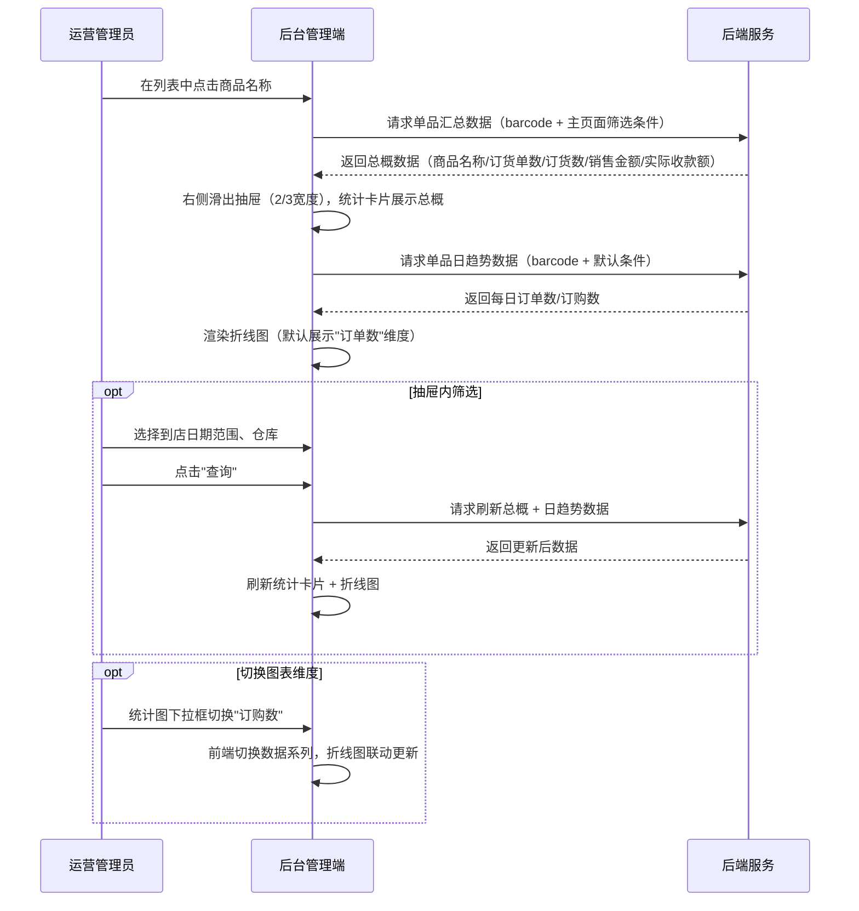
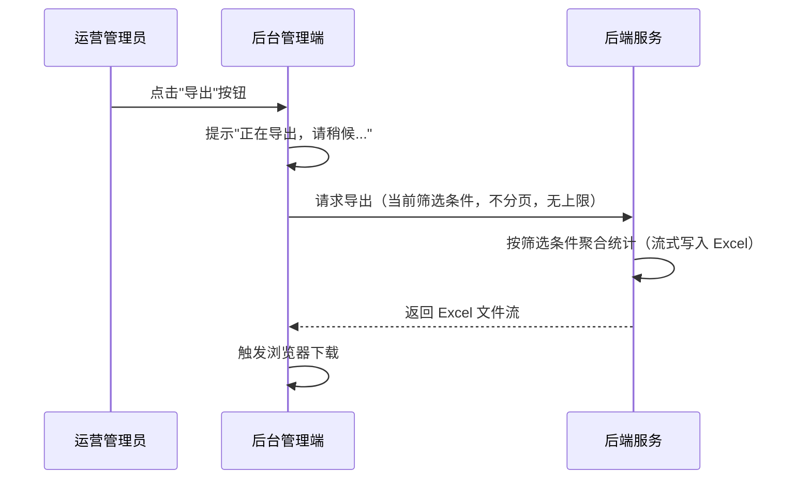

# 商品统计报表模块 SPEC

> **归属中心**：09-数据管理
> **模块**：商品统计报表
> **版本**：v1.2
> **更新日期**：2026-07-13

------

## 1. 背景与目标 (Background & Objectives)

**背景**：运营管理人员需要以商品为主体视角，查看每个商品在指定时间范围内的下单数量、退货数量、销售金额等汇总数据，以便进行商品维度的经营分析和采购决策。

**目标**：为运营管理人员提供商品维度的全量统计数据查询、多维筛选、排序、导出及单品下钻分析能力，支持按到货时间、商品类目、商品信息、仓库等条件灵活筛选。

------

## 2. 角色与使用场景 (Roles & Scenarios)

| 角色 | 说明 |
| --- | --- |
| 运营管理员 | 查看全平台商品统计数据，进行商品维度经营分析 |
| 区域运营经理 | 按数据权限查看管辖范围内的商品统计数据 |
| 采购/供应链经理 | 根据商品销售数据调整采购计划 |

**使用场景**：

- 作为运营管理员，我可以通过到货时间范围、商品类目、商品条码/名称、仓库等多条件组合筛选商品统计数据。
- 作为运营管理员，我可以对订货单数、销售金额等数值列进行升序/降序排列，快速定位热销/滞销商品。
- 作为运营管理员，我可以将当前筛选条件下的商品统计数据导出为 Excel，用于线下分析或汇报。
- 作为运营管理员，我可以点击商品名称弹出二级窗口，查看该商品的汇总数据与日趋势统计图。
- 作为运营管理员，我可以在单品详情弹窗中按到店日期和仓库进一步筛选，切换查看订单数/订购数的日趋势。

------

## 3. 核心业务流程 (Core Business Flow)

### 3.1 商品统计查询流程

```
进入数据管理 → 商品报表页面
    → 页面展示面包屑"商品统计报表 / 商品下单分布"
    → 系统加载商品类目、仓库下拉选项
    → 运营管理员可选填写筛选条件（到货时间 / 商品类目 / 商品信息 / 仓库）
    → 点击"查询"
    → 后端按条件聚合统计（订单/退货/差补/支付多表汇总）
    → 返回分页统计列表
    → 前端渲染表格（冻结序号 + 商品名称列）
```

<details>
<summary>时序图</summary>



</details>

### 3.2 列排序流程

```
点击数值列表头（如"订货单数"）
    → 表头下方弹出排序浮层（重置 / 升序 / 倒序）
    → 选择升序 → 后端按 sortField + ASC 排序返回
    → 选择倒序 → 后端按 sortField + DESC 排序返回
    → 选择重置 → 后端不传排序参数，恢复默认排序
    → 前端刷新表格，排序列显示 ↑ 或 ↓ 图标
```

<details>
<summary>时序图</summary>



</details>

### 3.3 单品详情下钻流程

```
在列表中点击商品名称
    → 后端返回单品汇总数据（商品名称 / 订货单数 / 订货数 / 销售金额 / 实际收款额）
    → 前端从右侧滑出抽屉（占页面 2/3 宽度），总概区域以统计卡片形式展示
    → 后端返回每日订单数/订购数趋势数据（覆盖所选日期范围内每一天）
    → 前端渲染折线图（默认展示"订单数"维度）

抽屉内筛选（可选）：
    → 选择到店日期范围、仓库
    → 点击"查询"
    → 后端刷新总概数据 + 日趋势数据
    → 前端刷新总概卡片 + 折线图

切换图表维度（可选）：
    → 统计图下拉框切换"订购数"
    → 前端切换数据系列，折线图联动更新（不重新请求接口）
```

<details>
<summary>时序图</summary>



</details>

### 3.4 导出流程

```
点击"导出"按钮
    → 提示"正在导出，请稍候..."
    → 后端按当前筛选条件聚合统计（不分页，无导出上限）
    → 大数据量时采用异步导出或流式写入
    → 返回 Excel 文件流
    → 浏览器触发下载
```

<details>
<summary>时序图</summary>



</details>

### 排序状态映射

| 排序状态 | 图标展示 | 触发条件 |
| --- | --- | --- |
| 无排序（默认） | 无图标 | 初始加载 / 点击重置 |
| 升序 | ↑ | 点击升序 |
| 倒序 | ↓ | 点击倒序 |

------

## 4. 界面与交互说明 (UI & Interaction)

### 4.1 页面整体布局

```
┌──────────────────────────────────────────────────────────────────────────────┐
│  商品统计报表 / 商品下单分布                                                    │
├──────────────────────────────────────────────────────────────────────────────┤
│  [查询]  [重置]  [导出]                                                        │
├──────────────────────────────────────────────────────────────────────────────┤
│  到货时间：[____年-__月-__日] 至 [____年-__月-__日]                              │
│  商品类目：[全部 ▼]    商品信息：[___商品条码/商品名称___]    仓库：[全部 ▼]      │
├──────────────────────────────────────────────────────────────────────────────┤
│  ← 冻结 → │                          ← 可横向滚动 →                           │
│  ┌──┬────┬────┬────┬────┬────┬────┬────┬────┬────┬────┬────┬────┬────┐        │
│  │序│商品│商品│商品│订货│退货│差补│订货│退货│补差│销售│退货│补差│实际│        │
│  │号│名称│编号│条码│单数│单数│单数│ 数 │ 数 │ 数 │金额│金额│金额│收款│        │
│  │  │    │    │    │ ▲  │ ▲  │ ▲  │(KG)│(KG)│(KG)│ ▲  │ ▲  │ ▲  │额▲ │        │
│  ├──┼────┼────┼────┼────┼────┼────┼────┼────┼────┼────┼────┼────┼────┤        │
│  │1 │红富│P001│6900│128 │ 5  │ 2  │520 │ 15 │ 8  │15600│ 450│ 120│14820│       │
│  │  │士苹│    │... │    │    │    │    │    │    │ .00 │ .00│ .00│ .00 │       │
│  │  │果  │    │    │    │    │    │    │    │    │     │    │    │     │       │
│  └──┴────┴────┴────┴────┴────┴────┴────┴────┴────┴────┴────┴────┴────┘        │
│                                              分页：[5/10/20/30/50/100] 条/页    │
└──────────────────────────────────────────────────────────────────────────────┘
```

### 4.2 面包屑导航

| 元素 | 说明 |
| --- | --- |
| "商品统计报表" | 一级节点，当前页不可点击或点击无跳转 |
| "商品下单分布" | 二级节点，当前页面标识 |
| 分隔符 | 使用 " / " 作为层级分隔 |

> **交互**：面包屑为可点击导航，"商品统计报表"为一级节点（当前页高亮），“商品下单分布”为二级当前页标识。

### 4.3 操作栏

操作栏位于筛选区上方，三个按钮从左到右依次排列：

| 序号 | 按钮 | 类型 | 说明 |
| --- | --- | --- | --- |
| 1 | 查询 | 主按钮（Primary） | 根据当前筛选条件查询数据，刷新列表 |
| 2 | 重置 | 默认按钮（Default） | 清空所有筛选条件恢复默认值，刷新列表 |
| 3 | 导出 | 默认按钮（Default） | 按当前筛选条件导出数据为 Excel |

### 4.4 筛选区字段

| 序号 | 字段名 | 组件类型 | Placeholder/默认值 | 说明 |
| --- | --- | --- | --- | --- |
| 1 | 到货时间 | 日期范围选择器 | 空（不限制） | 以商品单据的到货日期为检索依据；可选同一天（开始=结束）；建议提供快捷选项：今天/最近7天/最近30天/本月 |
| 2 | 商品类目 | 级联选择器（Cascader） | "全部" | 三级分类结构（大分类 → 中分类 → 小分类），支持任意层级选择；不选视作不按类目筛选；数据来源于 WMS 商品分类接口，见 4.4.1 |
| 3 | 商品信息 | 文本输入框 | `商品条码/商品名称` | 模糊匹配，同时对商品条码和商品名称字段搜索 |
| 4 | 仓库 | 下拉单选 | "全部" | 不选或选"全部"时视作不按仓库筛选；枚举值见 4.4.2 |

#### 4.4.1 商品类目 — 三级级联选择器

商品类目使用**三级级联选择器**（Cascader），数据结构为「大分类 → 中分类 → 小分类」三层树形结构。数据来源于 WMS 商品分类查询接口（`GET https://wms-qa.qdama.cn/base/category`），该接口返回 SAP 同步的三级分类数据。

**交互逻辑**：
- 默认展示"全部"，不限制类目筛选
- 用户可展开选择任意层级（选大分类 = 该大分类下所有商品；选中分类 = 该中分类下所有商品；选小分类 = 精确到三级）
- 支持输入关键字搜索和过滤分类节点
- 清空选择回到"全部"状态

**典型分类结构示例**（实际数据以 WMS 接口返回为准）：

| 大分类（一级） | 中分类（二级）示例 | 小分类（三级）示例 |
| :--- | :--- | :--- |
| 生鲜食品 | 猪肉类 | 排骨、五花肉、瘦肉、猪蹄… |
| 生鲜食品 | 蔬菜 | 叶菜类、根茎类、瓜果类… |
| 生鲜食品 | 水产 | 鱼类、虾类、贝类… |
| 生鲜食品 | 水果 | 苹果、柑橘、浆果… |
| 生鲜食品 | 肉类（非猪肉） | 牛肉、羊肉、禽肉… |
| 生鲜食品 | 蛋奶 | 鸡蛋、鸭蛋、牛奶… |
| 生鲜食品 | 肉禽蛋类 | 整鸡、分割鸡、鸭肉… |
| 生鲜食品 | 熟食 | 卤味、烤制、凉拌… |
| 加工食品 | 加工食品 | 速冻食品、罐头、腌制品… |
| 加工食品 | 冷藏及加工类 | 冷藏面点、冷藏调理品… |
| 标品 | 综合标品 | 干货、调味品… |
| 标品 | 标品类 | 米面、食用油… |
| 粮油副食 | 粮油副食 | 大米、面粉、杂粮… |
| 酒水饮料 | 酒水饮料 | 啤酒、白酒、饮料… |
| 休闲食品 | 休闲食品 | 薯片、坚果、糖果… |
| 清洁用品 | 清洁用品 | 洗涤剂、清洁工具… |
| 日用百货 | 百货日杂店 | 厨房用品、卫浴用品… |
| 日用百货 | 日报用品 | 纸巾、垃圾袋… |
| 包装宣传 | 包装宣传 | 包装袋、宣传物料… |
| 生产用具 | 生产用具 | 刀具、砧板… |
| 日常课程 | 日常课程 | 线上课程、线下课程… |
| 设备类 | 设备类 | 厨房设备、制冷设备… |
| 消耗品类 | 消耗品类 | 手套、口罩… |
| 营销类 | 营销类 | 赠品、样品… |
| 虚拟商品 | 虚拟商品 | 电子券、会员卡… |

> **注意**：上表为典型分类结构示例，实际三级分类数据以 WMS 接口 `GET https://wms-qa.qdama.cn/base/category` 返回为准。前端在页面加载时请求该接口获取完整分类树并缓存。

#### 4.4.2 仓库枚举值

全部、全国集采虚拟仓、广州江高猪肉仓、广州江高电商仓、长沙丰泉综合仓、成都双流综合仓、深圳恒寿蔬果仓、广州南海猪肉仓、广州花地湾水产仓、广州番禺猪肉仓、广州菜吧仓、深圳菜吧仓、清远万安猪肉仓、海南项目仓、B端业务仓、中山创新仓、基地直采仓、中山颐丰猪肉仓、长沙B端业务仓、深圳创新仓、B端业务仓-停用、华南区线下共享仓

### 4.5 工具栏与列表操作

- **列排序**：点击数值列表头（订货单数/退货单数/差补单数/订货数/退货数/补差数/销售金额/退货金额/补差金额/实际收款额），表头下方弹出排序浮层（重置/升序/倒序），单选互斥，同一时间仅一列生效
- **Hover 提示**：光标移动到商品名称上时，弹出 Tooltip 展示商品简要信息（商品名称、商品条码、商品类目、所属仓库）
- **点击下钻**：点击商品名称，右侧滑出抽屉展示单品详情（占页面 2/3 宽度，见 4.6）
- **分页切换**：支持每页 5 / 10 / 20 / 30 / 50 / 100 条，默认 20 条
- **冻结列**：序号（第 1 列）和商品名称（第 2 列）为左侧冻结列，横向滚动时保持固定

### 4.6 单品详情抽屉（右侧弹出，占页面 2/3 宽度）

点击商品名称后，从页面右侧弹出抽屉（Drawer），宽度占整个页面的 2/3（约 67%），主页面剩余 1/3 区域显示半透明遮罩。

```
┌──────────────────────────────┬─────────────────────────────────────────────────────────┐
│  主页面（1/3，半透明遮罩）     │  单品详情抽屉（2/3 宽度）                                  │
│                              │                                                         │
│                              │  红富士苹果                                     [✕ 关闭] │
│                              ├─────────────────────────────────────────────────────────┤
│                              │  ┌──────────────┐ ┌──────────────┐ ┌──────────────┐     │
│                              │  │ 订货单数       │ │ 订货数(KG)    │ │ 销售金额       │     │
│                              │  │   128         │ │   520.50     │ │ ¥15,600.00  │     │
│                              │  └──────────────┘ └──────────────┘ └──────────────┘     │
│                              │  ┌──────────────┐ ┌──────────────┐                      │
│                              │  │ 实际收款额     │ │ 退货单数       │                      │
│                              │  │ ¥14,820.00  │ │     5        │                      │
│ (主页面内容被遮罩覆盖)         │  └──────────────┘ └──────────────┘                      │
│                              ├─────────────────────────────────────────────────────────┤
│                              │  到店日期：[____年-__月-__日] 至 [____年-__月-__日]        │
│                              │  仓库：[全部 ▼]                  [查询] [重置]           │
│                              ├─────────────────────────────────────────────────────────┤
│                              │  展示维度：[订单数 ▼]（默认选中）                          │
│                              │                                                         │
│                              │  ↑ 数量（折线图，直线连接数据点）                           │
│                              │  │     ·                                                 │
│                              │  │     ├──────·                                          │
│                              │  │     │      ├────·                                     │
│                              │  │     │      │    ├────·                                │
│                              │  │     │      │    │    ├────·                           │
│                              │  │     │      │    │    │    ├────·                      │
│                              │  │     │      │    │    │    │    ├────                  │
│                              │  └─┴──┴──┴──┴──┴──┴──┴──┴──┴──┴──→ 日期                   │
│                              │   07-01 07-02 07-03 07-04 07-05 07-06 ...               │
│                              │                                                         │
│                              │  ≤1月：每天一个点；>1月≤6月：每5天；>6月≤12月：每15天；>12月：每30天 │
└──────────────────────────────┴─────────────────────────────────────────────────────────┘
```

#### 4.6.1 抽屉基本信息

| 属性 | 说明 |
| :--- | :--- |
| 弹出方式 | 右侧滑出抽屉（Drawer） |
| 宽度 | 页面宽度的 2/3（约 67%） |
| 标题 | 当前选中商品的名称 |
| 关闭方式 | 点击右上角 ✕、点击遮罩层、按 ESC 键 |

#### 4.6.2 总概区域（统计卡片）

总概区域以**统计卡片**的形式展示，卡片横向排列，数字放大加粗突出，形成统计仪表盘的视觉效果：

| 卡片 | 说明 |
| :--- | :--- |
| 订货单数 | 大号数字展示，该商品在筛选条件下的总订单数 |
| 订货数（KG） | 大号数字展示，该商品在筛选条件下的总订货重量 |
| 销售金额 | 大号数字展示，¥ 前缀的金额格式 |
| 实际收款额 | 大号数字展示，¥ 前缀的金额格式 |
| 退货单数 | 大号数字展示，该商品在筛选条件下的总退货单数 |

> **交互**：卡片带有浅色背景和圆角边框，数字使用 24px+ 加粗字体，标签使用 12px 灰色小字，形成统计仪表盘的视觉冲击力。

#### 4.6.3 抽屉筛选区字段

| 序号 | 字段名 | 组件类型 | Placeholder/默认值 | 说明 |
| --- | --- | --- | --- | --- |
| 1 | 到店日期 | 日期范围选择器 | 空（不限制） | 独立于主页面的到货时间筛选，初始为空 |
| 2 | 仓库 | 下拉单选 | "全部" | 数据源同主页面，初始为"全部" |
| — | 查询 | 主按钮 | — | 按筛选条件刷新总概卡片 + 统计图 |
| — | 重置 | 默认按钮 | — | 清空筛选条件恢复默认 |

#### 4.6.4 抽屉统计图

| 属性 | 说明 |
| :--- | :--- |
| 图表类型 | **折线图**（Line Chart），直线连接相邻数据点，**不使用平滑曲线**（`smooth: false`） |
| X 轴 | 日期，数据点密度根据所选时间跨度自动调整（见下方规则） |
| Y 轴 | 数量（整数） |
| 无数据标记 | 无数据的日期对应数据点为空（`null`），该点不显示圆点，但左右相邻数据点的线条跨越连接（`connectNulls: true`） |
| 展示维度切换 | 下拉框：订单数 / 订购数，**默认选中"订单数"** |
| 数据联动 | 图表数据随抽屉内筛选条件联动更新 |
| 维度切换方式 | 前端切换数据系列，不重新请求接口 |

**数据点密度规则**（根据所选日期范围自动适配）：

| 日期范围 | 采样间隔 | X 轴展示效果 | 说明 |
| :--- | :--- | :--- | :--- |
| ≤ 1 个月（30 天） | 每天 1 个点 | 每个日期一个刻度 | 精确展示每一天数据，当天无数据则该点断开 |
| 1~6 个月（31~180 天） | 每 5 天 1 个点 | 每 5 天一个刻度 | 展示整体趋势，减少数据点密度避免 X 轴拥挤 |
| 6~12 个月（181~365 天） | 每 15 天 1 个点 | 每 15 天一个刻度 | 覆盖更长周期，数据点为对应间隔内的合计或日均值 |
| > 12 个月（365 天以上） | 每 30 天 1 个点 | 每月一个刻度 | 展示全年趋势，数据点按月汇总 |

> **计算规则**：前端根据抽屉内选择的到店日期范围计算天数，按上表确定采样间隔。数据点值为该间隔内的汇总值（如 5 天的合计订单数）。后端始终返回每日原始数据，前端负责按间隔聚合和采样。

### 4.7 极限状态

- **空数据状态**：列表无数据时展示"暂无统计数据"空状态占位图
- **无查询结果**：展示"未找到匹配的商品统计数据，请调整筛选条件"
- **加载状态**：列表表格展示骨架屏或 loading 动画
- **数据极多**：列表分页展示，支持每页 5/10/20/30/50/100 条
- **单品抽屉无图表数据**：展示"所选时间范围内无数据"空状态
- **日期范围非法**：开始日期 > 结束日期时提示"开始日期不能晚于结束日期"
- **导出数据量大**：大数据量导出时使用流式写入，不阻塞前端操作，完成后触发下载
- **WMS 接口超时**：商品类目级联数据加载失败时提示"类目数据加载失败，请刷新重试"，不影响其他筛选条件使用
- **网络异常**：查询/导出失败时提示"网络异常，请重试"

------

## 5. 数据字典与字段级规则 (Data & Field Rules)

### 5.1 列表字段

| 字段名称 | 字段类型 | 来源/依赖 | 默认值 | 读写权限 | 校验规则与约束 | 说明 |
| :--- | :--- | :--- | :--- | :--- | :--- | :--- |
| 序号 | Integer | 前端计算 | 1 | 只读 | 根据分页递增 | 冻结列 |
| 商品名称 | String | 关联基础SKU表 | — | 只读 | — | 冻结列，hover 展示 Tooltip，点击打开单品详情弹窗 |
| 商品编号 | String | 关联基础SKU表 | — | 只读 | — | — |
| 商品条码 | String | 关联基础SKU表 | — | 只读 | — | — |
| 订货单数 | Integer | 统计计算（订单表） | 0 | 只读 | ≥ 0 | 可排序 |
| 退货单数 | Integer | 统计计算（退货单表） | 0 | 只读 | ≥ 0 | 可排序 |
| 差补单数 | Integer | 统计计算（差补单表） | 0 | 只读 | ≥ 0 | 可排序 |
| 订货数（KG） | Decimal(10,2) | 统计计算（订单明细表） | 0.00 | 只读 | ≥ 0 | 可排序 |
| 退货数（KG） | Decimal(10,2) | 统计计算（退货单明细表） | 0.00 | 只读 | ≥ 0 | 可排序 |
| 补差数（KG） | Decimal(10,2) | 统计计算（差补单明细表） | 0.00 | 只读 | ≥ 0 | 可排序 |
| 销售金额 | Decimal(10,2) | 统计计算（订单表） | 0.00 | 只读 | ≥ 0 | 可排序，单位：元 |
| 退货金额 | Decimal(10,2) | 统计计算（退货单表） | 0.00 | 只读 | ≥ 0 | 可排序，单位：元 |
| 补差金额 | Decimal(10,2) | 统计计算（差补单表） | 0.00 | 只读 | ≥ 0 | 可排序，单位：元 |
| 实际收款额 | Decimal(10,2) | 统计计算（支付流水表） | 0.00 | 只读 | ≥ 0 | 可排序，单位：元，手机端收款总金额 |

### 5.2 筛选条件字段

| 字段名称 | 字段类型 | 来源/依赖 | 默认值 | 读写权限 | 校验规则与约束 | 说明 |
| :--- | :--- | :--- | :--- | :--- | :--- | :--- |
| 到货时间-开始 | Date | 用户选择 | 空 | 可编辑 | arrival_date ≥ 开始日期 | 不选则不限制左边界 |
| 到货时间-结束 | Date | 用户选择 | 空 | 可编辑 | arrival_date ≤ 结束日期 | 不选则不限制右边界 |
| 商品类目 | String (三级路径) | WMS 商品分类接口 | 空（不限制） | 可编辑 | 级联选择器，支持任意层级选择 | 数据来源于 WMS `GET /base/category`，结构为大分类→中分类→小分类 |
| 商品信息 | String | 用户输入 | 空 | 可编辑 | barcode LIKE %kw% OR name LIKE %kw% | 模糊匹配条码和名称 |
| 仓库 | String | 仓库信息管理模块 | "全部" | 可编辑 | "全部"或空则不限制 | 枚举值见 4.4.2 |

### 5.3 查询逻辑

- 所有筛选条件均为可选，未填或选"全部"时该条件不参与 WHERE 过滤
- 到货时间以商品单据的**到货日期**字段为检索依据
- 商品信息输入框同时对商品条码和商品名称字段进行模糊匹配
- 查询结果默认按商品编号升序排列
- 分页参数：page（页码）、pageSize（每页条数）

### 5.4 排序逻辑

- 可排序列共 10 列：订货单数、退货单数、差补单数、订货数（KG）、退货数（KG）、补差数（KG）、销售金额、退货金额、补差金额、实际收款额
- 同一时间仅支持单列排序，点击另一列时自动取消当前列的排序
- 排序状态三态切换：无排序（默认）→ 升序 → 倒序 → 点击重置回到无排序
- 排序参数传递至后端：sortField（排序字段）、sortOrder（ASC/DESC）

### 5.5 导出逻辑

- 导出格式：Excel (.xlsx)
- 导出范围：按当前筛选条件导出（商品类目如有选择则按所选分类层级筛选），不受分页限制
- **无导出上限**：不设条数上限，大数据量时采用流式写入（SXSSFWorkbook）或异步导出任务
- 导出字段：表格全部 14 列（序号列为导出时的数据行号）
- 文件命名：`商品统计报表_YYYYMMDD_HHmmss.xlsx`

### 5.6 展示逻辑

- 日期时间格式统一为 `YYYY-MM-DD HH:mm:ss`
- 金额保留两位小数
- 重量（KG）保留两位小数
- 整数类型（单数）展示为整数，不含小数

------

## 6. 系统交互与边界 (System Integrations & Boundaries)

### 6.1 前置依赖

- 需先完成基础SKU表的数据维护（商品名称、编号、条码来源）
- 需先完成仓库信息管理模块的数据维护（仓库下拉来源）
- 需先完成 WMS 商品分类接口的对接（三级分类级联选择器数据来源）⚠️ 商品类目不再使用本地字典，改为调用 WMS 接口 `GET https://wms-qa.qdama.cn/base/category`
- 需订单/退货/差补/支付流水表中有数据（统计数据来源）

### 6.2 上下游影响

- **上游**：基础SKU表提供商品基础信息；订单/退货/差补/支付流水表提供原始统计数据
- **下游**：采购/运营人员依据统计报表调整采购计划和运营策略
- **数据聚合**：本模块为只读统计，不写入任何业务数据，所有字段由多表聚合查询得出
- **性能考量**：统计聚合涉及多表 JOIN，大数据量场景下需建立适当索引或使用预聚合表

------

## 7. 非功能性需求 (Non-Functional Requirements)

### 7.1 权限与安全

- **数据权限（Data 级）**：按用户仓库/大区权限过滤统计数据，用户仅能看到管辖范围内的商品统计
- **导出权限**：具备查看权限即可导出
- **数据安全**：统计数据为只读，不提供编辑/删除功能

### 7.2 性能要求

- 列表查询需支持分页，查询响应时间 < 3s
- 统计聚合查询涉及多表 JOIN，需建立适当索引
- 图表数据量 ≤ 365 个数据点（最多一年），渲染 < 1s
- 商品类目级联数据可前端缓存，减少对 WMS 接口的重复请求

### 7.3 业务规则

- 所有筛选条件为可选，不选 = 全选
- 到货时间可选同一天（开始日期 = 结束日期）
- 同一时间仅支持单列排序，不支持多列联合排序
- 导出数据受当前筛选条件约束，但不受分页限制，**无导出上限**
- 单品详情抽屉中的到店日期和仓库筛选独立于主页面，初始为空
- 统计图为直线折线图（非平滑曲线），无数据日不显示圆点但线条跨越连接
- 统计图数据点密度根据日期范围自动调整：≤1月每天/1-6月每5天/6-12月每15天/>12月每30天
- 统计图默认展示"订单数"维度，切换维度时前端切换折线数据系列
- 商品类目使用三级级联选择器，数据来源于 WMS 商品分类接口，支持任意层级筛选

------

## 8. 附录

### 8.1 功能清单汇总

| 功能项 | 说明 |
| --- | --- |
| 面包屑导航 | 顶部"商品统计报表 / 商品下单分布"，一级节点可点击 |
| 多条件筛选 | 到货时间（日期范围）、商品类目（三级级联选择器）、商品信息（模糊搜索）、仓库（下拉） |
| 查询 | 按筛选条件刷新列表 |
| 重置 | 清空筛选条件，恢复默认值 |
| 导出 | 按当前商品筛选条件导出 Excel，**无上限**，大数据量流式写入 |
| 数据表格 | 14 列数据展示，序号和商品名称列为左侧冻结列 |
| 列排序 | 10 个数值列支持单字段升序/降序/重置，浮层交互 |
| 商品名称 Hover | 光标悬停展示商品简要信息 Tooltip |
| 商品名称点击 | 右侧滑出抽屉（占页面 2/3），展示统计卡片 + 筛选区 + 折线图 |
| 单品总概 | 统计卡片形式：商品名称、订货单数、订货数（KG）、销售金额、实际收款额、退货单数（大号数字突出展示） |
| 单品日趋势折线图 | 直线折线图（非平滑曲线），根据日期范围自动调整数据点密度（≤1月每天/1-6月每5天/6-12月每15天/>12月每30天），无数据日断开，支持订单数/订购数切换（默认订单数） |
| 分页 | 每页 5 / 10 / 20 / 30 / 50 / 100 条可选，默认 20 条 |

### 8.2 功能与字段权限矩阵

| 功能 | 商品名称 | 商品编号 | 商品条码 | 订货单数 | 退货单数 | 差补单数 | 订货数(KG) | 退货数(KG) | 补差数(KG) | 销售金额 | 退货金额 | 补差金额 | 实际收款额 |
|:---|:---:|:---:|:---:|:---:|:---:|:---:|:---:|:---:|:---:|:---:|:---:|:---:|:---:|
| 列表查看 | 👁 | 👁 | 👁 | 👁 | 👁 | 👁 | 👁 | 👁 | 👁 | 👁 | 👁 | 👁 | 👁 |
| 列排序 | — | — | — | ✅ | ✅ | ✅ | ✅ | ✅ | ✅ | ✅ | ✅ | ✅ | ✅ |
| 导出 | ✅ | ✅ | ✅ | ✅ | ✅ | ✅ | ✅ | ✅ | ✅ | ✅ | ✅ | ✅ | ✅ |
| 单品总概 | 👁 | — | — | 👁 | — | — | 👁 | — | — | 👁 | — | — | 👁 |
| 单品图表 | — | — | — | ✅ | — | — | — | — | — | — | — | — | — |

> 图例：👁 展示 | ✅ 可操作/可导出 | — 不涉及

### 8.3 与其他模块的关系

| 关联模块 | 关系说明 |
| --- | --- |
| 商品管理-基础SKU（01） | 提供商品条码、名称、编号、类目等基础数据 |
| 交易管理-销售订单（03） | 提供订货单数、订货数、销售金额等统计数据 |
| 交易管理-退货单（03） | 提供退货单数、退货数、退货金额等统计数据 |
| 交易管理-差补单（03） | 提供差补单数、补差数、补差金额等统计数据 |
| 财务管理-支付流水（05） | 提供实际收款额数据 |
| 运营管理-仓库（07） | 提供仓库下拉筛选数据源 |
| WMS 商品分类接口 | 提供三级商品类目级联数据（大分类→中分类→小分类） |

### 8.4 接口预估

| 接口 | 方法 | 路径（建议） | 说明 |
| --- | --- | --- | --- |
| 商品统计列表 | GET | /api/admin/report/product/list | 分页查询商品统计数据，支持筛选和单字段排序 |
| 商品统计导出 | POST | /api/admin/report/product/export | 按当前商品筛选条件导出 Excel，无上限，流式写入 |
| 单品汇总数据 | GET | /api/admin/report/product/{barcode}/summary | 获取单个商品的汇总数据（总概卡片） |
| 单品日趋势 | GET | /api/admin/report/product/{barcode}/daily-trend | 获取单个商品在日期范围内每一天的订单数/订购数趋势 |
| 商品类目三级树 ⚠️ | GET | WMS `/base/category` | 调用 WMS 接口获取大分类→中分类→小分类三级分类树 |

### 8.5 路由路径

```
/report/product          ← 商品统计报表（商品下单分布）
```

### 8.6 变更记录

| 版本 | 日期 | 变更内容 | 变更人 |
| --- | --- | --- | --- |
| v1.0 | 2026-07-13 | 初始版本，定义商品统计报表核心功能：多条件筛选（到货时间/商品类目三级级联/商品信息/仓库）、商品维度的下单数量与金额统计、冻结列（序号+商品名称）、10列单字段数值排序（浮层交互）、商品名称 Hover 提示、单品详情右侧抽屉（占页面2/3，统计卡片+筛选区+折线图+维度切换）、导出无上限 | — |
| v1.1 | 2026-07-13 | 修订：①单品详情由模态弹窗改为右侧滑出抽屉（页面2/3宽度）②总概区改为统计卡片样式（大号数字）③统计图改为折线图并覆盖所选日期每一天 ④商品类目由扁平下拉改为三级级联选择器（数据来源于 WMS `/base/category` 接口）⑤列排序明确为单字段排序 ⑥导出取消条数上限，大数据量使用流式写入 | — |
| v1.2 | 2026-07-13 | 修订：①折线图改为直线连接（非平滑曲线，smooth: false），无数据日不显示圆点但线条跨越连接（connectNulls: true）②新增数据点密度自适应规则：≤1月每天/1-6月每5天/6-12月每15天/>12月每30天，后端返回每日原始数据，前端按间隔聚合采样 | — |
