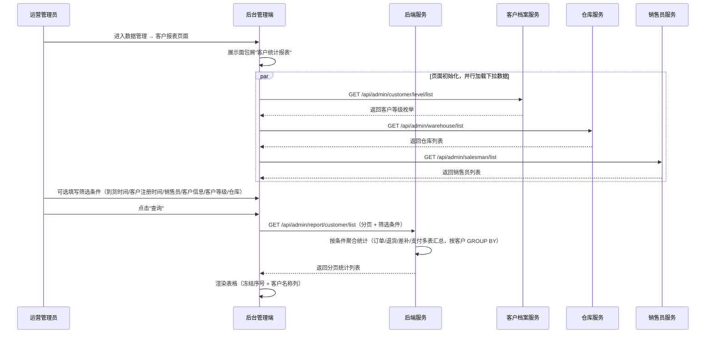
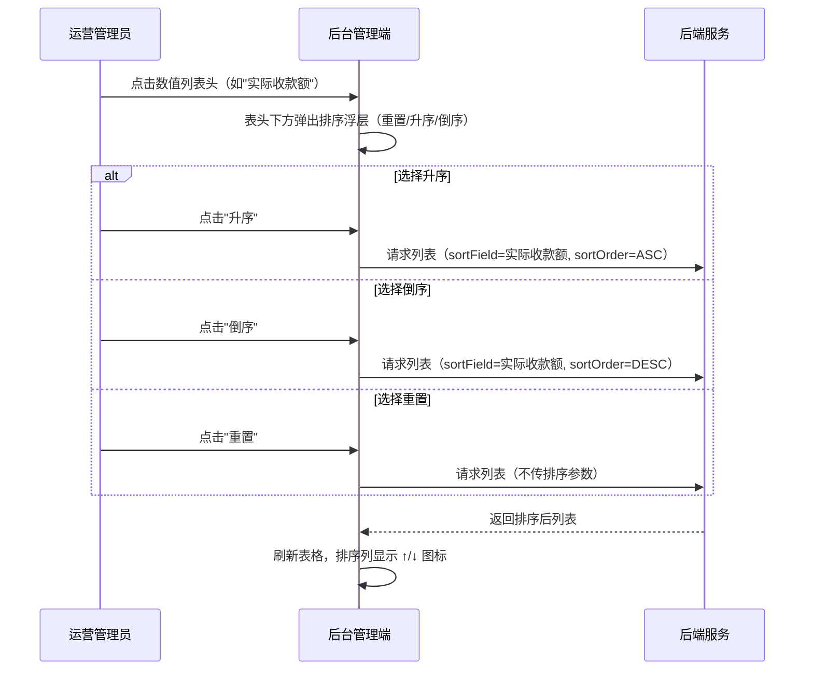
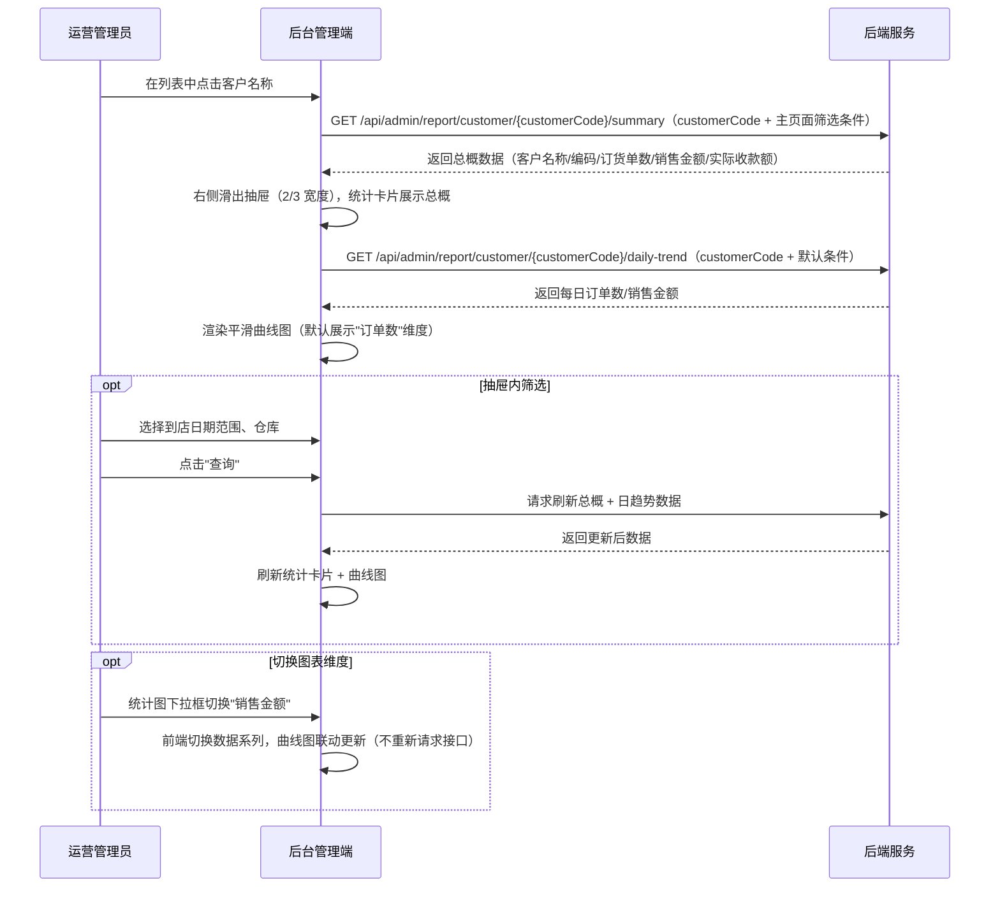
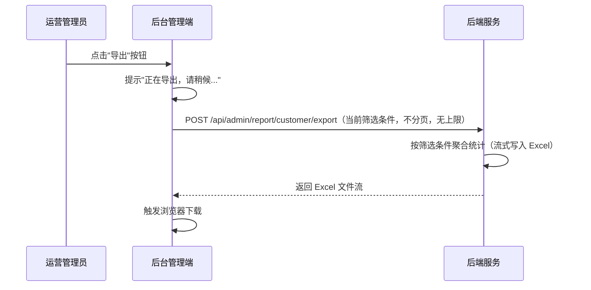

# 客户统计报表模块 SPEC

> **归属中心**：09-数据管理
> **模块**：客户统计报表
> **版本**：v1.2
> **更新日期**：2026-07-13

------

## 1. 背景与目标 (Background & Objectives)

**背景**：运营管理人员需要以客户为主体视角，查看每个客户在指定时间范围内的下单数量、销售金额、退货金额、实际收款额等汇总数据，以便进行客户维度的经营分析、客户分层管理和销售策略调整。

**目标**：为运营管理人员提供客户维度的全量统计数据查询、多维筛选、排序、导出及单客户下钻分析能力，支持按到货时间、客户注册时间、销售员、客户信息、客户等级、仓库等条件灵活筛选。

------

## 2. 角色与使用场景 (Roles & Scenarios)

| 角色 | 说明 |
| --- | --- |
| 运营管理员 | 查看全平台客户统计数据，进行客户维度经营分析 |
| 区域运营经理 | 按数据权限查看管辖范围内的客户统计数据 |
| 销售经理 | 根据客户销售数据评估客户贡献度，制定销售策略 |

**使用场景**：

- 作为运营管理员，我可以通过到货时间、客户注册时间、销售员、客户信息、客户等级、仓库等多条件组合筛选客户统计数据。
- 作为运营管理员，我可以对退货金额、补差金额、实际收款额等数值列进行升序/降序排列，快速定位高价值/高退货客户。
- 作为运营管理员，我可以将当前筛选条件下的客户统计数据导出为 Excel，用于线下分析或汇报。
- 作为运营管理员，我可以点击客户名称右侧滑出抽屉，查看该客户的汇总数据与订货单数/销售金额趋势图。
- 作为运营管理员，我可以在客户详情抽屉中按到店日期和仓库进一步筛选，切换查看订单数/销售金额的日趋势。

------

## 3. 核心业务流程 (Core Business Flow)

### 3.1 客户统计查询流程



### 3.2 列排序流程



### 3.3 客户详情下钻流程



### 3.4 导出流程



### 排序状态映射

| 排序状态 | 图标展示 | 触发条件 |
| --- | --- | --- |
| 无排序（默认） | 无图标 | 初始加载 / 点击重置 |
| 升序 | ↑ | 点击升序 |
| 倒序 | ↓ | 点击倒序 |

------

## 4. 界面与交互说明 (UI & Interaction)

### 4.1 页面整体布局

```
┌──────────────────────────────────────────────────────────────────────────────┐
│  客户统计报表                                                                   │
├──────────────────────────────────────────────────────────────────────────────┤
│  [查询]  [重置]  [导出]                                                        │
├──────────────────────────────────────────────────────────────────────────────┤
│  到货时间：[____年-__月-__日] 至 [____年-__月-__日]                              │
│  客户注册时间：[____年-__月-__日] 至 [____年-__月-__日]                           │
│  销售员：[全部 ▼]    客户信息：[___客户名称/客户编码___]                           │
│  客户等级：[全部 ▼]    仓库：[全部 ▼]                                            │
├──────────────────────────────────────────────────────────────────────────────┤
│  ← 冻结 → │                           ← 可横向滚动 →                          │
│  ┌──┬────┬────┬────┬────┬──────────────┬──────────────────────────────┐        │
│  │序│客户│客户│联系│负责│   订单数维度   │         销售金额维度           │        │
│  │号│名称│编码│人电│销售├────┬────┬────┼──────┬──────┬──────┬──────┤        │
│  │  │    │    │话  │员  │订货│退货│差补│销售  │退货  │补差  │实际  │        │
│  │  │    │    │    │    │单数│单数│单数│金额  │金额  │金额  │收款额│        │
│  ├──┼────┼────┼────┼────┼────┼────┼────┼──────┼──────┼──────┼──────┤        │
│  │1 │永辉│C001│138..│张三│328 │ 15 │  5 │98600 │ 450  │ 120  │93870 │        │
│  │  │超市│    │    │    │    │    │    │ .00  │ .00  │ .00  │ .00  │        │
│  └──┴────┴────┴────┴────┴────┴────┴────┴──────┴──────┴──────┴──────┘        │
│                                              分页：[5/10/20/30/50/100] 条/页    │
└──────────────────────────────────────────────────────────────────────────────┘
```

### 4.2 面包屑导航

页面顶部展示"客户统计报表"作为页面标题，单行展示，无需二级节点。

| 属性 | 说明 |
| --- | --- |
| 标题 | "客户统计报表" |
| 样式 | 加粗深色文字（`color: #303133; font-weight: 500`），位于页面顶部白色背景栏中 |

### 4.3 操作栏

操作栏位于筛选区上方，三个按钮从左到右依次排列：

| 序号 | 按钮 | 类型 | 说明 |
| --- | --- | --- | --- |
| 1 | 查询 | 主按钮（Primary） | 根据当前筛选条件查询数据，刷新列表 |
| 2 | 重置 | 默认按钮（Default） | 清空所有筛选条件恢复默认值，刷新列表 |
| 3 | 导出 | 默认按钮（Default） | 按当前筛选条件导出数据为 Excel，无上限 |

### 4.4 筛选区字段

| 序号 | 字段名 | 组件类型 | Placeholder/默认值 | 说明 |
| --- | --- | --- | --- | --- |
| 1 | 到货时间 | 日期范围选择器 | 空（不限制） | 以商品单据的到货日期为检索依据，可搜索该时间段内产生所有单据信息的相关客户；可选同一天（开始=结束） |
| 2 | 客户注册时间 | 日期范围选择器 | 空（不限制） | 以客户注册时间为检索依据（数据字段来源见 5.2）；可选同一天（开始=结束） |
| 3 | 销售员 | 下拉单选（可搜索） | "全部" | 检索后台已有的销售员列表，支持输入关键字搜索；不选视作全部（数据接口见 5.2） |
| 4 | 客户信息 | 文本输入框 | `客户名称/客户编码` | 模糊匹配，同时对客户名称和客户编码字段搜索 |
| 5 | 客户等级 | 下拉单选 | "全部" | 不选视作全部（数据接口见 5.2） |
| 6 | 仓库 | 下拉单选 | "全部" | 不选视作全部（数据接口见 5.2） |

#### 4.4.1 客户等级枚举值

| 等级 | 值 | 说明 |
| :--- | :--- | :--- |
| 一般客户 | NORMAL | 默认等级 |
| 中级客户 | MIDDLE | 中等价值客户 |
| 顶级客户 | TOP | 高价值/重点客户 |

#### 4.4.2 仓库枚举值

全部、全国集采虚拟仓、广州江高猪肉仓、广州江高电商仓、长沙丰泉综合仓、成都双流综合仓、深圳恒寿蔬果仓、广州南海猪肉仓、广州花地湾水产仓、广州番禺猪肉仓、广州菜吧仓、深圳菜吧仓、清远万安猪肉仓、海南项目仓、B端业务仓、中山创新仓、基地直采仓、中山颐丰猪肉仓、长沙B端业务仓、深圳创新仓、B端业务仓-停用、华南区线下共享仓

### 4.5 工具栏与列表操作

- **列分组**：表格分为基础信息区（序号、客户名称、客户编码、联系人电话、负责销售员）和两个维度分组——「订单数维度」（订货单数、退货单数、差补单数）和「销售金额维度」（销售金额、退货金额、补差金额、实际收款额），分组表头跨越对应子列
- **列排序**：点击维度分组下的数值列表头（订货单数/退货单数/差补单数/销售金额/退货金额/补差金额/实际收款额），表头下方弹出排序浮层（重置/升序/倒序），单选互斥，同一时间仅一列生效，仅针对所选字段排序
- **Hover 提示**：光标移动到客户名称上时，弹出 Tooltip 展示客户简要信息（客户名称、客户编码、客户等级、负责销售员）
- **点击下钻**：点击客户名称，右侧滑出抽屉展示客户详情（占页面 2/3 宽度，见 4.6）
- **分页切换**：支持每页 5 / 10 / 20 / 30 / 50 / 100 条，默认 20 条
- **冻结列**：序号（第 1 列）和客户名称（第 2 列）为左侧冻结列，横向滚动时保持固定

### 4.6 客户详情抽屉（右侧弹出，占页面 2/3 宽度）

点击客户名称后，从页面右侧弹出抽屉（Drawer），宽度占整个页面的 2/3（约 67%）。

```
┌──────────────────────────────┬─────────────────────────────────────────────────────────┐
│  主页面（1/3，半透明遮罩）     │  客户详情抽屉（2/3 宽度）                                  │
│                              │                                                         │
│                              │  永辉超市（C001）                                [✕ 关闭] │
│                              ├─────────────────────────────────────────────────────────┤
│                              │  ┌──────────────┐ ┌──────────────┐ ┌──────────────┐     │
│                              │  │ 订货单数       │ │ 销售金额       │ │ 实际收款额     │     │
│                              │  │   328         │ │ ¥98,600.00  │ │ ¥93,670.00  │     │
│                              │  └──────────────┘ └──────────────┘ └──────────────┘     │
│ (主页面内容被遮罩覆盖)         ├─────────────────────────────────────────────────────────┤
│                              │  到店日期：[____年-__月-__日] 至 [____年-__月-__日]        │
│                              │  仓库：[全部 ▼]                  [查询] [重置]           │
│                              ├─────────────────────────────────────────────────────────┤
│                              │  展示维度：[订单数 ▼]（默认选中，可选：订单数 / 销售金额） │
│                              │                                                         │
│                              │  ↑ 数量/金额（平滑曲线图，Y轴单位随维度切换）               │
│                              │  │     ·                                                 │
│                              │  │    ╱ ╲      ·                                        │
│                              │  │   ╱   ╲    ╱ ╲                                       │
│                              │  │  ╱     ╲  ╱   ╲     ·                                │
│                              │  │ ╱       ╲╱     ╲___╱                                 │
│                              │  │ ·                       ·                            │
│                              │  └─┴──┴──┴──┴──┴──┴──┴──┴──┴──→ 日期                     │
│                              │   07-01 07-02 07-03 07-04 07-05 07-06 ...               │
│                              │                                                         │
│                              │  ≤1月：每天；>1月≤6月：每5天；>6月：每30天                  │
└──────────────────────────────┴─────────────────────────────────────────────────────────┘
```

#### 4.6.1 抽屉基本信息

| 属性 | 说明 |
| :--- | :--- |
| 弹出方式 | 右侧滑出抽屉（Drawer） |
| 宽度 | 页面宽度的 2/3（约 67%） |
| 标题 | 当前选中客户的名称和编码（格式：`客户名称（客户编码）`） |
| 关闭方式 | 点击右上角 ✕、点击遮罩层、按 ESC 键 |

#### 4.6.2 总概区域（统计卡片）

总概区域以**统计卡片**的形式展示，卡片横向排列，数字放大加粗突出：

| 卡片 | 说明 |
| :--- | :--- |
| 订货单数 | 大号数字展示，该客户在筛选条件下的总订单数 |
| 销售金额 | 大号数字展示，¥ 前缀的金额格式 |
| 实际收款额 | 大号数字展示，¥ 前缀的金额格式 |

> **交互**：卡片带有浅色背景和圆角边框，数字使用 24px+ 加粗字体，标签使用 12px 灰色小字。

#### 4.6.3 抽屉筛选区字段

| 序号 | 字段名 | 组件类型 | Placeholder/默认值 | 说明 |
| --- | --- | --- | --- | --- |
| 1 | 到店日期 | 日期范围选择器 | 空（不限制） | 独立于主页面的到货时间筛选，初始为空 |
| 2 | 仓库 | 下拉单选 | "全部" | 数据源同主页面，初始为"全部" |
| — | 查询 | 主按钮 | — | 按筛选条件刷新总概卡片 + 统计图 |
| — | 重置 | 默认按钮 | — | 清空筛选条件恢复默认 |

#### 4.6.4 抽屉统计图

| 属性 | 说明 |
| :--- | :--- |
| 图表类型 | **平滑曲线图**（Line Chart），使用平滑曲线连接相邻数据点（`smooth: true`） |
| 无数据标记 | 无数据的日期对应数据点为空（`null`），该点不显示圆点，但左右相邻数据点之间**曲线跨越连接**（`connectNulls: true`） |
| X 轴 | 日期，数据点密度根据所选时间跨度自动调整（见下方规则） |
| Y 轴 | 数量（整数） |
| 展示维度切换 | 下拉框：订单数 / 销售金额，**默认选中"订单数"**。切换"销售金额"时 Y 轴单位为元（¥） |
| 数据联动 | 图表数据随抽屉内筛选条件联动更新 |
| 维度切换方式 | 前端切换数据系列，不重新请求接口 |

**数据点密度规则**（根据所选日期范围自动适配）：

| 日期范围 | 采样间隔 | X 轴展示效果 | 说明 |
| :--- | :--- | :--- | :--- |
| ≤ 1 个月（30 天） | 每天 1 个点 | 每个日期一个刻度 | 精确展示每一天数据，当天无数据则该点留空、曲线跨越连接 |
| 1~6 个月（31~180 天） | 每 5 天 1 个点 | 每 5 天一个刻度 | 展示整体趋势，减少数据点密度 |
| > 6 个月（181 天以上） | 每 30 天 1 个点 | 每月一个刻度 | 展示长周期趋势，数据点按月汇总 |

> **计算规则**：前端根据抽屉内选择的到店日期范围计算天数，按上表确定采样间隔。数据点值为该间隔内的汇总值。后端始终返回每日原始数据，前端负责按间隔聚合和采样。

### 4.7 极限状态

- **空数据状态**：列表无数据时展示"暂无统计数据"空状态占位图
- **无查询结果**：展示"未找到匹配的客户统计数据，请调整筛选条件"
- **加载状态**：列表表格展示骨架屏或 loading 动画
- **数据极多**：列表分页展示，支持每页 5/10/20/30/50/100 条
- **客户抽屉无图表数据**：展示"所选时间范围内无数据"空状态
- **日期范围非法**：开始日期 > 结束日期时提示"开始日期不能晚于结束日期"
- **导出数据量大**：大数据量导出时使用流式写入，不阻塞前端操作，完成后触发下载
- **网络异常**：查询/导出失败时提示"网络异常，请重试"

------

## 5. 数据字典与字段级规则 (Data & Field Rules)

### 5.1 列表字段

| 字段名称 | 字段类型 | 来源/依赖 | 默认值 | 读写权限 | 校验规则与约束 | 说明 |
| :--- | :--- | :--- | :--- | :--- | :--- | :--- |
| 序号 | Integer | 前端计算 | 1 | 只读 | 根据分页递增 | 冻结列 |
| 客户名称 | String | 关联客户档案表 | — | 只读 | — | 冻结列，hover 展示 Tooltip，点击打开客户详情抽屉 |
| 客户编码 | String | 关联客户档案表 | — | 只读 | — | 基础信息 |
| 联系人电话 | String | 关联客户档案表 | — | 只读 | — | 基础信息 |
| 负责销售员 | String | 关联客户档案表 | — | 只读 | — | 基础信息 |
| **订单数维度** | | | | | | **以下 3 列归属订单数维度分组表头** |
| 订货单数 | Integer | 统计计算（订单表） | 0 | 只读 | ≥ 0 | 可排序 |
| 退货单数 | Integer | 统计计算（退货单表） | 0 | 只读 | ≥ 0 | 可排序 |
| 差补单数 | Integer | 统计计算（差补单表） | 0 | 只读 | ≥ 0 | 可排序 |
| **销售金额维度** | | | | | | **以下 4 列归属销售金额维度分组表头** |
| 销售金额 | Decimal(10,2) | 统计计算（订单表） | 0.00 | 只读 | ≥ 0 | 可排序，单位：元 |
| 退货金额 | Decimal(10,2) | 统计计算（退货单表） | 0.00 | 只读 | ≥ 0 | 可排序，单位：元 |
| 补差金额 | Decimal(10,2) | 统计计算（差补单表） | 0.00 | 只读 | ≥ 0 | 可排序，单位：元 |
| 实际收款额 | Decimal(10,2) | 统计计算（支付流水表） | 0.00 | 只读 | ≥ 0 | 可排序，单位：元 |

### 5.2 筛选条件字段

| 字段名称 | 字段类型 | 来源/依赖 | 默认值 | 读写权限 | 校验规则与约束 | 说明 |
| :--- | :--- | :--- | :--- | :--- | :--- | :--- |
| 到货时间-开始 | Date | 用户选择 | 空 | 可编辑 | arrival_date ≥ 开始日期 | 以商品单据到货日期为检索依据；不选则不限制左边界 |
| 到货时间-结束 | Date | 用户选择 | 空 | 可编辑 | arrival_date ≤ 结束日期 | 不选则不限制右边界 |
| 客户注册时间-开始 | Date | 用户选择 | 空 | 可编辑 | register_date ≥ 开始日期 | ⚠️ 数据字段来源于客户档案表 `cst_archive.register_time`；不选则不限制左边界 |
| 客户注册时间-结束 | Date | 用户选择 | 空 | 可编辑 | register_date ≤ 结束日期 | 不选则不限制右边界 |
| 销售员 | String | ⚠️ `GET /api/admin/salesman/list` | "全部" | 可编辑 | "全部"或空则不限制 | 下拉搜索，页面初始化时调用接口获取列表 |
| 客户信息 | String | 用户输入 | 空 | 可编辑 | name LIKE %kw% OR code LIKE %kw% | 模糊匹配客户名称和编码 |
| 客户等级 | Enum | ⚠️ `GET /api/admin/customer/level/list` | "全部" | 可编辑 | "全部"或空则不限制 | 页面初始化时调用接口获取枚举；暂定：一般客户/中级客户/顶级客户 |
| 仓库 | String | ⚠️ `GET /api/admin/warehouse/list` | "全部" | 可编辑 | "全部"或空则不限制 | 页面初始化时调用接口获取列表；枚举值见 4.4.2 |

### 5.3 查询逻辑

- 所有筛选条件均为可选，未填或选"全部"时该条件不参与 WHERE 过滤
- 到货时间以商品单据的**到货日期**字段为检索依据，通过订单关联客户
- 客户注册时间以客户档案表的**注册时间**字段为检索依据
- 查询结果按客户编码升序排列（默认）
- 分页参数：page（页码）、pageSize（每页条数）

### 5.4 排序逻辑

- 可排序列共 7 列：订货单数、退货单数、差补单数、销售金额、退货金额、补差金额、实际收款额
- 同一时间仅支持单列排序，点击另一列时自动取消当前列的排序
- 排序状态三态切换：无排序（默认）→ 升序 → 倒序 → 点击重置回到无排序
- 排序参数传递至后端：sortField（排序字段）、sortOrder（ASC/DESC）

### 5.5 导出逻辑

- 导出格式：Excel (.xlsx)
- 导出范围：按当前筛选条件导出（含客户等级、仓库等所有筛选条件），不受分页限制
- **无导出上限**：不设条数上限，大数据量时采用流式写入（SXSSFWorkbook）或异步导出任务
- 导出字段：表格全部 8 列（序号列为导出时的数据行号）
- 文件命名：`客户统计报表_YYYYMMDD_HHmmss.xlsx`

### 5.6 展示逻辑

- 日期时间格式统一为 `YYYY-MM-DD HH:mm:ss`
- 金额保留两位小数
- 整数类型展示为整数，不含小数

------

## 6. 系统交互与边界 (System Integrations & Boundaries)

### 6.1 前置依赖

- 需先完成客户档案表的数据维护（客户名称、编码、联系人电话来源），客户注册时间字段来源于 `cst_archive.register_time`，客户等级字段来源于 `cst_archive.customer_level`
- ⚠️ 需对接 `GET /api/admin/salesman/list` 接口（销售员下拉数据源，复用运营管理-销售员管理模块）
- ⚠️ 需对接 `GET /api/admin/warehouse/list` 接口（仓库下拉数据源，复用运营管理-仓库信息管理模块）
- ⚠️ 需对接 `GET /api/admin/customer/level/list` 接口（客户等级枚举数据源，来源于客户档案模块或字典管理）
- 需订单/退货/差补/支付流水表中有数据（统计数据来源）

### 6.2 上下游影响

- **上游**：客户档案表提供客户基础信息；销售员管理提供销售员列表；订单/退货/差补/支付流水表提供原始统计数据
- **下游**：销售经理依据客户统计报表评估客户贡献度、制定销售策略
- **数据聚合**：本模块为只读统计，不写入任何业务数据，所有字段由多表聚合查询得出
- **性能考量**：统计聚合涉及多表 JOIN 和 GROUP BY 客户维度，大数据量场景下需建立适当索引

------

## 7. 非功能性需求 (Non-Functional Requirements)

### 7.1 权限与安全

- **数据权限（Data 级）**：按用户仓库/大区权限过滤统计数据，用户仅能看到管辖范围内的客户统计
- **导出权限**：具备查看权限即可导出
- **数据安全**：统计数据为只读，不提供编辑/删除功能

### 7.2 性能要求

- 列表查询需支持分页，查询响应时间 < 3s
- 统计聚合查询涉及多表 JOIN 和 GROUP BY，需建立适当索引
- 图表数据量 ≤ 365 个数据点（最多一年），渲染 < 1s
- 销售员列表和仓库下拉选项可前端缓存，减少重复请求

### 7.3 业务规则

- 所有筛选条件为可选，不选 = 全选
- 到货时间和客户注册时间均可选同一天（开始日期 = 结束日期）
- 同一时间仅支持单列排序，不支持多列联合排序
- 导出数据受当前筛选条件约束，但不受分页限制，**无导出上限**
- 客户详情抽屉中的到店日期和仓库筛选独立于主页面，初始为空
- 统计图为平滑曲线图（`smooth: true`），无数据日不显示圆点但曲线跨越连接（`connectNulls: true`）
- 统计图数据点密度根据日期范围自动调整：≤1月每天/1-6月每5天/>6月每30天
- 统计图展示维度：订单数 / 销售金额（默认订单数），切换"销售金额"时 Y 轴单位变为元（¥）

------

## 8. 附录

### 8.1 功能清单汇总

| 功能项 | 说明 |
| --- | --- |
| 面包屑导航 | 顶部"客户统计报表"，一级节点可点击 |
| 多条件筛选 | 到货时间、客户注册时间（日期范围）、销售员（下拉搜索）、客户信息（模糊搜索）、客户等级（下拉）、仓库（下拉） |
| 查询 | 按筛选条件刷新列表 |
| 重置 | 清空筛选条件，恢复默认值 |
| 导出 | 按当前客户筛选条件导出 Excel，**无上限**，大数据量流式写入 |
| 数据表格 | 12 列数据展示（分组表头：基础信息 + 订单数维度 + 销售金额维度），序号和客户名称列为左侧冻结列 |
| 列排序 | 7 个数值字段支持单字段升序/降序/重置，浮层交互 |
| 客户名称 Hover | 光标悬停展示客户简要信息 Tooltip |
| 客户名称点击 | 右侧滑出抽屉（占页面 2/3），展示统计卡片 + 筛选区 + 平滑曲线图 |
| 客户总概 | 统计卡片形式：订货单数、销售金额、实际收款额（大号数字突出展示） |
| 客户日趋势曲线图 | 平滑曲线图（`smooth: true`），根据日期范围自动调整数据点密度（≤1月每天/1-6月每5天/>6月每30天），无数据日曲线跨越连接，支持订单数/销售金额切换（默认订单数），切换销售金额时 Y 轴单位为 ¥ |
| 分页 | 每页 5 / 10 / 20 / 30 / 50 / 100 条可选，默认 20 条 |

### 8.2 功能与字段权限矩阵

| 功能 | 客户名称 | 客户编码 | 联系人电话 | 负责销售员 | 订货单数 | 退货单数 | 差补单数 | 销售金额 | 退货金额 | 补差金额 | 实际收款额 |
|:---|:---:|:---:|:---:|:---:|:---:|:---:|:---:|:---:|:---:|:---:|:---:|
| 列表查看 | 👁 | 👁 | 👁 | 👁 | 👁 | 👁 | 👁 | 👁 | 👁 | 👁 | 👁 |
| 列排序 | — | — | — | — | ✅ | ✅ | ✅ | ✅ | ✅ | ✅ | ✅ |
| 导出 | ✅ | ✅ | ✅ | ✅ | ✅ | ✅ | ✅ | ✅ | ✅ | ✅ | ✅ |
| 客户总概 | 👁 | 👁 | — | — | 👁 | — | — | 👁 | — | — | 👁 |
| 客户图表 | — | — | — | — | ✅ | — | — | ✅ | — | — | — |

> 图例：👁 展示 | ✅ 可操作/可导出 | — 不涉及

### 8.3 与其他模块的关系

| 关联模块 | 关系说明 |
| --- | --- |
| 客户管理-客户档案（02） | 提供客户名称、编码、联系人电话、注册时间、客户等级等基础数据 |
| 运营管理-销售员（07） | 提供销售员下拉筛选数据源 |
| 运营管理-仓库（07） | 提供仓库下拉筛选数据源 |
| 交易管理-销售订单（03） | 提供订货单数、销售金额等统计数据 |
| 交易管理-退货单（03） | 提供退货金额统计数据 |
| 交易管理-差补单（03） | 提供补差金额统计数据 |
| 财务管理-支付流水（05） | 提供实际收款额数据 |

### 8.4 接口预估

| 接口 | 方法 | 路径（建议） | 说明 |
| --- | --- | --- | --- |
| 客户统计列表 | GET | /api/admin/report/customer/list | 分页查询客户统计数据，支持筛选和单字段排序 |
| 客户统计导出 | POST | /api/admin/report/customer/export | 按当前客户筛选条件导出 Excel，无上限，流式写入 |
| 客户汇总数据 | GET | /api/admin/report/customer/{customerCode}/summary | 获取单个客户的汇总数据（总概卡片） |
| 客户日趋势 | GET | /api/admin/report/customer/{customerCode}/daily-trend | 获取单个客户在日期范围内每一天的订单数/销售金额趋势 |
| 下拉-销售员列表 ⚠️ | GET | /api/admin/salesman/list | 页面初始化调用，获取销售员下拉选项（复用运营管理-销售员管理模块） |
| 下拉-仓库列表 ⚠️ | GET | /api/admin/warehouse/list | 页面初始化调用，获取仓库下拉选项（复用运营管理-仓库信息管理模块） |
| 下拉-客户等级 ⚠️ | GET | /api/admin/customer/level/list | 页面初始化调用，获取客户等级枚举（来源于客户档案模块或字典管理） |

> ⚠️ 标注的接口为筛选条件下拉数据源，页面初始化时并行调用。销售员列表、仓库列表、客户等级枚举均可前端缓存以提升性能。

### 8.5 路由路径

```
/report/customer          ← 客户统计报表
```

### 8.6 变更记录

| 版本 | 日期 | 变更内容 | 变更人 |
| --- | --- | --- | --- |
| v1.0 | 2026-07-13 | 初始版本，定义客户统计报表核心功能：6 条件筛选（到货时间/客户注册时间/销售员/客户信息/客户等级/仓库），其中销售员（`GET /api/admin/salesman/list`）、客户等级（`GET /api/admin/customer/level/list`）、仓库（`GET /api/admin/warehouse/list`）三个筛选条件均调用后台接口获取数据；客户注册时间来源于客户档案表 `cst_archive.register_time`；客户维度的下单数量与金额统计；冻结列（序号+客户名称）；6 列单字段数值排序（浮层交互）；客户名称 Hover 提示；客户详情右侧抽屉（占页面2/3，统计卡片+筛选区+平滑曲线图+维度切换+数据点密度自适应）；导出无上限 | — |
| v1.1 | 2026-07-13 | 修订：①核心业务流程图全部改为标准 mermaid 时序图（去掉折叠，直接展示）②筛选区字段和前置依赖全部标注具体后台 API 接口路径，包括销售员、客户等级、仓库三个下拉接口及客户注册时间的数据表来源 | — |
| v1.2 | 2026-07-13 | 修订：①前端页面去除接口 ⚠️ 标识（接口信息仅在数据字典和系统交互章节保留）②表格新增分组表头（订单数维度：订货单数/退货单数/差补单数；销售金额维度：销售金额/退货金额/补差金额/实际收款额），总列数从 8 列扩展为 12 列 ③图表展示维度从"订单数/订购数"改为"订单数/销售金额" ④可排序列从 6 列调整为 7 列 | — |
