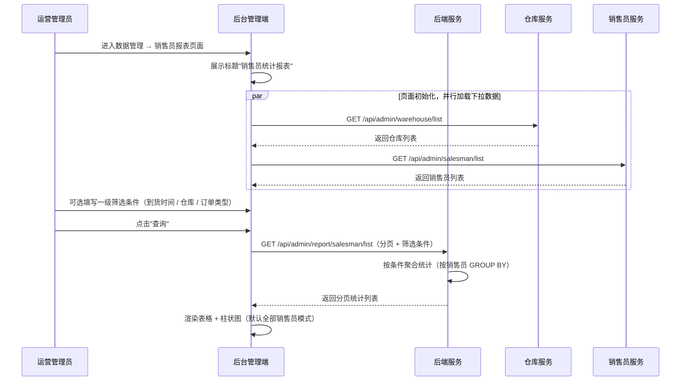
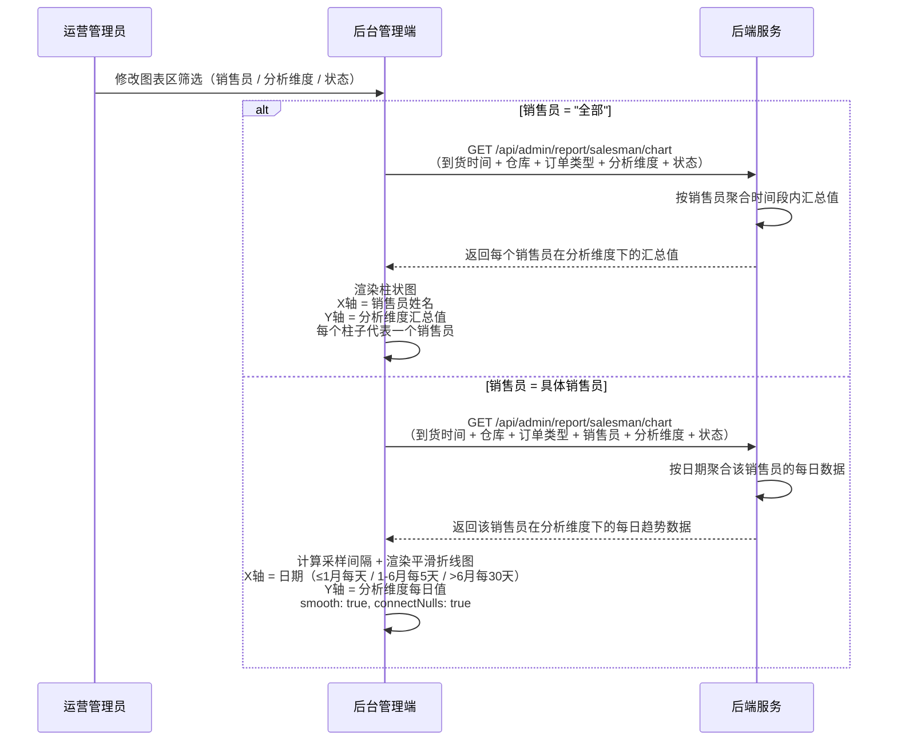
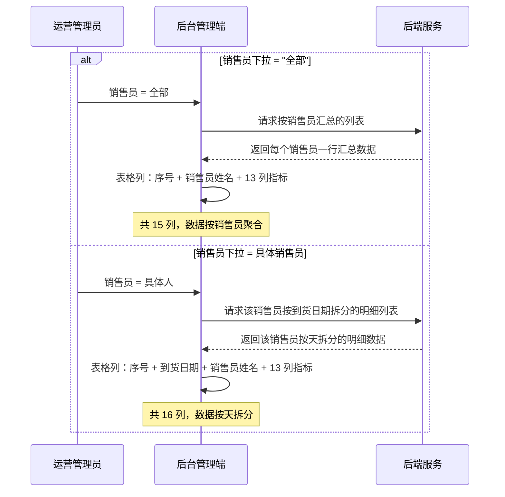
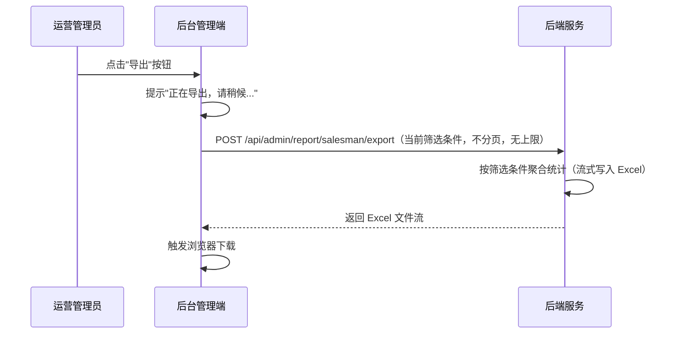

# 销售员统计报表模块 SPEC

> **归属中心**：09-数据管理
> **模块**：销售员统计报表
> **版本**：v2.1
> **更新日期**：2026-07-13

------

## 1. 背景与目标 (Background & Objectives)

**背景**：运营管理人员需要以销售员为主体视角，查看每个销售员在指定时间范围内带来的下单数量、销售金额、退货金额、实际收益额等汇总数据，并与团队均值进行对比，以便评估销售员绩效、制定激励策略。

**目标**：为运营管理人员提供销售员维度的全量统计数据查询、图表分析、排序、导出能力。图表区根据销售员筛选范围自动切换展示模式——全部销售员时以柱状图对比各销售员在分析维度下的汇总值，具体销售员时以折线图展示该销售员的时间趋势。

------

## 2. 角色与使用场景 (Roles & Scenarios)

| 角色 | 说明 |
| --- | --- |
| 运营管理员 | 查看全平台销售员统计数据，进行绩效评估 |
| 区域运营经理 | 按数据权限查看管辖范围内的销售员统计 |
| 销售经理 | 查看团队销售员业绩对比，发现优秀/落后销售员 |

**使用场景**：

- 作为运营管理员，我可以通过到货时间、仓库、订单类型筛选销售员统计数据，并在柱状图中横向对比各销售员在分析维度下的汇总值。
- 作为运营管理员，我可以选择具体销售员，查看该销售员在分析维度下的日趋势折线图。
- 作为运营管理员，我可以切换分析维度（8 项）来改变图表的 Y 轴指标。
- 作为运营管理员，我可以对比各销售员的有效客户率、与团队均值差量等表格指标，快速定位业绩差异。
- 作为运营管理员，我可以查看销售员实际收益额的同比变化（绿色↑/红色↓），判断业绩走势。
- 作为运营管理员，我可以将当前筛选条件下的销售员统计数据导出为 Excel。

------

## 3. 核心业务流程 (Core Business Flow)

### 3.1 销售员统计查询流程



### 3.2 图表渲染流程（根据销售员筛选切换模式）



### 3.3 表格列联动流程



### 3.4 导出流程



------

## 4. 界面与交互说明 (UI & Interaction)

### 4.1 页面整体布局

```
┌──────────────────────────────────────────────────────────────────────────────┐
│  销售员统计报表                                                                 │
├──────────────────────────────────────────────────────────────────────────────┤
│  [查询]  [重置]  [导出]                                                        │
├──────────────────────────────────────────────────────────────────────────────┤
│  到货时间：[____年-__月-__日] 至 [____年-__月-__日]                              │
│  仓库：[全部 ▼]    订单类型：[全部 ▼]                                            │
├──────────────────────────────────────────────────────────────────────────────┤
│  ── 图表分析区（继承上方一级筛选条件）──                                           │
│  销售员：[全部 ▼]    分析维度：[销售金额 ▼]    状态：[全部 ▼]                      │
│  ┌──────────────────────────────────────────────────────────────────────┐    │
│  │  销售员=全部时：柱状图                  销售员=具体人时：折线图          │    │
│  │  ↑ 销售金额（汇总）                      ↑ 销售金额（每日）              │    │
│  │  │  ██                                  │    ···                      │    │
│  │  │  ██ ██                               │  ╱      ╲                   │    │
│  │  │  ██ ██ ██                             │ ╱        ╲···               │    │
│  │  │  ██ ██ ██ ██                          │╱           ╲  ╲             │    │
│  │  └──┴──┴──┴──┴──→ 销售员                 └────────────────→ 日期        │    │
│  │     张三 李四 王五 赵六                      07-01  07-05  07-10         │    │
│  └──────────────────────────────────────────────────────────────────────┘    │
├──────────────────────────────────────────────────────────────────────────────┤
│  ── 数据表格 ──                                                                │
│  ← 冻结 → │                    ← 可横向滚动 →                                 │
│  ┌──┬────┬────┬────┬────┬────┬────┬────┬────┬────┬────┬────┬────┬───┐       │
│  │序│销售│有效│下单│有效│订货│团队│退货│差补│销售│退货│差补│实际│同比│       │
│  │号│员姓│下单│客户│客户│单数│订单│单数│单数│金额│金额│金额│收益│变化│       │
│  │  │名  │客户│数  │率  │    │量均│    │    │    │    │    │额  │(与 │       │
│  │  │    │数  │    │    │    │值差│    │    │    │    │    │    │上月│       │
│  │  │    │    │    │    │    │    │    │    │    │    │    │    │同比│       │
│  ├──┼────┼────┼────┼────┼────┼────┼────┼────┼────┼────┼────┼────┼───┤       │
│  │1 │张三│ 45 │ 52 │86% │328 │+15 │ 15 │  5 │... │... │... │... │↑12│       │
│  └──┴────┴────┴────┴────┴────┴────┴────┴────┴────┴────┴────┴────┴───┘       │
│                                              分页：[5/10/20/30/50/100] 条/页    │
└──────────────────────────────────────────────────────────────────────────────┘
```

### 4.2 标题

页面顶部展示"销售员统计报表"作为页面标题，单行展示，加粗深色文字。

### 4.3 操作栏

| 序号 | 按钮 | 类型 | 说明 |
| --- | --- | --- | --- |
| 1 | 查询 | 主按钮（Primary） | 根据当前筛选条件查询数据，刷新表格 + 图表 |
| 2 | 重置 | 默认按钮（Default） | 清空所有筛选条件恢复默认值，刷新 |
| 3 | 导出 | 默认按钮（Default） | 按当前筛选条件导出数据为 Excel，无上限 |

### 4.4 一级筛选区（影响表格 + 图表）

| 序号 | 字段名 | 组件类型 | Placeholder/默认值 | 说明 |
| --- | --- | --- | --- | --- |
| 1 | 到货时间 | 日期范围选择器 | **默认近一个月**（今天往前推 30 天至今天） | 以商品单据的到货日期为检索依据；可选同一天。**图表的时间轴严格按此范围展示，表格数据也以此范围过滤** |
| 2 | 仓库 | 下拉单选 | "全部" | 不选视作全部；**图表和表格的仓库过滤与此联动** |
| 3 | 订单类型 | 下拉单选 | "全部" | 枚举：全部 / 普通客户订单 / 线上尾货 / 大客户订单；**图表和表格的订单类型过滤与此联动** |

### 4.5 图表分析区（继承一级筛选，销售员范围决定图表模式）

图表区位于一级筛选下方，**继承**一级筛选的到货时间、仓库、订单类型条件，并额外提供三个图表专属筛选。

#### 4.5.1 图表区筛选字段

| 序号 | 字段名 | 组件类型 | Placeholder/默认值 | 说明 |
| --- | --- | --- | --- | --- |
| 1 | 销售员 | 下拉单选（可搜索） | "全部" | 检索后台已有的销售员列表。**此选择决定图表模式**（见 4.5.2）以及表格列（见 4.6.1） |
| 2 | 分析维度 | 下拉单选 | "销售金额" | 决定图表 Y 轴展示的指标；全部销售员柱状图 = Y 轴为汇总值，具体销售员折线图 = Y 轴为每日值 |
| 3 | 状态 | 下拉单选 | "全部" | 枚举：全部 / 启用 / 禁用；过滤参与图表和表格的销售员 |

#### 4.5.2 图表双模式

图表数据的时间范围**严格遵循**一级筛选的到货时间选择。页面初始默认展示近一个月（今天往前推 30 天）。用户修改到货时间后，柱状图和折线图的 X 轴范围同步更新。

| 模式 | 触发条件 | 图表类型 | X 轴 | Y 轴 | 数据含义 |
| :--- | :--- | :--- | :--- | :--- | :--- |
| **柱状图模式** | 销售员选择"全部" | 柱状图（Bar Chart） | 销售员姓名（每个柱子一个销售员） | 所选分析维度的**时间段内汇总值** | 在到货时间范围内，每个销售员在该分析维度下的累计总和 |
| **折线图模式** | 销售员选择具体人 | 平滑曲线图（Line Chart） | 日期，范围 = 到货时间的开始至结束 | 所选分析维度的**每日值** | 该销售员在到货时间范围内每一天的数据点，X 轴严格按时间跨度展示 |

> **交互规则**：切换分析维度下拉框时，两种模式的 Y 轴指标同步切换。切换销售员下拉框（全部 ↔ 具体人）时，图表类型和坐标轴自动切换。

#### 4.5.3 折线图模式专属配置（仅销售员=具体人时适用）

| 属性 | 说明 |
| :--- | :--- |
| X 轴范围 | **严格等于**一级筛选到货时间的开始日期至结束日期 |
| 曲线类型 | `smooth: true`（平滑曲线），`connectNulls: true`（无数据日不显示圆点但曲线跨越连接） |
| 零值处理 | 数值为 0 的数据点正常显示在 X 轴上（非 null，圆点定在数轴） |
| 数据点密度 | 根据到货时间的天数跨度自动计算采样间隔（见下表） |

**数据点密度规则**（仅折线图模式，根据到货时间天数自动适配）：

| 日期范围 | 采样间隔 | X 轴展示效果 |
| :--- | :--- | :--- |
| ≤ 1 个月（1~30 天） | 每天 1 个点 | 每个日期一个刻度，当天无数据则该点留空、曲线跨越连接 |
| 1~6 个月（31~180 天） | 每 5 天 1 个点 | 每 5 天一个刻度，间隔内数值汇总 |
| > 6 个月（181 天以上） | 每 30 天 1 个点 | 每月一个刻度，间隔内数值汇总 |

> **计算规则**：后端返回到货时间范围内每天的原始数据，前端根据 `(结束日期 - 开始日期)` 的天数按上表确定采样间隔，将每日原始数据按间隔聚合后渲染。柱状图模式不需要采样，直接按销售员聚合时间段内汇总值即可。

#### 4.5.4 分析维度枚举值（8 项）

| 序号 | 维度 | 说明 |
|:--|:---|:---|
| 1 | 有效下单客户数 | 实际完成下单的有效客户数 |
| 2 | 下单客户数 | 总下单客户数（含未完成） |
| 3 | 订单有效率 | 有效订单数 ÷ 总订单数 |
| 4 | 销售金额 | 总销售金额（元） |
| 5 | 退货金额 | 总退货金额（元） |
| 6 | 实际销售额 | 销售金额 − 退货金额 |
| 7 | 与团队订单量均值差量 | 该销售员订单量 − 团队订单量均值 |
| 8 | 与团队实际收款额均值差额 | 该销售员实际收款额 − 团队实际收款额均值 |

### 4.6 数据表格

#### 4.6.1 表格列定义（根据图表区销售员筛选动态切换）

**模式 A — 销售员选择"全部"（15 列）**：

> **排序规则**：序号和销售员姓名为冻结列不可排序，其余 13 列**全部支持排序**，点击列表头弹出浮层（重置 / 升序 / 倒序）。

| 序号 | 列名 | 是否冻结 | 是否可排序 | 说明 |
|:--|:---|:---:|:---:|:---|
| 1 | 序号 | ✅ 冻结 | ❌ | 根据分页自动计算 |
| 2 | 销售员姓名 | ✅ 冻结 | ❌ | — |
| 3 | 有效下单客户数 | ❌ | ✅ 可排序 | — |
| 4 | 下单客户数 | ❌ | ✅ 可排序 | — |
| 5 | 有效客户率 | ❌ | ✅ 可排序 | 有效下单客户数 ÷ 下单客户数，百分比 |
| 6 | 订货单数 | ❌ | ✅ 可排序 | — |
| 7 | 与团队订单量均值差量 | ❌ | ✅ 可排序 | 正值 + 前缀，负值 − 前缀 |
| 8 | 退货单数 | ❌ | ✅ 可排序 | — |
| 9 | 差补单数 | ❌ | ✅ 可排序 | — |
| 10 | 销售金额 | ❌ | ✅ 可排序 | 单位：元 |
| 11 | 退货金额 | ❌ | ✅ 可排序 | 单位：元 |
| 12 | 差补金额 | ❌ | ✅ 可排序 | 单位：元 |
| 13 | 实际收益额 | ❌ | ✅ 可排序 | 单位：元 |
| 14 | 实际收益额同比变化（与上月同比） | ❌ | ✅ 可排序 | 绿色↑正增长 / 红色↓负增长 / 灰色—持平 |
| 15 | 与团队实际收款额均值差额 | ❌ | ✅ 可排序 | 单位：元 |

**模式 B — 销售员选择具体人（16 列）**：在序号和销售员姓名之间插入"到货日期"列（`YYYY年-MM月-DD日`）。到货日期列不可排序，其余列排序规则同模式 A（销售员姓名之后 13 列全部可排序）。

#### 4.6.2 列排序交互

- 点击可排序列表头 → 弹出浮层（重置 / 升序 / 倒序）
- 单选互斥，同一时间仅一列生效
- 表头以 ↑ ↓ ⇅ 图标指示排序状态

**排序语义**（业务定义）：

| 操作 | 含义 | 排序效果 |
|:---|:---|:---|
| 升序 ↑ | 数值大的排在表格顶端 | 数据从大到小排列（等同 SQL DESC） |
| 降序 ↓ | 数值小的排在表格顶端 | 数据从小到大排列（等同 SQL ASC） |
| 重置 | 取消排序 | 恢复默认排序 |

#### 4.6.3 实际收益额同比变化（与上月同比）列渲染

| 条件 | 展示 | 样式 |
|:---|:---|:---|
| 本月同比 > 上月同比 | ↑XX.XX% | 绿色（`#67c23a`）加粗 |
| 本月同比 < 上月同比 | ↓XX.XX% | 红色（`#f56c6c`）加粗 |
| 本月同比 = 上月同比（持平） | — | 灰色（`#909399`） |
| 上月无数据，无法计算同比 | **-** | 灰色（`#909399`） |

#### 4.6.4 分页

- 每页条数：5 / 10 / 20 / 30 / 50 / 100 条可选，默认 20 条
- 冻结列：模式 A 为序号 + 销售员姓名；模式 B 为序号 + 到货日期 + 销售员姓名

### 4.7 极限状态

- **空数据状态**：表格展示"暂无统计数据"，图表展示"所选时间范围内无数据"
- **无查询结果**：展示"未找到匹配的销售员统计数据，请调整筛选条件"
- **加载状态**：表格和图表区域展示 loading 动画
- **日期范围非法**：开始 > 结束时提示"开始日期不能晚于结束日期"
- **导出量大**：流式写入，不阻塞前端

------

## 5. 数据字典与字段级规则 (Data & Field Rules)

### 5.1 列表字段

| 字段名称 | 字段类型 | 来源/依赖 | 默认值 | 读写权限 | 校验规则与约束 | 说明 |
| :--- | :--- | :--- | :--- | :--- | :--- | :--- |
| 序号 | Integer | 前端计算 | 1 | 只读 | 根据分页递增 | 冻结列 |
| 销售员姓名 | String | 关联销售员表 | — | 只读 | — | 冻结列 |
| 到货日期 | String | 仅模式 B | — | 只读 | 格式 YYYY年-MM月-DD日 | 仅销售员=具体人时显示 |
| 有效下单客户数 | Integer | 统计计算 | 0 | 只读 | ≥ 0 | 可排序 |
| 下单客户数 | Integer | 统计计算 | 0 | 只读 | ≥ 0 | 可排序 |
| 有效客户率 | Decimal(5,2) | 计算字段 | 0.00 | 只读 | 有效下单客户数 ÷ 下单客户数 | 可排序，百分比展示 |
| 订货单数 | Integer | 统计计算（订单表） | 0 | 只读 | ≥ 0 | 可排序 |
| 与团队订单量均值差量 | Decimal(10,2) | 计算字段 | 0.00 | 只读 | — | 可排序 |
| 退货单数 | Integer | 统计计算（退货单表） | 0 | 只读 | ≥ 0 | 可排序 |
| 差补单数 | Integer | 统计计算（差补单表） | 0 | 只读 | ≥ 0 | 可排序 |
| 销售金额 | Decimal(10,2) | 统计计算（订单表） | 0.00 | 只读 | ≥ 0 | 可排序，单位：元 |
| 退货金额 | Decimal(10,2) | 统计计算（退货单表） | 0.00 | 只读 | ≥ 0 | 可排序，单位：元 |
| 差补金额 | Decimal(10,2) | 统计计算（差补单表） | 0.00 | 只读 | ≥ 0 | 可排序，单位：元 |
| 实际收益额 | Decimal(10,2) | 统计计算 | 0.00 | 只读 | — | 可排序，单位：元 |
| 实际收益额同比变化（与上月同比） | Decimal(5,2) | 计算字段 | 0.00 | 只读 | — | 可排序，绿↑/红↓ |
| 与团队实际收款额均值差额 | Decimal(10,2) | 计算字段 | 0.00 | 只读 | — | 可排序，单位：元 |

### 5.2 筛选条件字段

| 字段名称 | 字段类型 | 来源/依赖 | 默认值 | 说明 |
| :--- | :--- | :--- | :--- | :--- |
| 到货时间-开始 | Date | 用户选择 | 空 | 以商品单据到货日期为检索依据 |
| 到货时间-结束 | Date | 用户选择 | 空 | — |
| 仓库 | String | `GET /api/admin/warehouse/list` | "全部" | 页面初始化调用，复用仓库管理模块 |
| 订单类型 | Enum | 字典 | "全部" | 普通客户订单 / 线上尾货 / 大客户订单 |

### 5.3 图表区筛选字段

| 字段名称 | 字段类型 | 来源/依赖 | 默认值 | 说明 |
| :--- | :--- | :--- | :--- | :--- |
| 销售员 | String | `GET /api/admin/salesman/list` | "全部" | 决定图表模式（柱状图/折线图）和表格列模式（A/B） |
| 分析维度 | Enum | — | "销售金额" | 8 项见 4.5.4 |
| 状态 | Enum | 销售员表 | "全部" | 启用 / 禁用 |

### 5.4 排序逻辑

- 可排序列共 13 列（模式 A：销售员姓名后的 13 列；模式 B：到货日期不可排序，销售员姓名后的 13 列）
- 同一时间仅支持单列排序
- 浮层交互：重置 / 升序 / 倒序

### 5.5 导出逻辑

- 导出格式：Excel (.xlsx)，不受分页限制，无上限，流式写入
- 文件命名：`销售员统计报表_YYYYMMDD_HHmmss.xlsx`

### 5.6 展示逻辑

- 有效客户率：百分比保留两位小数
- 实际收益额同比变化（与上月同比）：绿色↑ / 红色↓ / 灰色—
- 团队均值差量/差额：正值 + 前缀，负值 − 前缀
- 金额保留两位小数

------

## 6. 系统交互与边界 (System Integrations & Boundaries)

### 6.1 前置依赖

- 需先完成销售员管理模块维护（销售员下拉数据源）
- 需对接 `GET /api/admin/salesman/list`（复用运营管理-销售员管理）
- 需对接 `GET /api/admin/warehouse/list`（复用运营管理-仓库信息管理）
- 需订单/退货/差补/支付流水表中有数据

### 6.2 上下游影响

- **上游**：销售员管理、仓库管理、订单/退货/差补/支付流水表
- **下游**：销售经理依据报表进行绩效评估
- **数据聚合**：只读统计，团队均值字段需额外全团队查询

------

## 7. 非功能性需求 (Non-Functional Requirements)

### 7.1 权限与安全

- 按用户仓库/大区权限过滤统计数据
- 具备查看权限即可导出
- 统计数据为只读

### 7.2 性能要求

- 列表查询 < 3s，图表数据渲染 < 1s
- 团队均值计算需优化查询或使用缓存

### 7.3 业务规则

- 所有筛选条件为可选，不选 = 全选
- 图表模式由销售员筛选自动切换，不可手动选择
- 折线图模式数据点密度：≤1月每天 / 1-6月每5天 / >6月每30天
- 折线图零值定轴，无数据日跨越连接
- 表格列根据销售员筛选自动切换（A:15列 / B:16列）
- 同一时间仅支持单列排序
- 导出无上限

------

## 8. 附录

### 8.1 功能清单汇总

| 功能项 | 说明 |
| --- | --- |
| 标题 | 顶部"销售员统计报表" |
| 一级筛选 | 到货时间、仓库、订单类型（影响表格 + 图表） |
| 图表区 | 继承一级筛选，销售员=全部→柱状图（X=销售员 Y=维度汇总值），销售员=具体人→折线图（X=日期 Y=维度每日值） |
| 分析维度切换 | 8 项下拉，同时影响柱状图和折线图的 Y 轴 |
| 查询 | 按筛选条件刷新表格 + 图表 |
| 重置 | 清空所有条件恢复默认 |
| 导出 | Excel 无上限流式写入 |
| 数据表格 | 销售员姓名之后共 13 个数据列全部展示：有效下单客户数、下单客户数、有效客户率、订货单数、与团队订单量均值差量、退货单数、差补单数、销售金额、退货金额、差补金额、实际收益额、实际收益额同比变化（与上月同比）、与团队实际收款额均值差额。模式 A（全部销售员）15 列，模式 B（具体销售员）16 列（序号后插入到货日期） |
| 列排序 | 销售员姓名之后的 13 列**全部**支持浮层排序（重置/升序/倒序），点击字段名或排序图标均可触发 |
| 同比变化列 | 绿色↑正增长 / 红色↓负增长（与上月同比） |
| 分页 | 5/10/20/30/50/100 条可选 |

### 8.2 图表模式对照

| 销售员筛选 | 图表类型 | X 轴 | Y 轴 | 数据聚合方式 | 密度规则 |
| :--- | :--- | :--- | :--- | :--- | :--- |
| 全部 | 柱状图 | 销售员姓名 | 分析维度汇总值 | 时间段内累计求和 | 不适用 |
| 具体人 | 平滑折线图 | 日期 | 分析维度每日值 | 按天聚合 | ≤1月每天/1-6月每5天/>6月每30天 |

### 8.3 功能与字段权限矩阵

| 功能 | 销售员姓名 | 有效下单客户数 | 下单客户数 | 有效客户率 | 订货单数 | 团队订单均值差 | 退货单数 | 差补单数 | 销售金额 | 退货金额 | 差补金额 | 实际收益额 | 同比变化(与上月同比) | 团队收款均值差 |
|:---|:---:|:---:|:---:|:---:|:---:|:---:|:---:|:---:|:---:|:---:|:---:|:---:|:---:|:---:|
| 列表查看 | 👁 | 👁 | 👁 | 👁 | 👁 | 👁 | 👁 | 👁 | 👁 | 👁 | 👁 | 👁 | 👁 | 👁 |
| 列排序 | — | ✅ | ✅ | ✅ | ✅ | ✅ | ✅ | ✅ | ✅ | ✅ | ✅ | ✅ | ✅ | ✅ |
| 导出 | ✅ | ✅ | ✅ | ✅ | ✅ | ✅ | ✅ | ✅ | ✅ | ✅ | ✅ | ✅ | ✅ | ✅ |

### 8.4 与其他模块的关系

| 关联模块 | 关系说明 |
| --- | --- |
| 运营管理-销售员（07） | 提供销售员下拉数据源 |
| 运营管理-仓库（07） | 提供仓库下拉数据源 |
| 交易管理-销售订单（03） | 提供订货单数、销售金额等统计数据 |
| 交易管理-退货单（03） | 提供退货单数、退货金额数据 |
| 交易管理-差补单（03） | 提供差补单数、差补金额数据 |
| 财务管理-支付流水（05） | 提供实际收益额、实际收款额数据 |

### 8.5 接口预估

| 接口 | 方法 | 路径（建议） | 说明 |
| --- | --- | --- | --- |
| 销售员统计列表 | GET | /api/admin/report/salesman/list | 分页查询，支持筛选和排序 |
| 销售员统计导出 | POST | /api/admin/report/salesman/export | 无上限流式导出 |
| 图表-全部销售员汇总 | GET | /api/admin/report/salesman/chart/summary | 返回每个销售员在分析维度下的时间段汇总值（用于柱状图） |
| 图表-单销售员日趋势 | GET | /api/admin/report/salesman/chart/trend | 返回指定销售员在分析维度下的每日数据（用于折线图） |
| 销售员列表 | GET | /api/admin/salesman/list | 复用运营管理 |
| 仓库列表 | GET | /api/admin/warehouse/list | 复用运营管理 |

### 8.6 路由路径

```
/report/salesman          ← 销售员统计报表
```

### 8.7 变更记录

| 版本 | 日期 | 变更内容 | 变更人 |
| --- | --- | --- | --- |
| v1.0 | 2026-07-13 | 初始版本，核心功能定义 | — |
| v1.1 | 2026-07-13 | 明确一级筛选与图表联动；销售员=全部时折线图多线；列名加"（与上月同比）" | — |
| v2.0 | 2026-07-13 | **重大修订**：图表区根据销售员筛选切换双模式——全部→柱状图（X=销售员 Y=维度汇总值），具体人→折线图（X=日期 Y=维度每日值+密度规则）；新增 4.5.2 图表双模式定义和 8.2 对照表；图表接口拆分为 summary 和 trend 两个 | — |
| v2.1 | 2026-07-13 | 修订：①到货时间默认值改为近一个月（今天往前推 30 天），图表 X 轴严格按到货时间范围展示 ②折线图密度规则细化（≤1月每天/1-6月每5天/>6月每30天），零值点定在数轴上 ③明确销售员姓名之后全部 13 列均支持排序，补充模式 B 的排序规则说明 | — |
