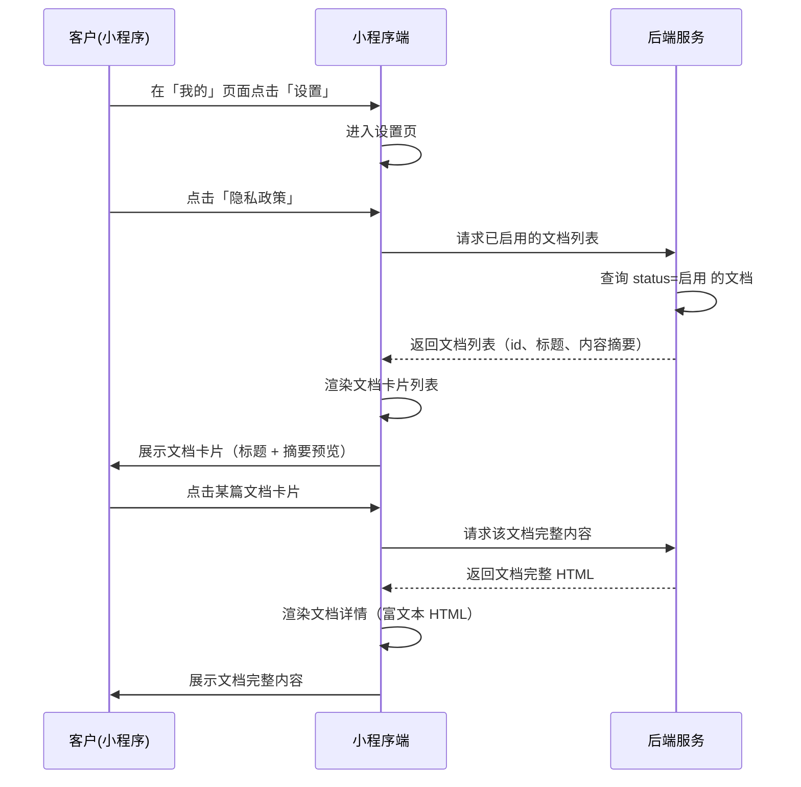

# 隐私政策-小程序 SPEC

> **归属中心**：06-基础管理
> **子模块**：隐私政策管理
> **终端**：小程序端
> **版本**：v1.0
> **更新日期**：2026-07-07
>
> - **小程序端**：面向 B 端客户，在「我的 → 设置」中查看平台发布的隐私政策、用户协议等法律文档。
> - **后台端**：隐私政策的创建、编辑、启用/禁用由运营管理员在后台维护，详见 [隐私政策管理.md](./隐私政策管理.md)。

------

## 1. 背景与目标 (Background & Objectives)

**背景**：运营管理员已在后台隐私政策管理模块完成文档的创建与发布。B 端客户需要一个入口查看平台公示的隐私政策、用户协议等法律文档，满足合规要求。

**目标**：在小程序「我的 → 设置」页面提供「隐私政策」入口，客户可浏览所有已启用的法律文档，查看每篇文档的详细内容。

------

## 2. 角色与使用场景 (Roles & Scenarios)

| 角色 | 说明 |
| --- | --- |
| B 端客户 | 已登录小程序的客户，查看平台发布的隐私政策和法律文档 |

**使用场景**：

- 作为 B 端客户，我可以在「我的 → 设置」页面点击「隐私政策」入口，进入文档列表页。
- 作为 B 端客户，我可以在文档列表页看到所有已启用的法律文档，以卡片形式展示，每张卡片包含文档标题和内容摘要。
- 作为 B 端客户，我可以点击任意文档卡片，进入详情页查看文档的完整内容。
- 作为 B 端客户，我可以从详情页返回到文档列表，继续浏览其他文档。

------

## 3. 核心业务流程 (Core Business Flow)

### 3.1 查看隐私政策流程



### 3.2 异常流与逆向流

| 异常场景 | 触发条件 | 系统处理方式 |
| --- | --- | --- |
| 无已启用文档 | 后台未启用任何隐私政策文档 | 展示空状态插图 + 「暂无文档」 |
| 网络请求失败 | 请求超时或失败 | Toast「加载失败，请下拉刷新重试」 |
| 未登录 | 客户未登录或登录态过期 | 跳转登录页 |
| 文档内容为空 | 后台保存了标题但内容为空（异常数据） | 详情页展示「暂无内容」 |

------

## 4. 界面与交互说明 (UI & Interaction)

### 4.1 「我的 → 设置」入口

```
┌─────────────────────────────────┐
│  ← 设置                          │
├─────────────────────────────────┤
│                                 │
│  ┌──────────────────────────┐   │
│  │  👤 个人资料           >  │   │
│  └──────────────────────────┘   │
│  ┌──────────────────────────┐   │
│  │  📞 联系客服           >  │   │
│  └──────────────────────────┘   │
│  ┌──────────────────────────┐   │
│  │  📄 隐私政策           >  │   │  ← 点击进入文档列表
│  └──────────────────────────┘   │
│  ┌──────────────────────────┐   │
│  │  ℹ️ 关于我们           >  │   │
│  └──────────────────────────┘   │
│                                 │
└─────────────────────────────────┘
```

**交互**：「隐私政策」行点击 → 跳转至文档列表页。

### 4.2 文档列表页

#### 4.2.1 整体布局

```
┌─────────────────────────────────┐
│  ← 隐私政策                      │
├─────────────────────────────────┤
│                                 │
│  ┌─────────────────────────┐   │
│  │  📄 隐私政策             │   │  ← 文档卡片
│  │  本隐私政策旨在向您说明   │   │  ← 内容摘要（纯文本前80字）
│  │  我们如何收集、使用、存   │   │
│  │  储和保护您的个人信息...  │   │
│  │                     >    │   │
│  └─────────────────────────┘   │
│                                 │
│  ┌─────────────────────────┐   │
│  │  📄 用户协议             │   │
│  │  欢迎使用本平台服务。在   │   │
│  │  使用本平台前，请您仔细   │   │
│  │  阅读以下协议条款...     │   │
│  │                     >    │   │
│  └─────────────────────────┘   │
│                                 │
│  ┌─────────────────────────┐   │
│  │  📄 关于我们             │   │
│  │  我们是一家致力于为餐饮   │   │
│  │  行业提供优质食材供应链   │   │
│  │  服务的平台...           │   │
│  │                     >    │   │
│  └─────────────────────────┘   │
│                                 │
└─────────────────────────────────┘
```

#### 4.2.2 文档卡片

每篇已启用的文档以卡片形式展示，卡片内容自上而下：

| 序号 | 信息项 | 说明 |
| --- | --- | --- |
| 1 | 文档标题 | 卡片顶部，较大字号，加粗 |
| 2 | 内容摘要 | 标题下方，灰色辅助文字，截取纯文本前 80 字（去除 HTML 标签），超出以省略号替代 |
| 3 | 右箭头 › | 卡片右侧，暗示可点击进入详情 |

**排序规则**：按后台更新时间倒序排列（最近更新的排在最前面）。

**交互**：点击卡片任意位置 → 跳转至文档详情页。

### 4.3 文档详情页

#### 4.3.1 整体布局

```
┌─────────────────────────────────┐
│  ← 隐私政策                      │  ← 导航栏标题为文档标题
├─────────────────────────────────┤
│                                 │
│  ┌─────────────────────────┐   │
│  │                         │   │
│  │  （富文本 HTML 渲染区）    │   │  ← 后端返回的 HTML 内容
│  │                         │   │    通过 rich-text 组件渲染
│  │  完整的文档内容，          │   │
│  │  包含标题、段落、          │   │
│  │  加粗、列表等格式          │   │
│  │                         │   │
│  └─────────────────────────┘   │
│                                 │
│  更新时间：2026-07-01 14:20      │  ← 页面底部展示文档更新时间
│                                 │
└─────────────────────────────────┘
```

#### 4.3.2 详情页说明

| 信息项 | 说明 |
| --- | --- |
| 导航栏标题 | 显示当前文档的标题 |
| 文档内容 | 使用小程序 `rich-text` 组件渲染后端返回的 HTML 内容，支持加粗、斜体、下划线、标题、段落、列表、链接等富文本格式 |
| 更新时间 | 页面底部灰色辅助文字展示文档最后更新时间 |

**交互**：
- 点击导航栏返回箭头 → 返回文档列表页
- 文档内容区域可上下滚动
- 文档中的链接可点击，跳转至外部 H5 页面

### 4.4 极限状态

#### 4.4.1 空数据状态

后台未启用任何文档时：

```
┌─────────────────────────────────┐
│  ← 隐私政策                      │
├─────────────────────────────────┤
│                                 │
│                                 │
│          📄 (空状态插图)          │
│                                 │
│          暂无文档                 │
│                                 │
│                                 │
└─────────────────────────────────┘
```

#### 4.4.2 加载状态

进入列表页时，卡片区域展示骨架屏（灰色色块模拟卡片形状，2-3 个占位块），数据返回后替换为实际内容。

#### 4.4.3 数据量

文档数量通常较少（≤ 10 篇），一次性加载全部数据，不分页。若文档数量超过一屏，页面可滚动查看。

### 4.5 导航与框架约束

> 本节定义页面嵌入小程序框架时的导航栏行为，确保用户看到的导航栏干净、准确。

#### 4.5.1 导航栏总体规则

| 规则 | 说明 |
| --- | --- |
| **页面自带导航栏** | 列表页和详情页均自带顶部导航栏，不依赖父框架提供导航控件 |
| **导航栏仅含两个元素** | 左侧一个返回箭头（←），居中展示当前页面标题，**除此之外不出现任何其他文字或控件** |
| **框架不叠加导航栏** | 当本页面以 iframe / webview 形式嵌入时，宿主框架层不应在本页面上方再叠加额外的导航栏，避免出现双导航栏或错误的标题文字 |

#### 4.5.2 列表页导航栏

```
┌─────────────────────────────────┐
│  ← 隐私政策                      │  ← 仅此两个元素，无其他文字
├─────────────────────────────────┤
│  （文档卡片列表）                  │
```

| 元素 | 内容 | 行为 |
| --- | --- | --- |
| 返回箭头 (←) | — | 通知父框架返回上一级页面（「我的 → 设置」） |
| 标题 | 「隐私政策」 | 静态文本，居中加粗 |

#### 4.5.3 详情页导航栏

```
┌─────────────────────────────────┐
│  ← [文档标题]                    │  ← 标题为当前文档的名称
├─────────────────────────────────┤
│  （文档 HTML 内容）               │
```

| 元素 | 内容 | 行为 |
| --- | --- | --- |
| 返回箭头 (←) | — | 返回列表页（页面内部视图切换，不通知父框架） |
| 标题 | 当前文档标题 | 动态展示，居中加粗 |

#### 4.5.4 返回行为层级

```
列表页点击 ←  →  通知父框架返回「我的 → 设置」
详情页点击 ←  →  页面内部切换回列表视图
```

- **列表页 → 上一级**：列表页的返回操作离开本页面，由页面通过 `postMessage` 通知父框架执行返回。
- **详情页 → 列表页**：详情页的返回操作不离开本页面，仅在页面内部将视图从详情切换回列表。

#### 4.5.5 禁止行为

| 禁止项 | 说明 |
| --- | --- |
| ❌ 导航栏出现「商品详情」或其他无关标题 | 标题只能是「隐私政策」（列表页）或当前文档标题（详情页） |
| ❌ 双导航栏叠加 | 页面嵌入 iframe 时，父框架不应在本页面上方再叠加导航栏 |
| ❌ 返回行为异常 | 列表页点返回不能停留在本页面，必须回到「我的」；详情页点返回不能跳出整个页面，只能回到列表 |

------

## 5. 数据字典与字段级规则 (Data & Field Rules)

### 5.1 接口响应字段

#### 5.1.1 文档列表接口

| 字段名称 | 字段类型 | 来源 | 说明 |
| :--- | :--- | :--- | :--- |
| 文档ID | String(UUID) | 文档主表 | 唯一标识 |
| 文档标题 | String(50) | 文档主表 | 卡片标题展示 |
| 内容摘要 | String(80) | 后端计算 | 去除 HTML 标签后的纯文本前 80 字 |
| 更新时间 | DateTime | 文档主表 | 排序依据和底部展示 |

#### 5.1.2 文档详情接口

| 字段名称 | 字段类型 | 来源 | 说明 |
| :--- | :--- | :--- | :--- |
| 文档ID | String(UUID) | 文档主表 | 唯一标识 |
| 文档标题 | String(50) | 文档主表 | 导航栏标题 |
| 文档内容 | HTML(LONGTEXT) | 文档主表 | 完整 HTML 内容，通过 rich-text 渲染 |
| 更新时间 | DateTime | 文档主表 | 页面底部展示 |

### 5.2 展示逻辑

| 展示项 | 格式/规则 |
| --- | --- |
| 文档标题 | 卡片中较大字号加粗；详情页作为导航栏标题 |
| 内容摘要 | 去除 HTML 标签后截取纯文本前 80 字，超出以 `...` 省略号替代 |
| 文档内容 | 使用小程序 `rich-text` 组件渲染 HTML |
| 更新时间 | 格式 `YYYY-MM-DD HH:mm` |
| 空状态 | 居中展示空状态插图 + 「暂无文档」 |

### 5.3 数据过滤规则

| 规则 | 说明 |
| --- | --- |
| 仅展示已启用文档 | 后端查询时过滤 `status = 启用` 的文档 |
| 禁用文档不可见 | `status = 禁用` 的文档不出现在列表中，也无法通过直接输入文档 ID 访问 |

### 5.4 编辑逻辑

小程序端对隐私政策文档**无编辑权限**，所有字段均为只读展示。文档的创建、编辑、启用/禁用均由后台端管理。

------

## 6. 系统交互与边界 (System Integrations & Boundaries)

### 6.1 前置依赖

| 依赖项 | 说明 |
| --- | --- |
| 隐私政策管理模块（后台） | 文档的创建、编辑、发布、启用/禁用，详见 [隐私政策管理.md](./隐私政策管理.md) |
| 客户认证模块 | 客户需登录后才能查看，登录机制详见 [小程序登录注册模块.md](../02-客户管理/小程序登录注册模块.md) |

### 6.2 下游影响

| 关联模块 | 影响说明 |
| --- | --- |
| 小程序注册/登录页 | 注册和登录页面底部的《隐私政策》《用户协议》链接指向本文档列表页或详情页 |

### 6.3 接口定义

| 接口功能 | 方法 | 路径 | 说明 |
| --- | --- | --- | --- |
| 文档列表 | GET | `/api/privacy/docs` | 返回所有已启用文档（id、标题、摘要、更新时间），按更新时间倒序 |
| 文档详情 | GET | `/api/privacy/docs/{id}` | 返回文档完整内容（标题、HTML 内容、更新时间） |

**文档列表响应结构**：
```json
{
  "docs": [
    {
      "id": "uuid",
      "title": "隐私政策",
      "summary": "本隐私政策旨在向您说明我们如何收集、使用、存储和保护您的个人信息...",
      "updatedAt": "2026-07-01 14:20:00"
    }
  ]
}
```

**文档详情响应结构**：
```json
{
  "id": "uuid",
  "title": "隐私政策",
  "content": "<h2>隐私政策</h2><p>本隐私政策旨在向您说明...</p>",
  "updatedAt": "2026-07-01 14:20:00"
}
```

------

## 7. 非功能性需求 (Non-Functional Requirements)

### 7.1 性能要求

| 指标 | 要求 |
| --- | --- |
| 文档列表接口响应 | < 300ms |
| 文档详情接口响应 | < 500ms |
| 页面首屏加载 | < 1s（含接口请求 + 渲染） |

### 7.2 权限与安全

| 层级 | 说明 |
| --- | --- |
| 操作权限 | 需登录后访问，未登录跳转登录页 |
| 数据权限 | 仅展示后台已启用的文档，禁用文档不可通过 API 直接访问 |
| 内容安全 | 后端存储前已完成 XSS 过滤，小程序端直接渲染 |

------

## 8. 输出文档需求

本模块为 **06-基础管理** 下的 **隐私政策管理** 子模块，小程序端。

```
spec/
└── 06-基础管理/
    ├── 隐私政策管理.md          ← 后台端 SPEC
    └── 隐私政策-小程序.md       ← 本文档（小程序端）
```

**关联模块**：

| 模块 | 状态 | 说明 |
| --- | --- | --- |
| 隐私政策管理（后台） | 已有 | 文档的创建、编辑、启用/禁用，详见 `隐私政策管理.md` |
| 小程序登录注册 | 已有 | 客户认证，详见 `spec/02-客户管理/小程序登录注册模块.md` |
| 小程序 — 设置页面 | 待建 | 作为入口容器页面 |
| 小程序 — 注册/登录页 | 已有 | 底部协议链接指向本文档列表或详情页 |
